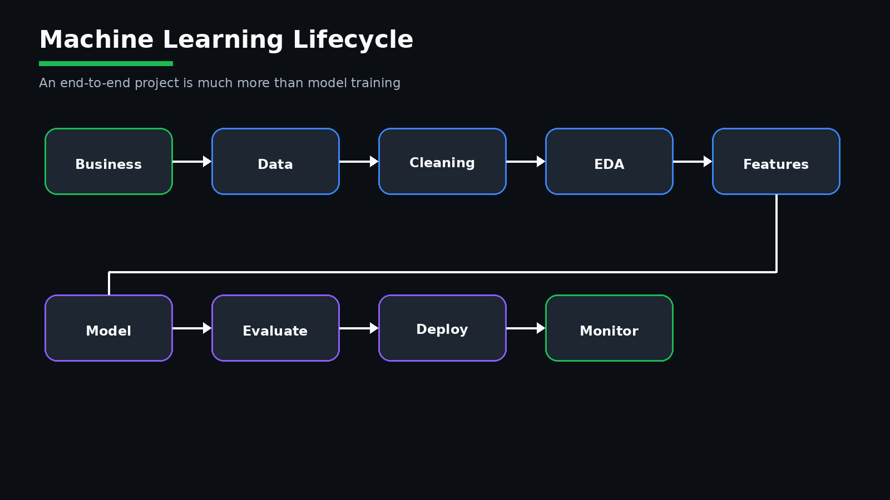
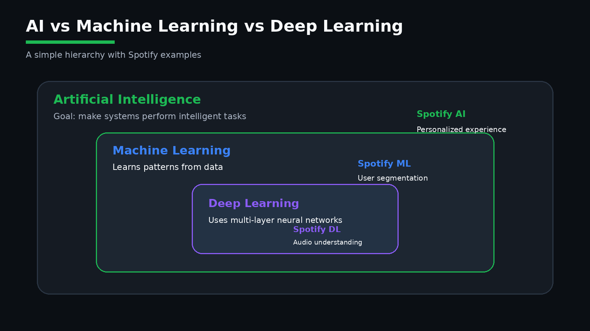
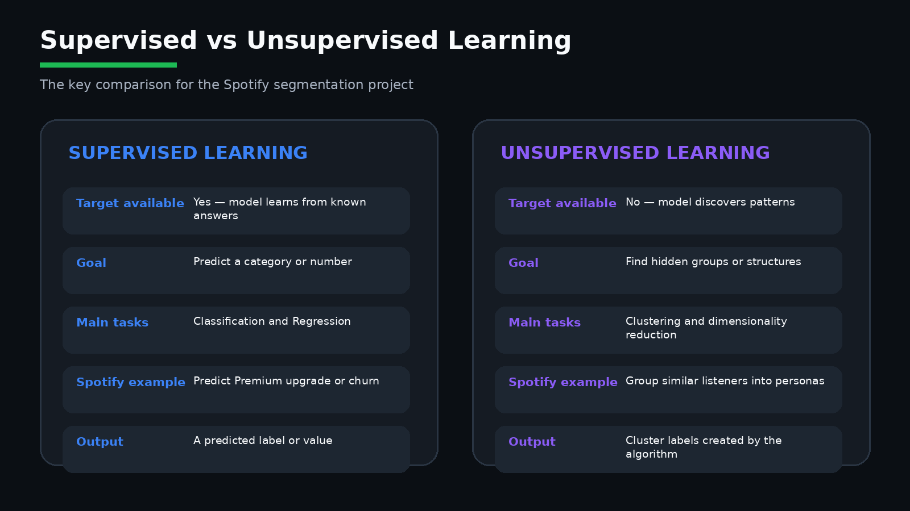
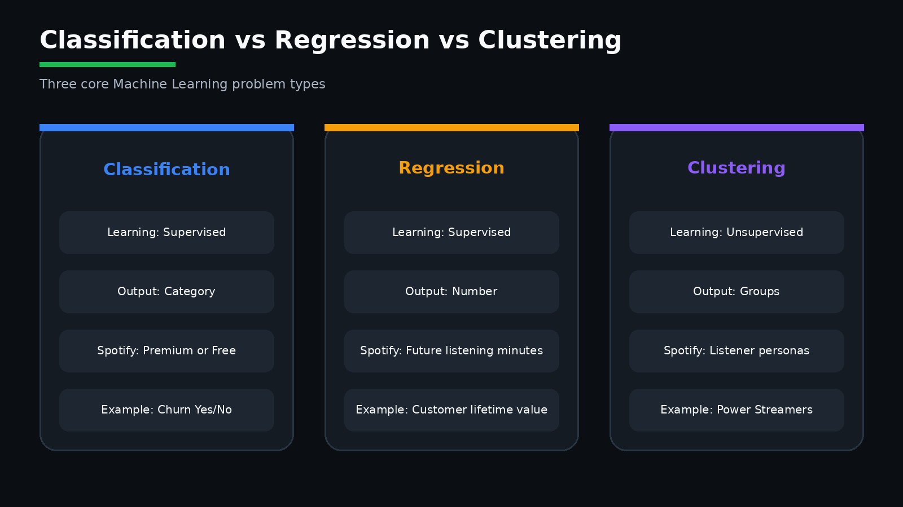
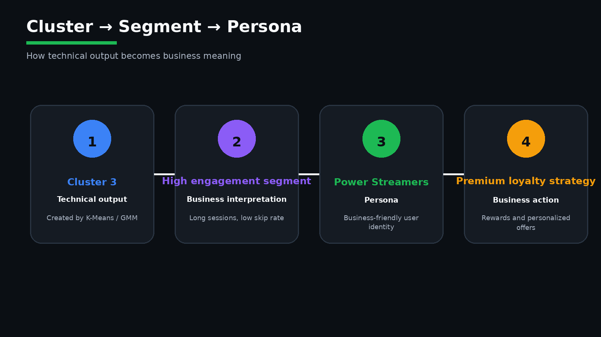
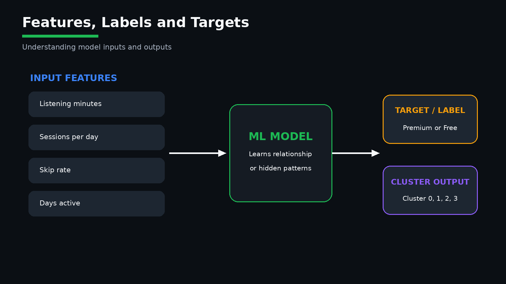
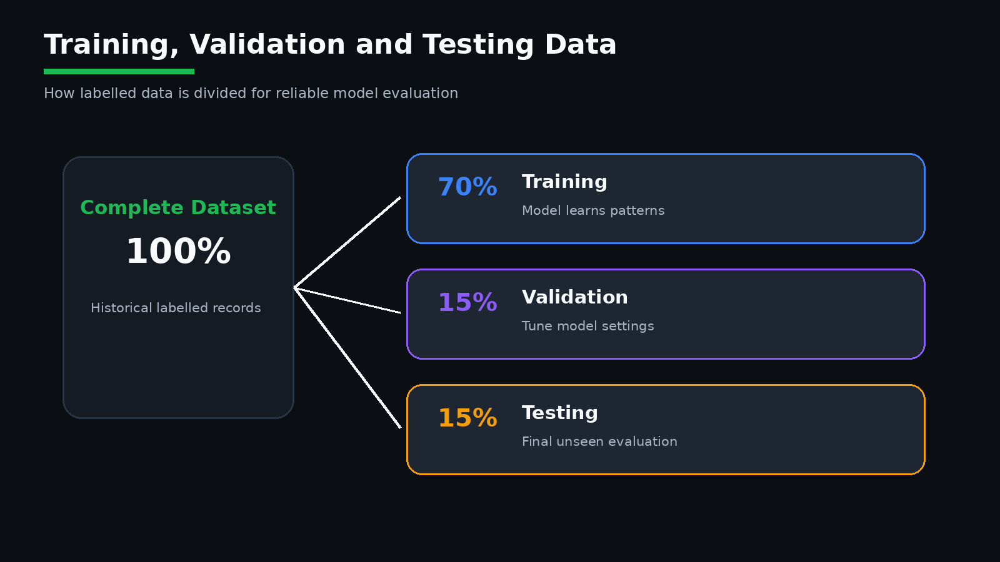
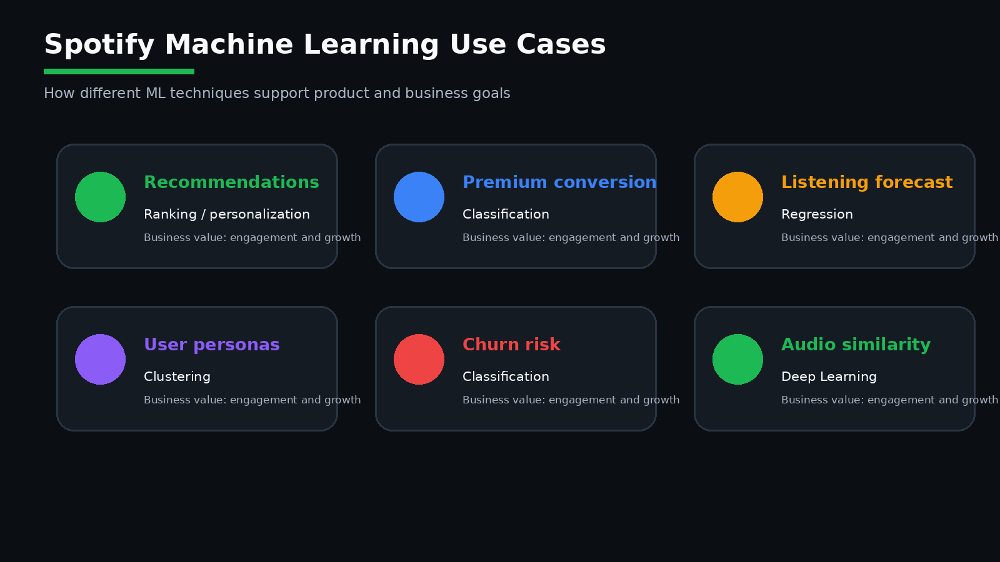

# Module 01 — Introduction to Artificial Intelligence and Machine Learning

> A beginner-friendly foundation module for understanding **Artificial Intelligence, Machine Learning, Deep Learning, Supervised Learning, Unsupervised Learning, Classification, Regression, Clustering, Segmentation, Personas, Features, Labels, Targets, and the Machine Learning lifecycle** using easy examples and Spotify comparisons.

---

## Table of Contents

1. [Module Overview](#1-module-overview)
2. [Learning Objectives](#2-learning-objectives)
3. [Artificial Intelligence](#3-artificial-intelligence)
4. [Machine Learning](#4-machine-learning)
5. [Deep Learning](#5-deep-learning)
6. [Traditional Programming vs Machine Learning](#6-traditional-programming-vs-machine-learning)
7. [AI vs ML vs Deep Learning](#7-ai-vs-ml-vs-deep-learning)
8. [Types of Machine Learning](#8-types-of-machine-learning)
9. [Supervised Learning](#9-supervised-learning)
10. [Classification](#10-classification)
11. [Regression](#11-regression)
12. [Unsupervised Learning](#12-unsupervised-learning)
13. [Clustering](#13-clustering)
14. [Segmentation](#14-segmentation)
15. [Persona](#15-persona)
16. [Cluster vs Segment vs Persona](#16-cluster-vs-segment-vs-persona)
17. [Reinforcement Learning](#17-reinforcement-learning)
18. [Features](#18-features)
19. [Labels and Targets](#19-labels-and-targets)
20. [Training, Validation, and Testing Data](#20-training-validation-and-testing-data)
21. [Machine Learning Lifecycle](#21-machine-learning-lifecycle)
22. [Why Businesses Use Machine Learning](#22-why-businesses-use-machine-learning)
23. [How Spotify Uses Machine Learning](#23-how-spotify-uses-machine-learning)
24. [Spotify Project Context](#24-spotify-project-context)
25. [Important Terminology](#25-important-terminology)
26. [Interview Questions and Answers](#26-interview-questions-and-answers)
27. [Module Summary](#27-module-summary)
28. [Quick Reference Cheat Sheet](#28-quick-reference-cheat-sheet)
29. [What Comes Next?](#29-what-comes-next)

---

# 1. Module Overview

Before students learn **K-Means**, **Gaussian Mixture Models**, **scaling**, **transformations**, and **cluster evaluation**, they must understand the basic concepts of Artificial Intelligence and Machine Learning.

This module explains every key term using:

- A simple definition
- An everyday example
- A Spotify comparison
- A business explanation
- A technical explanation

The Spotify project follows this journey:



```text
Spotify User Data
        ↓
Data Understanding
        ↓
Data Cleaning
        ↓
Exploratory Data Analysis
        ↓
Feature Selection
        ↓
Scaling and Transformation
        ↓
Unsupervised Learning
        ↓
Clustering
        ↓
Cluster Profiling
        ↓
Customer Segmentation
        ↓
Persona Creation
        ↓
Business Growth Strategy
```

---

# 2. Learning Objectives

By the end of this module, students should be able to:

- Explain Artificial Intelligence in simple words
- Explain Machine Learning and Deep Learning
- Compare traditional programming and Machine Learning
- Differentiate AI, ML, and Deep Learning
- Explain supervised, unsupervised, and reinforcement learning
- Explain classification, regression, and clustering
- Explain the difference between a cluster, segment, and persona
- Identify features, labels, and targets
- Explain training, validation, and testing data
- Describe the complete Machine Learning lifecycle
- Explain why businesses use Machine Learning
- Explain how Spotify uses Machine Learning
- Explain why the Spotify persona project uses clustering

---

# 3. Artificial Intelligence

## 3.1 What is Artificial Intelligence?

Artificial Intelligence, commonly called **AI**, is the broad field of creating computer systems that can perform tasks that normally require human intelligence.

These tasks include:

- Understanding language
- Recognizing images
- Making decisions
- Solving problems
- Recommending content
- Predicting future outcomes
- Learning from experience

---

## 3.2 Easy Example

Imagine a friend asks:

> “Which song should I listen to next?”

You remember that the friend likes soft Telugu melodies and recommend a song.

Spotify does something similar automatically.

```text
Human
Observes music preference
        ↓
Understands interest
        ↓
Recommends a song

Spotify AI
Collects listening history
        ↓
Finds patterns
        ↓
Recommends a song
```

---

## 3.3 Real-World Examples

| Company or Application | AI Usage |
|---|---|
| Spotify | Song and playlist recommendations |
| Netflix | Movie recommendations |
| Amazon | Product recommendations |
| Gmail | Spam detection |
| Google Maps | Traffic and route prediction |
| Banks | Fraud detection |
| Smartphones | Face recognition |
| Chatbots | Automated customer support |

---

## 3.4 Spotify Comparison

Spotify can use AI to:

- Recommend songs
- Build personalized playlists
- Discover similar artists
- Improve advertisement targeting
- Predict user interests
- Identify users who may leave
- Suggest Premium plans

---

# 4. Machine Learning

## 4.1 What is Machine Learning?

Machine Learning is a branch of AI where a computer learns patterns from data and uses those patterns to make predictions, decisions, or discover hidden groups.

---

## 4.2 Easy Example

Suppose we have the following Spotify users:

| User | Listening Minutes | Sessions | Skip Rate |
|---|---:|---:|---:|
| U1 | 220 | 8 | 0.08 |
| U2 | 210 | 7 | 0.10 |
| U3 | 40 | 2 | 0.70 |
| U4 | 35 | 1 | 0.65 |

A Machine Learning algorithm may learn that:

- U1 and U2 behave similarly
- U3 and U4 behave similarly

The system learns from data instead of using only manually written rules.

---

## 4.3 Machine Learning Flow

```text
Historical Data
        ↓
Machine Learning Algorithm
        ↓
Pattern Learning
        ↓
Trained Model
        ↓
Prediction or Grouping
```

---

## 4.4 Spotify Comparison

Spotify may use:

- Daily listening minutes
- Sessions per day
- Average session length
- Skip rate
- Days active
- Ads skipped
- Playlist follows

The system studies these values and identifies patterns.

---

# 5. Deep Learning

## 5.1 What is Deep Learning?

Deep Learning is a subset of Machine Learning that uses multi-layer neural networks to learn complex patterns from large amounts of data.

---

## 5.2 Easy Example

Traditional Machine Learning is often suitable for table-based data.

Deep Learning is especially useful for:

- Audio
- Images
- Video
- Speech
- Text
- Complex recommendation ranking

---

## 5.3 Spotify Comparison

Spotify may use Deep Learning for:

- Audio similarity
- Mood detection
- Podcast understanding
- Song embeddings
- Recommendation ranking
- Voice search

For example, Deep Learning can compare two songs based on sound, rhythm, mood, and energy.

---

## 5.4 Does This Project Use Deep Learning?

No.

This project mainly uses:

- Data analysis
- Unsupervised Learning
- K-Means
- Gaussian Mixture Models

Deep Learning is not required for every project.

---

# 6. Traditional Programming vs Machine Learning

## 6.1 Traditional Programming

In traditional programming, the developer writes the rules.

```text
Input Data + Human-Written Rules
                ↓
              Program
                ↓
              Output
```

Example:

```python
if daily_listening_minutes > 120:
    user_type = "Heavy Listener"
else:
    user_type = "Casual Listener"
```

---

## 6.2 Machine Learning

In Machine Learning, the algorithm learns patterns from historical data.

```text
Input Data
    ↓
Learning Algorithm
    ↓
Learned Patterns
    ↓
Prediction or Grouping
```

---

## 6.3 Comparison

| Traditional Programming | Machine Learning |
|---|---|
| Humans define the rules | The system learns the rules |
| Suitable for fixed logic | Suitable for complex patterns |
| Does not learn from new data | Can improve with more data |
| Easier for simple conditions | Better for large-scale prediction |
| Example: age validation | Example: churn prediction |

---

## 6.4 Spotify Comparison

### Traditional Rule

```text
If skip_rate > 0.60,
mark user as high-friction.
```

### Machine Learning

```text
Use skip rate, session depth, listening intensity,
days active, and ad behavior to discover multiple user groups.
```

---

# 7. AI vs ML vs Deep Learning



```text
Artificial Intelligence
│
└── Machine Learning
    │
    └── Deep Learning
```

| Concept | Meaning | Spotify Example |
|---|---|---|
| AI | Broad field of intelligent systems | Personalized Spotify experience |
| ML | Learning patterns from data | User segmentation |
| Deep Learning | Neural-network-based learning | Audio understanding |

### Easy Way to Remember

```text
AI = Broad goal

ML = Learns patterns from data

DL = Learns complex patterns using deep neural networks
```

---

# 8. Types of Machine Learning



```text
Machine Learning
│
├── Supervised Learning
├── Unsupervised Learning
└── Reinforcement Learning
```

| Learning Type | Target Available? | Main Purpose |
|---|---|---|
| Supervised Learning | Yes | Predict an output |
| Unsupervised Learning | No | Discover hidden patterns |
| Reinforcement Learning | Reward signal | Learn through feedback |

---

## 8.1 Supervised vs Unsupervised Learning


| Area | Supervised Learning | Unsupervised Learning |
|---|---|---|
| Target or label | Available | Not available |
| Main objective | Predict a known output | Discover hidden patterns |
| Typical tasks | Classification and Regression | Clustering and dimensionality reduction |
| Output | Category or numeric prediction | Cluster labels or hidden structure |
| Spotify example | Predict Premium upgrade | Discover listener personas |
| Evaluation | Accuracy, Precision, Recall, RMSE | Silhouette, Inertia, AIC, BIC, stability |
| Business use | Prediction and risk scoring | Segmentation and customer understanding |

### Easy Spotify Comparison

```text
Supervised Learning
Spotify already knows previous Premium outcomes
        ↓
Model learns from those labelled examples
        ↓
Predicts who may upgrade next

Unsupervised Learning
Spotify has listening behaviour but no persona labels
        ↓
Algorithm discovers similar user groups
        ↓
Analyst profiles and names the personas
```

---

---

# 9. Supervised Learning

## 9.1 What is Supervised Learning?

Supervised Learning uses:

- Input features
- A known output, label, or target

The model learns the relationship between input and output.

---

## 9.2 Example

| Listening Minutes | Skip Rate | Days Active | Subscription |
|---:|---:|---:|---|
| 180 | 0.10 | 28 | Premium |
| 35 | 0.70 | 8 | Free |
| 140 | 0.25 | 24 | Premium |

Features:

```text
Listening Minutes
Skip Rate
Days Active
```

Target:

```text
Subscription
```

---

## 9.3 Spotify Use Cases

- Predict Premium conversion
- Predict churn
- Predict ad clicks
- Predict future listening minutes
- Predict customer lifetime value

---



# 10. Classification

## 10.1 What is Classification?

Classification is a supervised-learning task where the output is a category.

Examples:

```text
Premium or Free
Churn or Not Churn
Clicked Ad or Did Not Click
High Risk or Low Risk
```

---

## 10.2 Binary Classification

Two possible classes:

```text
Churn = Yes or No
```

---

## 10.3 Multiclass Classification

More than two classes:

```text
Free
Premium Individual
Premium Family
Premium Student
```

---

## 10.4 Spotify Example

Problem:

```text
Predict whether a user will upgrade to Premium.
```

Features:

- Listening minutes
- Days active
- Ads skipped
- Sessions per day
- Subscription tenure

Target:

```text
premium_upgrade_flag
```

---

# 11. Regression

## 11.1 What is Regression?

Regression is a supervised-learning task where the output is a numerical value.

Examples:

```text
Future listening minutes
Monthly revenue
Customer Lifetime Value
Number of sessions
```

---

## 11.2 Spotify Example

Problem:

```text
Predict next month's listening minutes.
```

Features:

- Previous listening minutes
- Sessions per day
- Days active
- Playlist follows

Target:

```text
next_month_listening_minutes
```

---

## 11.3 Classification vs Regression

| Classification | Regression |
|---|---|
| Predicts a category | Predicts a number |
| Premium or Free | Future listening minutes |
| Churn or Not Churn | Customer Lifetime Value |
| Discrete output | Continuous output |

---

# 12. Unsupervised Learning

## 12.1 What is Unsupervised Learning?

Unsupervised Learning works without a predefined target.

The algorithm discovers:

- Hidden groups
- Similarities
- Structures
- Patterns
- Unusual observations

---

## 12.2 Easy Spotify Example

Spotify has 108,000 users and knows:

- Listening minutes
- Sessions
- Skip rate
- Days active
- Ads skipped
- Playlist follows

But Spotify does not have a column called:

```text
persona_name
```

The algorithm must discover user groups automatically.

---

## 12.3 Main Unsupervised Tasks

### Clustering

Groups similar users.

### Dimensionality Reduction

Reduces the number of features.

Examples:

- PCA
- t-SNE
- UMAP

### Anomaly Detection

Finds unusual records.

Examples:

- Bot-like listening
- Abnormal streaming
- Fraudulent account activity

---

# 13. Clustering

## 13.1 What is Clustering?

Clustering is an unsupervised-learning technique that groups similar records based on their feature values.

---

## 13.2 Easy Spotify Example

| User | Listening Minutes | Skip Rate |
|---|---:|---:|
| U1 | 220 | 0.08 |
| U2 | 210 | 0.10 |
| U3 | 40 | 0.70 |
| U4 | 35 | 0.65 |

Possible result:

```text
Cluster 0:
U1 and U2

Cluster 1:
U3 and U4
```

---

## 13.3 Important Point

Cluster numbers are identifiers only.

```text
Cluster 3 is not better than Cluster 1.
```

---

## 13.4 Spotify Business Value

Clustering helps Spotify:

- Discover user groups
- Personalize recommendations
- Improve retention
- Optimize advertisements
- Improve Premium conversion

---

# 14. Segmentation

## 14.1 What is Segmentation?

Segmentation is the business process of dividing customers into meaningful groups based on shared characteristics.

---

## 14.2 Types of Segmentation

### Demographic Segmentation

- Age
- Country
- Device type

### Behavioral Segmentation

- Listening minutes
- Sessions
- Skip rate
- Days active

### Engagement Segmentation

- Frequency
- Consistency
- Session depth

### Value-Based Segmentation

- Premium potential
- Revenue potential
- Customer Lifetime Value

---

## 14.3 Spotify Example

Technical result:

```text
Cluster 2
```

Business interpretation:

```text
Highly consistent users with long sessions.
```

This becomes a segment.

---

# 15. Persona

## 15.1 What is a Persona?

A persona is a business-friendly identity created to represent a customer segment.

A persona summarizes:

- Behavior
- Needs
- Risks
- Opportunities
- Business value

---

## 15.2 Spotify Example

```text
Cluster 3
        ↓
High listening intensity
Long sessions
Low skip rate
        ↓
Power Streamers
```

---

## 15.3 Why Personas Are Useful

Personas help:

- Product teams
- Marketing teams
- Leadership
- Customer-experience teams
- Data teams

They make technical results easy to understand.

---



# 16. Cluster vs Segment vs Persona

```text
Cluster 2
        ↓
High consistency
Long sessions
Stable listening
        ↓
Loyal User Segment
        ↓
Habitual Loyalists Persona
```

| Concept | Purpose | Example |
|---|---|---|
| Cluster | Technical grouping | Cluster 2 |
| Segment | Business grouping | Loyal users |
| Persona | Descriptive identity | Habitual Loyalists |

---

# 17. Reinforcement Learning

## 17.1 What is Reinforcement Learning?

Reinforcement Learning is a type of Machine Learning where an agent learns through rewards and penalties.

```text
Agent
  ↓
Takes Action
  ↓
Environment Responds
  ↓
Reward or Penalty
  ↓
Agent Learns
```

---

## 17.2 Spotify Example

Spotify recommends a song.

| User Action | Possible Signal |
|---|---|
| Plays full song | Positive |
| Likes song | Strong positive |
| Adds to playlist | Strong positive |
| Skips immediately | Negative |
| Closes app | Strong negative |

The system can use feedback to improve future recommendations.

---



# 18. Features

## 18.1 What is a Feature?

A feature is an input variable used by a Machine Learning algorithm.

Spotify examples:

- `daily_listening_minutes`
- `sessions_per_day`
- `avg_session_minutes`
- `days_active_last_30`
- `skip_rate`
- `ads_skipped_pct`

---

## 18.2 Feature vs Column

Every feature is a column, but not every column should be used as a feature.

Example:

```text
user_id
```

`user_id` identifies a user but does not describe behavior.

---

## 18.3 Numerical Features

- Listening minutes
- Skip rate
- Sessions per day

## 18.4 Categorical Features

- Country
- Device type
- Subscription type

---

# 19. Labels and Targets

## 19.1 Label

A label is a known output category in supervised learning.

Example:

```text
Premium
Free
```

---

## 19.2 Target

The target is the output variable a supervised model predicts.

Examples:

```text
churn_flag
future_revenue
subscription_type
```

---

## 19.3 Does Clustering Have a Target?

No.

Clustering does not require a target.

Input:

- Listening minutes
- Sessions
- Skip rate
- Days active

Output:

```text
Cluster labels created by the algorithm
```

---



# 20. Training, Validation, and Testing Data

These concepts are mainly used in supervised learning.

## Training Data

Used to teach the model.

## Validation Data

Used to compare settings and tune the model.

## Testing Data

Used to evaluate the final model on unseen data.

Typical split:

```text
Training   → 70%
Validation → 15%
Testing    → 15%
```

Another common split:

```text
Training → 80%
Testing  → 20%
```

---

## 20.1 Clustering Evaluation

Clustering is commonly evaluated using:

- Silhouette Score
- Davies-Bouldin Index
- Calinski-Harabasz Score
- Inertia
- AIC
- BIC
- Cluster balance
- Stability
- Business interpretability

---


# 21. Machine Learning Lifecycle

```text
Business Understanding
        ↓
Data Collection
        ↓
Data Understanding
        ↓
Data Cleaning
        ↓
Exploratory Data Analysis
        ↓
Feature Selection
        ↓
Feature Engineering
        ↓
Data Preparation
        ↓
Model Training
        ↓
Model Evaluation
        ↓
Business Interpretation
        ↓
Deployment
        ↓
Monitoring
        ↓
Retraining
```

---

## 21.1 Spotify Project Mapping

| ML Lifecycle Step | Spotify Project Example |
|---|---|
| Business Understanding | Understand user behavior |
| Data Collection | Behavior and demographic datasets |
| Data Cleaning | Missing, duplicate, and invalid values |
| EDA | Distribution and skewness analysis |
| Feature Selection | Select behavioral features |
| Scaling | Standard, MinMax, Robust, Power, Quantile |
| Training | K-Means and GMM |
| Evaluation | Silhouette, Inertia, AIC, BIC |
| Interpretation | Cluster profiling |
| Business Output | Personas and growth strategies |

---

# 22. Why Businesses Use Machine Learning

Businesses use ML to:

- Understand customers
- Automate decisions
- Predict future outcomes
- Detect risks
- Improve personalization
- Reduce costs
- Increase revenue
- Improve customer experience

| Business Problem | ML Solution |
|---|---|
| Customers are leaving | Churn prediction |
| Users behave differently | Segmentation |
| Recommendations are weak | Recommendation systems |
| Revenue is uncertain | Revenue forecasting |
| Ads perform poorly | Ad-response prediction |

---



# 23. How Spotify Uses Machine Learning

Spotify can use ML for:

## Song Recommendation

Based on likes, skips, repeats, and listening history.

## Personalized Playlists

Create mixes and discovery playlists.

## User Segmentation

Group users by behavior.

## Churn Prediction

Identify users who may leave.

## Premium Conversion

Identify users likely to upgrade.

## Advertisement Optimization

Understand ad tolerance and ad skipping.

## Audio Understanding

Analyze mood, tempo, energy, and similarity.

## Artist Discovery

Recommend emerging and similar artists.

---

# 24. Spotify Project Context

## 24.1 Project Objective

Analyze Spotify user behavior and identify meaningful groups using unsupervised learning.

---

## 24.2 Why Clustering?

The dataset does not contain predefined persona labels.

```text
User Behavior Data
        ↓
Clustering
        ↓
Technical Groups
        ↓
Cluster Profiling
        ↓
Segments
        ↓
Personas
```

---

## 24.3 Strategic Dimensions

### Intensity

How much the user listens.

### Frequency

How often the user returns.

### Depth

How long each session lasts.

### Consistency

How regularly the user uses Spotify.

### Friction

How often the user skips songs or ads.

---

## 24.4 Possible Personas

| Cluster | Persona |
|---|---|
| Cluster 0 | Casual Snackers |
| Cluster 1 | Exploratory Samplers |
| Cluster 2 | Habitual Loyalists |
| Cluster 3 | Power Streamers |

---

# 25. Important Terminology

| Term | Meaning |
|---|---|
| AI | Broad field of intelligent systems |
| Machine Learning | Learning patterns from data |
| Deep Learning | Neural-network-based learning |
| Supervised Learning | Learning with known targets |
| Unsupervised Learning | Pattern discovery without targets |
| Classification | Predicting a category |
| Regression | Predicting a number |
| Clustering | Grouping similar records |
| Cluster | Technical group |
| Segment | Business group |
| Persona | Business-friendly identity |
| Feature | Model input |
| Label | Known output category |
| Target | Output to be predicted |
| Training | Learning from data |
| Validation | Tuning model settings |
| Testing | Final evaluation |
| Churn | User leaving or reducing activity |
| Retention | Keeping users active |
| Engagement | User interaction with the platform |

---

# 26. Interview Questions and Answers

## 1. What is Artificial Intelligence?

AI is the broad field of building systems that perform tasks requiring human-like intelligence.

## 2. What is Machine Learning?

Machine Learning is a subset of AI where systems learn patterns from data.

## 3. What is Deep Learning?

Deep Learning is a subset of ML that uses multi-layer neural networks.

## 4. What is supervised learning?

Supervised learning uses input features and known targets.

## 5. What is unsupervised learning?

Unsupervised learning discovers patterns without predefined targets.

## 6. What is classification?

Classification predicts a category.

## 7. What is regression?

Regression predicts a numerical value.

## 8. What is clustering?

Clustering groups similar observations.

## 9. Why is this Spotify project unsupervised?

Because the dataset does not contain predefined persona labels.

## 10. What is the difference between a cluster and a persona?

A cluster is a technical group. A persona is a business-friendly identity created after profiling the cluster.

## 11. What is a feature?

A feature is an input variable used by the model.

## 12. Does clustering require a target?

No.

## 13. Why should `user_id` not be used as a feature?

It identifies the user but does not describe user behavior.

## 14. How can clustering help Spotify?

It helps Spotify identify user groups, personalize recommendations, improve retention, optimize ads, and increase Premium conversion.

---

# 27. Module Summary

In this module, we learned:

- AI is the broad field of intelligent systems
- ML is a subset of AI
- Deep Learning is a subset of ML
- Traditional programming uses manually written rules
- Machine Learning learns patterns from data
- Supervised learning uses known targets
- Classification predicts categories
- Regression predicts numbers
- Unsupervised learning discovers hidden patterns
- Clustering groups similar users
- Segmentation converts technical groups into business groups
- Personas give business-friendly identities
- Features are model inputs
- Labels and targets are supervised outputs
- Spotify uses ML for recommendations, segmentation, churn reduction, and monetization
- This Spotify project uses clustering because persona labels are not predefined

---

# 28. Quick Reference Cheat Sheet

| Question | Answer |
|---|---|
| What is AI? | Broad field of intelligent systems |
| What is ML? | Learning patterns from data |
| What is Deep Learning? | ML using neural networks |
| What is supervised learning? | Learning with targets |
| What is unsupervised learning? | Discovering patterns without targets |
| What is classification? | Predicting a category |
| What is regression? | Predicting a number |
| What is clustering? | Grouping similar observations |
| What is a cluster? | Technical group |
| What is a segment? | Business group |
| What is a persona? | Business-friendly identity |
| What is a feature? | Model input |
| What is a target? | Model output |
| Why clustering for Spotify? | Persona labels are not predefined |

---

# 29. What Comes Next?

## Module 02 — Spotify Business Understanding

The next module will cover:

- Spotify's business model
- Free and Premium users
- Subscription revenue
- Advertisement revenue
- User engagement
- Retention
- Churn
- Premium conversion
- Business objectives
- Business KPIs
- Why segmentation supports Spotify's growth