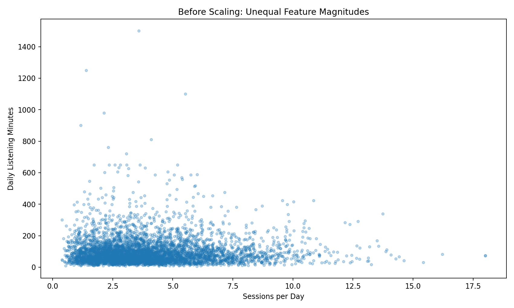
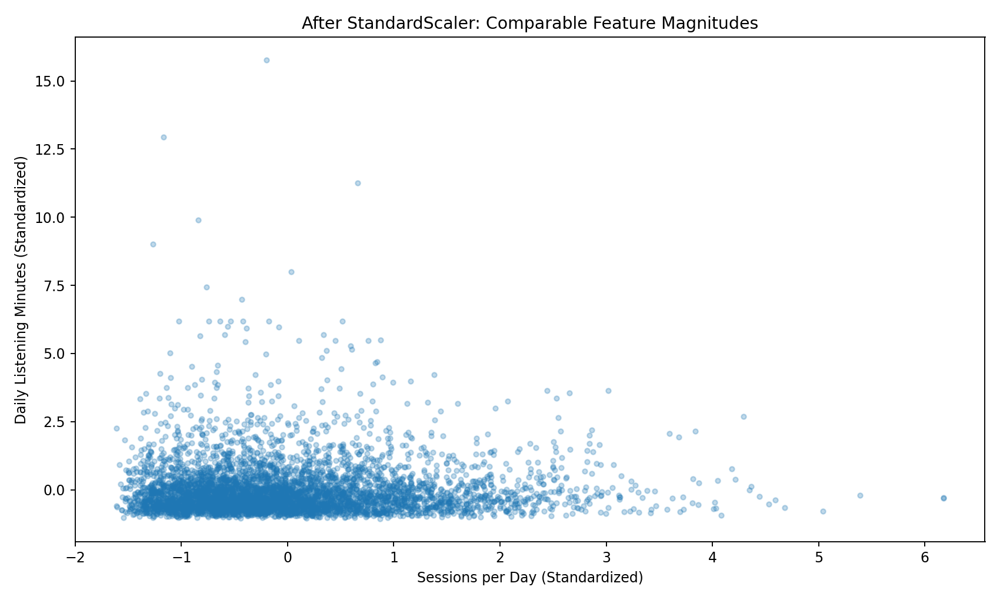
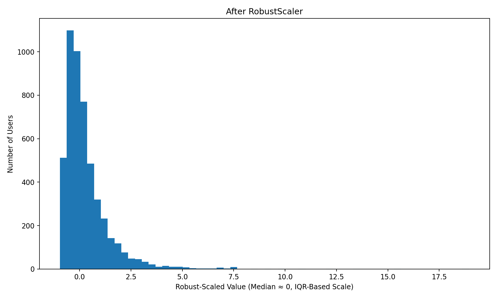
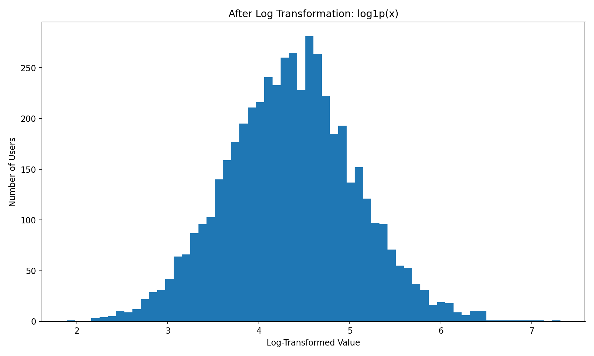
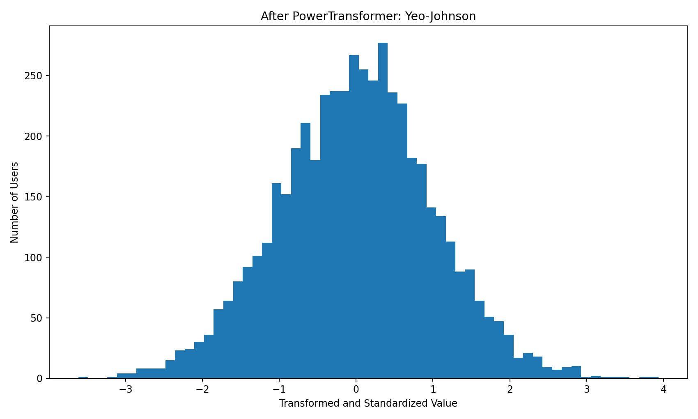
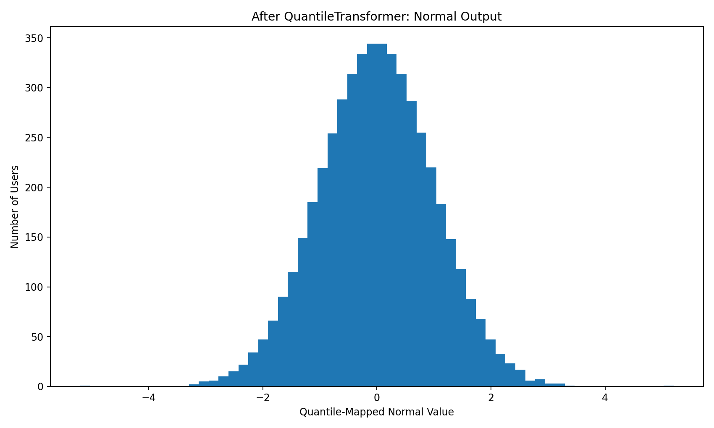
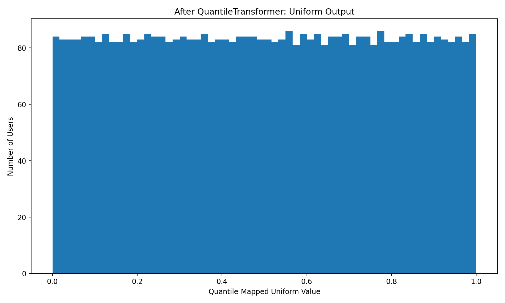
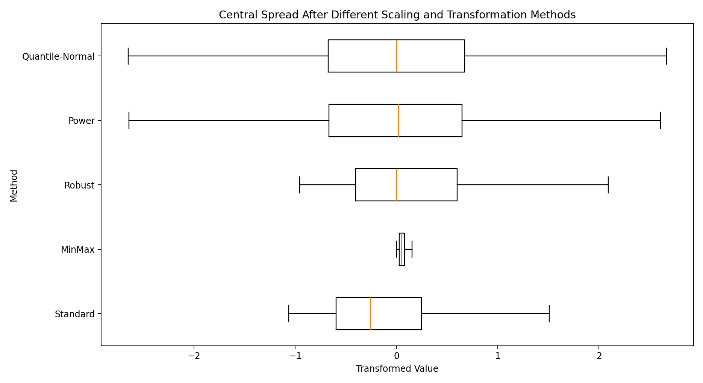

# Module 07 — Data Scaling and Transformation

> A detailed beginner-friendly guide to understanding why Spotify clustering features must be placed on comparable scales, how each scaler changes the data, how transformations handle skewness, and how to select the correct preprocessing method.

---

## Table of Contents

1. [Module Overview](#1-module-overview)
2. [Learning Objectives](#2-learning-objectives)
3. [Why Scaling Is Required](#3-why-scaling-is-required)
4. [Spotify Example of Unequal Scales](#4-spotify-example-of-unequal-scales)
5. [Distance-Based Algorithms](#5-distance-based-algorithms)
6. [Scaling vs Transformation](#6-scaling-vs-transformation)
7. [Important Fit and Transform Concepts](#7-important-fit-and-transform-concepts)
8. [StandardScaler](#8-standardscaler)
9. [MinMaxScaler](#9-minmaxscaler)
10. [RobustScaler](#10-robustscaler)
11. [Log Transformation](#11-log-transformation)
12. [PowerTransformer](#12-powertransformer)
13. [QuantileTransformer](#13-quantiletransformer)
14. [Handling Skewness](#14-handling-skewness)
15. [How the Outputs Look After Execution](#15-how-the-outputs-look-after-execution)
16. [Comparing Scaling Techniques](#16-comparing-scaling-techniques)
17. [Selecting the Right Transformation](#17-selecting-the-right-transformation)
18. [Spotify Feature-by-Feature Guidance](#18-spotify-feature-by-feature-guidance)
19. [Scaling for K-Means](#19-scaling-for-k-means)
20. [Scaling for Gaussian Mixture Models](#20-scaling-for-gaussian-mixture-models)
21. [Scaling for DBSCAN and Hierarchical Clustering](#21-scaling-for-dbscan-and-hierarchical-clustering)
22. [Building Multiple Preprocessing Experiments](#22-building-multiple-preprocessing-experiments)
23. [Preventing Data Leakage](#23-preventing-data-leakage)
24. [Using Pipelines](#24-using-pipelines)
25. [Saving and Reusing the Scaler](#25-saving-and-reusing-the-scaler)
26. [Inverse Transformation](#26-inverse-transformation)
27. [Validation After Scaling](#27-validation-after-scaling)
28. [Common Interpretation Errors](#28-common-interpretation-errors)
29. [Complete Spotify Scaling Workflow](#29-complete-spotify-scaling-workflow)
30. [Scaler Selection Checklist](#30-scaler-selection-checklist)
31. [Important Terminology](#31-important-terminology)
32. [Interview Questions and Answers](#32-interview-questions-and-answers)
33. [Module Summary](#33-module-summary)
34. [Quick Reference Cheat Sheet](#34-quick-reference-cheat-sheet)
35. [What Comes Next?](#35-what-comes-next)

---

# 1. Module Overview

Spotify behavioral features use different units and ranges.

Examples:

```text
daily_listening_minutes    → Minutes
sessions_per_day           → Count
days_active_last_30        → 0 to 30
skip_rate                  → 0 to 1
mean_track_popularity      → 0 to 100
mean_tempo                 → Beats per minute
```

A clustering algorithm does not understand the business meaning of these units.

It only sees numbers.

If the raw values are used directly, features with large numerical ranges may dominate features with small ranges.

The correct workflow is:

```text
Clean Features
      ↓
Review Distribution and Skewness
      ↓
Select Scaling or Transformation
      ↓
Fit the Preprocessor
      ↓
Transform the Features
      ↓
Run Clustering
      ↓
Evaluate Cluster Quality
      ↓
Compare Experiments
```

---

# 2. Learning Objectives

By the end of this module, students should be able to:

- Explain why scaling is required
- Explain how unequal scales affect distance
- Identify distance-based algorithms
- Differentiate scaling and transformation
- Use `StandardScaler`
- Use `MinMaxScaler`
- Use `RobustScaler`
- Use `PowerTransformer`
- Use `QuantileTransformer`
- Apply a safe log transformation
- Explain how each method changes the distribution
- Explain which methods preserve distribution shape
- Explain which methods reshape the distribution
- Handle skewed Spotify features
- Compare preprocessing experiments
- Select a suitable scaler for K-Means and GMM
- Prevent preprocessing leakage
- Save and reuse fitted scalers
- Validate transformed data
- Explain scaler output images

---

# 3. Why Scaling Is Required

## 3.1 Algorithms See Numeric Distance

Suppose two Spotify features are:

```text
daily_listening_minutes = 180
skip_rate = 0.25
```

The listening feature may range from a few minutes to several hundred minutes.

The skip rate ranges only from:

```text
0 to 1
```

Without scaling, a change of 100 listening minutes is much larger numerically than a change of 0.50 in skip rate.

The algorithm may treat listening time as far more important, even when both are equally important to the business.

---

## 3.2 Euclidean Distance Example

For two users:

```text
User A:
daily_listening_minutes = 50
skip_rate = 0.20

User B:
daily_listening_minutes = 200
skip_rate = 0.80
```

Raw Euclidean distance:

```text
Distance =
√[(200 - 50)² + (0.80 - 0.20)²]

≈ √[22500 + 0.36]
```

The listening-minutes difference dominates almost the entire distance.

The skip-rate difference becomes almost invisible.

---

## 3.3 What Scaling Does

Scaling places features on comparable numeric magnitudes.

It does not say that all features have the same business importance.

It only prevents the unit of measurement from deciding importance automatically.

---

# 4. Spotify Example of Unequal Scales



## How to Read This Image

- The horizontal axis contains `sessions_per_day`.
- The vertical axis contains `daily_listening_minutes`.
- Listening minutes have a much larger numeric range.
- A distance-based model will be strongly influenced by vertical distance.
- Sessions per day may contribute much less to the distance calculation.

After `StandardScaler`:



## How to Read the Scaled Image

- Both features are centered around zero.
- Both features have comparable spread.
- One standard-deviation change in sessions is numerically comparable with one standard-deviation change in listening minutes.
- K-Means can now consider both dimensions more fairly.
- The relationship between points remains, but the measurement units have changed.

> The committed images use an illustrative Spotify-like sample. Run the included visualization script with `spotify_user_behavior.xlsx` to generate the same charts from the project data.

---

# 5. Distance-Based Algorithms

Scaling is particularly important when an algorithm uses:

- Distance
- Neighborhood radius
- Variance in a shared feature space
- Geometric direction

## Common Algorithms Requiring Scaling

| Algorithm | Why Scaling Matters |
|---|---|
| K-Means | Uses distance to cluster centroids |
| K-Nearest Neighbors | Uses distance to neighboring records |
| DBSCAN | Uses an epsilon neighborhood radius |
| Hierarchical clustering | Often uses pairwise distances |
| PCA | Large-variance features can dominate components |
| SVM | Feature scale affects margins and kernels |
| Neural networks | Comparable magnitudes can improve optimization |

## Tree-Based Models

Scaling is usually less important for:

- Decision trees
- Random forests
- Gradient-boosted trees

These models split one feature at a time rather than measuring joint Euclidean distance.

---

# 6. Scaling vs Transformation

These words are related but not identical.

## Scaling

Scaling changes the numerical range or center.

Examples:

```text
StandardScaler
MinMaxScaler
RobustScaler
```

These methods are linear feature-wise transformations.

They usually preserve:

- Ordering
- Relative shape
- Skewness pattern

They change the axis values, not the fundamental distribution shape.

---

## Transformation

Transformation changes the shape of the distribution.

Examples:

```text
log1p
PowerTransformer
QuantileTransformer
```

These methods may reduce skewness or map values to a new target distribution.

---

## Comparison

| Scaling | Transformation |
|---|---|
| Changes magnitude | May change shape |
| Makes units comparable | Handles skewness or non-normality |
| Often linear | Often non-linear |
| Example: StandardScaler | Example: PowerTransformer |

---

# 7. Important Fit and Transform Concepts

Scikit-learn preprocessors use two main operations.

## `fit()`

Learns parameters from reference data.

Examples:

- Mean and standard deviation
- Minimum and maximum
- Median and IQR
- Yeo-Johnson lambda
- Quantile mapping

```python
scaler.fit(X_reference)
```

---

## `transform()`

Applies the learned parameters.

```python
X_scaled = scaler.transform(X_reference)
```

For future users:

```python
new_users_scaled = scaler.transform(new_users)
```

---

## `fit_transform()`

Fits and transforms the same data.

```python
X_scaled = scaler.fit_transform(X_reference)
```

Use this only for the reference or training dataset.

Do not call `fit_transform()` independently on every future batch.

That would create inconsistent feature spaces.

---

# 8. StandardScaler

## 8.1 What It Does

`StandardScaler` subtracts the feature mean and divides by the feature standard deviation.

Formula:

```text
z = (x - mean) ÷ standard deviation
```

Typical result:

```text
Mean ≈ 0
Standard deviation ≈ 1
```

---

## 8.2 Code

```python
from sklearn.preprocessing import StandardScaler

scaler = StandardScaler()

X_standard = scaler.fit_transform(
    X
)
```

Convert back to a DataFrame:

```python
X_standard = pd.DataFrame(
    X_standard,
    columns=X.columns,
    index=X.index
)
```

---

## 8.3 How to Interpret Values

```text
0.00  → Near the feature mean
+1.00 → Approximately one standard deviation above the mean
-1.00 → Approximately one standard deviation below the mean
```

Negative values do not mean invalid data.

They mean below-average values on the standardized scale.

---

## 8.4 Strengths

- Strong default baseline
- Easy to interpret statistically
- Good for many distance-based algorithms
- Preserves ordering
- Useful when features do not contain extreme influential outliers

---

## 8.5 Limitations

- Mean and standard deviation are sensitive to outliers
- Does not remove skewness
- Does not bound values to 0 and 1

---

## 8.6 Output Image


### Image Explanation

- The x-axis is no longer measured in minutes.
- It is measured in standard-deviation units.
- The center moves near zero.
- The long right tail is still visible.
- StandardScaler changed location and scale but did not make the data normal.

---

# 9. MinMaxScaler

## 9.1 What It Does

`MinMaxScaler` maps the training minimum and maximum to a selected range.

Default range:

```text
0 to 1
```

Formula:

```text
x_scaled =
(x - minimum)
÷
(maximum - minimum)
```

---

## 9.2 Code

```python
from sklearn.preprocessing import MinMaxScaler

scaler = MinMaxScaler(
    feature_range=(0, 1)
)

X_minmax = scaler.fit_transform(
    X
)
```

---

## 9.3 Interpretation

```text
0 → Training-set minimum
1 → Training-set maximum
```

Values between them show relative position within the training range.

---

## 9.4 Strengths

- Produces bounded training values
- Easy to explain
- Preserves ordering and shape
- Useful when a bounded range is required

---

## 9.5 Limitations

- Very sensitive to extreme minimum and maximum values
- Most normal users may be compressed near zero when one large outlier exists
- New values outside the fitted range can transform outside 0 to 1 unless clipping is used
- Does not reduce skewness

---

## 9.6 Output Image


### Image Explanation

- All training values lie between 0 and 1.
- The distribution remains right-skewed.
- A few extreme listeners define the value 1.
- Most regular users become compressed into a smaller range near the lower end.
- MinMaxScaler changes the range, not the shape.

---

# 10. RobustScaler

## 10.1 What It Does

`RobustScaler` centers using the median and scales using the interquartile range.

```text
IQR = Q3 - Q1
```

Formula:

```text
x_robust =
(x - median)
÷
IQR
```

---

## 10.2 Code

```python
from sklearn.preprocessing import RobustScaler

scaler = RobustScaler()

X_robust = scaler.fit_transform(
    X
)
```

---

## 10.3 Interpretation

```text
0 → Near the median
Positive → Above the median
Negative → Below the median
```

Extreme values can remain numerically large.

That is expected.

RobustScaler does not delete or hide outliers.

It prevents them from controlling the center and scale of the majority.

---

## 10.4 Strengths

- Resistant to outlier influence
- Good for long-tailed behavioral features
- Keeps central users well spread
- Preserves rank and distribution shape

---

## 10.5 Limitations

- Does not remove skewness
- Output is not bounded
- Extreme users may still have very large transformed values

---

## 10.6 Output Image



### Image Explanation

- The median is placed near zero.
- The central 50% of users receives a useful spread.
- Extreme users remain visible in the right tail.
- Unlike MinMaxScaler, one outlier does not force the majority into a tiny 0-to-1 interval.
- The distribution is still skewed because RobustScaler is a scaling method, not a shape-changing transform.

---

# 11. Log Transformation

## 11.1 What It Does

A log transformation compresses large positive values more than small values.

For zero-safe non-negative values:

```python
np.log1p(x)
```

`log1p(x)` means:

```text
log(1 + x)
```

The `+1` allows zero values.

---

## 11.2 Code

```python
import numpy as np

X_log = X.copy()

X_log[
    "daily_listening_minutes"
] = np.log1p(
    X_log[
        "daily_listening_minutes"
    ]
)
```

---

## 11.3 When to Use

Useful for non-negative, strongly right-skewed variables such as:

- Listening minutes
- Playlist counts
- Artist counts
- Gap durations
- Session counts

Use only when the business meaning and value range support it.

---

## 11.4 Limitations

- Cannot directly accept negative values
- Changes interpretability
- Should not be applied to already bounded 0-to-1 rates without a clear reason
- Does not automatically standardize all features

A common workflow is:

```text
log1p
      ↓
StandardScaler
```

---

## 11.5 Output Image



### Image Explanation

- Very high values are compressed strongly.
- Lower and middle values become more visible.
- The long right tail becomes shorter.
- The x-axis is now a logarithmic representation, not minutes.
- This transformation changes the distribution shape.

---

# 12. PowerTransformer

## 12.1 What It Does

`PowerTransformer` applies a monotonic power transformation to make a feature more Gaussian-like and stabilize variance.

Supported methods:

```text
Yeo-Johnson
Box-Cox
```

---

## 12.2 Yeo-Johnson

Yeo-Johnson supports:

- Positive values
- Zero
- Negative values

This makes it a flexible default for mixed numeric ranges.

---

## 12.3 Box-Cox

Box-Cox requires:

```text
x > 0
```

It cannot accept zero or negative values.

---

## 12.4 Code

```python
from sklearn.preprocessing import PowerTransformer

transformer = PowerTransformer(
    method="yeo-johnson",
    standardize=True
)

X_power = transformer.fit_transform(
    X
)
```

With `standardize=True`, output is also standardized.

---

## 12.5 Strengths

- Reduces skewness
- Estimates transformation strength automatically
- Preserves ordering because it is monotonic
- Can improve Gaussian-style modeling assumptions
- Useful for GMM and PCA experiments

---

## 12.6 Limitations

- Changes the original unit
- More complex to explain than simple scaling
- Not every distribution becomes perfectly normal
- Must be fitted and saved for future data

---

## 12.7 Output Image



### Image Explanation

- The strong right skew is reduced.
- Values are centered around zero because standardization is enabled.
- The shape becomes more balanced.
- Relative ordering is preserved.
- This method changes both shape and scale.

---

# 13. QuantileTransformer

## 13.1 What It Does

`QuantileTransformer` uses ranks and quantiles to map a feature to a selected output distribution.

Options:

```text
uniform
normal
```

---

## 13.2 Normal Output

```python
from sklearn.preprocessing import QuantileTransformer

transformer = QuantileTransformer(
    n_quantiles=1000,
    output_distribution="normal",
    random_state=42
)

X_quantile_normal = (
    transformer.fit_transform(X)
)
```

---

## 13.3 Uniform Output

```python
transformer = QuantileTransformer(
    n_quantiles=1000,
    output_distribution="uniform",
    random_state=42
)
```

---

## 13.4 Strengths

- Strongly reduces marginal outlier influence
- Can create a near-normal or uniform marginal distribution
- Useful when distributions are extremely non-Gaussian
- Non-parametric

---

## 13.5 Limitations

- Alters distances and exact numeric relationships
- Can make interpretation harder
- New values beyond the fitted range map to distribution boundaries
- Requires careful pipeline reuse
- May over-transform already meaningful bounded features

---

## 13.6 Normal Output Image



### Image Explanation

- Values are mapped according to rank.
- The output resembles a normal distribution.
- Original minute differences are no longer preserved exactly.
- A difference of 100 raw minutes does not have one fixed transformed difference.
- The transformation is strong and should be evaluated through clustering results.

---

## 13.7 Uniform Output Image



### Image Explanation

- Ranks are spread approximately evenly between 0 and 1.
- Dense raw regions are stretched.
- Sparse raw regions are compressed.
- The original distribution shape is intentionally replaced.
- This is useful for specific experiments, not automatically the best choice.

---

# 14. Handling Skewness

## 14.1 First Measure Skewness

```python
skewness = (
    X.skew()
    .sort_values(
        key=abs,
        ascending=False
    )
)

display(skewness)
```

---

## 14.2 Then Inspect the Distribution

Use:

- Histogram
- Box plot
- Percentiles
- Business meaning
- Outlier review

---

## 14.3 Possible Decisions

| Distribution | Possible Method |
|---|---|
| Roughly symmetric, limited outliers | StandardScaler |
| Bounded range needed, limited outliers | MinMaxScaler |
| Strong outliers but shape should remain | RobustScaler |
| Positive right-skewed count/time feature | `log1p` then StandardScaler |
| Skewed with zero or negative values | Yeo-Johnson PowerTransformer |
| Extremely irregular distribution | QuantileTransformer experiment |
| Already meaningful 0-to-1 rate | StandardScaler or RobustScaler experiment |

---

## 14.4 Important Difference

```text
StandardScaler does not fix skewness.
MinMaxScaler does not fix skewness.
RobustScaler does not fix skewness.
```

They rescale the existing distribution.

To change skewness, use a non-linear transformation such as:

```text
Log
Power
Quantile
```

---

# 15. How the Outputs Look After Execution

## Original Feature


### Interpretation

- The feature is strongly right-skewed.
- Most users are concentrated at lower or moderate listening levels.
- A smaller number of users have very high listening values.
- These users may be genuine Power Streamers rather than data errors.

---

## Central-Spread Comparison



### Interpretation

- StandardScaler and PowerTransformer usually center values around zero.
- MinMaxScaler produces a bounded training range.
- RobustScaler uses the central 50% rather than mean and standard deviation.
- Quantile-normal creates rank-based normal output.
- The chart hides visual fliers only to make the central spread readable; the underlying transformed data still contains all records.

---

# 16. Comparing Scaling Techniques

| Method | Center | Scale/Range | Handles Outlier Influence | Changes Shape | Bounded |
|---|---|---|---|---|---|
| StandardScaler | Mean | Standard deviation | No | No | No |
| MinMaxScaler | Minimum | Min-to-max range | No | No | Training range |
| RobustScaler | Median | IQR | Yes, for center/scale | No | No |
| Log transformation | N/A | Compresses high values | Partly | Yes | No |
| PowerTransformer | Learned transform | Usually standardized | Better than plain scaling | Yes | No |
| QuantileTransformer | Rank-based | Normal or uniform target | Strong | Yes | Depends on target |

---

## 16.1 Summary Statistics Comparison

```python
comparison = pd.DataFrame({
    "raw": X.iloc[:, 0],
    "standard": X_standard[:, 0],
    "minmax": X_minmax[:, 0],
    "robust": X_robust[:, 0],
    "power": X_power[:, 0],
    "quantile_normal": (
        X_quantile_normal[:, 0]
    )
})

display(
    comparison
    .agg(
        [
            "mean",
            "median",
            "std",
            "min",
            "max",
            "skew"
        ]
    )
    .T
    .round(3)
)
```

---

# 17. Selecting the Right Transformation

There is no universally best scaler.

Use an experiment-driven decision.

## Decision Process

```text
1. Understand the feature
2. Inspect range and units
3. Inspect skewness
4. Check outliers
5. Choose candidate methods
6. Run clustering
7. Compare metrics
8. Compare cluster balance
9. Compare profile separation
10. Select the most stable and interpretable result
```

---

## Selection Guide

### Choose StandardScaler When

- You need a strong baseline
- Features have limited extreme outliers
- You want zero-mean, unit-variance features
- K-Means or PCA is being tested

### Choose MinMaxScaler When

- A bounded range is required
- Outliers are controlled
- Relative positions within a fixed range are useful

### Choose RobustScaler When

- Valid power users or extreme behaviors exist
- You want to preserve the original shape
- Median and IQR are more representative

### Choose PowerTransformer When

- Features are strongly skewed
- Gaussian-like shape may benefit GMM or PCA
- You want a monotonic transformation

### Choose QuantileTransformer When

- Marginal distributions are extremely irregular
- Outlier influence must be strongly reduced
- Exact raw-value distances are less important
- It is treated as an experiment rather than a default

### Choose Log Transformation When

- A non-negative count or duration feature is right-skewed
- A simple and interpretable compression is preferred

---

# 18. Spotify Feature-by-Feature Guidance

These are starting hypotheses, not final decisions.

| Spotify Feature Type | Possible Starting Method |
|---|---|
| Listening minutes | RobustScaler or log1p + StandardScaler |
| Sessions per day | StandardScaler, RobustScaler or PowerTransformer |
| Days active, 0–30 | StandardScaler or MinMaxScaler |
| Average session minutes | RobustScaler or PowerTransformer |
| Follow counts | log1p + StandardScaler or RobustScaler |
| Skip/like/repeat rates, 0–1 | StandardScaler or RobustScaler |
| Audio features, often 0–1 | StandardScaler |
| Tempo | StandardScaler |
| Popularity, 0–100 | StandardScaler or MinMaxScaler |
| Gap between plays | log1p + StandardScaler or PowerTransformer |

The final choice must be based on actual project experiments.

---

# 19. Scaling for K-Means

K-Means minimizes within-cluster squared Euclidean distance.

Therefore, feature magnitude directly affects:

- Point-to-centroid distance
- Cluster assignment
- Centroid location
- Inertia
- Silhouette score

Recommended baseline:

```python
StandardScaler()
```

Recommended alternatives:

```python
RobustScaler()
PowerTransformer()
QuantileTransformer()
```

Compare all of them using the same:

- Feature set
- Number of clusters
- Random state
- Evaluation process

---

# 20. Scaling for Gaussian Mixture Models

GMM models each cluster as a Gaussian distribution.

Scale affects:

- Covariance estimation
- Likelihood
- Cluster shape
- Numerical stability
- AIC and BIC comparisons

Useful candidates:

```text
StandardScaler
PowerTransformer
QuantileTransformer with normal output
RobustScaler
```

Power or quantile methods may make marginal features more Gaussian-like, but they can also change relationships.

Evaluation is required.

---

# 21. Scaling for DBSCAN and Hierarchical Clustering

## DBSCAN

DBSCAN uses a neighborhood radius:

```text
epsilon
```

If features are not scaled, epsilon has inconsistent meaning across dimensions.

Scaling is essential before tuning epsilon.

---

## Hierarchical Clustering

Many linkage methods rely on pairwise distances.

Unscaled large-range features can dominate the dendrogram structure.

Scale before comparing users.

---

# 22. Building Multiple Preprocessing Experiments

Use consistent experiment names.

Example:

```text
EXP_01_STANDARD_CORE
EXP_02_MINMAX_CORE
EXP_03_ROBUST_CORE
EXP_04_POWER_CORE
EXP_05_QUANTILE_NORMAL_CORE
EXP_06_LOG_STANDARD_CORE
```

For each experiment, record:

- Feature set
- Scaler
- Transformation
- Algorithm
- Number of clusters
- Random state
- Silhouette
- Cluster sizes
- Inertia or AIC/BIC
- Business interpretation
- Stability notes

A template is included in:

```text
scaling_experiment_register.md
```

---

# 23. Preventing Data Leakage

A preprocessor must learn parameters only from reference or training data.

Incorrect:

```python
X_all_scaled = scaler.fit_transform(
    X_all
)
```

when part of `X_all` represents a held-out evaluation period.

Correct:

```python
scaler.fit(X_train)

X_train_scaled = scaler.transform(
    X_train
)

X_test_scaled = scaler.transform(
    X_test
)
```

For a production clustering system:

```text
Fit scaler on reference population
        ↓
Save scaler
        ↓
Use transform() for future users
```

Do not refit for every scoring request.

---

# 24. Using Pipelines

A pipeline keeps transformations and the model together.

```python
from sklearn.pipeline import Pipeline
from sklearn.preprocessing import StandardScaler
from sklearn.cluster import KMeans

pipeline = Pipeline(
    steps=[
        (
            "scaler",
            StandardScaler()
        ),
        (
            "clusterer",
            KMeans(
                n_clusters=4,
                random_state=42,
                n_init="auto"
            )
        )
    ]
)

cluster_labels = pipeline.fit_predict(
    X
)
```

Benefits:

- Correct execution order
- Reproducibility
- Easier saving
- Reduced leakage risk
- Cleaner experiment comparison

---

# 25. Saving and Reusing the Scaler

```python
import joblib

joblib.dump(
    scaler,
    "spotify_standard_scaler.joblib"
)
```

Load it later:

```python
loaded_scaler = joblib.load(
    "spotify_standard_scaler.joblib"
)

new_users_scaled = (
    loaded_scaler.transform(
        new_users
    )
)
```

Save:

- Scaler
- Feature order
- Transformation configuration
- Model
- Version
- Training date
- Expected data types

---

# 26. Inverse Transformation

Some scalers support converting transformed values back to the original unit.

```python
X_original_units = (
    scaler.inverse_transform(
        X_scaled
    )
)
```

This is useful for:

- Explaining cluster centers
- Reporting listening minutes
- Reporting sessions per day
- Business interpretation

For cluster personas:

```text
Model works in scaled space.

Business teams need original units.
```

Therefore, convert centroids back where appropriate.

---

# 27. Validation After Scaling

## StandardScaler Checks

```python
scaled_df.mean().round(3)
scaled_df.std(ddof=0).round(3)
```

Expected approximately:

```text
Mean = 0
Standard deviation = 1
```

---

## MinMax Checks

```python
scaled_df.min()
scaled_df.max()
```

Expected training range:

```text
Minimum = 0
Maximum = 1
```

---

## RobustScaler Checks

```python
scaled_df.median().round(3)
```

Expected approximately:

```text
Median = 0
```

---

## General Checks

```python
import numpy as np

assert not scaled_df.isna().any().any()
assert np.isfinite(
    scaled_df.to_numpy()
).all()
```

Also confirm:

- Same row count
- Same feature order
- Same index
- No identifier included
- No unexpected object columns
- No transformed data overwritten accidentally

---

# 28. Common Interpretation Errors

## Error 1: “StandardScaler makes data normal”

Incorrect.

It makes:

```text
Mean ≈ 0
Standard deviation ≈ 1
```

It does not guarantee a normal shape.

---

## Error 2: “RobustScaler removes outliers”

Incorrect.

It reduces their influence on center and scale.

Outliers remain.

---

## Error 3: “MinMax always guarantees future values between 0 and 1”

Only fitted training values are guaranteed by the standard transformation.

Unseen values outside the fitted range can produce values outside the range unless clipping is enabled.

---

## Error 4: “The scaler with the best-looking histogram is best”

Incorrect.

The scaler must improve:

- Cluster quality
- Stability
- Balance
- Persona interpretation

---

## Error 5: “We should transform every skewed feature”

Incorrect.

Skewness may represent genuine business behavior.

---

## Error 6: “We can fit the scaler separately on every batch”

Incorrect.

That creates incompatible feature spaces.

---

# 29. Complete Spotify Scaling Workflow

```python
import pandas as pd
import numpy as np

from sklearn.preprocessing import (
    StandardScaler,
    MinMaxScaler,
    RobustScaler,
    PowerTransformer,
    QuantileTransformer
)

behavior = pd.read_excel(
    "spotify_user_behavior.xlsx"
)

features = [
    "daily_listening_minutes",
    "sessions_per_day",
    "avg_session_minutes",
    "days_active_last_30",
    "skip_rate",
    "ads_skipped_pct"
]

X = behavior[
    features
].copy()

assert not X.isna().any().any()

scalers = {
    "standard": StandardScaler(),
    "minmax": MinMaxScaler(),
    "robust": RobustScaler(),
    "power": PowerTransformer(
        method="yeo-johnson",
        standardize=True
    ),
    "quantile_normal": (
        QuantileTransformer(
            n_quantiles=min(
                1000,
                len(X)
            ),
            output_distribution="normal",
            random_state=42
        )
    )
}

scaled_datasets = {}

for name, scaler in scalers.items():
    transformed = scaler.fit_transform(
        X
    )

    scaled_datasets[name] = (
        pd.DataFrame(
            transformed,
            columns=features,
            index=X.index
        )
    )

    print(
        name,
        scaled_datasets[name].shape
    )
```

The complete reusable implementation is available in:

```text
examples/spotify_scaling_pipeline.py
```

The image-generation script is available in:

```text
examples/spotify_scaler_visualization.py
```

---

# 30. Scaler Selection Checklist

## Feature Review

- [ ] Feature units documented
- [ ] Feature ranges documented
- [ ] Skewness calculated
- [ ] Outliers investigated
- [ ] Identifiers removed
- [ ] Missing and infinite values checked

## Method Selection

- [ ] StandardScaler baseline created
- [ ] MinMaxScaler tested where bounded output is useful
- [ ] RobustScaler tested for outlier-heavy features
- [ ] Log transformation tested for non-negative right-skewed features
- [ ] PowerTransformer tested for skewed distributions
- [ ] QuantileTransformer tested only when justified

## Pipeline

- [ ] Preprocessor fitted on reference/training data
- [ ] Future data uses `transform()`
- [ ] Feature order is preserved
- [ ] Scaler is saved
- [ ] Transformation configuration is documented

## Evaluation

- [ ] Same feature set used across scaler comparison
- [ ] Same algorithm settings used
- [ ] Silhouette compared
- [ ] Cluster balance compared
- [ ] Stability compared
- [ ] Business interpretation compared
- [ ] Selected method documented

---

# 31. Important Terminology

| Term | Meaning |
|---|---|
| Scaling | Changing feature magnitude or range |
| Transformation | Changing feature representation or shape |
| Standardization | Mean-zero, unit-variance scaling |
| Normalization | Broad term often used for range or vector scaling |
| Mean | Arithmetic average |
| Standard deviation | Spread around the mean |
| Median | Middle value |
| IQR | Q3 minus Q1 |
| Skewness | Distribution asymmetry |
| Outlier | Unusually extreme observation |
| Fit | Learn preprocessing parameters |
| Transform | Apply learned parameters |
| Fit-transform | Learn and apply on the same reference data |
| StandardScaler | Mean and standard-deviation scaler |
| MinMaxScaler | Fixed-range scaler |
| RobustScaler | Median and IQR scaler |
| PowerTransformer | Monotonic Gaussian-like transformation |
| Yeo-Johnson | Power transform supporting zero and negatives |
| Box-Cox | Power transform requiring positive values |
| QuantileTransformer | Rank and quantile-based transformation |
| Log transformation | Compresses positive right tails |
| Inverse transform | Return to original units |
| Data leakage | Using evaluation information during fitting |
| Pipeline | Ordered preprocessing and model workflow |
| Distance-based algorithm | Algorithm influenced by feature-space distance |

---

# 32. Interview Questions and Answers

## 1. Why is scaling required?

Scaling prevents large-unit features from dominating distance calculations.

---

## 2. Which Spotify features have unequal scales?

Listening minutes, session counts, active days, rates, tempo and popularity use different units and ranges.

---

## 3. What is a distance-based algorithm?

An algorithm that uses distances or neighborhoods in feature space.

---

## 4. Why does K-Means require scaling?

It assigns records to centroids using distance.

---

## 5. What does StandardScaler do?

It subtracts the mean and divides by standard deviation.

---

## 6. Does StandardScaler make data normal?

No.

---

## 7. What does MinMaxScaler do?

It maps fitted training values to a selected range, commonly 0 to 1.

---

## 8. Is MinMaxScaler robust to outliers?

No.

---

## 9. What does RobustScaler do?

It centers using the median and scales using the IQR.

---

## 10. Does RobustScaler remove outliers?

No.

---

## 11. What is a log transformation?

A non-linear transformation that compresses large positive values.

---

## 12. Why use `log1p()`?

It supports zero by calculating `log(1 + x)`.

---

## 13. What is PowerTransformer?

A transformation that estimates a monotonic power to make data more Gaussian-like.

---

## 14. Yeo-Johnson vs Box-Cox?

Yeo-Johnson supports zero and negative values. Box-Cox requires strictly positive values.

---

## 15. What is QuantileTransformer?

A rank-based transformation mapping features to uniform or normal output.

---

## 16. What is the disadvantage of QuantileTransformer?

It changes exact numeric relationships and can reduce interpretability.

---

## 17. Scaling vs transformation?

Scaling changes magnitude. Transformation may change distribution shape.

---

## 18. Which methods preserve distribution shape?

StandardScaler, MinMaxScaler and RobustScaler generally preserve shape because they are linear feature-wise transformations.

---

## 19. Which methods change distribution shape?

Log, PowerTransformer and QuantileTransformer.

---

## 20. Which scaler is the best?

There is no universal best scaler. Compare experiments.

---

## 21. When is RobustScaler useful?

When valid extreme values or outliers affect mean and standard deviation.

---

## 22. Why may Spotify power users be kept?

They may represent a valuable business persona rather than data errors.

---

## 23. What is preprocessing leakage?

Learning scaler parameters from data that should be held out or treated as future data.

---

## 24. What is the difference between `fit_transform()` and `transform()`?

`fit_transform()` learns and applies parameters. `transform()` reuses already learned parameters.

---

## 25. Why save the scaler?

Future data must be transformed in the same feature space.

---

## 26. What is inverse transformation?

Converting scaled values back to original units.

---

## 27. Why inverse-transform cluster centers?

Business teams understand minutes, sessions and rates better than scaled values.

---

## 28. How do you compare scalers?

Use the same features and model settings, then compare clustering metrics, stability, balance and business meaning.

---

## 29. Why does DBSCAN require scaling?

Its epsilon radius must have a consistent meaning across dimensions.

---

## 30. Why can PowerTransformer help GMM?

It may reduce skewness and create more Gaussian-like marginal features, but results must still be evaluated.

---

# 33. Module Summary

In this module, we learned:

- Spotify features have different units and ranges
- Distance-based algorithms can be dominated by large-scale features
- Scaling gives features comparable numerical magnitudes
- StandardScaler centers at the mean and scales by standard deviation
- MinMaxScaler maps fitted training values to a selected range
- RobustScaler uses the median and IQR
- Standard, MinMax and Robust scaling do not remove skewness
- Log transformation compresses positive right tails
- PowerTransformer changes skewed data toward a more Gaussian-like shape
- QuantileTransformer uses ranks to create normal or uniform output
- There is no universally best scaler
- K-Means, GMM, DBSCAN and hierarchical clustering should be tested with suitable preprocessing
- Fitted preprocessors must be reused for future users
- Pipelines reduce leakage and improve reproducibility
- Cluster centers should be converted back to business units where possible
- Scaler selection must consider metrics, stability and business interpretation

---

# 34. Quick Reference Cheat Sheet

## Imports

```python
from sklearn.preprocessing import (
    StandardScaler,
    MinMaxScaler,
    RobustScaler,
    PowerTransformer,
    QuantileTransformer
)
```

## StandardScaler

```python
X_scaled = StandardScaler().fit_transform(X)
```

## MinMaxScaler

```python
X_scaled = MinMaxScaler().fit_transform(X)
```

## RobustScaler

```python
X_scaled = RobustScaler().fit_transform(X)
```

## PowerTransformer

```python
X_scaled = PowerTransformer(
    method="yeo-johnson"
).fit_transform(X)
```

## QuantileTransformer

```python
X_scaled = QuantileTransformer(
    output_distribution="normal",
    random_state=42
).fit_transform(X)
```

## Log Transformation

```python
X["feature_log"] = np.log1p(
    X["feature"]
)
```

## Selection Guide

```text
Default baseline        → StandardScaler
Outlier-heavy           → RobustScaler
Bounded output          → MinMaxScaler
Positive right skew     → log1p + scaling
Skewed mixed-sign data  → Yeo-Johnson
Extreme irregular shape → QuantileTransformer experiment
```

---

# 35. What Comes Next?

## Module 08 — Introduction to Clustering

The next module can cover:

- What clustering is
- Why clustering is unsupervised
- Similarity and distance
- Euclidean distance
- Centroids
- Cluster assignment
- Hard vs soft clustering
- Number of clusters
- Clustering use cases
- Spotify customer-segmentation workflow
