# Module 08 — Introduction to Clustering

> A detailed beginner-friendly introduction to clustering, similarity, distance, Euclidean distance, cluster formation, hard and soft clustering, centroids, cluster labels, selecting the number of clusters, and the business use of clustering in the Spotify project.

---

## Table of Contents

1. [Module Overview](#1-module-overview)
2. [Learning Objectives](#2-learning-objectives)
3. [What Is Clustering?](#3-what-is-clustering)
4. [Why Clustering Is Required](#4-why-clustering-is-required)
5. [Supervised vs Unsupervised Learning](#5-supervised-vs-unsupervised-learning)
6. [What Does Similarity Mean?](#6-what-does-similarity-mean)
7. [Similarity and Distance](#7-similarity-and-distance)
8. [Euclidean Distance](#8-euclidean-distance)
9. [Why Scaling Comes Before Clustering](#9-why-scaling-comes-before-clustering)
10. [How Clusters Are Formed](#10-how-clusters-are-formed)
11. [Hard Clustering](#11-hard-clustering)
12. [Soft Clustering](#12-soft-clustering)
13. [Hard vs Soft Clustering](#13-hard-vs-soft-clustering)
14. [What Is a Centroid?](#14-what-is-a-centroid)
15. [Cluster Labels](#15-cluster-labels)
16. [Cluster Label vs Business Persona](#16-cluster-label-vs-business-persona)
17. [Choosing the Number of Clusters](#17-choosing-the-number-of-clusters)
18. [Elbow Method](#18-elbow-method)
19. [Silhouette Score](#19-silhouette-score)
20. [Cluster Size and Balance](#20-cluster-size-and-balance)
21. [Business Interpretability](#21-business-interpretability)
22. [Cluster Stability](#22-cluster-stability)
23. [Business Uses of Clustering](#23-business-uses-of-clustering)
24. [Spotify Clustering Use Cases](#24-spotify-clustering-use-cases)
25. [Spotify Persona Example](#25-spotify-persona-example)
26. [Clustering Workflow](#26-clustering-workflow)
27. [What Clustering Can and Cannot Tell Us](#27-what-clustering-can-and-cannot-tell-us)
28. [Common Clustering Algorithms](#28-common-clustering-algorithms)
29. [Clustering Evaluation Overview](#29-clustering-evaluation-overview)
30. [Practical Python Example](#30-practical-python-example)
31. [Module Checklist](#31-module-checklist)
32. [Important Terminology](#32-important-terminology)
33. [Interview Questions and Answers](#33-interview-questions-and-answers)
34. [Module Summary](#34-module-summary)
35. [Quick Reference Cheat Sheet](#35-quick-reference-cheat-sheet)
36. [What Comes Next?](#36-what-comes-next)

---

# 1. Module Overview

Clustering is an unsupervised Machine Learning technique used to group similar records.

In this Spotify project:

```text
Record = One Spotify user
```

The clustering model studies behavior such as:

- Daily listening minutes
- Sessions per day
- Days active
- Average session duration
- Skip rate
- Advertisement skipping
- Repeat behavior
- Genre diversity

It then groups users whose behavior is similar.

```text
Spotify User Features
        ↓
Scaling and Transformation
        ↓
Clustering Algorithm
        ↓
Cluster Labels
        ↓
Cluster Profiles
        ↓
Business Segments
        ↓
Personas and Actions
```

The algorithm does not know persona names such as:

```text
Power Streamers
Casual Snackers
```

It initially produces technical labels such as:

```text
Cluster 0
Cluster 1
Cluster 2
Cluster 3
```

Analysts study the cluster profiles and then assign meaningful business names.

---

# 2. Learning Objectives

By the end of this module, students should be able to:

- Explain clustering
- Explain why clustering is unsupervised
- Explain why clustering is required
- Explain similarity and distance
- Calculate Euclidean distance
- Explain how features influence distance
- Explain how clusters are formed
- Differentiate hard and soft clustering
- Explain centroids
- Explain cluster labels
- Differentiate technical labels and personas
- Explain why scaling is required
- Explain how to choose the number of clusters
- Explain the Elbow Method
- Explain Silhouette Score
- Review cluster balance
- Explain cluster stability
- Connect clusters to business use cases
- Describe the Spotify segmentation workflow

---

# 3. What Is Clustering?

Clustering is the process of grouping similar observations without using predefined target labels.

```text
Similar users
→ Same cluster

Different users
→ Different clusters
```

A clustering algorithm attempts to create groups where:

```text
Users inside one cluster are similar.

Users in different clusters are less similar.
```

---

## 3.1 Visual Example

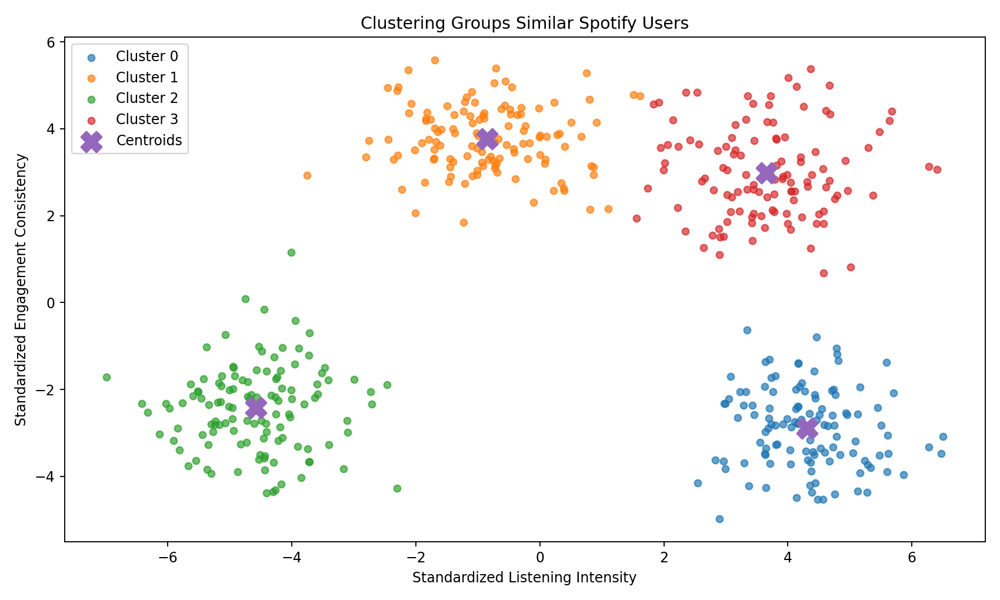

### Image Explanation

- Each point represents one user.
- The horizontal and vertical axes represent two behavioral dimensions.
- Points close together have similar behavior.
- The algorithm groups nearby users.
- The `X` markers represent cluster centers.
- The visual example contains four clusters.

The image is illustrative. Real Spotify clustering uses more than two features, but two dimensions make the idea easier to see.

---

# 4. Why Clustering Is Required

Spotify users do not behave in the same way.

Some users may:

- Listen for only a few minutes
- Open Spotify occasionally
- Skip many tracks
- Avoid advertisements
- Explore many genres
- Repeat the same artists
- Listen every day
- Use very long sessions

Treating all users identically can lead to:

- Generic recommendations
- Generic Premium offers
- Poor advertisement targeting
- Weak retention strategies
- Missed engagement opportunities

Clustering helps Spotify discover hidden groups.

```text
Large User Population
        ↓
Behavioral Clusters
        ↓
Different User Needs
        ↓
Different Business Strategies
```

---

# 5. Supervised vs Unsupervised Learning

| Supervised Learning | Unsupervised Learning |
|---|---|
| Known target exists | No known target |
| Learns from labeled examples | Discovers hidden structure |
| Predicts category or number | Finds groups or patterns |
| Classification and regression | Clustering |
| Example: Predict Premium conversion | Example: Discover user personas |

In this project, there is no existing column such as:

```text
persona = Power Streamer
```

The algorithm must discover groups from behavior.

Therefore, clustering is unsupervised.

---

# 6. What Does Similarity Mean?

Similarity means users have comparable feature values.

Example:

```text
User A
daily_listening_minutes = 160
sessions_per_day = 6
days_active_last_30 = 28
skip_rate = 0.15

User B
daily_listening_minutes = 172
sessions_per_day = 7
days_active_last_30 = 29
skip_rate = 0.18
```

These users may be similar.

Another user:

```text
User C
daily_listening_minutes = 25
sessions_per_day = 1
days_active_last_30 = 5
skip_rate = 0.78
```

may be far less similar.

---

# 7. Similarity and Distance

Many clustering algorithms represent similarity through distance.

```text
Small distance
→ More similar

Large distance
→ Less similar
```

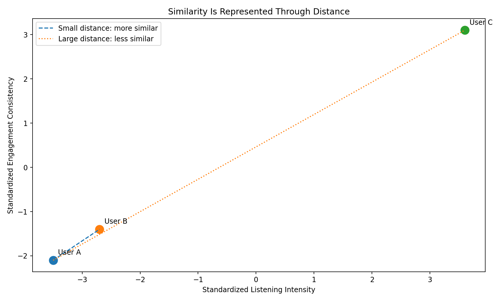

### Image Explanation

- User A and User B are close to each other.
- Their distance is small, so they are more similar.
- User C is far from User A.
- The larger distance indicates weaker similarity.
- Distance is calculated using all selected model features.

---

## 7.1 Distance Is Not Business Importance

Distance depends on:

- Selected features
- Feature scaling
- Distance metric
- Transformation
- Feature weights

The algorithm does not automatically know which feature matters most to Spotify.

Feature selection and preprocessing determine the geometry.

---

# 8. Euclidean Distance

Euclidean distance is the straight-line distance between two points.

For two features:

```text
Distance =
√[(x₂ - x₁)² + (y₂ - y₁)²]
```

For many features:

```text
Distance =
√[(feature₁ difference)²
 + (feature₂ difference)²
 + ...
 + (featureₙ difference)²]
```

---

## 8.1 Visual Explanation

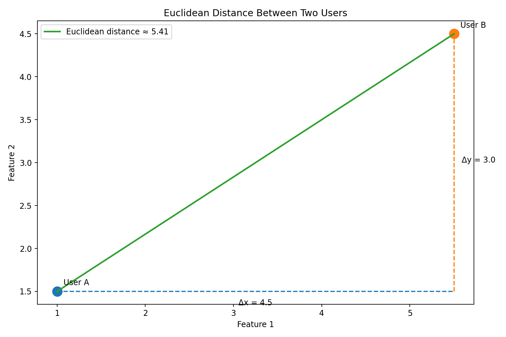

### Image Explanation

- User A and User B are represented by two points.
- The horizontal difference is `Δx`.
- The vertical difference is `Δy`.
- The diagonal line is the Euclidean distance.
- The formula follows the Pythagorean theorem.

---

## 8.2 Python Example

```python
import numpy as np

user_a = np.array([1.0, 1.5])
user_b = np.array([5.5, 4.5])

distance = np.linalg.norm(
    user_b - user_a
)

print(distance)
```

Equivalent manual calculation:

```python
distance = np.sqrt(
    ((5.5 - 1.0) ** 2)
    + ((4.5 - 1.5) ** 2)
)
```

---

# 9. Why Scaling Comes Before Clustering

Suppose the features are:

```text
daily_listening_minutes → 0 to hundreds
skip_rate               → 0 to 1
```

Without scaling, listening minutes can dominate Euclidean distance.

The previous module covered:

- StandardScaler
- MinMaxScaler
- RobustScaler
- PowerTransformer
- QuantileTransformer

The clustering model should use the transformed feature matrix, not raw unequal units.

```text
Raw Features
        ↓
Scaling
        ↓
Comparable Feature Magnitudes
        ↓
Clustering
```

---

# 10. How Clusters Are Formed

The exact process depends on the algorithm.

A centroid-based method such as K-Means generally performs:

```text
1. Select number of clusters K
2. Initialize K centroids
3. Calculate distance from each user to each centroid
4. Assign each user to the nearest centroid
5. Recalculate centroids
6. Repeat until assignments stabilize
```

---

## 10.1 Visual Example

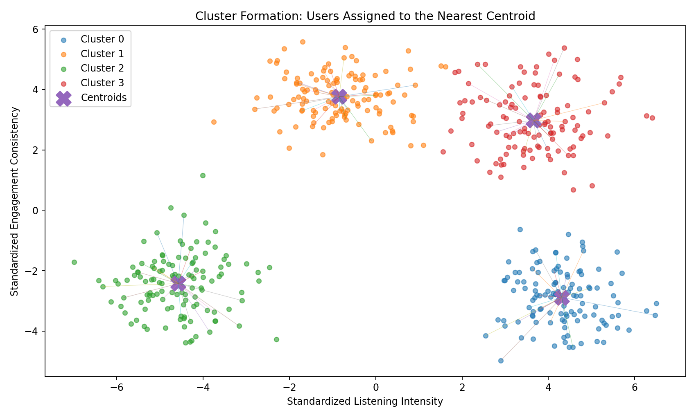

### Image Explanation

- Each point represents a user.
- Lines show example assignments toward a centroid.
- Each `X` represents a cluster center.
- Users are assigned to their nearest centroid.
- The centroids move during training until the solution stabilizes.

Only a subset of assignment lines is shown to keep the image readable.

---

# 11. Hard Clustering

Hard clustering assigns each observation to exactly one cluster.

```text
User 1001 → Cluster 0
User 1002 → Cluster 2
User 1003 → Cluster 1
```

K-Means is a hard-clustering algorithm.

---

## 11.1 Visual Example


### Image Explanation

- Every user belongs to one and only one cluster.
- The model provides one integer label per user.
- A boundary user must still be assigned to one side.
- The `X` markers represent the centroids.

---

## 11.2 Hard-Clustering Output

```python
labels = kmeans.fit_predict(
    X_scaled
)

print(labels[:10])
```

Possible output:

```text
[2, 0, 1, 1, 3, 0, 2, 2, 1, 3]
```

---

# 12. Soft Clustering

Soft clustering gives each observation a probability of belonging to each cluster.

Gaussian Mixture Models support soft clustering.

Example:

```text
User 1001:
Cluster 0 probability = 0.78
Cluster 1 probability = 0.18
Cluster 2 probability = 0.03
Cluster 3 probability = 0.01
```

The user is most likely in Cluster 0, but some uncertainty is retained.

---

## 12.1 Visual Example

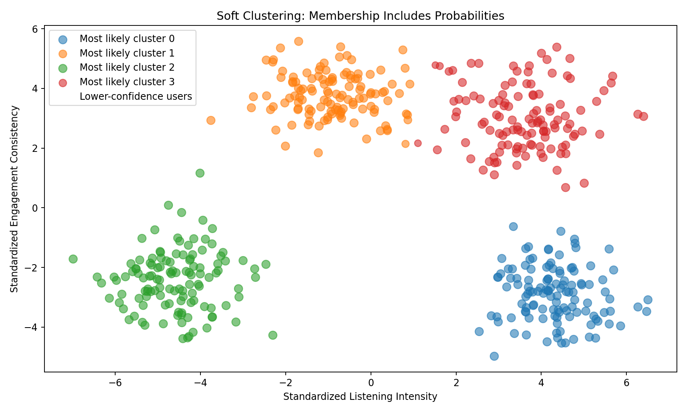

### Image Explanation

- Each user still has a most likely cluster.
- Marker size reflects confidence in the most likely cluster.
- Outlined users represent lower-confidence assignments.
- Users near cluster boundaries often have more mixed probabilities.
- Soft clustering is useful when behavior overlaps.

---

## 12.2 Python Example

```python
from sklearn.mixture import GaussianMixture

gmm = GaussianMixture(
    n_components=4,
    random_state=42
)

gmm.fit(X_scaled)

hard_labels = gmm.predict(
    X_scaled
)

probabilities = gmm.predict_proba(
    X_scaled
)
```

---

# 13. Hard vs Soft Clustering

| Hard Clustering | Soft Clustering |
|---|---|
| One cluster per user | Probability for every cluster |
| Simple output | Richer uncertainty information |
| K-Means example | GMM example |
| Clear business assignment | Useful for boundary users |
| No membership confidence | Membership confidence available |

## Spotify Interpretation

Hard clustering:

```text
Assign one persona to each user.
```

Soft clustering:

```text
User is mostly a Power Streamer but also partly a Habitual Loyalist.
```

---

# 14. What Is a Centroid?

A centroid is the average position of all points in a cluster.

For each feature:

```text
Centroid value
=
Mean feature value of users in that cluster
```

A centroid is not necessarily a real user.

It is a mathematical center.

---

## 14.1 Visual Example

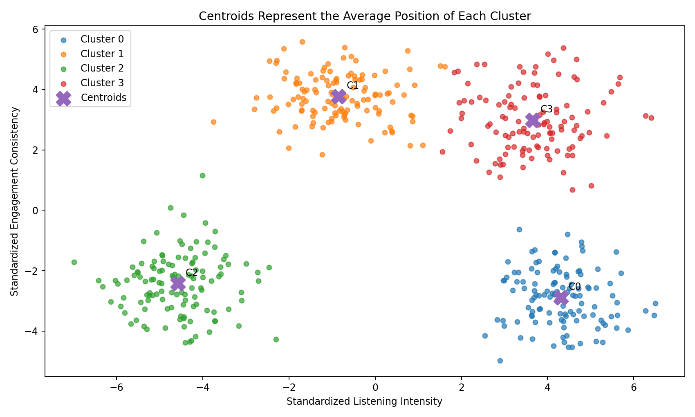

### Image Explanation

- Each `X` is a centroid.
- C0, C1, C2 and C3 are centroid identifiers.
- Each centroid summarizes the average feature position of one cluster.
- Users closer to a centroid are more representative of that cluster.

---

## 14.2 Business Interpretation

After inverse scaling, a centroid may look like:

```text
Cluster 3:
daily_listening_minutes = 190
sessions_per_day = 7.4
days_active_last_30 = 28
avg_session_minutes = 34
skip_rate = 0.14
```

This supports a persona such as:

```text
Power Streamers
```

---

# 15. Cluster Labels

Cluster labels are model-generated group identifiers.

Examples:

```text
0
1
2
3
```

They do not have an inherent order.

```text
Cluster 3 is not better than Cluster 1.

Cluster 0 is not the lowest-quality group.
```

The numbers are arbitrary identifiers.

---

## 15.1 Visual Example

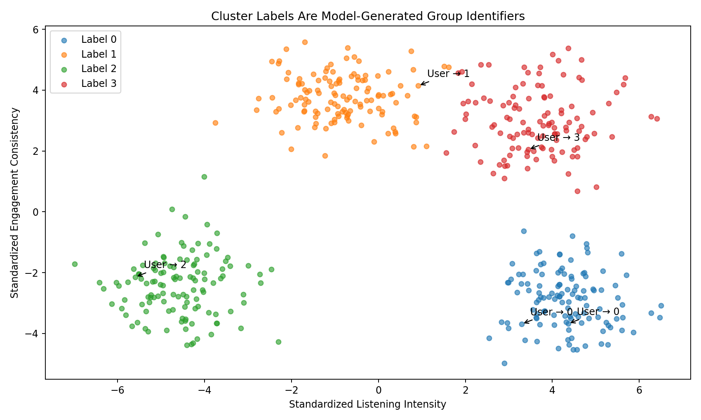

### Image Explanation

- Each user receives a technical label.
- Labels identify groups but do not explain them.
- The same data may receive different numeric label ordering in another run.
- Business meaning must come from cluster profiling.

---

# 16. Cluster Label vs Business Persona

```text
Cluster Label
= Technical output

Segment
= Business interpretation

Persona
= Descriptive user identity
```

Example:

```text
Cluster 3
        ↓
High-engagement segment
        ↓
Power Streamers
```

A cluster should not be named before reviewing:

- Feature averages
- Medians
- Percentiles
- Demographics
- Cluster size
- Business opportunities
- Risks

---

# 17. Choosing the Number of Clusters

Some algorithms require a number of clusters.

For K-Means:

```python
KMeans(
    n_clusters=4
)
```

For GMM:

```python
GaussianMixture(
    n_components=4
)
```

The correct number should not be chosen only by guessing.

Use multiple forms of evidence:

- Elbow Method
- Silhouette Score
- Cluster size balance
- Stability
- Business interpretability
- Profile separation
- GMM AIC and BIC
- Operational usefulness

---

# 18. Elbow Method

The Elbow Method compares K-Means inertia for different values of `K`.

Inertia measures the total squared distance of users from their assigned centroids.

Lower is better, but inertia always falls when more clusters are added.

We look for a bend where improvement starts slowing.

---

## 18.1 Image

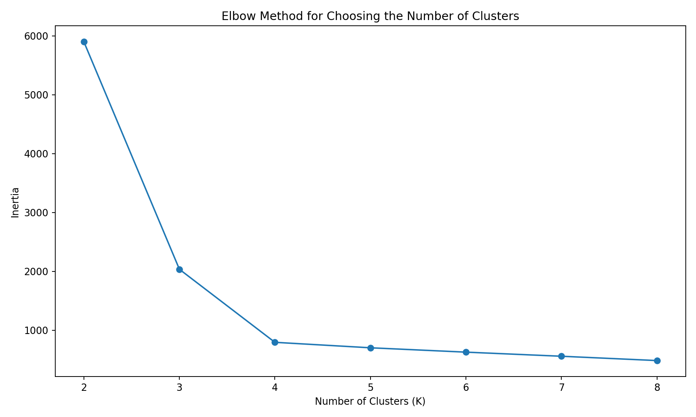

### Image Explanation

- The x-axis shows the number of clusters.
- The y-axis shows inertia.
- Inertia decreases as more clusters are added.
- The useful point is where the curve starts flattening.
- The elbow is guidance, not an automatic final answer.

---

# 19. Silhouette Score

Silhouette Score compares:

- How close a user is to its own cluster
- How far it is from neighboring clusters

General range:

```text
-1 to +1
```

| Score | General Meaning |
|---:|---|
| Close to +1 | Well separated |
| Around 0 | Near cluster boundary |
| Negative | Possibly assigned to the wrong cluster |

---

## 19.1 Image

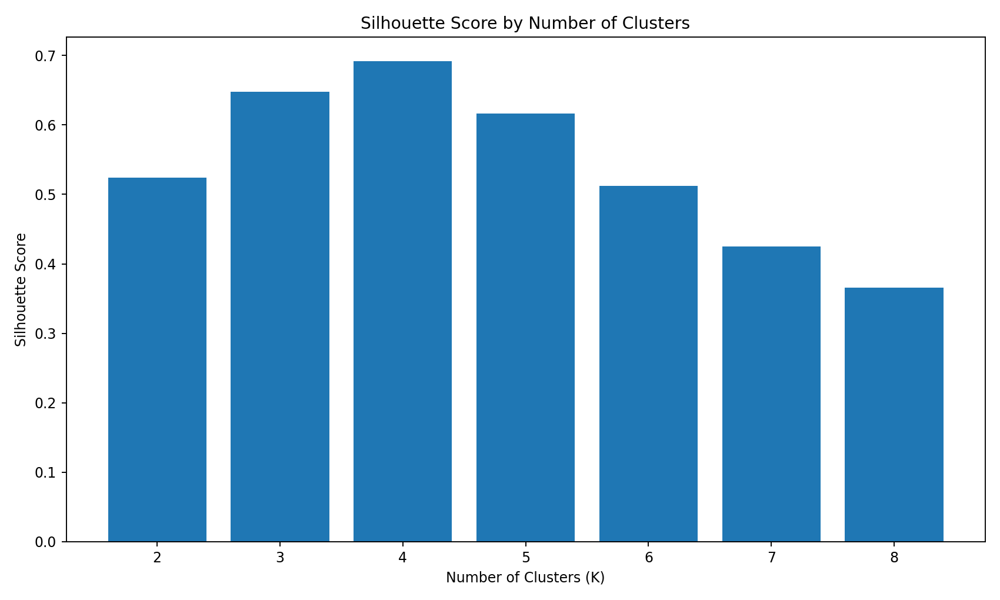

### Image Explanation

- Each bar represents one candidate `K`.
- Higher score generally indicates better separation.
- The highest score is not automatically the best business solution.
- Cluster size, stability and interpretability must also be reviewed.

---

# 20. Cluster Size and Balance

A high score can still produce unusable clusters.

Example:

```text
Cluster 0 = 93%
Cluster 1 = 3%
Cluster 2 = 2%
Cluster 3 = 2%
```

Questions to ask:

- Is the large cluster too broad?
- Are tiny clusters valid niche personas?
- Are tiny groups caused by outliers?
- Can business teams act on the segment?
- Is the group stable across experiments?

Balanced does not always mean equal.

Real populations can contain small valuable segments.

---

# 21. Business Interpretability

A useful clustering solution should answer:

- What makes each cluster different?
- Can the difference be explained simply?
- Does each cluster represent a distinct behavior?
- Can Spotify take a different action for each cluster?
- Are the personas stable and meaningful?

A technically strong cluster solution that cannot be interpreted may have limited business value.

---

# 22. Cluster Stability

Stable clusters remain broadly similar when:

- Random seed changes
- Sample changes
- Data is refreshed
- Preprocessing changes slightly
- Model is retrained

Possible stability checks:

- Adjusted Rand Index between runs
- Centroid comparison
- Cluster-size comparison
- Profile comparison
- User assignment consistency

Stability is covered in detail in later evaluation modules.

---

# 23. Business Uses of Clustering

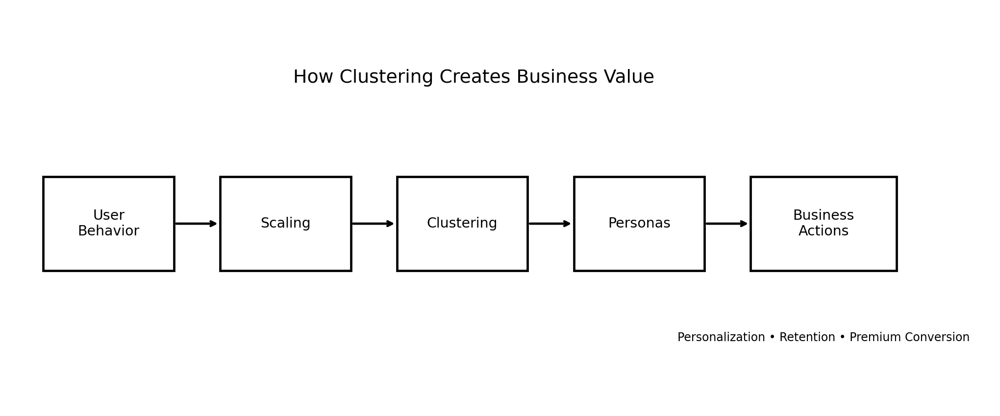

### Image Explanation

- User behavior becomes the model input.
- Scaling creates a comparable feature space.
- Clustering discovers groups.
- Analysts convert groups into personas.
- Business teams design actions for each persona.
- Actions may support personalization, retention and Premium conversion.

---

## General Business Uses

- Customer segmentation
- Marketing personalization
- Product personalization
- Risk grouping
- Store grouping
- Fraud-pattern discovery
- Geographic segmentation
- Content segmentation
- Customer lifecycle analysis

---

# 24. Spotify Clustering Use Cases

## 24.1 Recommendation Strategy

Different clusters may require:

- Familiar music
- More discovery
- Mood-based playlists
- Mainstream recommendations
- Niche recommendations

---

## 24.2 Premium Conversion

A cluster with:

```text
High engagement
+ High ad skipping
```

may be a strong Premium-conversion audience.

---

## 24.3 Retention

A cluster with:

```text
Low active days
+ Long gaps between plays
```

may need re-engagement campaigns.

---

## 24.4 Advertisement Strategy

Different clusters may vary in:

- Advertisement tolerance
- Skip behavior
- Session length
- Listening time
- Device usage

---

## 24.5 Product Experience

Frequent short-session users may need a different home-page experience from long-session users.

---

# 25. Spotify Persona Example

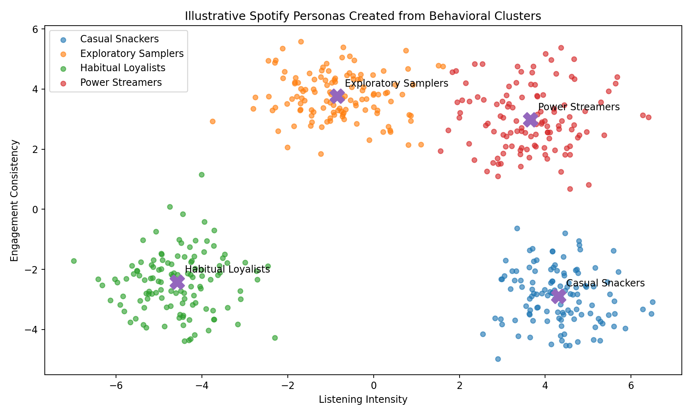

### Image Explanation

The figure shows an illustrative translation from technical clusters to four business personas:

- Casual Snackers
- Exploratory Samplers
- Habitual Loyalists
- Power Streamers

The names are not generated by the algorithm.

They are assigned after profile analysis.

The actual persona name must be supported by:

- Cluster feature averages
- Distribution differences
- Demographic profiling
- Business interpretation

---

# 26. Clustering Workflow

```text
1. Understand business objective
2. Clean data
3. Perform EDA
4. Select features
5. Engineer features
6. Scale and transform
7. Choose clustering algorithms
8. Test multiple values of K
9. Evaluate technical metrics
10. Review cluster sizes
11. Check stability
12. Profile clusters
13. Create segments and personas
14. Recommend business actions
```

Clustering is not only:

```python
model.fit_predict(X)
```

The model is one stage in a larger analytical process.

---

# 27. What Clustering Can and Cannot Tell Us

## Clustering Can

- Discover hidden groups
- Summarize complex behavior
- Support persona development
- Identify high-engagement and low-engagement patterns
- Reveal unusual subgroups
- Support targeted strategy

## Clustering Cannot Automatically

- Prove why behavior occurs
- Guarantee that every group is actionable
- Name personas
- Predict future conversion by itself
- Prove causation
- Guarantee that one K is objectively correct
- Replace business judgment

---

# 28. Common Clustering Algorithms

| Algorithm | Type | Main Idea |
|---|---|---|
| K-Means | Hard | Assign users to nearest centroid |
| Gaussian Mixture Model | Soft | Estimate probability under Gaussian components |
| Hierarchical clustering | Hard | Build a hierarchy of merged or divided groups |
| DBSCAN | Hard / density-based | Find dense regions and noise |
| HDBSCAN | Density-based | Find variable-density groups |
| Spectral clustering | Graph-based | Use similarity graph structure |

This project focuses primarily on:

```text
K-Means
Gaussian Mixture Models
```

---

# 29. Clustering Evaluation Overview

Because clustering has no true labels, evaluation uses several measures.

## Technical Metrics

- Silhouette Score
- Inertia
- Calinski-Harabasz Score
- Davies-Bouldin Score
- AIC
- BIC
- Log-likelihood

## Structural Checks

- Cluster sizes
- Cluster percentages
- Tiny or dominant clusters
- Separation
- Stability

## Business Checks

- Clear profile differences
- Meaningful personas
- Actionable recommendations
- Operational simplicity

No single metric should make the final decision.

---

# 30. Practical Python Example

```python
import pandas as pd

from sklearn.preprocessing import StandardScaler
from sklearn.cluster import KMeans
from sklearn.metrics import silhouette_score

behavior = pd.read_excel(
    "spotify_user_behavior.xlsx"
)

features = [
    "daily_listening_minutes",
    "sessions_per_day",
    "avg_session_minutes",
    "days_active_last_30",
    "skip_rate",
    "ads_skipped_pct"
]

X = behavior[
    features
].copy()

scaler = StandardScaler()

X_scaled = scaler.fit_transform(
    X
)

model = KMeans(
    n_clusters=4,
    random_state=42,
    n_init=20
)

cluster_labels = model.fit_predict(
    X_scaled
)

score = silhouette_score(
    X_scaled,
    cluster_labels
)

output = behavior[
    ["user_id"]
].copy()

output["cluster"] = (
    cluster_labels
)

print(
    "Silhouette Score:",
    round(score, 4)
)

print(
    output["cluster"]
    .value_counts()
    .sort_index()
)
```

The complete examples are included in:

```text
examples/spotify_clustering_concepts.py
examples/choosing_number_of_clusters.py
examples/euclidean_distance_example.py
```

---

# 31. Module Checklist

## Concept Understanding

- [ ] Clustering definition understood
- [ ] Unsupervised learning understood
- [ ] Similarity and distance understood
- [ ] Euclidean distance understood
- [ ] Scaling requirement understood
- [ ] Cluster formation understood
- [ ] Hard and soft clustering understood
- [ ] Centroids understood
- [ ] Cluster labels understood

## Choosing Clusters

- [ ] Multiple K values tested
- [ ] Elbow Method reviewed
- [ ] Silhouette Score reviewed
- [ ] Cluster sizes reviewed
- [ ] Stability considered
- [ ] Business interpretation considered

## Business Use

- [ ] Cluster profiles planned
- [ ] Personas not assigned too early
- [ ] Actions linked to each segment
- [ ] Limitations documented
- [ ] Technical labels separated from business names

---

# 32. Important Terminology

| Term | Meaning |
|---|---|
| Clustering | Grouping similar observations |
| Unsupervised learning | Learning without target labels |
| Similarity | Degree to which observations are alike |
| Distance | Numeric measure of difference |
| Euclidean distance | Straight-line distance |
| Feature space | Coordinate system created by model features |
| Cluster | Group of similar records |
| Cluster assignment | User-to-cluster allocation |
| Hard clustering | One cluster per record |
| Soft clustering | Probability across clusters |
| Centroid | Mean position of a cluster |
| Cluster label | Technical group identifier |
| Persona | Business-friendly cluster description |
| K | Number of clusters |
| Inertia | Within-cluster squared distance |
| Silhouette Score | Cohesion and separation measure |
| Cluster balance | Distribution of records across clusters |
| Stability | Consistency across retraining or samples |
| Boundary user | User near multiple clusters |
| Membership probability | Probability of belonging to a cluster |
| Feature scaling | Making numeric magnitudes comparable |
| Profile | Statistical description of a cluster |
| Actionability | Ability to use a cluster in business decisions |

---

# 33. Interview Questions and Answers

## 1. What is clustering?

Clustering is an unsupervised technique that groups similar observations.

---

## 2. Why is clustering unsupervised?

There is no predefined target label.

---

## 3. Why is clustering required for Spotify?

It helps discover hidden user-behavior groups for personalization, retention, advertising and Premium strategy.

---

## 4. What is similarity?

The degree to which users have comparable feature values.

---

## 5. How is similarity represented?

Often through distance.

---

## 6. What does a small distance mean?

Users are more similar in the selected feature space.

---

## 7. What is Euclidean distance?

The straight-line distance between points.

---

## 8. Why must features be scaled?

Large numerical ranges can dominate distance.

---

## 9. What is cluster formation?

The process of assigning similar users to groups according to an algorithm.

---

## 10. What is hard clustering?

Every observation belongs to exactly one cluster.

---

## 11. Give an example of hard clustering.

K-Means.

---

## 12. What is soft clustering?

Each observation receives membership probabilities across clusters.

---

## 13. Give an example of soft clustering.

Gaussian Mixture Model.

---

## 14. What is a centroid?

The average position of points in a cluster.

---

## 15. Is a centroid always a real user?

No.

---

## 16. What is a cluster label?

A technical identifier such as 0, 1, 2 or 3.

---

## 17. Does Cluster 3 mean better than Cluster 1?

No. Labels are arbitrary.

---

## 18. Who creates persona names?

Analysts and business stakeholders after profiling.

---

## 19. How do you choose the number of clusters?

Use metrics, balance, stability and business interpretability.

---

## 20. What is the Elbow Method?

A method that looks for diminishing improvement in inertia as K increases.

---

## 21. What is inertia?

Total squared distance between points and their centroids.

---

## 22. What is Silhouette Score?

A metric comparing within-cluster cohesion and separation from other clusters.

---

## 23. What is the Silhouette Score range?

Approximately -1 to +1.

---

## 24. Is the highest Silhouette Score always the final choice?

No.

---

## 25. Why review cluster sizes?

A technically good solution may contain tiny or dominant unusable clusters.

---

## 26. What is cluster stability?

Consistency of cluster structure across retraining or sampling.

---

## 27. What is a boundary user?

A user located near more than one cluster.

---

## 28. Why is soft clustering useful for boundary users?

It retains membership probabilities and uncertainty.

---

## 29. What is the difference between cluster and persona?

A cluster is technical output. A persona is a business interpretation.

---

## 30. What business problems can clustering support?

Segmentation, recommendations, retention, advertisements and Premium conversion.

---

# 34. Module Summary

In this module, we learned:

- Clustering groups similar observations
- Clustering is unsupervised because no target labels exist
- Similarity is often represented through distance
- Euclidean distance is a common straight-line metric
- Scaling is essential for distance-based clustering
- Cluster formation depends on the selected algorithm
- Hard clustering assigns one group
- Soft clustering provides membership probabilities
- Centroids represent average cluster positions
- Cluster labels are arbitrary technical identifiers
- Personas are created after cluster profiling
- The number of clusters should be selected using multiple forms of evidence
- Elbow and Silhouette are helpful but not sufficient alone
- Cluster size, stability and business interpretation matter
- Spotify can use clustering for personalization, retention, Premium conversion and advertisement strategy
- Clustering discovers patterns but does not prove causation

---

# 35. Quick Reference Cheat Sheet

## Clustering

```text
Similar users → Same cluster
Different users → Different clusters
```

## Euclidean Distance

```text
distance =
√Σ(feature difference²)
```

## Hard vs Soft

```text
K-Means → One cluster label
GMM     → Probability for each cluster
```

## Centroid

```text
Mean position of one cluster
```

## Choosing K

```text
Elbow
Silhouette
Cluster size
Stability
Business interpretation
```

## Technical to Business

```text
Cluster 2
→ Loyal segment
→ Habitual Loyalists
→ Retention and rewards strategy
```

---

# 36. What Comes Next?

## Module 09 — K-Means Clustering

The next module can cover:

- K-Means algorithm
- Initialization
- Assignment step
- Update step
- Convergence
- Inertia
- Elbow Method
- K-Means++
- Random state
- Multiple initializations
- Spotify K-Means implementation
- Cluster-center interpretation
