# Module 09 — K-Means Clustering

> A detailed beginner-friendly guide to the K-Means algorithm, K values, centroid initialization, cluster assignment, centroid recalculation, iterations, convergence, inertia, the Elbow Method, advantages, limitations, and an end-to-end Spotify implementation.

---

## Table of Contents

1. [Module Overview](#1-module-overview)
2. [Learning Objectives](#2-learning-objectives)
3. [K-Means Definition](#3-k-means-definition)
4. [Why It Is Called K-Means](#4-why-it-is-called-k-means)
5. [Understanding the K Value](#5-understanding-the-k-value)
6. [K-Means Inputs and Outputs](#6-k-means-inputs-and-outputs)
7. [What Is a Centroid?](#7-what-is-a-centroid)
8. [Centroid Initialization](#8-centroid-initialization)
9. [Random Initialization vs K-Means++](#9-random-initialization-vs-k-means)
10. [Step 1 — Select K](#10-step-1--select-k)
11. [Step 2 — Initialize Centroids](#11-step-2--initialize-centroids)
12. [Step 3 — Cluster Assignment](#12-step-3--cluster-assignment)
13. [Step 4 — Centroid Recalculation](#13-step-4--centroid-recalculation)
14. [Step 5 — Repeat Iterations](#14-step-5--repeat-iterations)
15. [What Is Convergence?](#15-what-is-convergence)
16. [Complete K-Means Algorithm](#16-complete-k-means-algorithm)
17. [What Is Inertia?](#17-what-is-inertia)
18. [Interpreting Inertia](#18-interpreting-inertia)
19. [Elbow Method](#19-elbow-method)
20. [Silhouette Score as Supporting Evidence](#20-silhouette-score-as-supporting-evidence)
21. [How to Choose the Final K](#21-how-to-choose-the-final-k)
22. [Understanding K-Means Parameters](#22-understanding-k-means-parameters)
23. [`n_clusters`](#23-n_clusters)
24. [`init`](#24-init)
25. [`n_init`](#25-n_init)
26. [`max_iter`](#26-max_iter)
27. [`tol`](#27-tol)
28. [`random_state`](#28-random_state)
29. [Advantages of K-Means](#29-advantages-of-k-means)
30. [Limitations of K-Means](#30-limitations-of-k-means)
31. [When K-Means Works Well](#31-when-k-means-works-well)
32. [When K-Means May Perform Poorly](#32-when-k-means-may-perform-poorly)
33. [Spotify Feature Selection for K-Means](#33-spotify-feature-selection-for-k-means)
34. [Spotify K-Means Implementation](#34-spotify-k-means-implementation)
35. [Testing Multiple K Values](#35-testing-multiple-k-values)
36. [Attaching Cluster Labels](#36-attaching-cluster-labels)
37. [Cluster Size Analysis](#37-cluster-size-analysis)
38. [Centroid Interpretation](#38-centroid-interpretation)
39. [Inverse-Scaling Centroids](#39-inverse-scaling-centroids)
40. [Cluster Profiling and Persona Naming](#40-cluster-profiling-and-persona-naming)
41. [Reproducibility and Model Saving](#41-reproducibility-and-model-saving)
42. [Complete Spotify K-Means Workflow](#42-complete-spotify-k-means-workflow)
43. [K-Means Validation Checklist](#43-k-means-validation-checklist)
44. [Important Terminology](#44-important-terminology)
45. [Interview Questions and Answers](#45-interview-questions-and-answers)
46. [Module Summary](#46-module-summary)
47. [Quick Reference Cheat Sheet](#47-quick-reference-cheat-sheet)
48. [What Comes Next?](#48-what-comes-next)

---

# 1. Module Overview

K-Means is one of the most widely used clustering algorithms.

It groups users into `K` clusters by repeatedly:

```text
Assigning users to the nearest centroid
        ↓
Recalculating the centroid of each cluster
        ↓
Repeating until the centroids stabilize
```

For the Spotify project, K-Means can group users using behavioral features such as:

- Daily listening minutes
- Sessions per day
- Average session duration
- Days active
- Skip rate
- Advertisement skipping
- Repeat behavior
- Genre diversity

The technical output is:

```text
user_id | cluster
```

The business output comes later:

```text
Cluster 0 → Casual Snackers
Cluster 1 → Exploratory Samplers
Cluster 2 → Habitual Loyalists
Cluster 3 → Power Streamers
```

Persona names are assigned only after cluster profiling.

---

# 2. Learning Objectives

By the end of this module, students should be able to:

- Define K-Means
- Explain the meaning of `K`
- Explain centroids
- Explain centroid initialization
- Explain K-Means++
- Explain cluster assignment
- Explain centroid recalculation
- Explain iterations
- Explain convergence
- Explain inertia
- Use the Elbow Method
- Use Silhouette Score as supporting evidence
- Understand important K-Means parameters
- Explain the advantages of K-Means
- Explain its limitations
- Implement K-Means for Spotify data
- Test multiple K values
- Attach cluster labels to `user_id`
- Analyze cluster sizes
- Interpret centroids
- Convert scaled centroids back to original units
- Profile clusters and create personas
- Save the model and scaler

---

# 3. K-Means Definition

K-Means is a hard-clustering algorithm that partitions observations into `K` groups.

Each observation belongs to the cluster with the nearest centroid.

The algorithm attempts to minimize:

```text
Within-cluster squared distance
```

This objective is commonly reported as:

```text
Inertia
```

---

## 3.1 Visual Definition

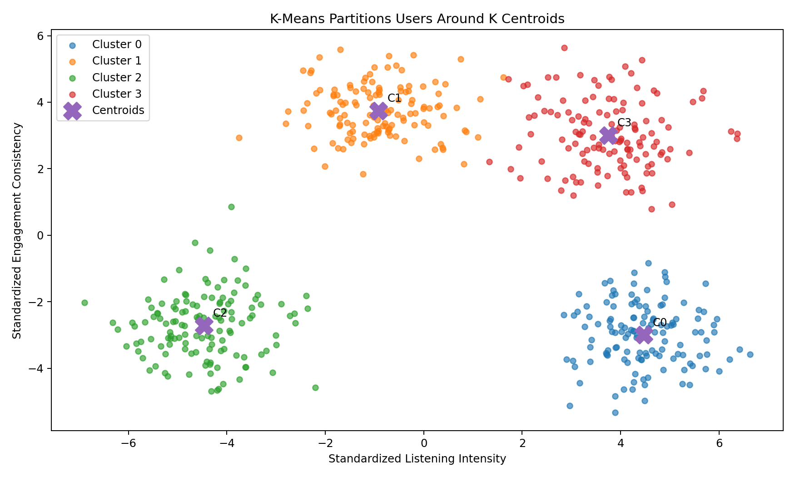

### Image Explanation

- Each point represents a user.
- Similar users are placed near each other.
- Each color represents one K-Means cluster.
- Each `X` represents a centroid.
- Every user belongs to exactly one cluster.
- The model attempts to keep users close to their own centroid.

---

# 4. Why It Is Called K-Means

The name contains two parts.

## K

`K` is the number of clusters.

Example:

```text
K = 4
```

means the algorithm will create four clusters.

## Means

The centroid is calculated using the mean of users assigned to the cluster.

Therefore:

```text
K-Means
=
K groups represented by mean positions
```

---

# 5. Understanding the K Value

Different K values create different segmentation structures.

## K = 2

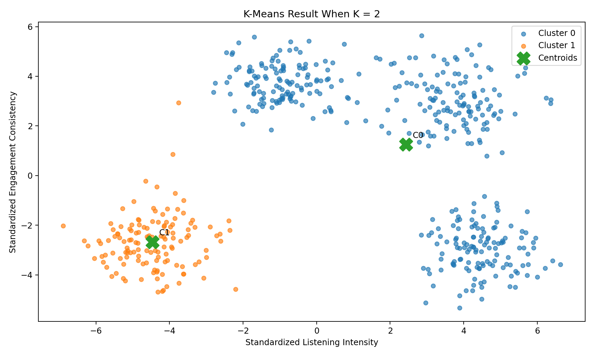

### Interpretation

- The population is divided into two broad groups.
- The solution may be easy to explain.
- Important behavior differences may be combined together.

---

## K = 3

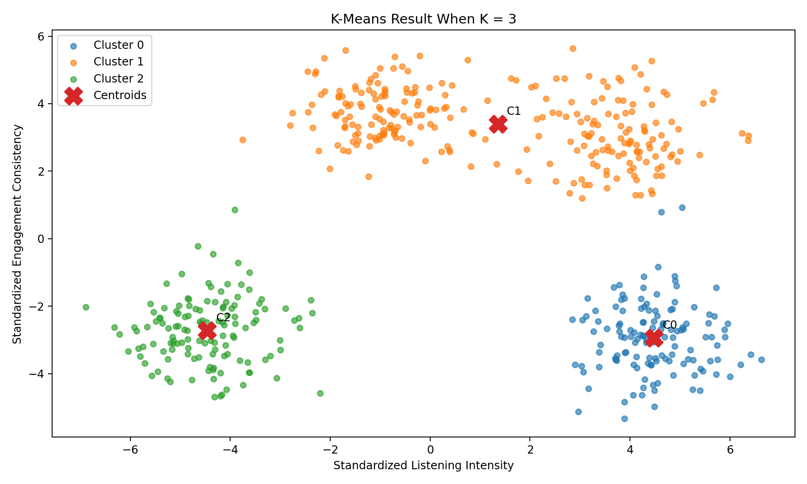

### Interpretation

- The population is divided into three groups.
- More detail is captured than K = 2.
- Some naturally distinct groups may still be merged.

---

## K = 4

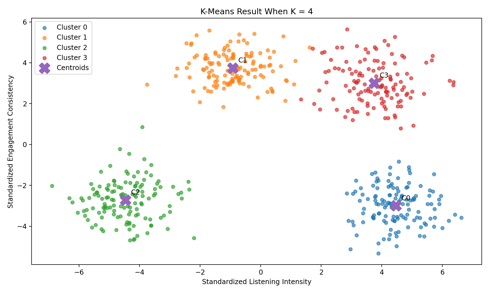

### Interpretation

- Four distinct behavioral groups are created in the illustrative data.
- This may support richer personas.
- A larger K is not automatically better.
- More clusters increase complexity and reduce inertia.

---

## Important Rule

K is not selected only because:

```text
Four persona names sound good.
```

The selection must use:

- Inertia
- Elbow Method
- Silhouette Score
- Cluster sizes
- Stability
- Business interpretation

---

# 6. K-Means Inputs and Outputs

## Inputs

K-Means receives a numerical feature matrix.

```text
X_scaled
```

Example shape:

```text
108,000 users × 6 features
```

Possible features:

```text
daily_listening_minutes
sessions_per_day
avg_session_minutes
days_active_last_30
skip_rate
ads_skipped_pct
```

---

## Outputs

### Cluster Labels

```python
model.labels_
```

One integer for each user.

### Centroids

```python
model.cluster_centers_
```

One centroid for each cluster.

### Inertia

```python
model.inertia_
```

Total within-cluster squared distance.

### Iteration Count

```python
model.n_iter_
```

Number of iterations used before convergence.

---

# 7. What Is a Centroid?

A centroid is the mean position of users in one cluster.

For one feature:

```text
Centroid listening minutes
=
Mean listening minutes of cluster members
```

For multiple features, the centroid contains one mean value for each feature.

Example:

| Feature | Cluster Centroid |
|---|---:|
| Listening intensity | 1.25 |
| Sessions | 0.90 |
| Active days | 1.10 |
| Skip rate | -0.72 |

These values may be standardized values.

For business interpretation, convert them back to original units.

---

# 8. Centroid Initialization

K-Means requires initial centroids before the assignment process begins.

Poor initial centroids may lead to:

- Slower convergence
- Poor local solutions
- Different cluster structures
- Higher final inertia

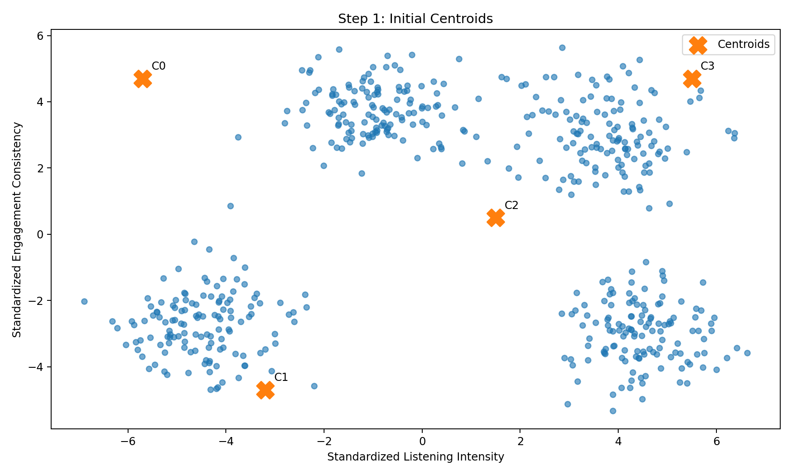

### Image Explanation

- User points are not yet assigned.
- Four initial centroids are shown as `X` markers.
- Their initial locations may be temporary.
- The algorithm moves them during training.

---

# 9. Random Initialization vs K-Means++

## Random Initialization

Randomly selects initial centroid positions or observations.

Possible problem:

- Several centroids may begin too close together.
- One natural group may initially receive no good center.
- Results may depend strongly on the random seed.

---

## K-Means++

K-Means++ selects initial centers in a way intended to spread them apart.

In Scikit-learn, the usual K-Means initialization is:

```python
init="k-means++"
```

Advantages:

- Better starting positions
- Often faster convergence
- Lower risk of poor local solutions

K-Means++ improves initialization but does not guarantee the global optimum.

---

# 10. Step 1 — Select K

Choose a candidate number of clusters.

```python
K = 4
```

At this stage, K may be a hypothesis.

A proper experiment tests several values.

Example:

```text
K = 2 to 10
```

---

# 11. Step 2 — Initialize Centroids

The algorithm creates K initial centers.

```text
K = 4
→ 4 initial centroids
```

The initialization is controlled by:

```python
init
n_init
random_state
```

---

# 12. Step 3 — Cluster Assignment

Each user is assigned to the closest centroid.

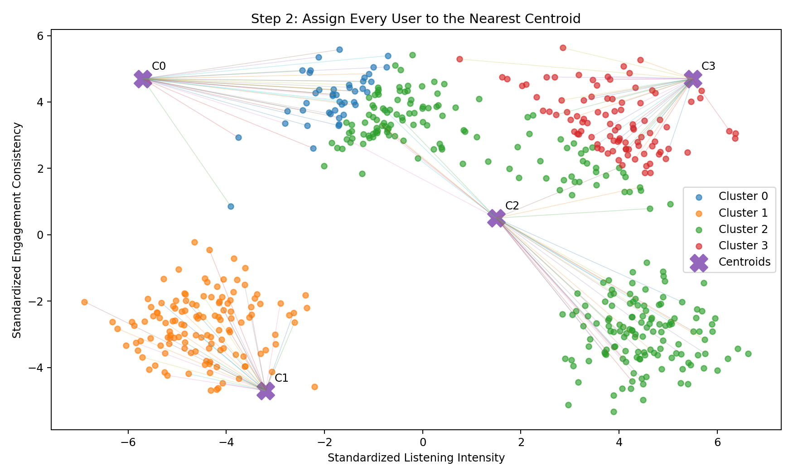

### Image Explanation

- Each color represents the closest initial centroid.
- Example lines connect users to their current centroid.
- Every user receives exactly one cluster assignment.
- Initial assignments are not final.
- Assignment depends on Euclidean distance in the transformed feature space.

---

## Assignment Logic

For each user:

```text
1. Calculate distance to Centroid 0
2. Calculate distance to Centroid 1
3. Calculate distance to Centroid 2
4. Calculate distance to Centroid 3
5. Choose the smallest distance
```

---

# 13. Step 4 — Centroid Recalculation

After assignment, each centroid is recalculated.

```text
New Centroid
=
Mean of users assigned to that cluster
```

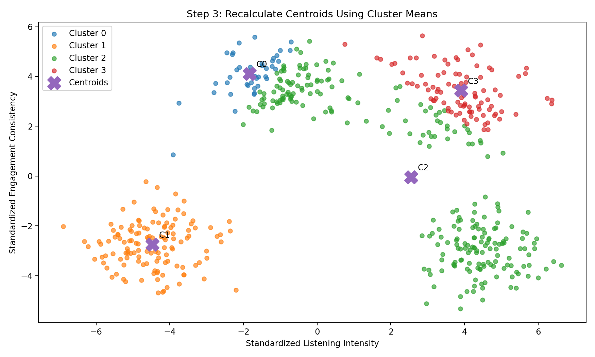

### Image Explanation

- Users retain the first assignment colors.
- Centroids move toward the center of their assigned users.
- The mean of the assigned points becomes the new centroid.
- Some users may change clusters during the next assignment step.

---

# 14. Step 5 — Repeat Iterations

K-Means repeats:

```text
Assignment
→ Centroid recalculation
→ Assignment
→ Centroid recalculation
```

Each repetition is an iteration.

During early iterations:

- Centroids may move significantly.
- Many users may change clusters.

During later iterations:

- Centroid movement decreases.
- Fewer users change assignments.

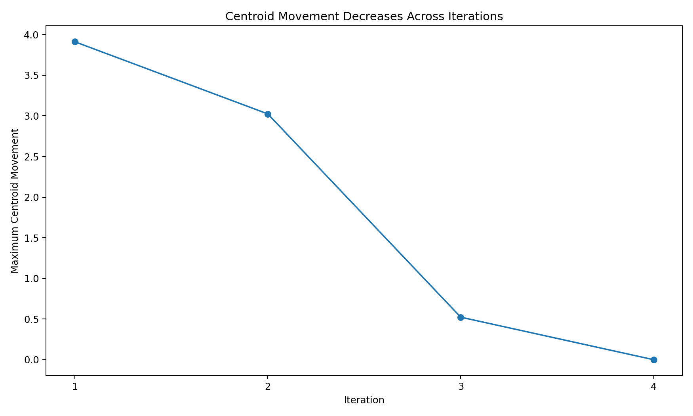

### Image Explanation

- The x-axis shows algorithm iterations.
- The y-axis shows the largest centroid movement.
- Movement falls as the model improves.
- When movement becomes extremely small, convergence is reached.

---

# 15. What Is Convergence?

Convergence means the solution has stabilized according to the stopping rule.

Possible stopping conditions:

- Centroid movement is below `tol`
- Cluster assignments stop changing
- `max_iter` is reached

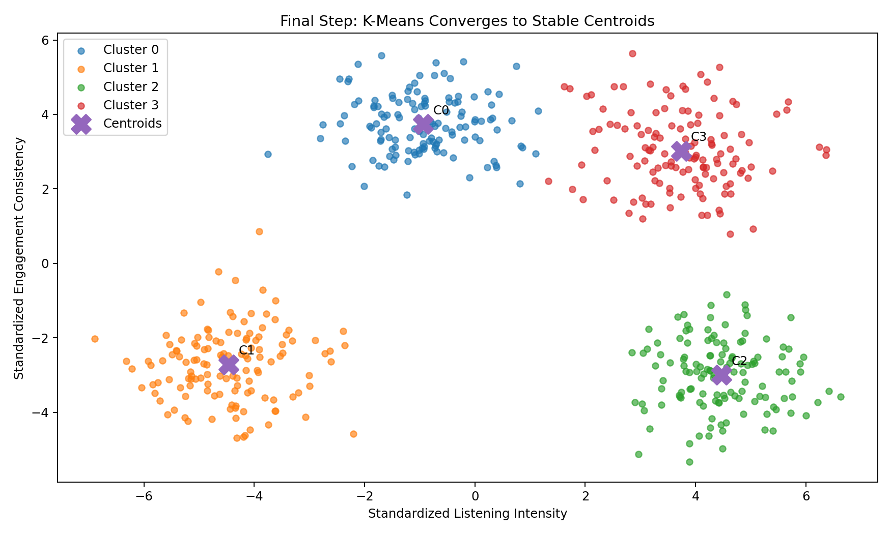

### Image Explanation

- Centroids have moved into the middle of stable groups.
- User assignments are now stable.
- Further iterations would produce little or no change.
- The final solution is a local optimum.

---

## Local Optimum

K-Means may converge to different solutions from different initializations.

That is why multiple initializations are useful.

```python
n_init=20
```

The implementation keeps the run with the best inertia among those initializations.

---

# 16. Complete K-Means Algorithm

```text
Input:
- Numerical feature matrix X
- Number of clusters K

Process:
1. Initialize K centroids
2. Calculate distance from every user to every centroid
3. Assign each user to the nearest centroid
4. Recalculate each centroid as the cluster mean
5. Repeat steps 2–4
6. Stop when converged or max iterations reached

Output:
- Cluster label for every user
- Final centroids
- Inertia
- Number of iterations
```

---

# 17. What Is Inertia?

Inertia is the sum of squared distances between every user and the centroid of the assigned cluster.

```text
Inertia
=
Σ distance(user, assigned centroid)²
```

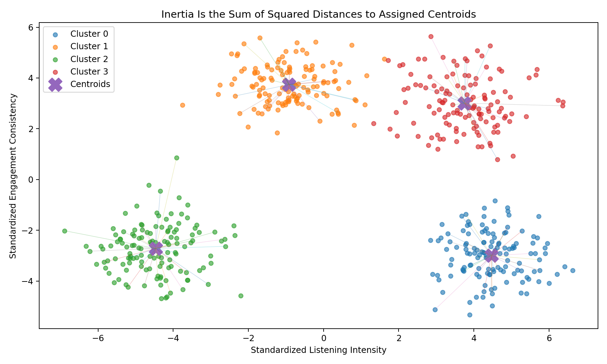

### Image Explanation

- Example lines connect users to their assigned centroids.
- Each line represents a within-cluster distance.
- K-Means squares and sums these distances.
- A compact solution has lower inertia.

---

# 18. Interpreting Inertia

Lower inertia means users are closer to their centroids.

However:

```text
Inertia always decreases as K increases.
```

Why?

More centroids allow the model to place centers closer to users.

Extreme case:

```text
K = Number of users
→ Inertia approaches 0
```

That solution is useless for segmentation.

Therefore, inertia cannot select K by itself.

---

# 19. Elbow Method

The Elbow Method plots:

```text
K vs Inertia
```

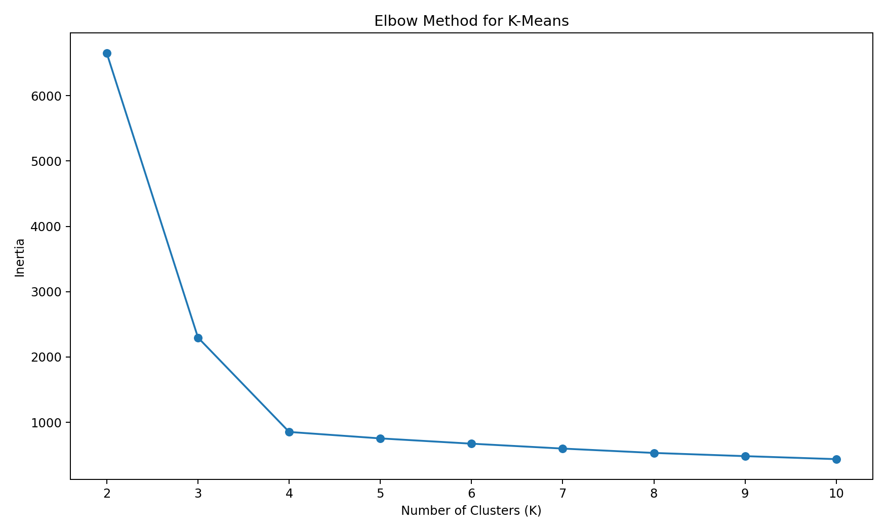

### Image Explanation

- Inertia falls as K increases.
- Early increases in K may create large improvements.
- Later increases may provide smaller improvements.
- The bend is called the elbow.
- The elbow suggests a reasonable balance between compactness and complexity.

---

## Python Example

```python
inertias = []

for k in range(2, 11):
    model = KMeans(
        n_clusters=k,
        random_state=42,
        n_init=20
    )

    model.fit(X_scaled)

    inertias.append(
        model.inertia_
    )
```

---

# 20. Silhouette Score as Supporting Evidence

Silhouette Score compares:

- Cohesion within the assigned cluster
- Separation from the nearest alternative cluster

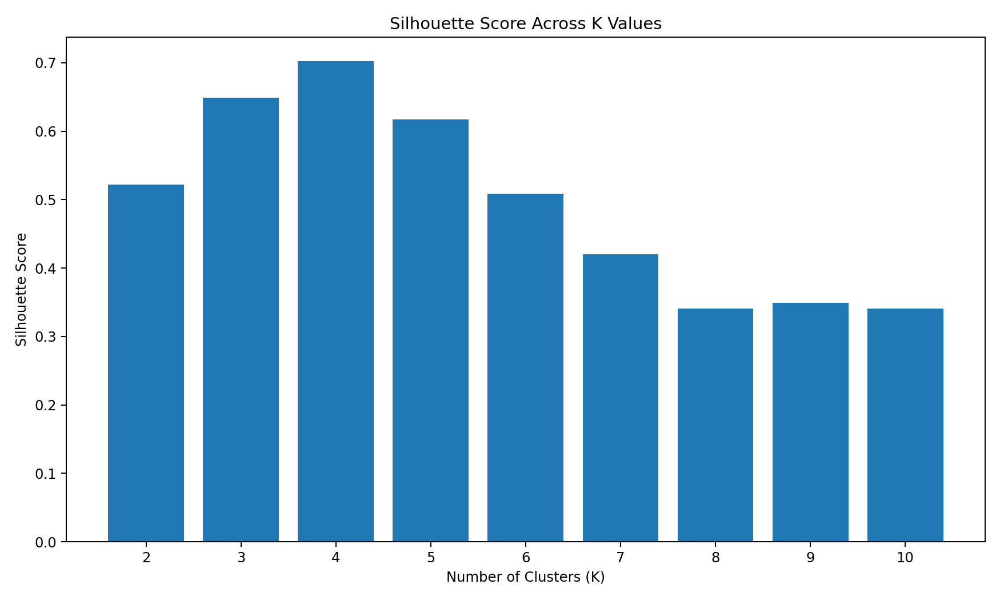

### Image Explanation

- Each bar represents one K value.
- A higher value generally means stronger separation.
- The highest score should not be used blindly.
- Cluster balance and business meaning must also be considered.

---

# 21. How to Choose the Final K

Use multiple forms of evidence.

| Evidence | Question |
|---|---|
| Elbow Method | Where does inertia improvement slow? |
| Silhouette Score | Are groups cohesive and separated? |
| Cluster size | Are groups usable and believable? |
| Stability | Do results remain similar across runs? |
| Centroid profiles | Are groups behaviorally distinct? |
| Business meaning | Can each cluster support an action? |
| Simplicity | Can stakeholders understand the segmentation? |

The final K is an analytical and business decision.

---

# 22. Understanding K-Means Parameters

A common Scikit-learn configuration:

```python
model = KMeans(
    n_clusters=4,
    init="k-means++",
    n_init=20,
    max_iter=300,
    tol=1e-4,
    random_state=42
)
```

Each parameter has a specific role.

---

# 23. `n_clusters`

```python
n_clusters=4
```

Defines K.

It controls how many clusters are created.

---

# 24. `init`

```python
init="k-means++"
```

Controls centroid initialization.

Common options:

```text
k-means++
random
custom centroid array
```

---

# 25. `n_init`

```python
n_init=20
```

Runs K-Means multiple times with different initial centroid seeds.

The result with the best inertia is retained.

Why use an explicit integer?

- Easy reproducibility across environments
- More robust comparison
- Avoid dependence on version-specific automatic behavior

---

# 26. `max_iter`

```python
max_iter=300
```

Maximum number of iterations allowed for one run.

If convergence occurs earlier, the algorithm stops earlier.

---

# 27. `tol`

```python
tol=1e-4
```

Controls the convergence tolerance.

When centroid changes become sufficiently small, training can stop.

---

# 28. `random_state`

```python
random_state=42
```

Controls random behavior.

Using a fixed value helps:

- Reproduce experiments
- Compare feature sets
- Compare scalers
- Debug results

It does not guarantee that clusters remain identical after major data changes.

---

# 29. Advantages of K-Means

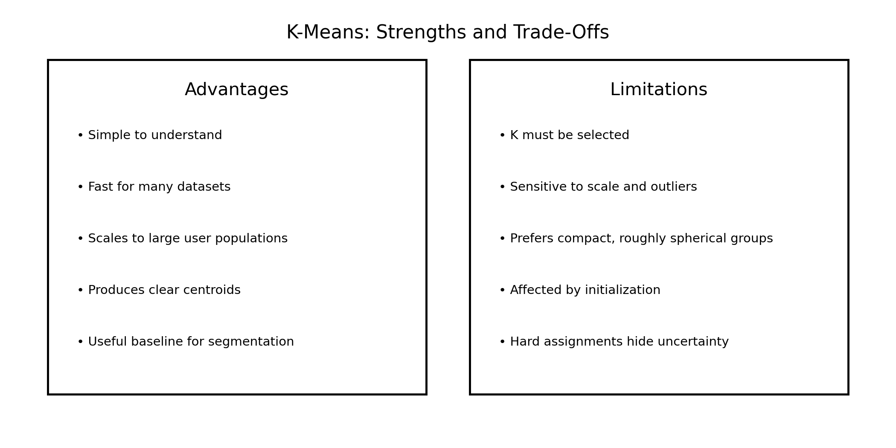

## Main Advantages

- Simple to understand
- Easy to implement
- Fast for many practical datasets
- Scales to large user populations
- Provides clear cluster assignments
- Provides centroids for interpretation
- Works well as a baseline
- Supports experiment automation
- Easy to combine with scaling pipelines

---

# 30. Limitations of K-Means

## Main Limitations

- K must be selected in advance
- Sensitive to feature scale
- Sensitive to outliers
- Sensitive to initialization
- May converge to a local optimum
- Prefers compact, roughly spherical clusters
- Struggles with different densities
- Struggles with irregular shapes
- Produces hard assignments only
- Centroids use means and can be influenced by extreme values

---

# 31. When K-Means Works Well

K-Means is suitable when:

- Features are numerical
- Features are scaled
- Groups are reasonably compact
- Groups have similar spread
- Large-scale clustering is needed
- Hard assignments are acceptable
- Centroids are useful for business interpretation

---

# 32. When K-Means May Perform Poorly

K-Means may be unsuitable when:

- Clusters have curved shapes
- Cluster densities differ strongly
- Many outliers exist
- Groups overlap heavily
- Categorical variables dominate
- Soft membership is required
- K is unclear and unstable
- Feature engineering produces distorted geometry

Alternatives may include:

- Gaussian Mixture Models
- DBSCAN
- HDBSCAN
- Hierarchical clustering
- Spectral clustering

---

# 33. Spotify Feature Selection for K-Means

A core behavioral feature set:

```python
features = [
    "daily_listening_minutes",
    "sessions_per_day",
    "avg_session_minutes",
    "days_active_last_30",
    "skip_rate",
    "ads_skipped_pct"
]
```

These represent:

| Feature | Dimension |
|---|---|
| `daily_listening_minutes` | Intensity |
| `sessions_per_day` | Frequency |
| `avg_session_minutes` | Depth |
| `days_active_last_30` | Consistency |
| `skip_rate` | Content friction |
| `ads_skipped_pct` | Advertisement friction |

Keep:

```text
user_id
```

separately for output.

Do not include it in the feature matrix.

---

# 34. Spotify K-Means Implementation

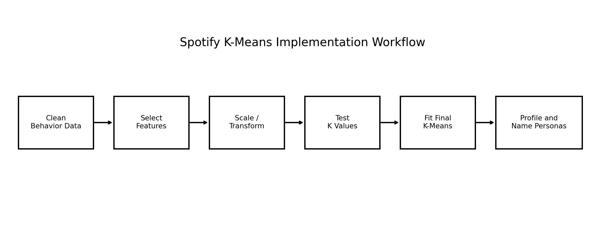

### Image Explanation

The end-to-end workflow is:

1. Load clean behavioral data
2. Select model features
3. Scale or transform them
4. Test multiple K values
5. Fit the selected K-Means model
6. Profile clusters
7. Create persona names and business actions

---

## Complete Baseline

```python
import pandas as pd

from sklearn.preprocessing import StandardScaler
from sklearn.cluster import KMeans
from sklearn.metrics import silhouette_score

behavior = pd.read_excel(
    "spotify_user_behavior.xlsx"
)

features = [
    "daily_listening_minutes",
    "sessions_per_day",
    "avg_session_minutes",
    "days_active_last_30",
    "skip_rate",
    "ads_skipped_pct"
]

user_ids = behavior[
    ["user_id"]
].copy()

X = behavior[
    features
].copy()

scaler = StandardScaler()

X_scaled = scaler.fit_transform(
    X
)

model = KMeans(
    n_clusters=4,
    init="k-means++",
    n_init=20,
    max_iter=300,
    tol=1e-4,
    random_state=42
)

labels = model.fit_predict(
    X_scaled
)

score = silhouette_score(
    X_scaled,
    labels
)

clustered_users = (
    user_ids.copy()
)

clustered_users[
    "cluster"
] = labels

print(
    "Inertia:",
    model.inertia_
)

print(
    "Iterations:",
    model.n_iter_
)

print(
    "Silhouette:",
    round(score, 4)
)
```

---

# 35. Testing Multiple K Values

```python
results = []

for k in range(2, 11):
    model = KMeans(
        n_clusters=k,
        init="k-means++",
        n_init=20,
        random_state=42
    )

    labels = model.fit_predict(
        X_scaled
    )

    counts = pd.Series(
        labels
    ).value_counts()

    results.append({
        "k": k,
        "inertia": model.inertia_,
        "silhouette": (
            silhouette_score(
                X_scaled,
                labels
            )
        ),
        "smallest_cluster_pct": (
            100
            * counts.min()
            / len(labels)
        ),
        "largest_cluster_pct": (
            100
            * counts.max()
            / len(labels)
        )
    })

evaluation = pd.DataFrame(
    results
)

display(
    evaluation.round(4)
)
```

This comparison includes:

- Inertia
- Silhouette
- Smallest cluster percentage
- Largest cluster percentage

---

# 36. Attaching Cluster Labels

Correct:

```python
cluster_output = behavior[
    ["user_id"]
].copy()

cluster_output[
    "cluster"
] = labels
```

This keeps the business identifier connected to the model result.

Do not use:

```text
DataFrame index
```

as the long-term user identifier.

---

# 37. Cluster Size Analysis

```python
cluster_sizes = (
    cluster_output[
        "cluster"
    ]
    .value_counts()
    .sort_index()
    .rename_axis(
        "cluster"
    )
    .reset_index(
        name="users"
    )
)

cluster_sizes[
    "percentage"
] = (
    cluster_sizes[
        "users"
    ]
    .div(
        cluster_sizes[
            "users"
        ]
        .sum()
    )
    .mul(100)
    .round(2)
)

display(cluster_sizes)
```

Review:

- Tiny clusters
- Dominant clusters
- Outlier groups
- Business usability
- Stability across experiments

---

# 38. Centroid Interpretation

Scaled centroids show the relative cluster position.

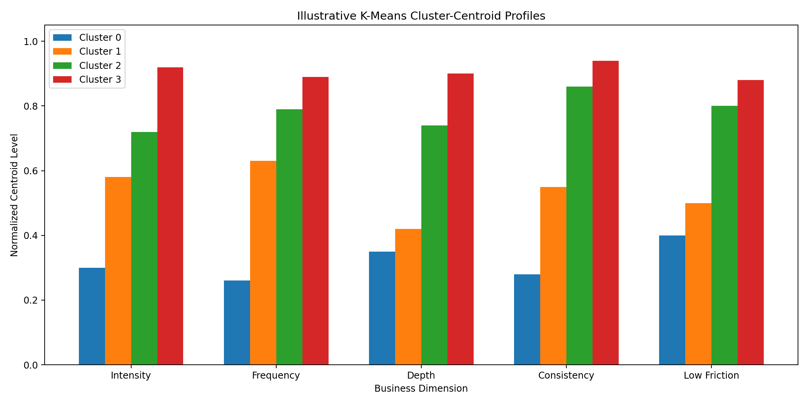

### Image Explanation

- Each bar group represents one cluster.
- Each business dimension comes from one or more model features.
- Higher intensity means stronger listening volume.
- Higher consistency means more active days.
- Higher low-friction means lower skipping in this illustrative profile.
- The visual helps compare clusters, but business reporting should also show original units.

---

## Scaled-Centroid DataFrame

```python
centroids_scaled = pd.DataFrame(
    model.cluster_centers_,
    columns=features
)

centroids_scaled[
    "cluster"
] = range(
    model.n_clusters
)

display(
    centroids_scaled.round(3)
)
```

---

# 39. Inverse-Scaling Centroids

Convert centroids back to original units:

```python
centroids_original = (
    scaler.inverse_transform(
        model.cluster_centers_
    )
)

centroids_original = pd.DataFrame(
    centroids_original,
    columns=features
)

centroids_original[
    "cluster"
] = range(
    model.n_clusters
)

display(
    centroids_original.round(3)
)
```

Now the business can read:

```text
Minutes
Sessions
Days active
Skip-rate percentage
```

instead of standardized values.

---

# 40. Cluster Profiling and Persona Naming

Centroids alone are not enough.

Profile each cluster using:

- Mean
- Median
- Percentiles
- User count
- Demographics
- Device
- Country
- Subscription tenure

Example:

```python
behavior_with_cluster = (
    behavior.copy()
)

behavior_with_cluster[
    "cluster"
] = labels

profile = (
    behavior_with_cluster
    .groupby(
        "cluster"
    )[features]
    .agg(
        [
            "mean",
            "median"
        ]
    )
)

display(profile)
```

Only after profiling should names be assigned.

---

# 41. Reproducibility and Model Saving

Save:

- Feature list
- Scaler
- K-Means model
- Experiment ID
- K
- Random state
- Cluster-profile definitions
- Persona-name mapping

```python
import joblib

joblib.dump(
    scaler,
    "spotify_scaler.joblib"
)

joblib.dump(
    model,
    "spotify_kmeans.joblib"
)
```

For future users:

```python
X_future_scaled = (
    scaler.transform(
        X_future
    )
)

future_labels = (
    model.predict(
        X_future_scaled
    )
)
```

Do not refit the scaler for every new user batch.

---

# 42. Complete Spotify K-Means Workflow

```text
Business Problem
        ↓
Clean Behavioral Data
        ↓
Feature Selection
        ↓
Scaling and Transformation
        ↓
K = 2 to K = 10 Experiments
        ↓
Inertia + Silhouette + Cluster Sizes
        ↓
Choose Candidate K
        ↓
Stability Validation
        ↓
Fit Final K-Means
        ↓
Attach Labels to user_id
        ↓
Inverse-Scale Centroids
        ↓
Profile Clusters
        ↓
Create Personas
        ↓
Recommend Business Actions
```

The complete scripts are included in:

```text
examples/spotify_kmeans_pipeline.py
examples/kmeans_iteration_visualization.py
examples/elbow_silhouette_analysis.py
examples/spotify_kmeans_cluster_profiling.py
```

---

# 43. K-Means Validation Checklist

## Input Data

- [ ] Clean data loaded
- [ ] `user_id` separated
- [ ] Numerical features selected
- [ ] Missing values checked
- [ ] Infinite values checked
- [ ] Features scaled

## K-Means Configuration

- [ ] K range documented
- [ ] Initialization documented
- [ ] Explicit `n_init` used
- [ ] Random state fixed
- [ ] Maximum iterations set
- [ ] Tolerance documented

## Evaluation

- [ ] Inertia captured
- [ ] Elbow plot created
- [ ] Silhouette captured
- [ ] Cluster counts calculated
- [ ] Cluster percentages calculated
- [ ] Stability tested
- [ ] Centroids reviewed

## Business Interpretation

- [ ] Original-unit centroids created
- [ ] Mean and median profiles created
- [ ] Demographics joined
- [ ] Persona names supported by evidence
- [ ] Business action written for every cluster
- [ ] Limitations documented

## Reproducibility

- [ ] Feature order saved
- [ ] Scaler saved
- [ ] Model saved
- [ ] Experiment ID recorded
- [ ] Persona mapping versioned

---

# 44. Important Terminology

| Term | Meaning |
|---|---|
| K-Means | Centroid-based hard clustering |
| K | Number of clusters |
| Centroid | Mean position of a cluster |
| Initialization | Starting centroid selection |
| K-Means++ | Spread-aware initialization method |
| Assignment | Mapping each user to nearest centroid |
| Recalculation | Updating centroid using cluster mean |
| Iteration | One assignment-and-update cycle |
| Convergence | Stable stopping state |
| Local optimum | Stable but not guaranteed globally best result |
| Inertia | Sum of squared within-cluster distances |
| Elbow Method | K-selection method using inertia curve |
| Silhouette Score | Cohesion and separation measure |
| Hard clustering | One cluster per user |
| `n_init` | Number of initialization runs |
| `max_iter` | Maximum iterations per run |
| `tol` | Convergence tolerance |
| `random_state` | Reproducibility control |
| Cluster label | Technical integer group ID |
| Cluster profile | Statistical description of a cluster |
| Inverse transform | Convert centroid to original units |
| Persona | Business-friendly cluster identity |

---

# 45. Interview Questions and Answers

## 1. What is K-Means?

K-Means is a hard-clustering algorithm that groups observations around K centroids.

---

## 2. What does K represent?

The number of clusters.

---

## 3. Why is it called K-Means?

It creates K groups represented by mean positions.

---

## 4. What is a centroid?

The mean position of users in one cluster.

---

## 5. Is a centroid always an actual user?

No.

---

## 6. What is centroid initialization?

The process of selecting starting centroids.

---

## 7. What is K-Means++?

An initialization method designed to spread initial centers.

---

## 8. What is cluster assignment?

Assigning each user to the nearest centroid.

---

## 9. What is centroid recalculation?

Calculating the mean of users assigned to each cluster.

---

## 10. What is an iteration?

One assignment-and-centroid-update cycle.

---

## 11. What is convergence?

The point where centroid changes become sufficiently small or the stopping rule is reached.

---

## 12. What is a local optimum?

A stable solution that may not be the globally best solution.

---

## 13. Why use multiple initializations?

Different starting centers may produce different local solutions.

---

## 14. What is inertia?

The sum of squared distances from users to their assigned centroids.

---

## 15. Is lower inertia always better?

For the same K, generally yes. Across K values, inertia always declines and cannot be used alone.

---

## 16. What is the Elbow Method?

A method that finds where inertia improvement starts slowing.

---

## 17. What is Silhouette Score?

A measure of cluster cohesion and separation.

---

## 18. How do you choose K?

Use inertia, Silhouette, cluster sizes, stability and business interpretability.

---

## 19. What does `n_clusters` do?

Sets K.

---

## 20. What does `init` do?

Controls initial centroid selection.

---

## 21. What does `n_init` do?

Runs K-Means multiple times and retains the best-inertia solution.

---

## 22. What does `max_iter` do?

Sets the maximum number of iterations per run.

---

## 23. What does `tol` do?

Sets the convergence tolerance.

---

## 24. What does `random_state` do?

Makes randomized behavior reproducible.

---

## 25. Why must Spotify features be scaled?

They use different units and K-Means relies on distance.

---

## 26. What are the advantages of K-Means?

It is simple, fast, scalable and produces interpretable centroids.

---

## 27. What are the limitations of K-Means?

It needs K, is sensitive to scale and outliers, and prefers compact clusters.

---

## 28. Does K-Means support soft membership?

No.

---

## 29. How do you attach cluster labels to users?

Keep `user_id` separately and add the predicted label.

---

## 30. Why inverse-transform centroids?

To explain clusters in original business units.

---

## 31. Why profile clusters after K-Means?

Technical labels do not provide business meaning.

---

## 32. Can Cluster 3 be assumed better than Cluster 1?

No. Labels are arbitrary.

---

## 33. Why save the scaler and model?

Future users must use the same transformation and cluster definitions.

---

## 34. When may K-Means perform poorly?

With irregular shapes, different densities, strong outliers or heavy overlap.

---

## 35. What is the complete Spotify K-Means workflow?

Clean, select features, scale, test K, evaluate, fit, label, profile, name personas and recommend actions.

---

# 46. Module Summary

In this module, we learned:

- K-Means partitions users into K hard clusters
- Each cluster is represented by a centroid
- K is chosen through experiments
- K-Means starts with initialized centroids
- K-Means++ generally provides stronger starting positions
- Every user is assigned to the nearest centroid
- Centroids are recalculated using cluster means
- The process repeats through iterations
- Convergence occurs when the solution stabilizes
- Inertia measures within-cluster squared distance
- Inertia always decreases as K increases
- The Elbow Method helps identify diminishing improvement
- Silhouette supports K comparison
- Cluster size, stability and business interpretation are also required
- K-Means is simple and scalable
- It is sensitive to scaling, outliers and initialization
- Spotify labels must be attached to `user_id`
- Centroids should be interpreted in original units
- Personas must be based on cluster profiles
- The scaler, feature order and model must be saved for future use

---

# 47. Quick Reference Cheat Sheet

## K-Means Steps

```text
Choose K
→ Initialize centroids
→ Assign users
→ Recalculate centroids
→ Repeat
→ Converge
```

## Baseline Code

```python
model = KMeans(
    n_clusters=4,
    init="k-means++",
    n_init=20,
    random_state=42
)

labels = model.fit_predict(
    X_scaled
)
```

## Outputs

```python
model.labels_
model.cluster_centers_
model.inertia_
model.n_iter_
```

## Choose K Using

```text
Elbow
Silhouette
Cluster size
Stability
Interpretability
```

## Spotify Output

```text
user_id
cluster
```

---

# 48. What Comes Next?

## Module 10 — Gaussian Mixture Models

The next module can cover:

- GMM definition
- Probability distributions
- Soft clustering
- Membership probabilities
- Gaussian components
- Means and covariance
- Covariance types
- Log-likelihood
- AIC
- BIC
- GMM advantages and limitations
- Spotify implementation
