# Module 10 — Gaussian Mixture Models

> A detailed beginner-friendly guide to Gaussian Mixture Models, probability-based clustering, hard and soft assignments, Gaussian distributions, means and covariances, the Expectation-Maximization algorithm, covariance types, model evaluation, advantages, limitations, K-Means comparison, and Spotify implementation.

---

## Table of Contents

1. [Module Overview](#1-module-overview)
2. [Learning Objectives](#2-learning-objectives)
3. [GMM Definition](#3-gmm-definition)
4. [Why It Is Called a Gaussian Mixture Model](#4-why-it-is-called-a-gaussian-mixture-model)
5. [Probability-Based Clustering](#5-probability-based-clustering)
6. [Hard vs Soft Clustering](#6-hard-vs-soft-clustering)
7. [GMM Hard Labels](#7-gmm-hard-labels)
8. [GMM Membership Probabilities](#8-gmm-membership-probabilities)
9. [Gaussian Distribution](#9-gaussian-distribution)
10. [Mean](#10-mean)
11. [Variance and Covariance](#11-variance-and-covariance)
12. [Covariance Matrix](#12-covariance-matrix)
13. [Mixture Components and Weights](#13-mixture-components-and-weights)
14. [GMM Probability Model](#14-gmm-probability-model)
15. [Expectation-Maximization Overview](#15-expectation-maximization-overview)
16. [Initialization](#16-initialization)
17. [Expectation Step](#17-expectation-step)
18. [Maximization Step](#18-maximization-step)
19. [EM Iterations](#19-em-iterations)
20. [EM Convergence](#20-em-convergence)
21. [Lower Bound and Log-Likelihood](#21-lower-bound-and-log-likelihood)
22. [Covariance Types Overview](#22-covariance-types-overview)
23. [Full Covariance](#23-full-covariance)
24. [Tied Covariance](#24-tied-covariance)
25. [Diagonal Covariance](#25-diagonal-covariance)
26. [Spherical Covariance](#26-spherical-covariance)
27. [Covariance Type Comparison](#27-covariance-type-comparison)
28. [Choosing the Number of Components](#28-choosing-the-number-of-components)
29. [AIC](#29-aic)
30. [BIC](#30-bic)
31. [AIC vs BIC](#31-aic-vs-bic)
32. [Silhouette Score with GMM](#32-silhouette-score-with-gmm)
33. [Membership Confidence and Uncertainty](#33-membership-confidence-and-uncertainty)
34. [Advantages of GMM](#34-advantages-of-gmm)
35. [Limitations of GMM](#35-limitations-of-gmm)
36. [When GMM Works Well](#36-when-gmm-works-well)
37. [When GMM May Perform Poorly](#37-when-gmm-may-perform-poorly)
38. [K-Means vs GMM](#38-k-means-vs-gmm)
39. [Spotify GMM Feature Set](#39-spotify-gmm-feature-set)
40. [Spotify GMM Implementation](#40-spotify-gmm-implementation)
41. [Testing Components and Covariance Types](#41-testing-components-and-covariance-types)
42. [Attaching Hard Labels](#42-attaching-hard-labels)
43. [Storing Membership Probabilities](#43-storing-membership-probabilities)
44. [Identifying Boundary Users](#44-identifying-boundary-users)
45. [GMM Cluster Profiling](#45-gmm-cluster-profiling)
46. [Business Interpretation](#46-business-interpretation)
47. [Saving and Reusing the Model](#47-saving-and-reusing-the-model)
48. [Complete Spotify GMM Workflow](#48-complete-spotify-gmm-workflow)
49. [GMM Validation Checklist](#49-gmm-validation-checklist)
50. [Important Terminology](#50-important-terminology)
51. [Interview Questions and Answers](#51-interview-questions-and-answers)
52. [Module Summary](#52-module-summary)
53. [Quick Reference Cheat Sheet](#53-quick-reference-cheat-sheet)
54. [What Comes Next?](#54-what-comes-next)

---

# 1. Module Overview

A Gaussian Mixture Model, or GMM, is a probability-based clustering model.

Instead of saying only:

```text
User 1001 belongs to Cluster 2
```

GMM can say:

```text
User 1001:
Component 0 probability = 0.08
Component 1 probability = 0.17
Component 2 probability = 0.70
Component 3 probability = 0.05
```

This makes GMM useful when Spotify user behaviors overlap.

A listener may show characteristics of more than one persona.

```text
Highly engaged
+ Strong repeat behavior
+ Moderate exploration
```

Such a user may be mostly a Habitual Loyalist while also showing Power Streamer behavior.

---

# 2. Learning Objectives

By the end of this module, students should be able to:

- Define a Gaussian Mixture Model
- Explain probability-based clustering
- Differentiate hard and soft clustering
- Explain Gaussian distributions
- Explain mean, variance and covariance
- Explain mixture weights
- Explain the Expectation-Maximization algorithm
- Explain the E-step
- Explain the M-step
- Explain EM convergence
- Differentiate full, tied, diagonal and spherical covariance
- Explain AIC and BIC
- Compare GMM and K-Means
- Understand GMM advantages and limitations
- Implement GMM for Spotify behavior data
- Save hard labels and probabilities
- Identify uncertain boundary users
- Profile and interpret GMM components

---

# 3. GMM Definition

A Gaussian Mixture Model assumes that the observed population is generated by a mixture of several Gaussian components.

Each component has:

- A mixture weight
- A mean vector
- A covariance structure

GMM estimates these parameters from data.

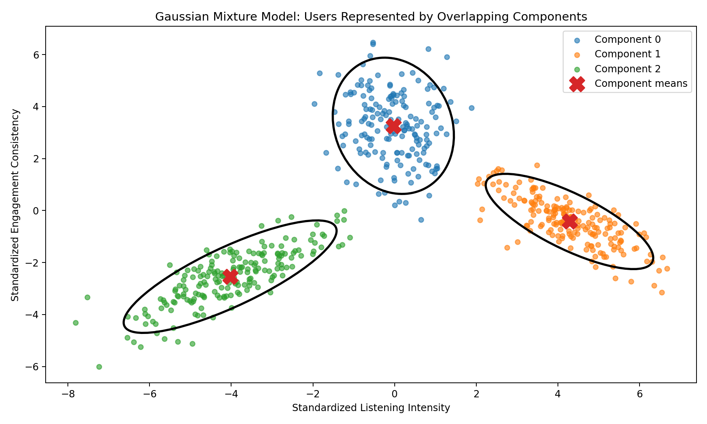

### Image Explanation

- Each point represents a user.
- Each ellipse represents one Gaussian component.
- The `X` marker represents the component mean.
- Components can have different sizes, shapes and orientations.
- Ellipses may overlap.
- Overlap allows soft membership rather than forcing completely separate groups.

---

# 4. Why It Is Called a Gaussian Mixture Model

## Gaussian

Each component is represented using a Gaussian probability distribution.

## Mixture

The total population is treated as a weighted combination of multiple Gaussian components.

## Model

The algorithm estimates parameters that describe the probability distribution of the data.

```text
GMM
=
Several weighted Gaussian distributions
combined into one population model
```

---

# 5. Probability-Based Clustering

GMM calculates how probable each user is under every component.


### Image Explanation

- Each user has probabilities across all components.
- Marker size represents confidence in the most likely component.
- Users near a component center tend to have stronger confidence.
- Users near overlapping regions may have mixed probabilities.
- GMM preserves uncertainty that K-Means normally hides.

---

# 6. Hard vs Soft Clustering

| Hard Clustering | Soft Clustering |
|---|---|
| One final label | Probability for every component |
| Simple segment assignment | Preserves overlap and uncertainty |
| K-Means is naturally hard | GMM is naturally soft |
| Boundary users are forced into one group | Boundary users can have mixed membership |
| Easy operational use | Richer analytical interpretation |

GMM supports both outputs:

```python
hard_labels = model.predict(X_scaled)

probabilities = model.predict_proba(
    X_scaled
)
```

---

# 7. GMM Hard Labels

A hard GMM label selects the component with the highest probability.

```text
hard label
=
argmax(component probabilities)
```

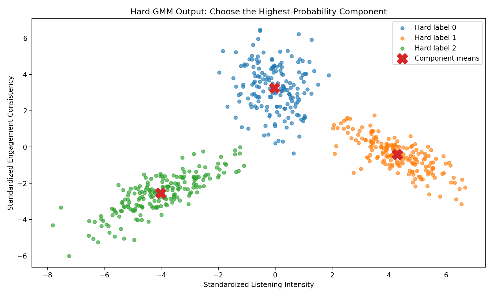

### Image Explanation

- Each user receives one final technical label.
- The selected label is the highest-probability component.
- This output resembles K-Means cluster labels.
- The underlying probabilities still exist even when hard labels are used.

---

# 8. GMM Membership Probabilities

Soft probabilities explain how strongly a user belongs to every component.

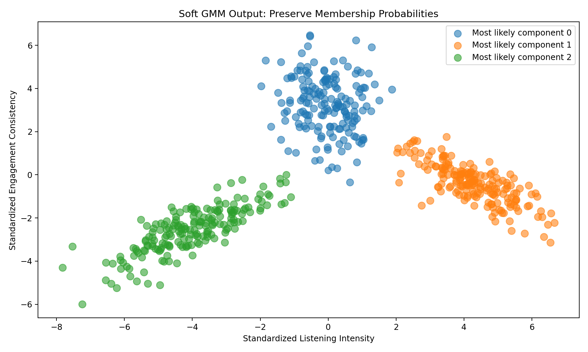

### Image Explanation

- Larger markers indicate stronger maximum probability.
- Outlined points are lower-confidence users.
- Boundary users are less clearly associated with one component.
- These users may need special interpretation or flexible business treatment.

---

## Example

```python
probabilities = model.predict_proba(
    X_scaled
)

probability_df = pd.DataFrame(
    probabilities,
    columns=[
        "component_0_probability",
        "component_1_probability",
        "component_2_probability",
        "component_3_probability"
    ]
)
```

The probabilities in each row should sum approximately to 1.

---

# 9. Gaussian Distribution

A Gaussian distribution is also called a normal distribution.

In one dimension, it has a bell-shaped probability-density curve.

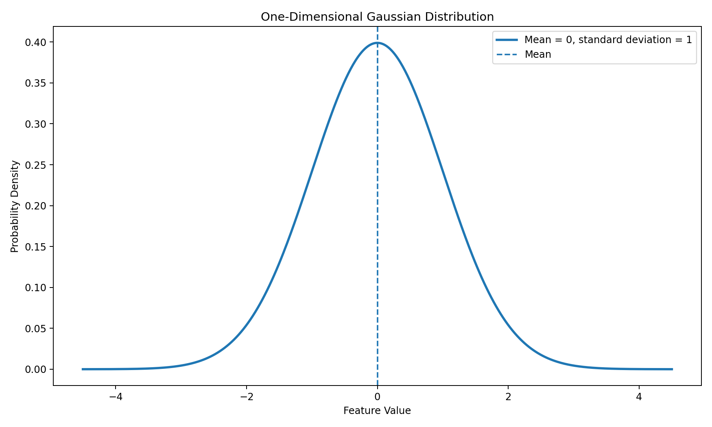

### Image Explanation

- The highest density is near the mean.
- Density decreases as values move farther from the mean.
- Standard deviation controls the width.
- A larger standard deviation creates a wider distribution.
- In multiple dimensions, Gaussian distributions form ellipses or ellipsoids.

---

# 10. Mean

The mean controls the center or location of a component.

For a two-feature model:

```text
Mean vector =
[
  average listening intensity,
  average engagement consistency
]
```

GMM component means are available through:

```python
model.means_
```

These means are similar in purpose to K-Means centroids, but GMM also estimates covariance and mixture weights.

---

# 11. Variance and Covariance

## Variance

Variance measures how widely one feature spreads around its mean.

## Covariance

Covariance measures how two features vary together.

```text
Positive covariance:
Features tend to rise together.

Negative covariance:
One tends to rise while the other falls.

Covariance near zero:
No strong linear co-movement.
```

---

# 12. Covariance Matrix

For two features:

```text
Covariance Matrix =
[
  variance(feature 1), covariance(1, 2)
  covariance(2, 1),   variance(feature 2)
]
```

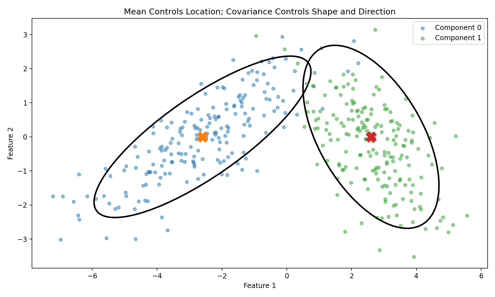

### Image Explanation

- The `X` markers represent component means.
- The mean determines location.
- Covariance determines width, height and rotation.
- A positive relationship tilts an ellipse upward.
- A negative relationship tilts an ellipse downward.

---

# 13. Mixture Components and Weights

Every component has a weight.

```text
π₀, π₁, π₂, ..., πₖ
```

The weights sum to 1:

```text
π₀ + π₁ + ... + πₖ = 1
```

A larger weight means the component represents a larger share of the modeled population.

Scikit-learn provides:

```python
model.weights_
```

---

# 14. GMM Probability Model

The total probability density is a weighted combination of component densities.

Conceptually:

```text
P(user)
=
weight₀ × Gaussian₀(user)
+
weight₁ × Gaussian₁(user)
+
...
+
weightₖ × Gaussianₖ(user)
```

Each user's component responsibility is based on:

- Component weight
- Distance from the component mean
- Covariance shape
- Density under competing components

---

# 15. Expectation-Maximization Overview

GMM parameters are commonly estimated using Expectation-Maximization, or EM.

EM repeatedly performs:

```text
Expectation Step
        ↓
Maximization Step
        ↓
Expectation Step
        ↓
Maximization Step
        ↓
Convergence
```

---

# 16. Initialization

Before EM begins, the model requires initial values for:

- Means
- Covariances
- Mixture weights

Scikit-learn configuration may use:

```python
init_params="kmeans"
```

or other supported initialization approaches.

Multiple initializations can reduce the risk of a poor local solution:

```python
n_init=10
```

---

# 17. Expectation Step

The E-step calculates responsibilities.

A responsibility means:

```text
Probability that component k
is responsible for user i
```

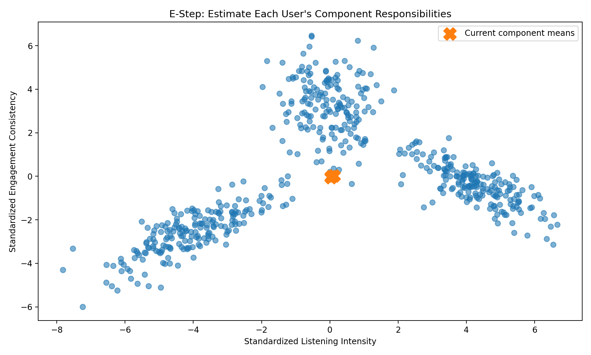

### Image Explanation

- Current component means are shown as `X`.
- Each user is evaluated against all components.
- Marker size illustrates responsibility for one selected component.
- The E-step does not permanently assign the user.
- It calculates probability-based membership using current parameters.

---

## Responsibility Notation

Conceptually:

```text
γ(i, k)
=
P(component k | user i)
```

For each user:

```text
γ(i, 0) + γ(i, 1) + ... + γ(i, K-1) = 1
```

---

# 18. Maximization Step

The M-step updates model parameters using the responsibilities from the E-step.

It recalculates:

- Mixture weights
- Means
- Covariances

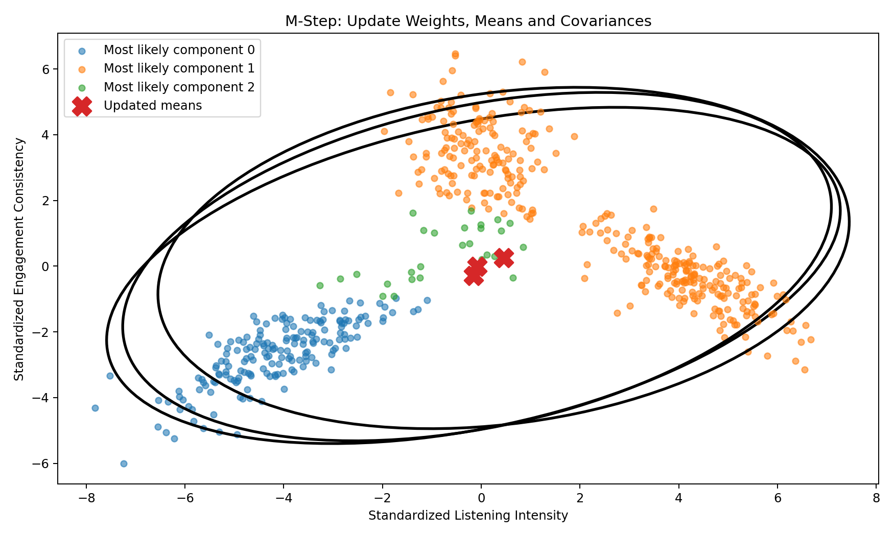

### Image Explanation

- Component means move toward users with high responsibility.
- Covariance ellipses change shape and orientation.
- Mixture weights change based on effective membership.
- The M-step improves the model under the current responsibilities.

---

# 19. EM Iterations

One EM iteration consists of:

```text
E-step
+
M-step
```

The algorithm repeats these steps.

During training:

- Responsibilities change
- Means move
- Covariances change
- Mixture weights change
- The objective improves

---

# 20. EM Convergence

EM stops when improvement becomes sufficiently small or the iteration limit is reached.

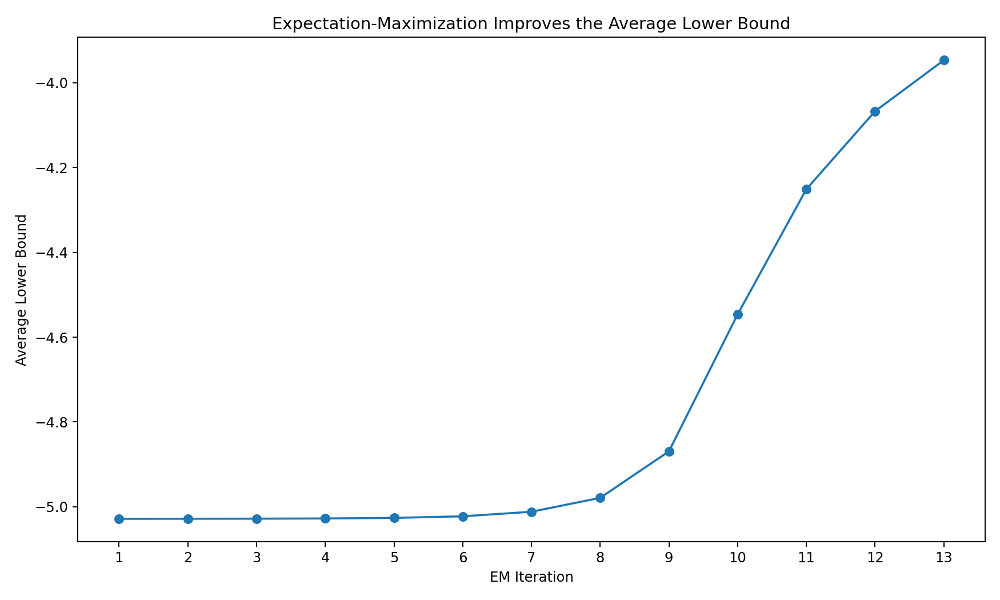

### Image Explanation

- The average lower bound improves over iterations.
- Improvement becomes smaller as the model stabilizes.
- Convergence occurs when the improvement falls below the tolerance.
- A converged model is still a local solution, not a guaranteed global optimum.

---

## Important Attributes

```python
model.converged_
model.n_iter_
model.lower_bound_
```

---

# 21. Lower Bound and Log-Likelihood

GMM attempts to fit the observed data with high likelihood.

Scikit-learn exposes:

```python
model.score(X_scaled)
```

This returns average log-likelihood per sample.

The fitted estimator also provides a lower-bound value used for convergence.

Higher log-likelihood generally indicates a better fit to the same data, but more complex models often fit better.

That is why AIC and BIC add complexity penalties.

---

# 22. Covariance Types Overview

Scikit-learn supports four covariance types:

```text
full
tied
diag
spherical
```

They control how flexible the Gaussian component shapes can be.

---

# 23. Full Covariance

```python
covariance_type="full"
```

Every component receives its own complete covariance matrix.

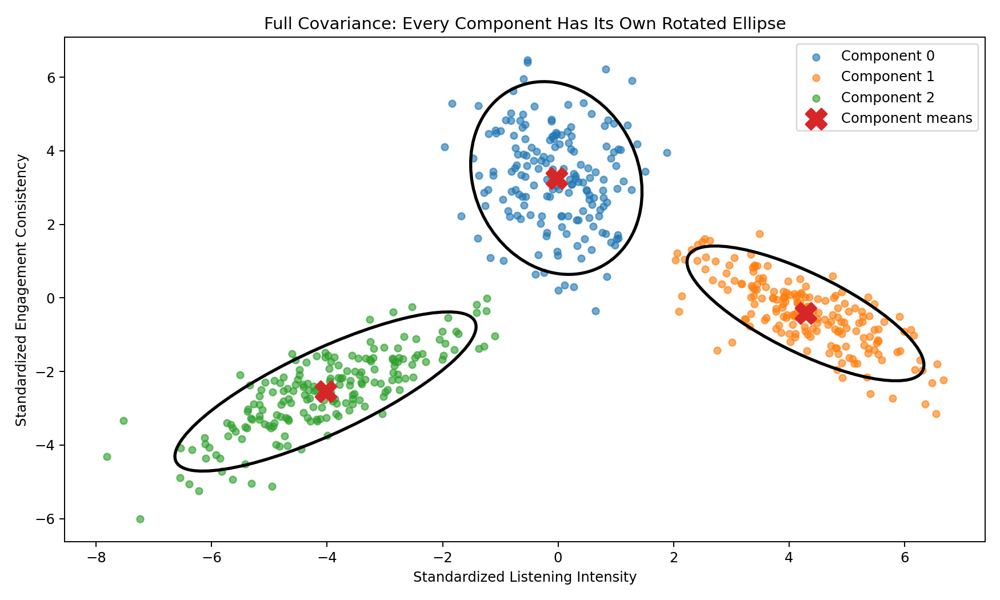

### Image Explanation

- Every component can have its own width.
- Every component can have its own height.
- Every component can have its own rotation.
- Feature correlations may differ between components.
- This is the most flexible option.

## Advantages

- Captures tilted and elongated groups
- Supports different relationships in every component

## Limitations

- Estimates many parameters
- Requires more data
- Can be less stable in high dimensions
- More computationally expensive

---

# 24. Tied Covariance

```python
covariance_type="tied"
```

All components share one full covariance matrix.

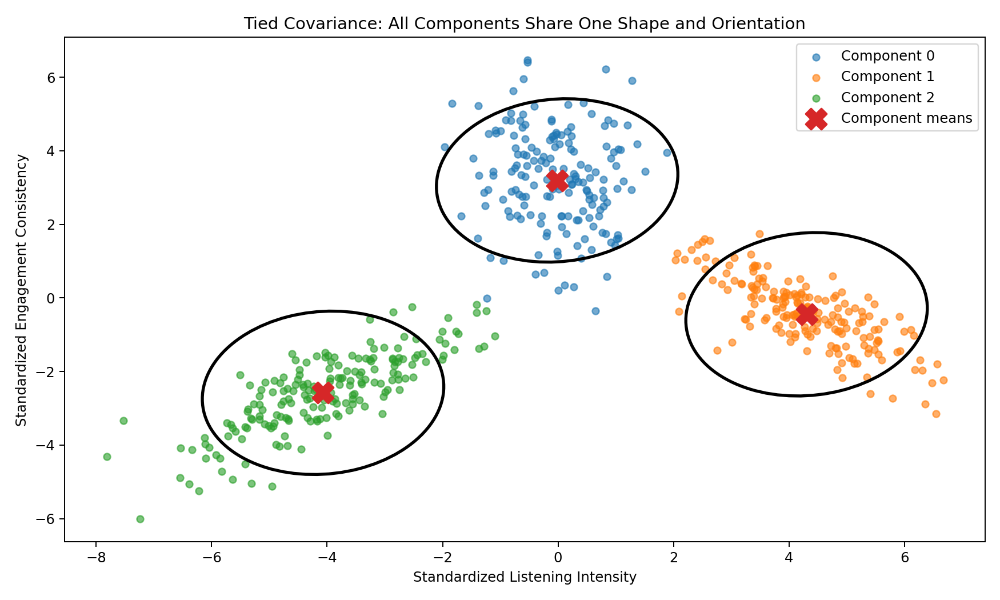

### Image Explanation

- Components have different means.
- All components share the same shape and orientation.
- The shared covariance reduces the number of parameters.
- It is more flexible than diagonal covariance but less flexible than full covariance.

---

# 25. Diagonal Covariance

```python
covariance_type="diag"
```

Every component has its own variance for every feature, but off-diagonal covariance values are zero.

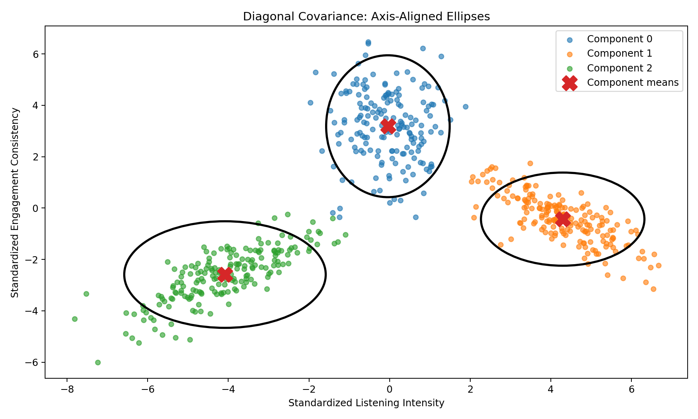

### Image Explanation

- Ellipses remain aligned with the feature axes.
- Components may have different widths and heights.
- Rotation is not modeled.
- Within each component, modeled feature covariance is zero.

## Advantage

Fewer parameters than full covariance.

## Limitation

Cannot represent tilted groups caused by feature relationships.

---

# 26. Spherical Covariance

```python
covariance_type="spherical"
```

Every component receives one variance value shared across its features.

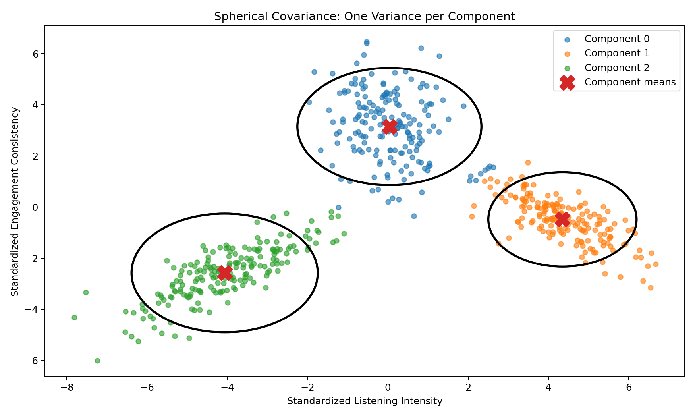

### Image Explanation

- Each component is represented by a circle in two dimensions.
- A component can have its own circle size.
- All directions within one component have equal variance.
- This is the most restrictive covariance option.

## Advantage

Simple, fast and parameter-efficient.

## Limitation

Cannot model elongated or rotated components.

---

# 27. Covariance Type Comparison

| Type | Component-Specific? | Feature Correlation? | Shape |
|---|---|---|---|
| Full | Yes | Yes | Any ellipse/ellipsoid |
| Tied | Shared across components | Yes | Same ellipse shape for all |
| Diagonal | Yes | No off-diagonal covariance | Axis-aligned ellipse |
| Spherical | Yes, one variance each | No | Circle/sphere |

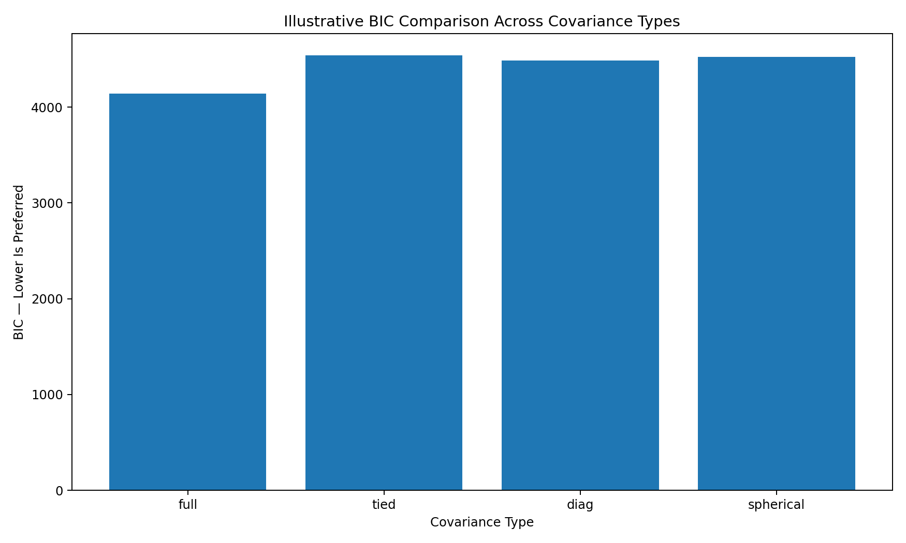

### Image Explanation

- The bars show illustrative BIC values for the same component count.
- Lower BIC is preferred.
- A flexible model may fit better but pays a larger complexity penalty.
- The winning covariance type depends on the actual dataset.

---

# 28. Choosing the Number of Components

GMM uses:

```python
n_components
```

This is similar to K in K-Means.

Candidate values may be:

```text
2 to 10
```

Evaluate combinations of:

```text
Number of components
×
Covariance type
×
Feature set
×
Preprocessing method
```

---

# 29. AIC

AIC means Akaike Information Criterion.

It balances:

- Model fit
- Model complexity

```text
Lower AIC is preferred.
```

Scikit-learn:

```python
model.aic(X_scaled)
```

AIC usually penalizes complexity less strongly than BIC.

---

# 30. BIC

BIC means Bayesian Information Criterion.

It also balances fit and complexity.

```text
Lower BIC is preferred.
```

Scikit-learn:

```python
model.bic(X_scaled)
```

BIC often favors simpler models more strongly as sample size increases.

---

# 31. AIC vs BIC

| AIC | BIC |
|---|---|
| Fit plus complexity penalty | Fit plus stronger sample-size-aware penalty |
| May select richer models | Often favors simpler models |
| Lower is better | Lower is better |
| Useful comparison evidence | Common GMM model-selection criterion |

Do not compare AIC or BIC across different datasets or incompatible feature spaces without caution.

They are most useful when candidate models are fitted to the same observations and features.

---

# 32. Silhouette Score with GMM

GMM is soft, but hard labels can be obtained using:

```python
labels = model.predict(X_scaled)
```

Then:

```python
silhouette_score(
    X_scaled,
    labels
)
```

This evaluates the hard partition.

It does not evaluate the full probability structure.

Therefore, combine:

- AIC
- BIC
- Log-likelihood
- Silhouette
- Cluster sizes
- Probability confidence
- Stability
- Business interpretation

---

# 33. Membership Confidence and Uncertainty

For each user:

```python
confidence =
maximum component probability
```

```python
probabilities = model.predict_proba(
    X_scaled
)

confidence = probabilities.max(
    axis=1
)
```

Possible interpretation:

| Confidence | Meaning |
|---:|---|
| High | Strong component membership |
| Medium | Some overlap |
| Low | Boundary or ambiguous behavior |

Thresholds must be chosen analytically.

Do not assume one universal threshold.

---

# 34. Advantages of GMM

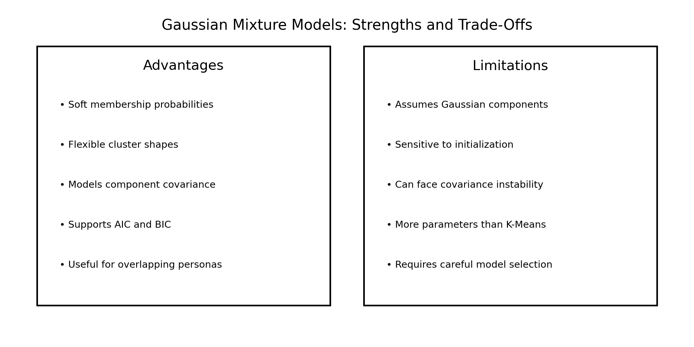

## Main Advantages

- Supports soft membership
- Captures overlapping behavior
- Models flexible component shapes
- Models covariance
- Provides component probabilities
- Provides mixture weights
- Supports AIC and BIC
- Useful for identifying boundary users
- Can be more expressive than K-Means

---

# 35. Limitations of GMM

## Main Limitations

- Assumes Gaussian mixture structure
- Requires component count selection
- Requires covariance-type selection
- Sensitive to initialization
- May converge to a local solution
- More computationally expensive than K-Means
- Full covariance estimates many parameters
- Covariance matrices can become unstable
- Sensitive to feature scale
- High-dimensional models require careful regularization

---

# 36. When GMM Works Well

GMM is useful when:

- Clusters overlap
- Soft probabilities matter
- Groups have elliptical shapes
- Groups have different spreads
- Boundary users are important
- Data can reasonably be modeled using Gaussian components
- Enough records exist to estimate covariance

---

# 37. When GMM May Perform Poorly

GMM may be weak when:

- Groups are strongly non-Gaussian
- Groups have irregular density shapes
- Many extreme outliers exist
- Feature count is high relative to sample size
- Covariance estimation is unstable
- Components heavily overlap without meaningful distinction
- Preprocessing creates artificial Gaussian shapes

Alternatives may include:

- K-Means
- DBSCAN
- HDBSCAN
- Hierarchical clustering
- Bayesian Gaussian Mixture Models

---

# 38. K-Means vs GMM

## K-Means Output

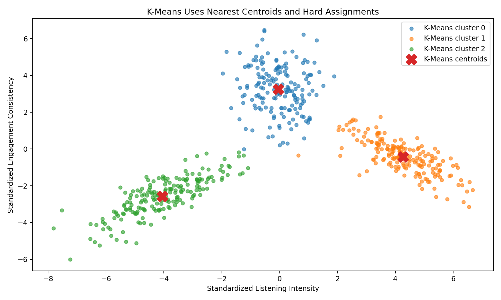

### Image Explanation

- K-Means uses hard assignments.
- Boundaries are determined by nearest-centroid regions.
- Centroids summarize cluster centers.
- Cluster shape is not explicitly modeled through covariance.

## GMM Output

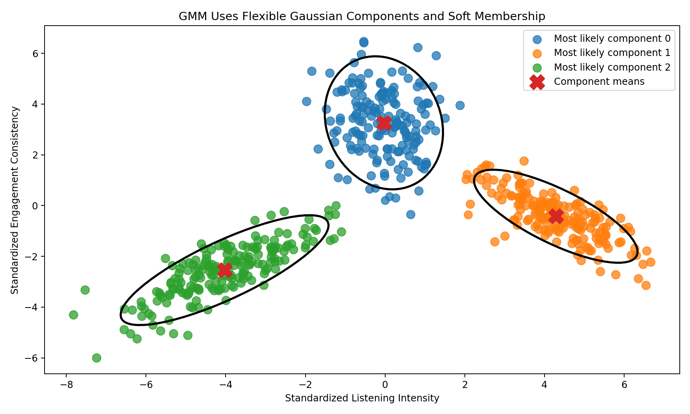

### Image Explanation

- GMM uses Gaussian component distributions.
- Components can be elongated and rotated.
- Membership probabilities are available.
- Overlap and uncertainty remain visible.

---

## Comparison Table

| K-Means | GMM |
|---|---|
| Hard clustering | Soft and hard output |
| Nearest centroid | Highest component probability |
| Centroids | Means, covariance and weights |
| Uses inertia | Uses likelihood, AIC and BIC |
| Simple and fast | More flexible but more complex |
| Compact groups work well | Elliptical overlapping groups work well |
| No confidence probabilities | Membership probabilities |
| Less parameter-heavy | More parameter-heavy |

---

# 39. Spotify GMM Feature Set

A core behavioral feature set:

```python
features = [
    "daily_listening_minutes",
    "sessions_per_day",
    "avg_session_minutes",
    "days_active_last_30",
    "skip_rate",
    "ads_skipped_pct"
]
```

GMM is sensitive to scale.

Apply a fitted scaler or transformer first.

Possible candidates:

- StandardScaler
- RobustScaler
- PowerTransformer
- QuantileTransformer with normal output

Compare preprocessing experiments rather than assuming one method is best.

---

# 40. Spotify GMM Implementation

```python
import pandas as pd

from sklearn.preprocessing import StandardScaler
from sklearn.mixture import GaussianMixture

behavior = pd.read_excel(
    "spotify_user_behavior.xlsx"
)

features = [
    "daily_listening_minutes",
    "sessions_per_day",
    "avg_session_minutes",
    "days_active_last_30",
    "skip_rate",
    "ads_skipped_pct"
]

X = behavior[
    features
].copy()

scaler = StandardScaler()

X_scaled = scaler.fit_transform(
    X
)

model = GaussianMixture(
    n_components=4,
    covariance_type="full",
    n_init=10,
    max_iter=300,
    tol=1e-4,
    reg_covar=1e-6,
    init_params="kmeans",
    random_state=42
)

model.fit(X_scaled)

labels = model.predict(
    X_scaled
)

probabilities = model.predict_proba(
    X_scaled
)
```

---

# 41. Testing Components and Covariance Types

```python
results = []

for components in range(2, 11):
    for covariance_type in [
        "full",
        "tied",
        "diag",
        "spherical"
    ]:
        model = GaussianMixture(
            n_components=components,
            covariance_type=(
                covariance_type
            ),
            n_init=10,
            max_iter=300,
            tol=1e-4,
            reg_covar=1e-6,
            random_state=42
        )

        model.fit(X_scaled)

        labels = model.predict(
            X_scaled
        )

        results.append({
            "components": components,
            "covariance_type": (
                covariance_type
            ),
            "aic": model.aic(
                X_scaled
            ),
            "bic": model.bic(
                X_scaled
            ),
            "average_log_likelihood": (
                model.score(
                    X_scaled
                )
            ),
            "converged": (
                model.converged_
            ),
            "iterations": (
                model.n_iter_
            ),
            "silhouette": (
                silhouette_score(
                    X_scaled,
                    labels
                )
            )
        })

evaluation = pd.DataFrame(
    results
)
```

---

# 42. Attaching Hard Labels

```python
clustered_users = behavior[
    ["user_id"]
].copy()

clustered_users[
    "gmm_component"
] = labels
```

Component numbers are arbitrary.

They are not ranked.

---

# 43. Storing Membership Probabilities

```python
probability_columns = [
    f"component_{index}_probability"
    for index in range(
        model.n_components
    )
]

probability_df = pd.DataFrame(
    probabilities,
    columns=probability_columns,
    index=behavior.index
)

clustered_users = pd.concat(
    [
        clustered_users,
        probability_df
    ],
    axis=1
)

clustered_users[
    "membership_confidence"
] = probabilities.max(
    axis=1
)
```

---

# 44. Identifying Boundary Users

```python
boundary_users = (
    clustered_users[
        clustered_users[
            "membership_confidence"
        ] < 0.70
    ]
)
```

A low-confidence user may:

- Sit between two personas
- Have mixed behavior
- Require flexible recommendations
- Be sensitive to small model changes

The `0.70` value is only an example threshold.

---

# 45. GMM Cluster Profiling

Profile hard component labels using:

- User count
- User percentage
- Mean features
- Median features
- Demographics
- Membership confidence
- Entropy
- Top competing component

Example:

```python
behavior_with_components = (
    behavior.copy()
)

behavior_with_components[
    "gmm_component"
] = labels

profile = (
    behavior_with_components
    .groupby(
        "gmm_component"
    )[features]
    .agg(
        [
            "mean",
            "median"
        ]
    )
)
```

---

# 46. Business Interpretation

GMM probabilities support more flexible strategy.

Example:

```text
User probability:
Power Streamer = 0.54
Habitual Loyalist = 0.42
Other = 0.04
```

Possible interpretation:

- User is highly engaged
- Loyalty and intensity are both strong
- Use a blended retention and Premium strategy
- Avoid treating the persona as perfectly certain

---

# 47. Saving and Reusing the Model

```python
import joblib

joblib.dump(
    scaler,
    "spotify_gmm_scaler.joblib"
)

joblib.dump(
    model,
    "spotify_gmm_model.joblib"
)
```

For future users:

```python
future_scaled = scaler.transform(
    future_features
)

future_labels = model.predict(
    future_scaled
)

future_probabilities = (
    model.predict_proba(
        future_scaled
    )
)
```

Keep the feature order unchanged.

---

# 48. Complete Spotify GMM Workflow

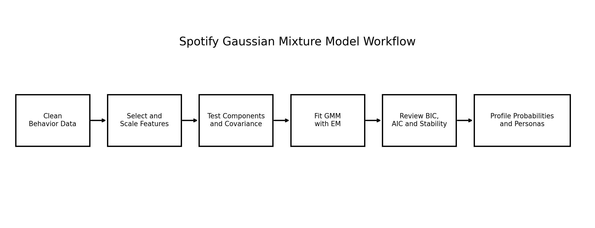

### Image Explanation

The workflow is:

1. Load clean behavioral data
2. Select and scale features
3. Test component counts and covariance types
4. Fit GMM using EM
5. Compare AIC, BIC, likelihood, Silhouette and stability
6. Store hard labels and probabilities
7. Profile components
8. Create personas and business actions

---

# 49. GMM Validation Checklist

## Input

- [ ] Data cleaned
- [ ] `user_id` separated
- [ ] Numeric features selected
- [ ] Missing values checked
- [ ] Infinite values checked
- [ ] Features scaled or transformed

## Model Search

- [ ] Component range tested
- [ ] Full covariance tested
- [ ] Tied covariance tested
- [ ] Diagonal covariance tested
- [ ] Spherical covariance tested
- [ ] Explicit `n_init` used
- [ ] Random state fixed
- [ ] Regularization documented

## Evaluation

- [ ] AIC recorded
- [ ] BIC recorded
- [ ] Average log-likelihood recorded
- [ ] Convergence checked
- [ ] Iteration count recorded
- [ ] Hard-label Silhouette reviewed
- [ ] Component sizes reviewed
- [ ] Membership confidence reviewed
- [ ] Stability tested

## Interpretation

- [ ] Means interpreted
- [ ] Covariances interpreted
- [ ] Weights interpreted
- [ ] Boundary users reviewed
- [ ] Demographics profiled
- [ ] Persona names justified
- [ ] Business actions documented

## Reproducibility

- [ ] Feature order saved
- [ ] Scaler saved
- [ ] Model saved
- [ ] Experiment ID recorded
- [ ] Persona mapping versioned

---

# 50. Important Terminology

| Term | Meaning |
|---|---|
| GMM | Gaussian Mixture Model |
| Gaussian component | One probability distribution in the mixture |
| Mixture weight | Component's population share |
| Mean vector | Component center |
| Variance | Spread of one feature |
| Covariance | Co-movement of two features |
| Covariance matrix | Component shape and orientation |
| Probability density | Relative likelihood under a distribution |
| Soft clustering | Membership probabilities |
| Hard label | Highest-probability component |
| Responsibility | User-to-component probability in EM |
| Expectation step | Estimate responsibilities |
| Maximization step | Update model parameters |
| EM | Expectation-Maximization |
| Convergence | Objective improvement becomes small |
| Log-likelihood | Model fit based on data probability |
| Lower bound | Objective used during EM convergence |
| Full covariance | Separate complete matrix per component |
| Tied covariance | One complete matrix shared by components |
| Diagonal covariance | Separate feature variances, zero off-diagonals |
| Spherical covariance | One variance per component |
| AIC | Fit-complexity criterion |
| BIC | Fit-complexity criterion with stronger size-aware penalty |
| Membership confidence | Largest component probability |
| Boundary user | User with uncertain component membership |
| `reg_covar` | Covariance diagonal regularization |

---

# 51. Interview Questions and Answers

## 1. What is a Gaussian Mixture Model?

A probabilistic model that represents data as a weighted mixture of Gaussian components.

---

## 2. Why is GMM called probability-based clustering?

It calculates component-membership probabilities for every observation.

---

## 3. What is soft clustering?

Assigning probabilities across multiple groups.

---

## 4. Can GMM also create hard labels?

Yes, by selecting the highest-probability component.

---

## 5. What is a Gaussian distribution?

A probability distribution defined by a mean and variance or covariance.

---

## 6. What does the mean control?

The component location.

---

## 7. What does covariance control?

The component spread, shape, orientation and feature relationships.

---

## 8. What is a mixture weight?

The modeled proportion of the population represented by one component.

---

## 9. What is Expectation-Maximization?

An iterative algorithm that alternates responsibility estimation and parameter updating.

---

## 10. What happens in the E-step?

The model estimates component responsibilities for every user.

---

## 11. What happens in the M-step?

The model updates weights, means and covariances.

---

## 12. What is EM convergence?

The improvement in the lower-bound objective becomes sufficiently small.

---

## 13. What is full covariance?

Every component has its own complete covariance matrix.

---

## 14. What is tied covariance?

All components share one complete covariance matrix.

---

## 15. What is diagonal covariance?

Every component has separate feature variances but zero off-diagonal covariances.

---

## 16. What is spherical covariance?

Every component has one variance shared across its features.

---

## 17. Which covariance type is most flexible?

Full covariance.

---

## 18. Which covariance type is most restrictive?

Spherical covariance.

---

## 19. What is AIC?

A criterion balancing model fit and complexity; lower is preferred.

---

## 20. What is BIC?

A fit-complexity criterion with a sample-size-aware penalty; lower is preferred.

---

## 21. Why not choose the model with highest likelihood only?

More complex models generally fit better, so complexity must be penalized.

---

## 22. Can Silhouette Score be used with GMM?

Yes, using hard labels, but it does not evaluate the full probability structure.

---

## 23. What is membership confidence?

The largest component probability for a user.

---

## 24. What is a boundary user?

A user with mixed or uncertain component probabilities.

---

## 25. What are GMM's advantages?

Soft membership, flexible shapes, covariance modeling and AIC/BIC support.

---

## 26. What are GMM's limitations?

Gaussian assumptions, complexity, initialization sensitivity and covariance instability.

---

## 27. K-Means vs GMM?

K-Means is centroid-based and hard; GMM is probabilistic and supports flexible covariance and soft membership.

---

## 28. Why must Spotify features be scaled?

GMM parameter estimation and covariance are affected by feature magnitude.

---

## 29. What does `reg_covar` do?

Adds non-negative regularization to covariance diagonals to improve numerical stability.

---

## 30. How do you implement GMM for Spotify?

Clean, select, scale, test components and covariance types, evaluate, fit, store labels and probabilities, profile and interpret.

---

# 52. Module Summary

In this module, we learned:

- GMM represents users as a mixture of Gaussian components
- GMM is probability-based
- It supports soft and hard output
- Gaussian means control component locations
- Covariances control spread, shape and orientation
- Mixture weights represent modeled population shares
- EM alternates expectation and maximization steps
- The E-step calculates responsibilities
- The M-step updates weights, means and covariances
- EM continues until convergence
- Full covariance is the most flexible
- Tied covariance shares one matrix
- Diagonal covariance creates axis-aligned components
- Spherical covariance creates circles or spheres
- AIC and BIC balance fit with complexity
- Hard-label Silhouette can support evaluation
- Membership confidence helps identify boundary users
- GMM is more flexible but more complex than K-Means
- Spotify can use probabilities for blended persona strategies
- The scaler, feature order and fitted GMM must be saved

---

# 53. Quick Reference Cheat Sheet

## Basic GMM

```python
model = GaussianMixture(
    n_components=4,
    covariance_type="full",
    n_init=10,
    random_state=42
)

model.fit(X_scaled)
```

## Outputs

```python
labels = model.predict(X_scaled)
probabilities = model.predict_proba(X_scaled)

model.weights_
model.means_
model.covariances_
model.converged_
model.n_iter_
```

## Evaluation

```python
model.aic(X_scaled)
model.bic(X_scaled)
model.score(X_scaled)
```

## Covariance Types

```text
full      → Own complete matrix
tied      → Shared complete matrix
diag      → Own diagonal matrix
spherical → One variance per component
```

## EM

```text
E-step → Estimate responsibilities
M-step → Update weights, means, covariance
Repeat → Converge
```

---

# 54. What Comes Next?

## Module 11 — Experiment Automation

The next module can cover:

- Why experiments must be automated
- Scaler loops
- Algorithm loops
- K and component loops
- Covariance-type loops
- Reproducible experiment IDs
- Metric capture
- Cluster-size capture
- Model and scaler storage
- Failure handling
- Experiment comparison tables
