# Module 11 — Experiment Automation

> A detailed beginner-friendly guide to automating Spotify clustering experiments across feature sets, scaling methods, transformations, K-Means configurations, Gaussian Mixture Model configurations, Python loops, functions, reusable pipelines, logging, result collection, failure handling, and experiment comparison.

---

## Table of Contents

1. [Module Overview](#1-module-overview)
2. [Learning Objectives](#2-learning-objectives)
3. [Why Multiple Experiments Are Required](#3-why-multiple-experiments-are-required)
4. [What Is an Experiment?](#4-what-is-an-experiment)
5. [Experiment Components](#5-experiment-components)
6. [Manual Experiments vs Automated Experiments](#6-manual-experiments-vs-automated-experiments)
7. [Experiment Search Space](#7-experiment-search-space)
8. [Scaling Combinations](#8-scaling-combinations)
9. [Transformation Combinations](#9-transformation-combinations)
10. [K-Means Experiment Grid](#10-k-means-experiment-grid)
11. [GMM Experiment Grid](#11-gmm-experiment-grid)
12. [Python Loops](#12-python-loops)
13. [Nested Loops](#13-nested-loops)
14. [Functions](#14-functions)
15. [User-Defined Functions](#15-user-defined-functions)
16. [Function Design for Experiments](#16-function-design-for-experiments)
17. [Reusable Pipelines](#17-reusable-pipelines)
18. [Configuration-Driven Automation](#18-configuration-driven-automation)
19. [Experiment IDs](#19-experiment-ids)
20. [Experiment Logging](#20-experiment-logging)
21. [Logging Schema](#21-logging-schema)
22. [Automated Result Collection](#22-automated-result-collection)
23. [K-Means Metrics](#23-k-means-metrics)
24. [GMM Metrics](#24-gmm-metrics)
25. [Cluster-Size Metrics](#25-cluster-size-metrics)
26. [Runtime and Status Metrics](#26-runtime-and-status-metrics)
27. [Failure Handling](#27-failure-handling)
28. [Comparison of Experiments](#28-comparison-of-experiments)
29. [Metric Comparability Rules](#29-metric-comparability-rules)
30. [Experiment Leaderboards](#30-experiment-leaderboards)
31. [Shortlisting Candidate Experiments](#31-shortlisting-candidate-experiments)
32. [Business Review of Experiments](#32-business-review-of-experiments)
33. [Reproducibility](#33-reproducibility)
34. [Saving Experiment Artifacts](#34-saving-experiment-artifacts)
35. [End-to-End Spotify Automation Workflow](#35-end-to-end-spotify-automation-workflow)
36. [Complete Automation Example](#36-complete-automation-example)
37. [Recommended Folder Structure](#37-recommended-folder-structure)
38. [Automation Checklist](#38-automation-checklist)
39. [Important Terminology](#39-important-terminology)
40. [Interview Questions and Answers](#40-interview-questions-and-answers)
41. [Module Summary](#41-module-summary)
42. [Quick Reference Cheat Sheet](#42-quick-reference-cheat-sheet)
43. [What Comes Next?](#43-what-comes-next)

---

# 1. Module Overview

A serious clustering project should not rely on one model run.

The final result can change when we change:

- Feature set
- Scaling method
- Transformation method
- Clustering algorithm
- Number of clusters
- Number of GMM components
- GMM covariance type
- Random seed
- Initialization settings

Instead of manually copying and modifying code for every experiment, we automate the process.

```text
Experiment Configuration
        ↓
Reusable Preprocessor
        ↓
Reusable Model
        ↓
Automated Fit and Prediction
        ↓
Automated Metrics
        ↓
Experiment Log
        ↓
Comparison Table
        ↓
Candidate Shortlist
```

---

# 2. Learning Objectives

By the end of this module, students should be able to:

- Explain why multiple experiments are required
- Define an experiment configuration
- Build scaling and transformation combinations
- Automate K-Means experiments
- Automate GMM experiments
- Use Python loops
- Use nested loops
- Write functions and user-defined functions
- Build reusable preprocessing functions
- Build reusable model factories
- Build reusable experiment runners
- Create experiment IDs
- Log experiment settings and outputs
- Collect successful and failed results
- Compare K-Means experiments
- Compare GMM experiments
- Understand which metrics can be compared
- Create candidate leaderboards
- Save reproducible experiment artifacts
- Build an end-to-end Spotify automation workflow

---

# 3. Why Multiple Experiments Are Required

Clustering has no target column that tells us the correct answer.

There is no official label such as:

```text
user_persona = Power Streamer
```

Therefore, we must test multiple reasonable solutions and compare them.

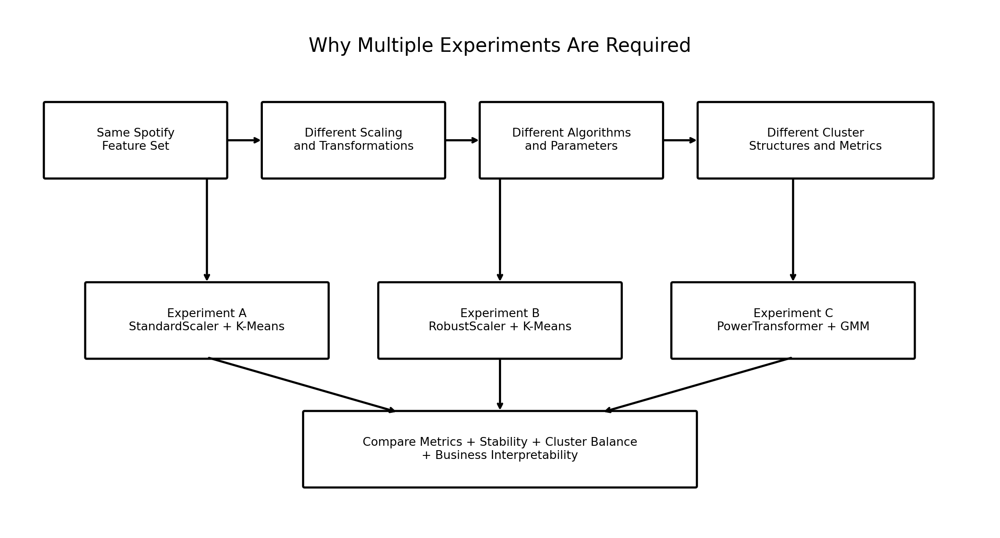

### Image Explanation

- The same Spotify feature set can be transformed in different ways.
- Different transformations create different feature-space geometry.
- K-Means and GMM use that geometry differently.
- The resulting cluster structures and metrics can differ.
- Final selection requires technical and business review.

A single experiment can be misleading because:

- One scaler may favor certain features
- One K value may be too broad
- One GMM covariance may overfit
- One initialization may be unstable
- One metric may look strong while cluster sizes are unusable

---

# 4. What Is an Experiment?

An experiment is one complete clustering configuration.

Example:

```text
Experiment ID:
EXP_CORE_STANDARD_KMEANS_K4

Feature Set:
Core behavioral features

Preprocessing:
StandardScaler

Algorithm:
K-Means

Parameters:
K = 4
n_init = 20
random_state = 42
```

One change creates a different experiment.

Example:

```text
StandardScaler + K-Means K=4
```

and:

```text
RobustScaler + K-Means K=4
```

are separate experiments.

---

# 5. Experiment Components

A complete experiment should record:

| Component | Example |
|---|---|
| Experiment ID | `EXP_001` |
| Feature set | Core behavior |
| Preprocessor | StandardScaler |
| Algorithm | K-Means |
| Main parameter | K = 4 |
| Other parameters | `n_init=20` |
| Random state | 42 |
| Status | SUCCESS |
| Runtime | 1.82 seconds |
| Metrics | Silhouette, inertia |
| Cluster sizes | 22%, 25%, 27%, 26% |
| Artifact paths | Model and scaler |
| Error details | Empty for success |

---

# 6. Manual Experiments vs Automated Experiments

| Manual | Automated |
|---|---|
| Copy and edit code | Configuration controls behavior |
| Easy to forget settings | Settings recorded automatically |
| Results stored separately | One comparison table |
| Errors may stop all work | Failures are logged and loop continues |
| Difficult to reproduce | Experiment ID and artifacts saved |
| Slow for many combinations | Loops execute the search space |
| High risk of inconsistent logic | Same functions used for all runs |

Automation is not only about speed.

It improves:

- Consistency
- Traceability
- Reproducibility
- Error handling
- Fair comparison

---

# 7. Experiment Search Space

The search space is the set of combinations to test.

Example:

```text
Feature sets:
2

Preprocessors:
5

K-Means K values:
2 through 8 = 7

GMM component values:
2 through 8 = 7

GMM covariance types:
4
```

K-Means experiments:

```text
2 × 5 × 7 = 70
```

GMM experiments:

```text
2 × 5 × 7 × 4 = 280
```

Total:

```text
350 experiments
```

This is why automation is required.

---

# 8. Scaling Combinations

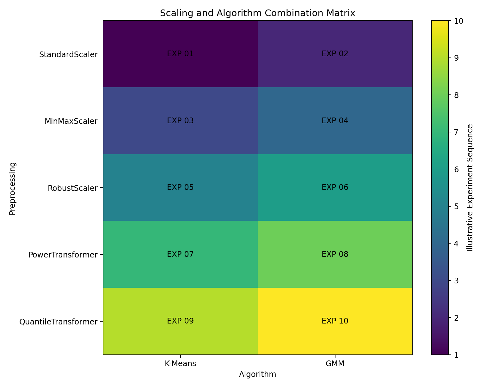

### Image Explanation

- Rows represent preprocessing methods.
- Columns represent clustering algorithms.
- Every cell is a separate experiment family.
- The grid expands further when K, components and covariance types are added.
- Automation makes the combinations systematic.

Possible preprocessors:

```text
StandardScaler
MinMaxScaler
RobustScaler
PowerTransformer
QuantileTransformer
```

---

# 9. Transformation Combinations

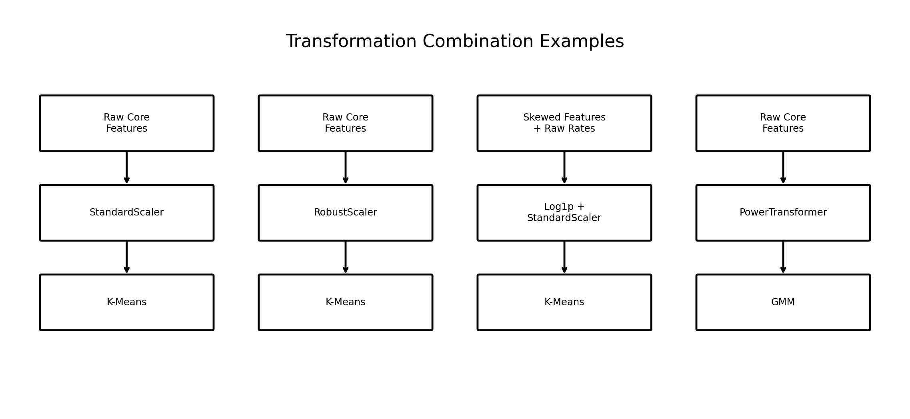

### Image Explanation

The image shows four possible pipelines:

- Raw features → StandardScaler → K-Means
- Raw features → RobustScaler → K-Means
- Selected skewed features → Log1p + StandardScaler → K-Means
- Raw features → PowerTransformer → GMM

A transformation combination must be treated as one pipeline.

Do not transform the data manually and lose the transformation definition.

---

# 10. K-Means Experiment Grid

A K-Means experiment commonly varies:

- Feature set
- Preprocessor
- K
- Initialization
- `n_init`
- Random state

Example:

```python
k_values = range(2, 9)

for k in k_values:
    model = KMeans(
        n_clusters=k,
        n_init=20,
        random_state=42
    )
```

Recommended K-Means result fields:

- Inertia
- Silhouette Score
- Calinski-Harabasz Score
- Davies-Bouldin Score
- Smallest cluster percentage
- Largest cluster percentage
- Iterations
- Runtime
- Status

---

# 11. GMM Experiment Grid

A GMM experiment commonly varies:

- Feature set
- Preprocessor
- Number of components
- Covariance type
- `n_init`
- Regularization
- Random state

Example:

```python
component_values = range(2, 9)

covariance_types = [
    "full",
    "tied",
    "diag",
    "spherical"
]
```

Recommended GMM result fields:

- AIC
- BIC
- Average log-likelihood
- Hard-label Silhouette Score
- Mean membership confidence
- 10th percentile confidence
- Minimum component percentage
- Maximum component percentage
- Convergence status
- Iterations
- Runtime
- Status

---

# 12. Python Loops

A loop repeats a block of code.

```python
for k in range(2, 9):
    print(
        "Running K-Means with K =",
        k
    )
```

Without a loop, the same code would be copied seven times.

Loops improve:

- Consistency
- Speed
- Maintainability
- Experiment coverage

---

# 13. Nested Loops

A nested loop places one loop inside another.

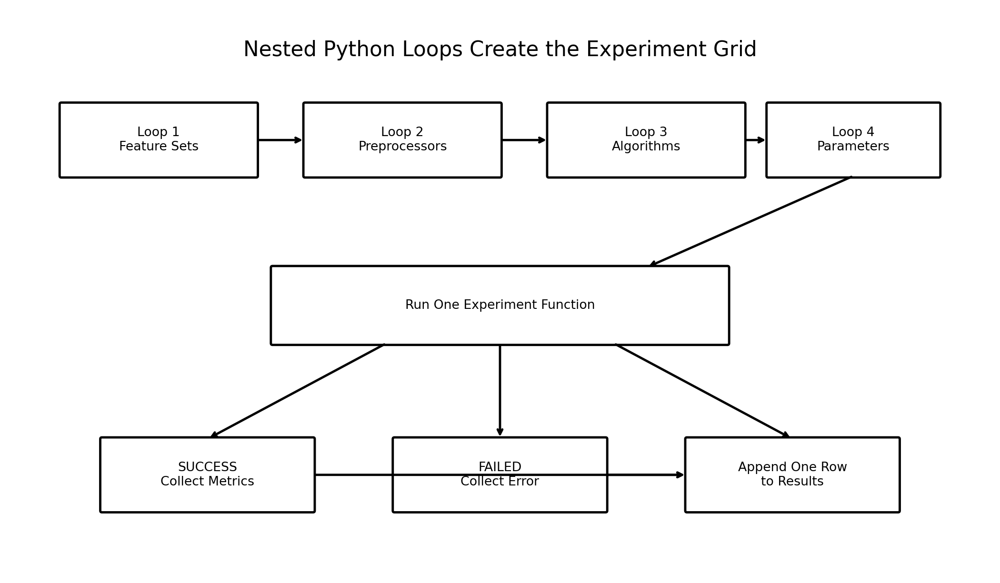

### Image Explanation

- The outer loop may select a feature set.
- The next loop selects a preprocessor.
- Another loop selects an algorithm.
- The inner loop selects K, components or covariance.
- Every combination is passed to one experiment function.
- The result is appended whether the run succeeds or fails.

Example:

```python
for feature_set_name, features in feature_sets.items():
    for preprocessor_name in preprocessors:
        for k in range(2, 9):
            run_kmeans_experiment(
                feature_set_name=feature_set_name,
                features=features,
                preprocessor_name=preprocessor_name,
                k=k
            )
```

---

# 14. Functions

A function is a reusable block of code.

```python
def calculate_cluster_percentages(
    labels
):
    counts = pd.Series(
        labels
    ).value_counts()

    return (
        counts
        .div(counts.sum())
        .mul(100)
    )
```

Functions reduce repeated logic.

---

# 15. User-Defined Functions

A user-defined function is a function created by the developer for project-specific logic.

Examples:

```python
build_preprocessor()
build_model()
run_experiment()
calculate_metrics()
log_result()
```

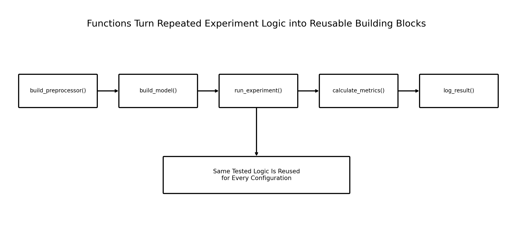

### Image Explanation

- Each function has one clear responsibility.
- The experiment runner combines the functions.
- The same tested logic is reused for every configuration.
- Changes are made in one place rather than copied across notebooks.

---

# 16. Function Design for Experiments

A function should ideally do one job.

## Good Separation

```text
validate_input()
build_preprocessor()
build_kmeans()
build_gmm()
calculate_cluster_sizes()
calculate_kmeans_metrics()
calculate_gmm_metrics()
run_one_experiment()
append_json_log()
```

## Avoid One Huge Function

A single function that loads data, cleans, transforms, models, plots, logs and saves everything becomes difficult to test and maintain.

---

# 17. Reusable Pipelines

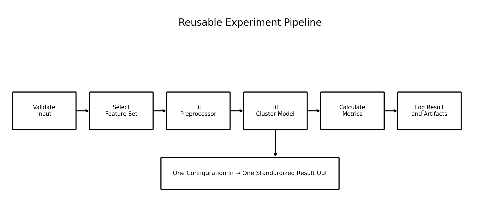

### Image Explanation

A reusable experiment pipeline:

1. Validates the input
2. Selects the requested feature set
3. Fits the requested preprocessor
4. Fits the requested clustering model
5. Calculates standard metrics
6. Logs settings and results

The same pipeline structure is used for every experiment.

---

# 18. Configuration-Driven Automation

Instead of changing code, change configuration.

```python
EXPERIMENT_CONFIG = {
    "feature_sets": {
        "core": [
            "daily_listening_minutes",
            "sessions_per_day",
            "avg_session_minutes",
            "days_active_last_30",
            "skip_rate",
            "ads_skipped_pct"
        ]
    },
    "preprocessors": [
        "standard",
        "robust",
        "power"
    ],
    "kmeans_k_values": list(
        range(2, 9)
    ),
    "gmm_components": list(
        range(2, 9)
    ),
    "gmm_covariance_types": [
        "full",
        "tied",
        "diag",
        "spherical"
    ]
}
```

Benefits:

- Search space is visible
- Code does not change for every run
- Configuration can be saved
- Experiment batches are reproducible

---

# 19. Experiment IDs

An experiment ID uniquely identifies one run.

Recommended pattern:

```text
EXP_<FEATURESET>_<PREPROCESSOR>_<MODEL>_<PARAMETERS>
```

Examples:

```text
EXP_CORE_STANDARD_KMEANS_K4
EXP_CORE_ROBUST_KMEANS_K5
EXP_CORE_POWER_GMM_C4_FULL
```

An ID should be:

- Unique
- Readable
- Stable
- Safe for file names

---

# 20. Experiment Logging

Experiment logging records what happened.

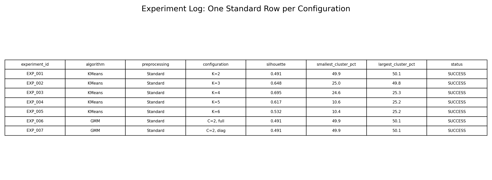

### Image Explanation

- Every row represents one experiment.
- Configuration and outputs appear together.
- Successful runs contain metrics.
- Failed runs contain error details.
- The log becomes the main comparison dataset.

Logging formats may include:

```text
CSV
JSON
JSON Lines
Parquet
Database table
MLflow
```

This module uses CSV and JSON Lines to remain beginner-friendly.

---

# 21. Logging Schema

A professional log can include:

## Identity

```text
experiment_id
run_timestamp
run_group
```

## Data and Features

```text
dataset_name
row_count
feature_set
feature_count
feature_names
```

## Preprocessing

```text
preprocessor
transformation_parameters
```

## Model

```text
algorithm
model_parameters
random_state
```

## Results

```text
status
runtime_seconds
silhouette
inertia
aic
bic
log_likelihood
cluster_sizes
```

## Failure

```text
error_type
error_message
```

---

# 22. Automated Result Collection

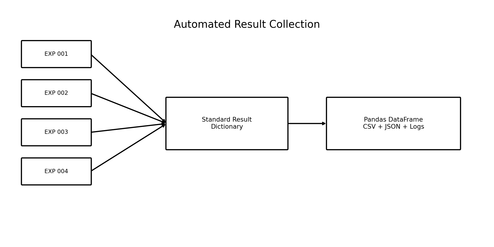

### Image Explanation

- Each experiment returns a dictionary with the same keys.
- The dictionaries are appended to a Python list.
- The list becomes a Pandas DataFrame.
- The DataFrame is exported for comparison.
- Standard output structure is essential.

Example:

```python
results = []

result = run_one_experiment(
    configuration
)

results.append(result)

results_df = pd.DataFrame(
    results
)
```

---

# 23. K-Means Metrics

Useful K-Means metrics:

| Metric | Purpose |
|---|---|
| Inertia | Within-cluster compactness |
| Silhouette | Cohesion and separation |
| Calinski-Harabasz | Separation relative to within-cluster dispersion |
| Davies-Bouldin | Similarity between clusters; lower is better |
| Iterations | Convergence behavior |
| Cluster sizes | Balance and usability |
| Runtime | Operational cost |

Important:

```text
Inertia should be compared only when the feature set and preprocessing space are the same.
```

A StandardScaler inertia and MinMaxScaler inertia use different numeric geometries.

---

# 24. GMM Metrics

Useful GMM metrics:

| Metric | Purpose |
|---|---|
| AIC | Fit and complexity |
| BIC | Fit and stronger complexity penalty |
| Average log-likelihood | Probability-based fit |
| Hard-label Silhouette | Separation of most likely labels |
| Membership confidence | Strength of soft assignment |
| Mixture weights | Modeled population proportions |
| Convergence | Fit completion |
| Iterations | EM behavior |
| Runtime | Operational cost |

Important:

```text
AIC and BIC should be compared among models fitted to the same observations and transformed feature space.
```

Do not create one global BIC leaderboard across different transformations without qualification.

---

# 25. Cluster-Size Metrics

For each experiment, calculate:

```text
smallest_cluster_count
largest_cluster_count
smallest_cluster_pct
largest_cluster_pct
```

Example:

```python
counts = pd.Series(
    labels
).value_counts()

smallest_pct = (
    100
    * counts.min()
    / len(labels)
)

largest_pct = (
    100
    * counts.max()
    / len(labels)
)
```

Cluster-size checks help identify:

- Tiny outlier clusters
- Dominant clusters
- Unusable segmentation
- Different model behavior

---

# 26. Runtime and Status Metrics

Automation should capture:

```text
start time
end time
runtime
status
```

Possible statuses:

```text
SUCCESS
FAILED
SKIPPED
```

Runtime matters because a technically strong configuration may be too expensive for repeated use.

---

# 27. Failure Handling

One failed experiment should not stop the full batch.

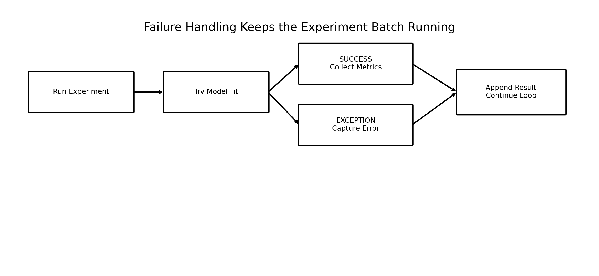

### Image Explanation

- The model fit is placed inside a `try` block.
- Successful runs collect metrics.
- Exceptions collect error type and message.
- Both paths append one result.
- The loop continues with the next configuration.

Example:

```python
try:
    model.fit(X_transformed)

    result["status"] = "SUCCESS"

except Exception as error:
    result["status"] = "FAILED"
    result["error_type"] = (
        type(error).__name__
    )
    result["error_message"] = str(
        error
    )
```

Do not silently ignore failures.

---

# 28. Comparison of Experiments

## K-Means Comparison

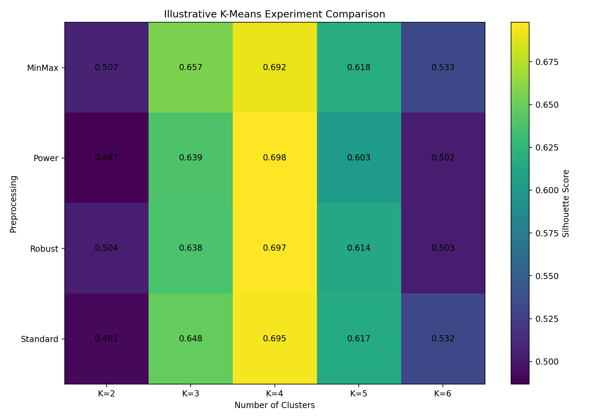

### Image Explanation

- Rows represent preprocessing methods.
- Columns represent K values.
- Each cell shows Silhouette Score.
- The chart helps identify strong combinations.
- It is an illustrative example, not an actual Spotify result.

## GMM Comparison

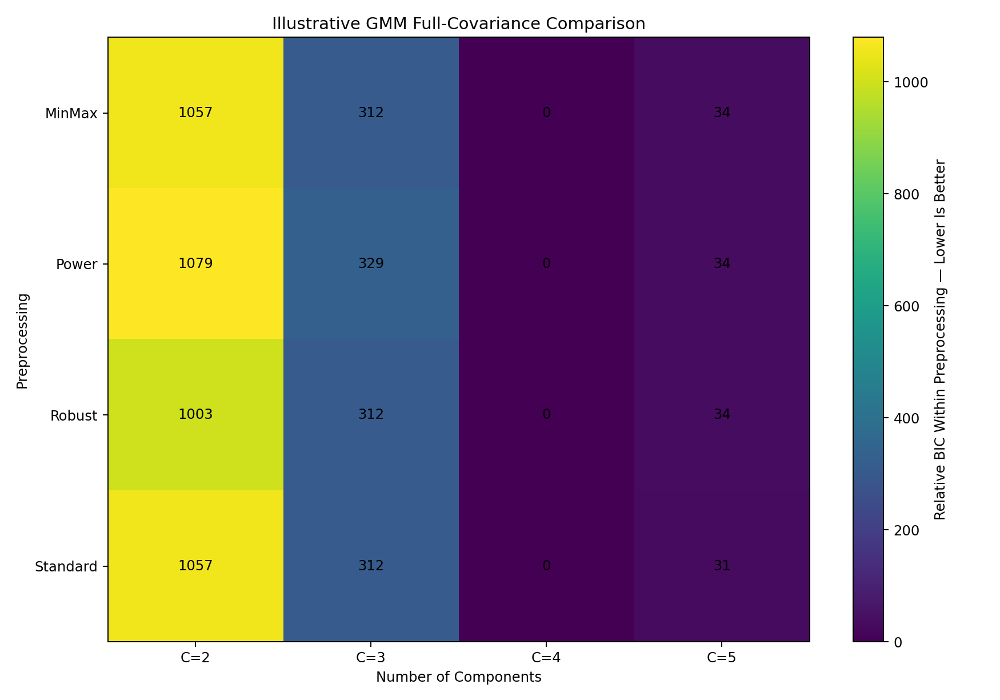

### Image Explanation

- Rows represent preprocessing methods.
- Columns represent component counts.
- Values are relative BIC within each preprocessing method.
- Lower relative BIC is better within that transformed space.
- This avoids incorrectly comparing absolute BIC across incompatible transformations.

---

# 29. Metric Comparability Rules

This is one of the most important sections.

## Inertia

Compare only when:

- Same observations
- Same features
- Same preprocessing

## AIC and BIC

Compare only when:

- Same observations
- Same feature set
- Same transformed space
- Same likelihood definition

## Silhouette

Silhouette can compare full clustering pipelines, but remember:

- Each transformation creates different geometry
- A higher score may come from stronger distortion
- Business interpretation and stability are still required

## Runtime

Runtime can be compared when:

- Same hardware
- Similar system load
- Similar data size

---

# 30. Experiment Leaderboards

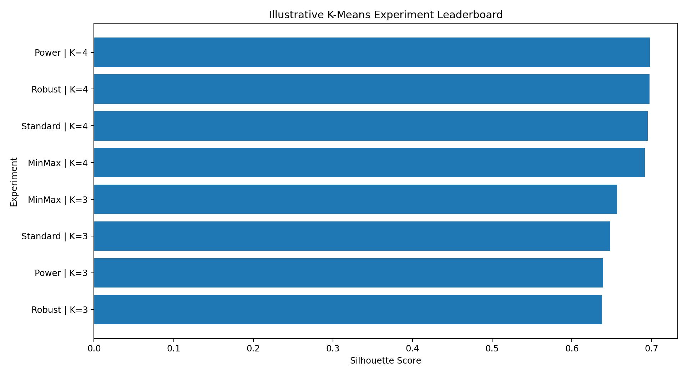

### Image Explanation

- Experiments are ranked by one screening metric.
- A leaderboard helps create a shortlist.
- It must not become the only selection rule.
- The best technical score may have poor cluster balance or weak business meaning.

Example:

```python
leaderboard = (
    results_df[
        results_df["status"]
        == "SUCCESS"
    ]
    .sort_values(
        "silhouette",
        ascending=False
    )
)
```

---

# 31. Shortlisting Candidate Experiments

A shortlist may require:

```text
Silhouette above threshold
Smallest cluster above threshold
Largest cluster below threshold
Successful convergence
Stable across seeds
Clear business interpretation
```

Example:

```python
shortlist = results_df[
    (results_df["status"] == "SUCCESS")
    & (results_df["silhouette"] >= 0.30)
    & (
        results_df[
            "smallest_cluster_pct"
        ] >= 5
    )
    & (
        results_df[
            "largest_cluster_pct"
        ] <= 60
    )
]
```

Thresholds must be project-specific.

---

# 32. Business Review of Experiments

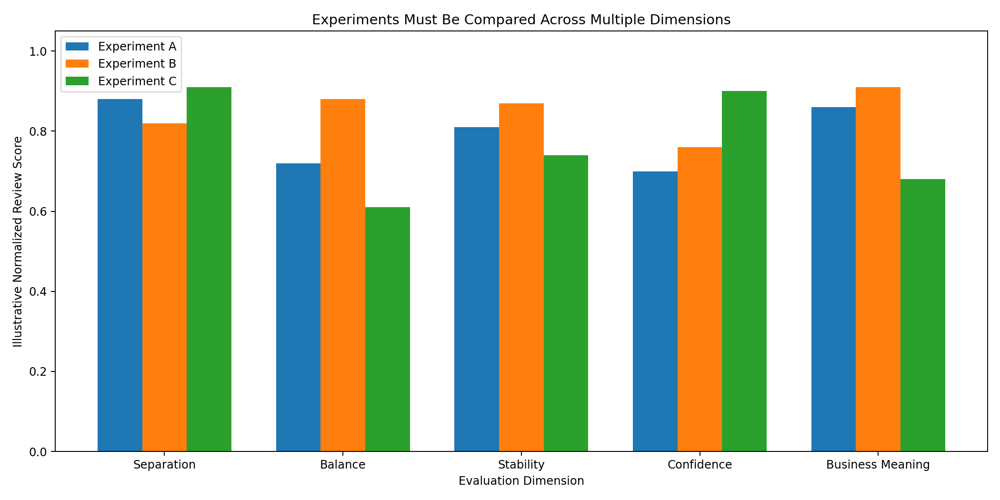

### Image Explanation

A model should be reviewed across multiple dimensions:

- Separation
- Balance
- Stability
- Probability confidence
- Business meaning

One experiment may have the strongest separation but weak balance.

Another may have slightly lower Silhouette but much clearer personas.

The final selection is not purely mathematical.

---

# 33. Reproducibility

A reproducible experiment can be rerun later and produce the expected process and comparable result.

Record:

- Dataset version
- Feature order
- Preprocessor
- Model parameters
- Random state
- Library versions
- Experiment ID
- Timestamp
- Code version

---

# 34. Saving Experiment Artifacts

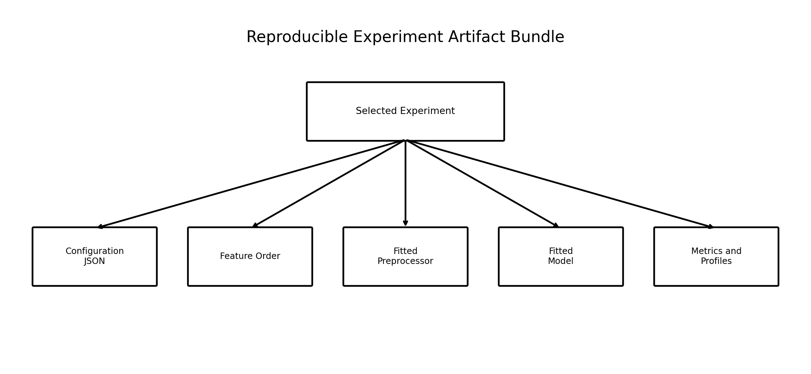

### Image Explanation

A selected experiment should save:

- Configuration JSON
- Feature order
- Fitted preprocessor
- Fitted model
- Metrics
- Cluster profiles
- Persona mapping

Example:

```python
joblib.dump(
    preprocessor,
    "preprocessor.joblib"
)

joblib.dump(
    model,
    "model.joblib"
)
```

Do not save every large model by default when hundreds of experiments are run.

A common strategy is:

```text
Log metrics for every run
Save full artifacts for shortlisted runs
```

---

# 35. End-to-End Spotify Automation Workflow

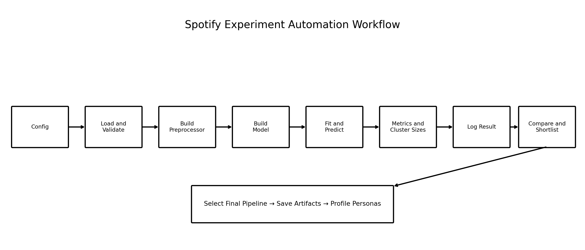

### Image Explanation

The workflow:

1. Read configuration
2. Load and validate Spotify data
3. Build the requested preprocessor
4. Build the requested model
5. Fit and generate labels or probabilities
6. Calculate metrics and cluster sizes
7. Log the result
8. Compare and shortlist candidates
9. Save the selected pipeline
10. Profile personas

---

# 36. Complete Automation Example

Core structure:

```python
results = []

for feature_set_name, features in feature_sets.items():

    for preprocessor_name in preprocessors:

        for k in k_values:

            configuration = {
                "feature_set_name": (
                    feature_set_name
                ),
                "features": features,
                "preprocessor_name": (
                    preprocessor_name
                ),
                "algorithm": "kmeans",
                "k": k
            }

            result = run_experiment(
                data=behavior,
                configuration=configuration
            )

            results.append(result)

results_df = pd.DataFrame(
    results
)
```

The complete implementation is included in:

```text
examples/spotify_experiment_automation.py
```

---

# 37. Recommended Folder Structure

```text
experiment_automation/
├── config/
│   └── experiment_config.json
├── data/
├── artifacts/
│   └── shortlisted_models/
├── logs/
│   └── experiment_log.jsonl
├── outputs/
│   ├── all_experiment_results.csv
│   ├── kmeans_results.csv
│   ├── gmm_results.csv
│   └── shortlist.csv
└── src/
    ├── preprocessing_factory.py
    ├── model_factory.py
    ├── experiment_runner.py
    ├── metrics.py
    └── logging_utils.py
```

This module provides beginner-friendly standalone scripts rather than requiring a Python package structure.

---

# 38. Automation Checklist

## Search Space

- [ ] Feature sets defined
- [ ] Preprocessors defined
- [ ] Transformations defined
- [ ] K values defined
- [ ] GMM component values defined
- [ ] Covariance types defined
- [ ] Random states defined

## Functions

- [ ] Input validation function
- [ ] Preprocessor factory
- [ ] Model factory
- [ ] Metric functions
- [ ] Experiment runner
- [ ] Logging function
- [ ] Comparison function

## Logging

- [ ] Unique experiment ID
- [ ] Configuration saved
- [ ] Runtime saved
- [ ] Status saved
- [ ] Metrics saved
- [ ] Cluster sizes saved
- [ ] Errors saved

## Comparison

- [ ] Failed runs excluded from ranking
- [ ] Metric comparability rules applied
- [ ] Cluster balance reviewed
- [ ] Stability reviewed
- [ ] Business profiles reviewed
- [ ] Candidate shortlist created

## Reproducibility

- [ ] Feature order saved
- [ ] Dataset version saved
- [ ] Random state saved
- [ ] Library versions saved
- [ ] Selected preprocessor saved
- [ ] Selected model saved

---

# 39. Important Terminology

| Term | Meaning |
|---|---|
| Experiment | One complete configuration and result |
| Search space | All configurations to test |
| Configuration | Settings that define one run |
| Automation | Programmatically running repeated tasks |
| Loop | Repeats code |
| Nested loop | Loop inside another loop |
| Function | Reusable block of code |
| UDF | User-defined function |
| Factory function | Builds an object from a name/config |
| Pipeline | Ordered preprocessing and modeling process |
| Experiment ID | Unique run identifier |
| Logging | Recording settings and results |
| Result collection | Combining outputs into a standard table |
| Status | SUCCESS, FAILED or SKIPPED |
| Exception | Runtime error object |
| Leaderboard | Ranked experiment table |
| Shortlist | Candidate experiments for deeper review |
| Artifact | Saved configuration, model or report |
| Reproducibility | Ability to rerun the same process |
| Runtime | Time required for one experiment |
| Comparability | Whether metrics are valid to compare |
| Grid | Combination of parameter values |
| Batch | Group of experiments run together |

---

# 40. Interview Questions and Answers

## 1. Why are multiple clustering experiments required?

Clustering has no true target label, and results change with features, preprocessing, algorithms and parameters.

---

## 2. What is an experiment?

One complete configuration, execution and result.

---

## 3. What is an experiment search space?

The full set of configurations to test.

---

## 4. Why automate experiments?

To improve speed, consistency, traceability and reproducibility.

---

## 5. What is a Python loop?

A structure that repeats code.

---

## 6. What is a nested loop?

A loop placed inside another loop.

---

## 7. What is a function?

A reusable block of code.

---

## 8. What is a user-defined function?

A project-specific function created by the developer.

---

## 9. What is a factory function?

A function that creates a preprocessor or model from configuration.

---

## 10. What is a reusable pipeline?

A standard sequence that validates, transforms, models and evaluates data.

---

## 11. What should an experiment ID contain?

Enough information to identify the feature set, preprocessing, algorithm and main parameters.

---

## 12. What is experiment logging?

Recording configuration, metrics, status, runtime and errors.

---

## 13. How are results collected automatically?

Return one standard dictionary per run and convert the list of dictionaries to a DataFrame.

---

## 14. Which K-Means metrics should be logged?

Inertia, Silhouette, cluster sizes, iterations and runtime.

---

## 15. Which GMM metrics should be logged?

AIC, BIC, log-likelihood, confidence, component sizes, convergence and runtime.

---

## 16. Can inertia be compared across scalers?

Not directly because the transformed feature spaces differ.

---

## 17. Can GMM BIC be compared across transformations?

It should be compared within the same observations, features and transformed space.

---

## 18. Can Silhouette compare pipelines?

It can support comparison, but the transformation changes geometry, so stability and business meaning must also be reviewed.

---

## 19. Why capture cluster sizes?

Strong metrics may still create tiny or dominant unusable clusters.

---

## 20. Why capture runtime?

Operational cost may matter for repeated training or production.

---

## 21. How should failures be handled?

Capture error details, mark the run failed and continue the batch.

---

## 22. What is a leaderboard?

A ranked experiment table based on one or more screening metrics.

---

## 23. Why is a leaderboard not the final decision?

It may ignore stability, balance and business interpretation.

---

## 24. What is a shortlist?

A smaller set of strong candidates for deeper analysis.

---

## 25. What artifacts should be saved?

Configuration, feature order, preprocessor, model, metrics and profiles.

---

## 26. Should every model artifact be saved?

Not necessarily. Log all results and save complete artifacts for shortlisted runs.

---

## 27. What makes an experiment reproducible?

Saved data version, features, configuration, random state, code and library versions.

---

## 28. What is configuration-driven automation?

Changing experiment settings through data structures or files rather than editing core code.

---

## 29. How do you automate K-Means experiments?

Loop through preprocessors and K values, fit, evaluate and log each run.

---

## 30. How do you automate GMM experiments?

Loop through preprocessors, component counts and covariance types, then evaluate and log each run.

---

# 41. Module Summary

In this module, we learned:

- One clustering experiment is not enough
- Feature sets, preprocessing and algorithms create different solutions
- Automation makes large search spaces manageable
- Python loops repeat configurations
- Nested loops create experiment grids
- Functions prevent duplicated logic
- UDFs encode project-specific behavior
- Reusable pipelines create consistent execution
- Configuration should control experiments
- Every run needs a unique experiment ID
- Logging must capture settings, metrics, runtime and status
- Failed runs should be recorded without stopping the batch
- Results should be collected in a standard DataFrame
- K-Means and GMM require different metrics
- Metric comparability rules must be respected
- Leaderboards create shortlists but do not replace business review
- Selected experiments require reproducible artifacts
- Final model selection combines technical quality, stability, balance and business meaning

---

# 42. Quick Reference Cheat Sheet

## Experiment Loop

```python
for preprocessor in preprocessors:
    for k in k_values:
        result = run_experiment(
            preprocessor,
            k
        )
        results.append(result)
```

## Result Collection

```python
results_df = pd.DataFrame(
    results
)
```

## Failure Handling

```python
try:
    ...
    status = "SUCCESS"
except Exception as error:
    status = "FAILED"
```

## K-Means Metrics

```text
Inertia
Silhouette
Cluster size
Iterations
Runtime
```

## GMM Metrics

```text
AIC
BIC
Log-likelihood
Confidence
Component size
Convergence
Runtime
```

## Important Comparison Rule

```text
Inertia and BIC are not globally comparable
across different transformed spaces.
```

---

# 43. What Comes Next?

## Module 12 — Clustering Evaluation Metrics

The next module can cover:

- Silhouette Score
- Calinski-Harabasz Score
- Davies-Bouldin Score
- Inertia
- AIC
- BIC
- Log-likelihood
- Cluster-size analysis
- Membership confidence
- Stability metrics
- Technical vs business evaluation
