# Module 12 — Cluster Evaluation

> A detailed beginner-friendly guide to evaluating clustering solutions using Silhouette Score, Davies-Bouldin Index, Calinski-Harabasz Score, inertia, log-likelihood, AIC, BIC, cluster-size distribution, balance, stability, business interpretability, and a practical best-model selection framework.

---

## Table of Contents

1. [Module Overview](#1-module-overview)
2. [Learning Objectives](#2-learning-objectives)
3. [Why Clustering Evaluation Is Difficult](#3-why-clustering-evaluation-is-difficult)
4. [Internal vs External Evaluation](#4-internal-vs-external-evaluation)
5. [Technical vs Business Evaluation](#5-technical-vs-business-evaluation)
6. [Silhouette Score](#6-silhouette-score)
7. [Silhouette Score Interpretation](#7-silhouette-score-interpretation)
8. [Silhouette Plot](#8-silhouette-plot)
9. [Davies-Bouldin Index](#9-davies-bouldin-index)
10. [Calinski-Harabasz Score](#10-calinski-harabasz-score)
11. [Inertia](#11-inertia)
12. [Log-Likelihood](#12-log-likelihood)
13. [AIC](#13-aic)
14. [BIC](#14-bic)
15. [AIC vs BIC](#15-aic-vs-bic)
16. [Cluster-Size Distribution](#16-cluster-size-distribution)
17. [Cluster Balance](#17-cluster-balance)
18. [Tiny and Dominant Clusters](#18-tiny-and-dominant-clusters)
19. [Cluster Stability](#19-cluster-stability)
20. [Adjusted Rand Index for Stability](#20-adjusted-rand-index-for-stability)
21. [Stability Across Random Seeds](#21-stability-across-random-seeds)
22. [Stability Across Samples and Time](#22-stability-across-samples-and-time)
23. [Business Interpretability](#23-business-interpretability)
24. [Actionability](#24-actionability)
25. [Model-Specific Evaluation](#25-model-specific-evaluation)
26. [K-Means Evaluation Framework](#26-k-means-evaluation-framework)
27. [GMM Evaluation Framework](#27-gmm-evaluation-framework)
28. [Metric Comparability Rules](#28-metric-comparability-rules)
29. [When Metrics Disagree](#29-when-metrics-disagree)
30. [Best Model Selection](#30-best-model-selection)
31. [Shortlisting Rules](#31-shortlisting-rules)
32. [Model Selection Scorecard](#32-model-selection-scorecard)
33. [Spotify Business Review](#33-spotify-business-review)
34. [Complete Spotify Evaluation Workflow](#34-complete-spotify-evaluation-workflow)
35. [Reusable Python Implementation](#35-reusable-python-implementation)
36. [Evaluation Checklist](#36-evaluation-checklist)
37. [Important Terminology](#37-important-terminology)
38. [Interview Questions and Answers](#38-interview-questions-and-answers)
39. [Module Summary](#39-module-summary)
40. [Quick Reference Cheat Sheet](#40-quick-reference-cheat-sheet)
41. [What Comes Next?](#41-what-comes-next)

---

# 1. Module Overview

Clustering evaluation is the process of deciding whether a clustering solution is technically sound, stable, interpretable, and useful for the business.

A clustering model may produce labels successfully but still be a poor solution.

Example problems:

- Clusters overlap heavily
- One cluster contains almost every user
- Tiny clusters contain only outliers
- Results change with every random seed
- Metrics look good but personas are unclear
- Personas are clear but separation is weak
- GMM probabilities show high uncertainty
- A model is too complex to operate

The final model should be selected using several types of evidence.

```text
Technical Metrics
        +
Cluster Size and Balance
        +
Stability
        +
Business Interpretation
        =
Best Supported Model
```

---

# 2. Learning Objectives

By the end of this module, students should be able to:

- Explain why clustering evaluation is difficult
- Differentiate internal and external metrics
- Calculate Silhouette Score
- Interpret a silhouette plot
- Calculate Davies-Bouldin Index
- Calculate Calinski-Harabasz Score
- Explain K-Means inertia
- Explain GMM log-likelihood
- Explain AIC and BIC
- Review cluster-size distribution
- Evaluate cluster balance
- Identify tiny and dominant clusters
- Evaluate stability across random seeds
- Use Adjusted Rand Index for stability
- Explain business interpretability
- Explain actionability
- Apply metric-comparability rules
- Resolve conflicting metrics
- Create a model-selection scorecard
- Select and document the best supported model

---

# 3. Why Clustering Evaluation Is Difficult

Clustering usually does not have true persona labels.

We do not know in advance:

```text
User 1001 = Power Streamer
User 1002 = Casual Snacker
```

The model creates groups without a target column.

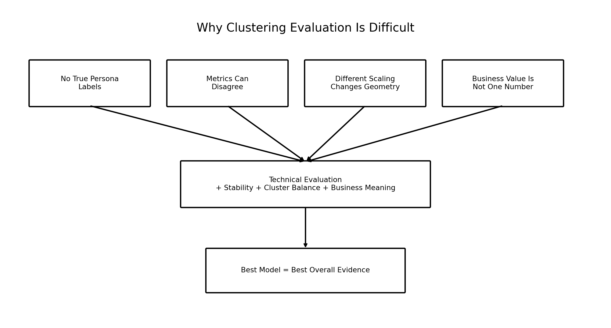

### Image Explanation

- There are no true persona labels for direct accuracy measurement.
- Different metrics may prefer different models.
- Scaling and transformation alter feature-space geometry.
- Business usefulness cannot be summarized by one technical score.
- The best model requires multiple forms of evidence.

---

## Main Difficulties

### No Accuracy Score

Classification can use:

```text
Accuracy
Precision
Recall
F1
```

Clustering usually cannot because true labels are absent.

### Multiple Valid Solutions

A three-cluster and four-cluster solution may both be reasonable at different business levels.

### Metrics Have Different Goals

- Silhouette measures cohesion and separation
- Davies-Bouldin measures cluster similarity
- Calinski-Harabasz compares between-cluster and within-cluster dispersion
- Inertia measures K-Means compactness
- AIC and BIC evaluate probabilistic fit with complexity penalties

### Business Meaning Is Essential

A technically compact solution may produce segments that cannot be used.

---

# 4. Internal vs External Evaluation

## Internal Evaluation

Uses the data and cluster assignments only.

Examples:

- Silhouette Score
- Davies-Bouldin Index
- Calinski-Harabasz Score
- Inertia

## External Evaluation

Compares clusters with known reference labels.

Examples:

- Adjusted Rand Index
- Normalized Mutual Information
- Adjusted Mutual Information

In this project, external metrics are mainly useful for:

```text
Stability comparison between two clusterings
```

rather than comparison with true persona labels.

---

# 5. Technical vs Business Evaluation

| Technical Evaluation | Business Evaluation |
|---|---|
| Separation | Clear persona meaning |
| Compactness | Actionable strategy |
| Model fit | Stakeholder usefulness |
| Cluster size | Operational simplicity |
| Stability | Repeatable business interpretation |
| Confidence | Acceptable uncertainty |

Both are required.

---

# 6. Silhouette Score

Silhouette Score measures how well each user fits its assigned cluster compared with the nearest alternative cluster.

For user `i`:

```text
a(i)
=
Average distance to users in the same cluster

b(i)
=
Lowest average distance to users in another cluster
```

Silhouette value:

```text
s(i)
=
[b(i) - a(i)]
÷
max[a(i), b(i)]
```

Range:

```text
-1 to +1
```

---

## Python

```python
from sklearn.metrics import silhouette_score

score = silhouette_score(
    X_scaled,
    labels
)
```

For large datasets:

```python
score = silhouette_score(
    X_scaled,
    labels,
    sample_size=10000,
    random_state=42
)
```

A sampled score can reduce computation time.

---

# 7. Silhouette Score Interpretation

| Value | General Interpretation |
|---:|---|
| Close to +1 | Well matched to own cluster |
| Around 0 | Near a cluster boundary |
| Below 0 | May fit another cluster better |

Important:

There is no universal score threshold for every dataset.

Use relative comparison among reasonable candidates.

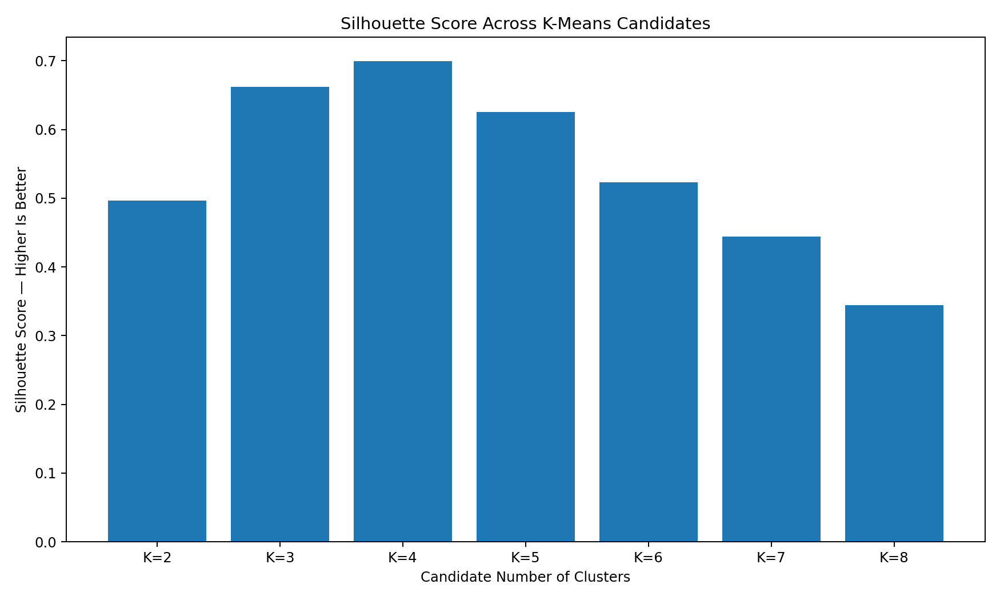

### Image Explanation

- Each bar represents one candidate K value.
- Higher values generally indicate better separation and cohesion.
- The highest score is not automatically the final answer.
- Cluster size, stability and business meaning must also be reviewed.

---

# 8. Silhouette Plot

A single average can hide weak clusters.

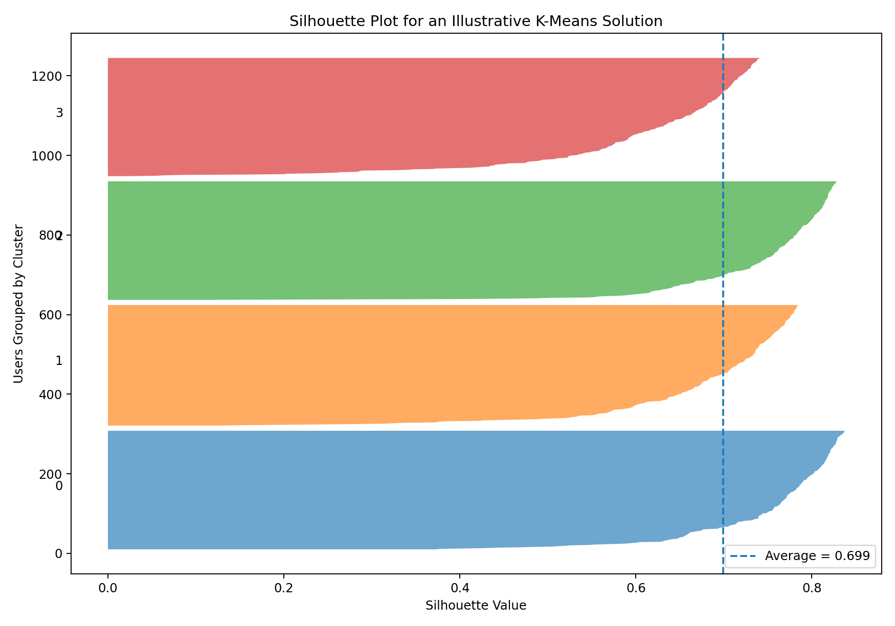

### Image Explanation

- Each horizontal shape represents one cluster.
- Every row segment represents one user's silhouette value.
- The dashed vertical line is the average Silhouette Score.
- Long positive regions indicate stronger assignment.
- Values near zero indicate boundary users.
- Negative values may indicate weak assignments.

A good solution usually has:

- Mostly positive silhouette values
- Similar or reasonable cluster thickness
- Few strongly negative values
- An average clearly above zero

---

# 9. Davies-Bouldin Index

Davies-Bouldin Index measures how similar each cluster is to its most similar competing cluster.

It considers:

- Within-cluster scatter
- Separation between cluster centers

Interpretation:

```text
Lower is better.
```

```python
from sklearn.metrics import (
    davies_bouldin_score
)

db_index = davies_bouldin_score(
    X_scaled,
    labels
)
```

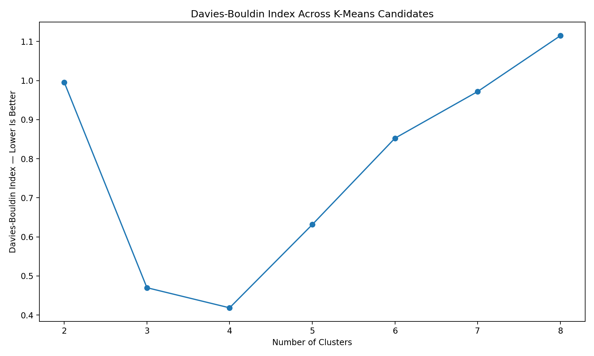

### Image Explanation

- The x-axis shows candidate cluster counts.
- The y-axis shows Davies-Bouldin Index.
- Lower values indicate clusters that are more compact and separated.
- It should be used with other metrics rather than alone.

---

## Limitations

- Sensitive to cluster geometry
- Can prefer compact spherical groups
- Does not measure business meaning
- A low score can still accompany poor cluster balance

---

# 10. Calinski-Harabasz Score

Calinski-Harabasz Score compares:

```text
Between-cluster dispersion
÷
Within-cluster dispersion
```

Interpretation:

```text
Higher is better.
```

```python
from sklearn.metrics import (
    calinski_harabasz_score
)

ch_score = calinski_harabasz_score(
    X_scaled,
    labels
)
```

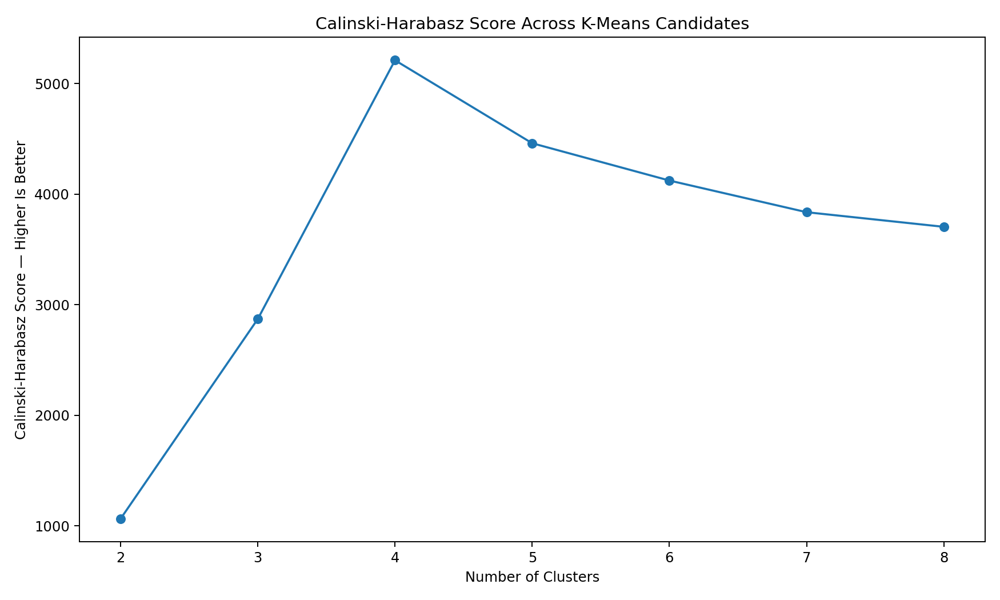

### Image Explanation

- Higher values indicate stronger separation relative to internal spread.
- The score can increase strongly for some K values.
- It is useful for comparison but has no universal business threshold.

---

## Limitations

- Often favors compact and well-separated groups
- Can be influenced by sample size
- Does not evaluate soft probabilities
- Does not guarantee actionable personas

---

# 11. Inertia

Inertia is specific to K-Means and related centroid-based methods.

```text
Inertia
=
Sum of squared distances
from each user
to the assigned centroid
```

```python
model.inertia_
```

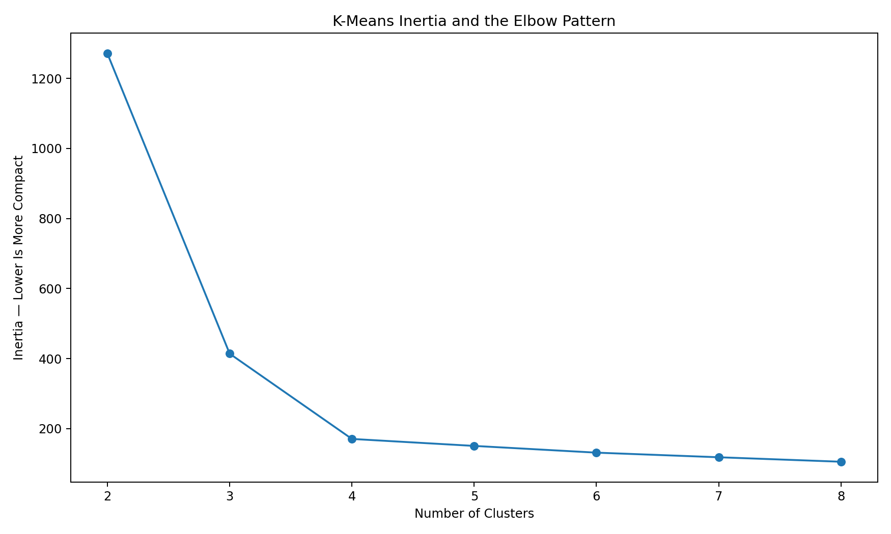

### Image Explanation

- Inertia decreases when more centroids are added.
- Lower values mean more compact clusters.
- The curve is used to find an elbow where improvement slows.
- Inertia alone cannot choose K because it always decreases.

---

## Comparability Rule

Compare inertia only when the candidates use:

- The same observations
- The same feature set
- The same preprocessing
- The same transformed feature space

Do not directly compare:

```text
StandardScaler inertia
vs
MinMaxScaler inertia
```

because the numeric geometry is different.

---

# 12. Log-Likelihood

GMM evaluates how probable the observed data is under the fitted mixture model.

```python
average_log_likelihood = (
    model.score(X_scaled)
)
```

Interpretation:

```text
Higher is better
for candidates fitted to the same data space.
```

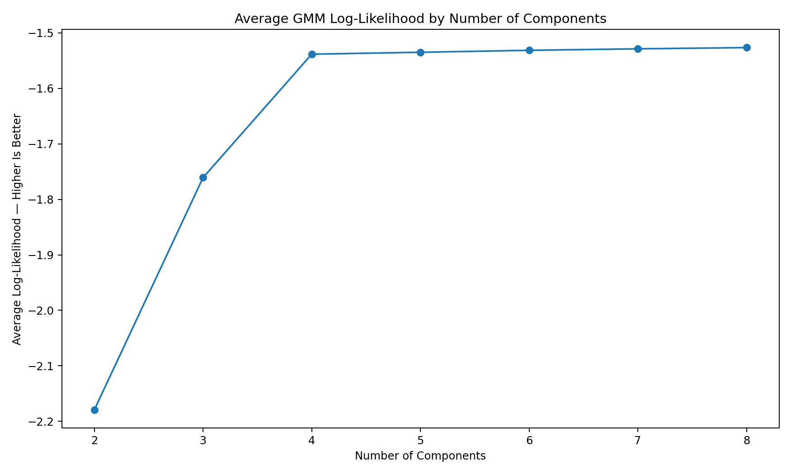

### Image Explanation

- More components usually improve raw fit.
- Higher log-likelihood means the model assigns greater probability to the observations.
- Complex models often improve likelihood even when the additional complexity is not useful.
- AIC and BIC add penalties for complexity.

---

# 13. AIC

AIC means Akaike Information Criterion.

It combines:

- Model fit
- Number of parameters

Interpretation:

```text
Lower is better.
```

```python
aic = model.aic(
    X_scaled
)
```

AIC often permits more complex solutions than BIC.

---

# 14. BIC

BIC means Bayesian Information Criterion.

It also balances:

- Model fit
- Model complexity

Interpretation:

```text
Lower is better.
```

```python
bic = model.bic(
    X_scaled
)
```

BIC applies a sample-size-aware complexity penalty and often favors simpler models.

---

# 15. AIC vs BIC

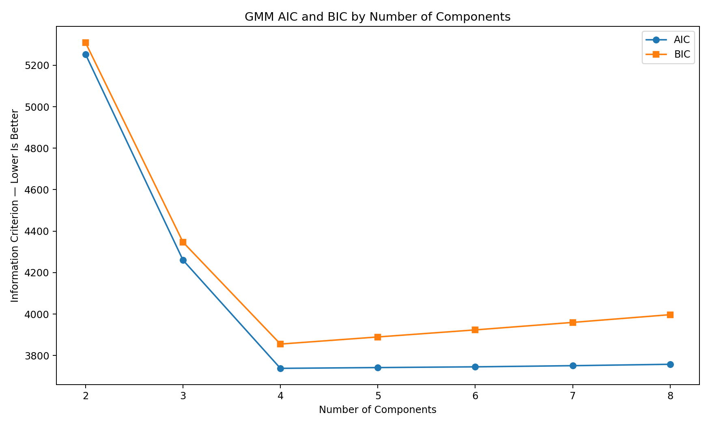

### Image Explanation

- Both metrics may fall as fit improves.
- After a point, complexity penalties may cause them to rise.
- The lowest point is a strong candidate.
- AIC and BIC may select different component counts.
- Final selection still requires size, stability and business review.

| AIC | BIC |
|---|---|
| Lower is better | Lower is better |
| Less conservative penalty | Often stronger penalty |
| May prefer richer models | May prefer simpler models |
| Useful GMM evidence | Frequently used for GMM selection |

---

## Comparability Rule

Compare AIC and BIC only when models use:

- The same rows
- The same features
- The same transformed feature space
- The same likelihood definition

Do not create one absolute BIC leaderboard across incompatible transformations.

---

# 16. Cluster-Size Distribution

Cluster-size distribution shows how users are divided among clusters.

```python
cluster_sizes = (
    pd.Series(labels)
    .value_counts()
    .sort_index()
)
```

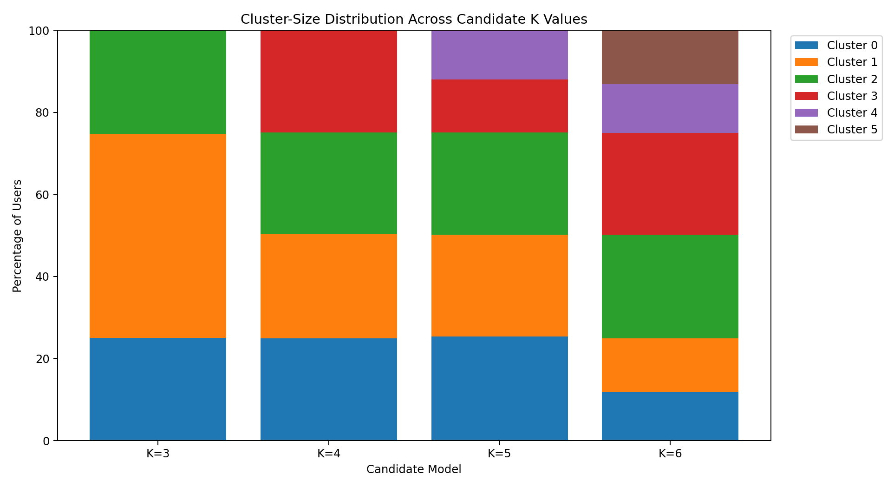

### Image Explanation

- Each bar represents one candidate model.
- Each stacked section represents one cluster's user percentage.
- The chart reveals tiny or dominant groups.
- Equal size is not required.
- Extremely uneven distributions require investigation.

---

# 17. Cluster Balance

Cluster balance describes how evenly users are distributed.

Useful measures:

```text
Smallest cluster percentage
Largest cluster percentage
Largest-to-smallest ratio
Entropy of cluster sizes
```

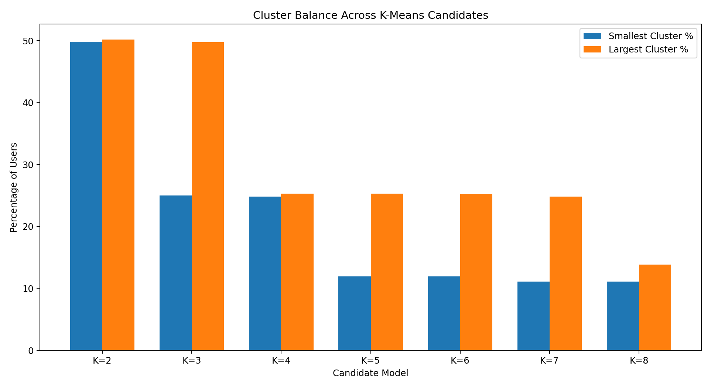

### Image Explanation

- One bar shows the smallest cluster percentage.
- The other shows the largest cluster percentage.
- A very small minimum may indicate an outlier cluster.
- A very large maximum may indicate under-segmentation.
- Balance must be interpreted with business context.

---

# 18. Tiny and Dominant Clusters

## Tiny Cluster

Possible explanations:

- Genuine niche persona
- Outlier group
- Data-quality problem
- Excessive K
- Unstable initialization
- Over-flexible GMM

## Dominant Cluster

Possible explanations:

- K too small
- Features do not separate behavior
- One broad population genuinely dominates
- Transformation compresses important differences
- Remaining clusters capture only extremes

Do not reject a cluster only because it is small.

Ask whether it is:

- Stable
- Meaningful
- Actionable
- Reproducible

---

# 19. Cluster Stability

Stability means the cluster structure remains similar under reasonable changes.

Test changes such as:

- Random seed
- Data sample
- Time period
- Feature subset
- Small preprocessing variations
- Retraining

A stable model should preserve:

- Similar cluster sizes
- Similar cluster profiles
- Similar user assignments
- Similar persona meaning

---

# 20. Adjusted Rand Index for Stability

Adjusted Rand Index, or ARI, compares two cluster-label assignments.

Range is generally:

```text
-1 to 1
```

Common interpretation:

```text
1
=
Identical grouping structure

Near 0
=
Agreement similar to chance
```

ARI is label-order independent.

Cluster 0 in one run can match Cluster 3 in another run without requiring manual renaming.

```python
from sklearn.metrics import (
    adjusted_rand_score
)

ari = adjusted_rand_score(
    labels_run_1,
    labels_run_2
)
```

---

# 21. Stability Across Random Seeds

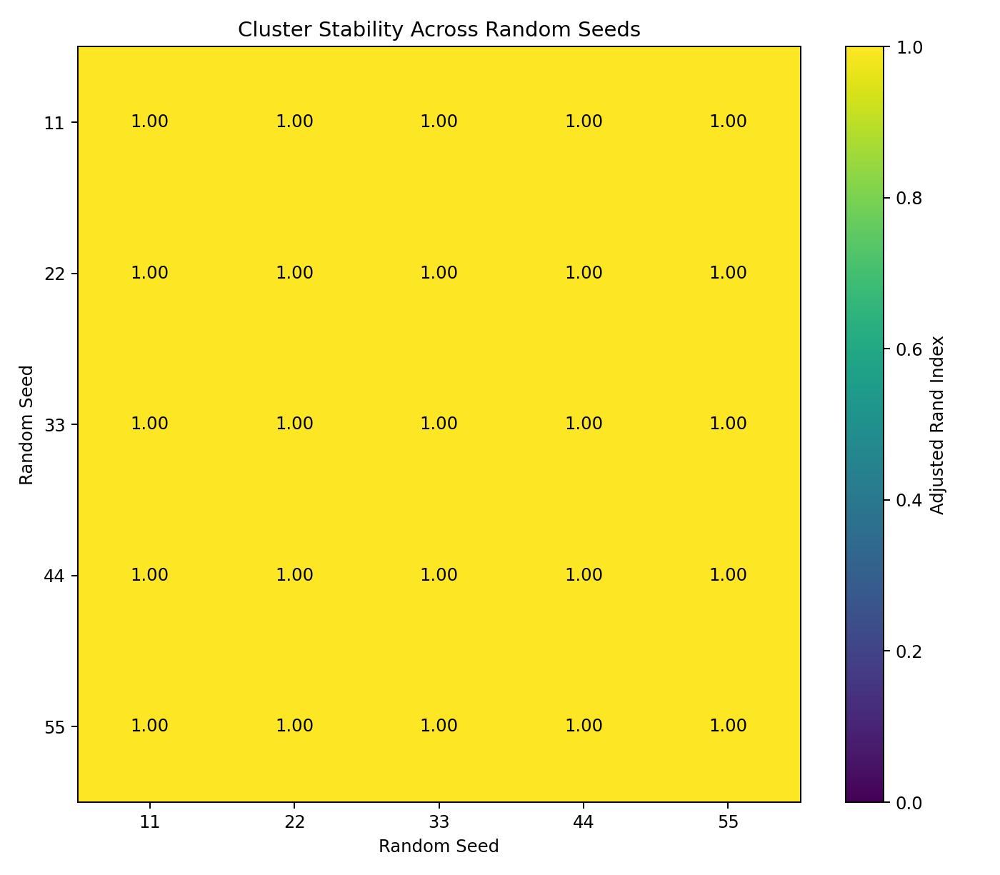

### Image Explanation

- Every cell compares two clustering runs.
- The number is Adjusted Rand Index.
- Values near 1 indicate highly similar group structure.
- Lower values indicate sensitivity to initialization.
- Diagonal values are 1 because each run is compared with itself.

---

# 22. Stability Across Samples and Time

Random-seed stability is not enough.

Also evaluate:

## Bootstrap or Sample Stability

- Draw repeated samples
- Fit the model
- Compare overlapping users or profiles

## Time Stability

- Train on one month
- Evaluate profile consistency in later months
- Track cluster-size drift
- Track centroid or component-mean drift

## Business Stability

- Do persona descriptions remain meaningful?
- Can operations continue using the segment definitions?
- Are actions still appropriate?

---

# 23. Business Interpretability

Business interpretability asks:

- Can each cluster be explained clearly?
- Which features make it different?
- Does the persona name match the evidence?
- Can a stakeholder understand the group?
- Is the segment distinct from the others?

Example:

```text
Cluster 2:
High listening minutes
High active days
Low skip rate
Long sessions
```

Possible persona:

```text
Power Streamers
```

A model with unclear or contradictory profiles may not be suitable.

---

# 24. Actionability

A cluster is actionable when the business can do something different for it.

Possible Spotify actions:

- Recommendation strategy
- Premium-conversion campaign
- Retention intervention
- Advertisement strategy
- Home-page personalization
- Playlist strategy
- Notification frequency

A cluster with no distinct action may add complexity without value.

---

# 25. Model-Specific Evaluation

Different algorithms require different primary metrics.

## K-Means

- Inertia
- Elbow Method
- Silhouette
- Davies-Bouldin
- Calinski-Harabasz
- Cluster sizes
- Stability
- Centroid interpretation

## GMM

- Log-likelihood
- AIC
- BIC
- Silhouette of hard labels
- Component weights
- Membership confidence
- Cluster sizes
- Stability
- Mean and covariance interpretation

---

# 26. K-Means Evaluation Framework

```text
1. Fit candidate K values
2. Record inertia
3. Calculate Silhouette
4. Calculate Davies-Bouldin
5. Calculate Calinski-Harabasz
6. Review cluster sizes
7. Test stability
8. Inverse-transform centroids
9. Profile clusters
10. Review business usefulness
```

---

# 27. GMM Evaluation Framework

```text
1. Fit candidate component counts
2. Test covariance types
3. Record log-likelihood
4. Record AIC and BIC
5. Confirm convergence
6. Calculate hard-label metrics
7. Review mixture weights
8. Review confidence
9. Test stability
10. Profile components
11. Review business usefulness
```

---

# 28. Metric Comparability Rules

## Inertia

Valid comparison:

```text
Same feature set
Same scaler
Different K
```

Invalid direct comparison:

```text
StandardScaler inertia
vs
RobustScaler inertia
```

## AIC and BIC

Valid comparison:

```text
Same observations
Same transformed features
Different GMM components/covariance
```

Invalid direct comparison:

```text
StandardScaler BIC
vs
PowerTransformer BIC
```

without qualification.

## Silhouette, DB and CH

These can compare complete pipelines more broadly, but:

- Transformation changes geometry
- A better score may come from stronger distortion
- Business meaning and stability remain essential

---

# 29. When Metrics Disagree

Example:

| Candidate | Silhouette | DB Index | CH Score | Balance | Business Meaning |
|---|---:|---:|---:|---|---|
| A | Best | Good | Good | Poor | Weak |
| B | Slightly lower | Best | Best | Good | Strong |
| C | Lower | Moderate | Moderate | Best | Moderate |

The final model may be Candidate B.

Use this process:

```text
1. Remove failed or unstable candidates
2. Check metric comparability
3. Review multiple technical metrics
4. Review cluster sizes
5. Review stability
6. Review business profiles
7. Select the strongest overall evidence
```

---

# 30. Best Model Selection

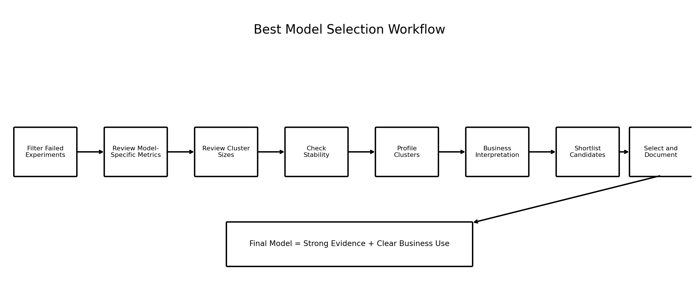

### Image Explanation

- Failed experiments are removed first.
- K-Means and GMM are reviewed using suitable metrics.
- Cluster size and stability are checked.
- Profiles are created and interpreted.
- A shortlist is discussed with business stakeholders.
- The final decision is documented with reasons.

---

# 31. Shortlisting Rules

Example technical filters:

```python
shortlist = results[
    (results["status"] == "SUCCESS")
    & (results["smallest_cluster_pct"] >= 5)
    & (results["largest_cluster_pct"] <= 60)
]
```

Possible additional filters:

- Silhouette above a project threshold
- DB below a project threshold
- GMM converged
- Mean GMM confidence above a project threshold
- Stability above a project threshold

Thresholds must be justified for the project.

---

# 32. Model Selection Scorecard

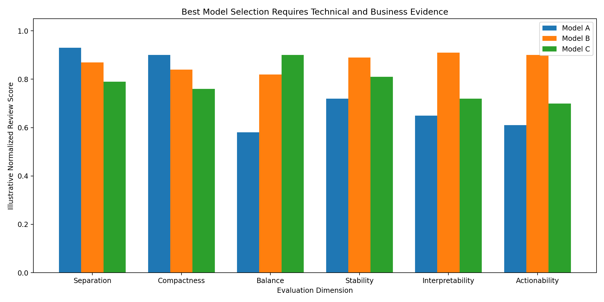

### Image Explanation

- Model A has very strong technical separation but weak balance and actionability.
- Model B is strong across all dimensions.
- Model C has strong balance but weaker separation and interpretability.
- The best overall model is not always the highest single metric.

A scorecard may include:

| Dimension | Weight |
|---|---:|
| Separation | 20% |
| Compactness or fit | 15% |
| Cluster balance | 15% |
| Stability | 20% |
| Interpretability | 15% |
| Actionability | 15% |

Weights are business decisions.

Do not present a weighted score as objective truth.

---

# 33. Spotify Business Review

For each candidate cluster:

- User count and percentage
- Mean and median behavior
- Original-unit centroid or component mean
- Top demographic patterns
- Device pattern
- Subscription tenure
- Membership confidence for GMM
- Possible persona
- Recommended business action
- Risks and limitations

Example review:

```text
Candidate Model:
StandardScaler + K-Means K=4

Technical:
Good Silhouette
Low DB Index
Stable across seeds

Structure:
No cluster below 8%
No cluster above 40%

Business:
Four distinct behavioral profiles
Clear retention and Premium opportunities

Decision:
Shortlist
```

---

# 34. Complete Spotify Evaluation Workflow

```text
Experiment Results
        ↓
Remove Failed Runs
        ↓
Apply Metric Comparability Rules
        ↓
Review K-Means Metrics
        ↓
Review GMM Metrics
        ↓
Review Cluster Sizes
        ↓
Review Stability
        ↓
Profile Candidate Clusters
        ↓
Evaluate Interpretability
        ↓
Evaluate Actionability
        ↓
Create Shortlist
        ↓
Select and Document Final Model
```

---

# 35. Reusable Python Implementation

Included scripts:

```text
examples/spotify_cluster_evaluation.py
examples/cluster_stability_analysis.py
examples/best_model_selection.py
examples/cluster_evaluation_visualizations.py
```

The scripts calculate:

- Silhouette Score
- Silhouette samples
- Davies-Bouldin Index
- Calinski-Harabasz Score
- K-Means inertia
- GMM log-likelihood
- GMM AIC and BIC
- Cluster-size distribution
- Balance metrics
- Random-seed stability
- Candidate shortlists
- Decision scorecards

---

# 36. Evaluation Checklist

## Technical Metrics

- [ ] Silhouette calculated
- [ ] Silhouette plot reviewed
- [ ] Davies-Bouldin calculated
- [ ] Calinski-Harabasz calculated
- [ ] Inertia reviewed for K-Means
- [ ] Log-likelihood reviewed for GMM
- [ ] AIC reviewed for GMM
- [ ] BIC reviewed for GMM

## Cluster Structure

- [ ] User counts calculated
- [ ] Percentages calculated
- [ ] Smallest cluster reviewed
- [ ] Largest cluster reviewed
- [ ] Tiny clusters investigated
- [ ] Dominant clusters investigated

## Stability

- [ ] Random-seed stability checked
- [ ] Sample stability considered
- [ ] Time stability considered
- [ ] Cluster profiles compared
- [ ] Persona meaning compared

## Business Review

- [ ] Profiles created
- [ ] Persona names justified
- [ ] Actions documented
- [ ] Stakeholder usefulness reviewed
- [ ] Complexity reviewed
- [ ] Limitations documented

## Selection

- [ ] Metric comparability rules applied
- [ ] Candidates shortlisted
- [ ] Scorecard completed
- [ ] Final decision reason documented
- [ ] Model and preprocessing artifacts saved

---

# 37. Important Terminology

| Term | Meaning |
|---|---|
| Cluster evaluation | Assessment of clustering quality |
| Internal metric | Uses data and cluster assignments |
| External metric | Compares two label sets or true labels |
| Silhouette Score | Cohesion and separation |
| Silhouette sample | User-level silhouette value |
| Davies-Bouldin Index | Cluster similarity measure |
| Calinski-Harabasz Score | Between/within dispersion ratio |
| Inertia | K-Means squared distance total |
| Log-likelihood | Probability-based model fit |
| AIC | Fit-complexity criterion |
| BIC | Fit-complexity criterion with stronger penalty |
| Cluster-size distribution | Users per cluster |
| Cluster balance | Relative group-size evenness |
| Tiny cluster | Very small segment |
| Dominant cluster | Very large segment |
| Stability | Similarity across reruns or samples |
| ARI | Adjusted Rand Index |
| Interpretability | Ease of explaining a cluster |
| Actionability | Ability to take distinct business action |
| Shortlist | Candidate models for deeper review |
| Scorecard | Multi-dimension comparison table |
| Metric comparability | Whether scores can be validly compared |
| Best model | Strongest overall supported solution |

---

# 38. Interview Questions and Answers

## 1. Why is clustering evaluation difficult?

There are usually no true cluster labels, and different metrics measure different properties.

---

## 2. What is an internal clustering metric?

A metric calculated using features and predicted labels only.

---

## 3. What is Silhouette Score?

A measure of within-cluster cohesion and nearest-cluster separation.

---

## 4. What is the Silhouette range?

Approximately -1 to +1.

---

## 5. What does a negative silhouette value mean?

The user may fit another cluster better.

---

## 6. Why use a silhouette plot?

It reveals cluster-level and user-level quality hidden by the average.

---

## 7. What is Davies-Bouldin Index?

A measure of how similar clusters are to their nearest competing clusters.

---

## 8. Is a lower or higher DB Index better?

Lower is better.

---

## 9. What is Calinski-Harabasz Score?

The ratio of between-cluster dispersion to within-cluster dispersion.

---

## 10. Is a lower or higher CH Score better?

Higher is better.

---

## 11. What is inertia?

The sum of squared distances from users to K-Means centroids.

---

## 12. Why cannot inertia select K alone?

It always decreases as K increases.

---

## 13. Can inertia be compared across scalers?

Not directly.

---

## 14. What is GMM log-likelihood?

The average probability-based fit of the data under the model.

---

## 15. What is AIC?

A fit-complexity criterion where lower is better.

---

## 16. What is BIC?

A fit-complexity criterion with a stronger sample-size-aware penalty.

---

## 17. Can BIC be compared across transformations?

Only with caution; direct comparison should stay within the same transformed feature space.

---

## 18. What is cluster-size distribution?

The count or percentage of users in every cluster.

---

## 19. What is cluster balance?

The relative evenness of cluster sizes.

---

## 20. Is equal cluster size required?

No.

---

## 21. What is a tiny cluster?

A very small segment that may be niche, unstable or outlier-driven.

---

## 22. What is cluster stability?

Consistency across seeds, samples, periods or retraining.

---

## 23. What is Adjusted Rand Index?

A label-order-independent comparison of two cluster assignments.

---

## 24. What ARI value indicates identical grouping?

1.

---

## 25. Why is business interpretability required?

Technical groups must be explainable and meaningful to stakeholders.

---

## 26. What is actionability?

The ability to take a distinct business action for a cluster.

---

## 27. Why can metrics disagree?

They measure different properties and respond differently to geometry and complexity.

---

## 28. How should conflicting metrics be handled?

Use multiple metrics, size checks, stability and business review.

---

## 29. What is a model-selection scorecard?

A structured comparison across technical and business dimensions.

---

## 30. How do you select the best clustering model?

Select the model with the strongest overall evidence, not simply the highest single metric.

---

# 39. Module Summary

In this module, we learned:

- Clustering evaluation is difficult because true labels are usually absent
- No single metric proves that a model is best
- Silhouette measures cohesion and separation
- A silhouette plot reveals cluster-level detail
- Davies-Bouldin is lower when clusters are less similar
- Calinski-Harabasz is higher when between-cluster separation is strong
- Inertia measures K-Means compactness
- Inertia always falls as K increases
- GMM log-likelihood measures probability-based fit
- AIC and BIC penalize complexity
- Cluster-size distribution reveals tiny and dominant groups
- Balance must be interpreted with business context
- Stability should be tested across seeds, samples and time
- ARI compares clustering structures without requiring matching label numbers
- Business interpretability and actionability are required
- Metric-comparability rules must be applied
- The final model is selected using technical, structural, stability and business evidence

---

# 40. Quick Reference Cheat Sheet

## Direction of Metrics

```text
Silhouette              → Higher is better
Davies-Bouldin          → Lower is better
Calinski-Harabasz       → Higher is better
Inertia                 → Lower is more compact
Log-likelihood          → Higher is better
AIC                     → Lower is better
BIC                     → Lower is better
ARI stability           → Closer to 1 is better
```

## K-Means Evaluation

```text
Inertia
Silhouette
Davies-Bouldin
Calinski-Harabasz
Cluster sizes
Stability
Centroid profiles
```

## GMM Evaluation

```text
Log-likelihood
AIC
BIC
Hard-label metrics
Confidence
Component sizes
Stability
Component profiles
```

## Final Selection

```text
Technical quality
+ Balance
+ Stability
+ Interpretability
+ Actionability
```

---

# 41. What Comes Next?

## Module 13 — Cluster Profiling and Persona Creation

The next module can cover:

- Attaching cluster labels
- Cluster-level aggregation
- Mean and median profiles
- Percentile profiles
- Demographic profiling
- Behavioral profiling
- GMM confidence profiles
- Naming clusters
- Persona templates
- Business recommendations
- Persona validation
