# Module 13 — Cluster Profiling

> A detailed beginner-friendly guide to converting technical cluster labels into understandable Spotify user segments by calculating cluster-level averages, comparing features, identifying behavioral and demographic characteristics, detecting high and low values, writing cluster summaries, assigning evidence-based names, and creating business interpretations.

---

## Table of Contents

1. [Module Overview](#1-module-overview)
2. [Learning Objectives](#2-learning-objectives)
3. [What Is Cluster Profiling?](#3-what-is-cluster-profiling)
4. [Why Cluster Profiling Is Required](#4-why-cluster-profiling-is-required)
5. [Cluster Labels vs Cluster Profiles](#5-cluster-labels-vs-cluster-profiles)
6. [Data Required for Profiling](#6-data-required-for-profiling)
7. [Attaching Cluster Labels](#7-attaching-cluster-labels)
8. [Cluster-Level Averages](#8-cluster-level-averages)
9. [Why Mean Alone Is Not Enough](#9-why-mean-alone-is-not-enough)
10. [Median and Percentiles](#10-median-and-percentiles)
11. [Feature Comparison](#11-feature-comparison)
12. [Absolute Comparison](#12-absolute-comparison)
13. [Relative Comparison](#13-relative-comparison)
14. [Standardized Cluster Profiles](#14-standardized-cluster-profiles)
15. [High and Low Values](#15-high-and-low-values)
16. [Behavioral Characteristics](#16-behavioral-characteristics)
17. [Engagement Characteristics](#17-engagement-characteristics)
18. [Loyalty Characteristics](#18-loyalty-characteristics)
19. [Friction Characteristics](#19-friction-characteristics)
20. [Exploration Characteristics](#20-exploration-characteristics)
21. [Demographic Characteristics](#21-demographic-characteristics)
22. [Age and Tenure](#22-age-and-tenure)
23. [Country and City Tier](#23-country-and-city-tier)
24. [Device Characteristics](#24-device-characteristics)
25. [Cluster-Size Distribution](#25-cluster-size-distribution)
26. [Writing Cluster Summaries](#26-writing-cluster-summaries)
27. [Cluster Summary Template](#27-cluster-summary-template)
28. [Cluster Naming](#28-cluster-naming)
29. [Good and Poor Cluster Names](#29-good-and-poor-cluster-names)
30. [Neutral and Ethical Naming](#30-neutral-and-ethical-naming)
31. [Business Interpretation](#31-business-interpretation)
32. [Business Actions](#32-business-actions)
33. [Creating Spotify Personas](#33-creating-spotify-personas)
34. [Example Cluster Profiles](#34-example-cluster-profiles)
35. [K-Means Profiling](#35-k-means-profiling)
36. [GMM Profiling](#36-gmm-profiling)
37. [Boundary-User Profiling](#37-boundary-user-profiling)
38. [Profile Validation](#38-profile-validation)
39. [Profile Stability](#39-profile-stability)
40. [Common Profiling Mistakes](#40-common-profiling-mistakes)
41. [End-to-End Spotify Profiling Workflow](#41-end-to-end-spotify-profiling-workflow)
42. [Reusable Python Implementation](#42-reusable-python-implementation)
43. [Profiling Checklist](#43-profiling-checklist)
44. [Important Terminology](#44-important-terminology)
45. [Interview Questions and Answers](#45-interview-questions-and-answers)
46. [Module Summary](#46-module-summary)
47. [Quick Reference Cheat Sheet](#47-quick-reference-cheat-sheet)
48. [What Comes Next?](#48-what-comes-next)

---

# 1. Module Overview

A clustering model produces technical labels.

Example:

```text
User 1001 → Cluster 0
User 1002 → Cluster 3
User 1003 → Cluster 1
```

These labels do not explain:

- Who the users are
- How they behave
- Why one cluster differs from another
- What business action should be taken
- What persona name is appropriate

Cluster profiling solves this problem.

```text
Technical Cluster Label
        ↓
Cluster-Level Statistics
        ↓
Behavioral and Demographic Comparison
        ↓
High and Low Characteristics
        ↓
Cluster Summary
        ↓
Persona Name
        ↓
Business Recommendation
```

---

# 2. Learning Objectives

By the end of this module, students should be able to:

- Define cluster profiling
- Explain why profiling is required
- Attach cluster labels to source data
- Calculate cluster-level averages
- Calculate medians and percentiles
- Compare clusters feature by feature
- Perform absolute comparison
- Perform relative comparison
- Create standardized cluster profiles
- Identify high and low values
- Describe behavioral characteristics
- Describe demographic characteristics
- Analyze cluster size
- Write concise cluster summaries
- Assign evidence-based cluster names
- Avoid judgmental persona names
- Translate profiles into business meaning
- Create actions for each persona
- Profile K-Means clusters
- Profile GMM components
- Analyze GMM membership confidence
- Validate profile stability
- Generate reusable profile reports

---

# 3. What Is Cluster Profiling?

Cluster profiling is the process of describing and interpreting each cluster using the original features, derived features, demographics, cluster sizes, and business context.

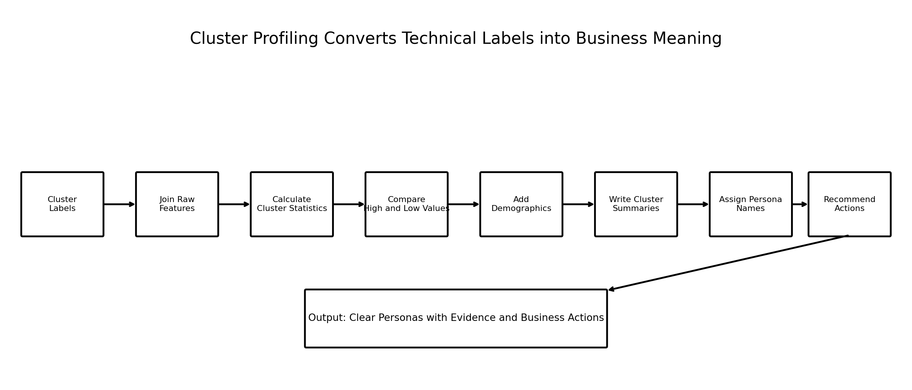

### Image Explanation

The process begins with technical labels and ends with business-ready personas:

1. Attach labels to users
2. Join behavioral and demographic data
3. Calculate cluster statistics
4. Compare high and low values
5. Write summaries
6. Assign names
7. Recommend actions

Cluster profiling is the bridge between Machine Learning output and business understanding.

---

# 4. Why Cluster Profiling Is Required

A clustering algorithm knows only numerical patterns.

It does not know:

```text
Cluster 3 = Power Streamers
```

The analyst must study the evidence.

Without profiling:

- Cluster labels remain meaningless
- Stakeholders cannot understand the model
- Persona names become guesses
- Business actions may be inappropriate
- Similar clusters may receive different names
- Unstable clusters may be accepted accidentally

---

# 5. Cluster Labels vs Cluster Profiles

| Cluster Label | Cluster Profile |
|---|---|
| Technical identifier | Statistical and business description |
| Example: `2` | High activity, high loyalty |
| Arbitrary number | Evidence-based meaning |
| May change order between runs | Should preserve meaning when stable |
| Used by model | Used by analysts and business teams |

Important:

```text
Cluster 3 is not better than Cluster 1.
```

Cluster numbers are arbitrary.

---

# 6. Data Required for Profiling

## Behavioral Data

Examples:

- Listening minutes
- Sessions
- Active days
- Session duration
- Skip rate
- Advertisement skipping
- Repeat rates
- Genre diversity
- Popularity preference

## Demographic Data

Examples:

- Age
- Country
- City tier
- Device type
- Subscription tenure

## Model Output

For K-Means:

```text
user_id
cluster
```

For GMM:

```text
user_id
gmm_component
component probabilities
membership confidence
```

---

# 7. Attaching Cluster Labels

The safest method is to join using `user_id`.

```python
profile_data = behavior.merge(
    cluster_labels,
    on="user_id",
    how="inner",
    validate="one_to_one"
)
```

Then join demographics:

```python
profile_data = profile_data.merge(
    demographics,
    on="user_id",
    how="left",
    validate="one_to_one"
)
```

Do not rely only on DataFrame row order unless it is strictly controlled and validated.

---

# 8. Cluster-Level Averages

The mean gives a simple cluster center for each feature.

```python
cluster_means = (
    profile_data
    .groupby("cluster")[features]
    .mean()
)
```

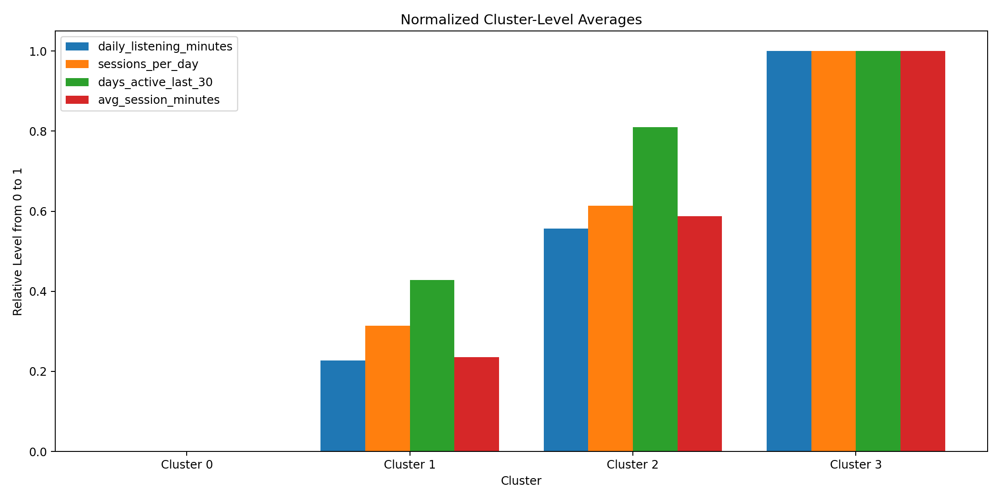

### Image Explanation

- Each group of bars represents one cluster.
- The features are normalized only for visual comparison.
- Higher bars indicate stronger relative feature levels.
- Cluster 3 is strongest on the main engagement dimensions in this illustrative example.
- Original units should still be reported in tables.

---

## Example

| Cluster | Listening Minutes | Sessions | Active Days |
|---:|---:|---:|---:|
| 0 | 38 | 1.4 | 8 |
| 1 | 82 | 3.6 | 17 |
| 2 | 146 | 5.7 | 25 |
| 3 | 232 | 8.4 | 29 |

Possible interpretation:

```text
Cluster 0 → Low engagement
Cluster 3 → Very high engagement
```

---

# 9. Why Mean Alone Is Not Enough

The mean can be influenced by extreme values.

Two clusters can have the same mean but different distributions.

Example:

```text
Cluster A:
Most users listen around 100 minutes

Cluster B:
Half listen 20 minutes
Half listen 180 minutes
```

Both can have a similar mean.

Therefore, include:

- Median
- Standard deviation
- Percentiles
- Minimum and maximum
- Count
- Missing percentage

---

# 10. Median and Percentiles

## Median

```python
cluster_medians = (
    profile_data
    .groupby("cluster")[features]
    .median()
)
```

## Percentiles

```python
cluster_percentiles = (
    profile_data
    .groupby("cluster")[features]
    .quantile(
        [0.25, 0.50, 0.75]
    )
)
```

Recommended profile:

```text
Mean
Median
P25
P75
```

This reveals both center and spread.

---

# 11. Feature Comparison

Cluster profiling compares the same feature across all clusters.

Questions:

- Which cluster has the highest listening?
- Which has the lowest activity?
- Which has the highest skip rate?
- Which has the strongest repeat behavior?
- Which explores the most genres?
- Which shows the longest tenure?

A feature is meaningful through comparison.

---

# 12. Absolute Comparison

Absolute comparison uses original units.

Example:

```text
Cluster 3:
232 listening minutes/day
8.4 sessions/day
29 active days
13% skip rate
```

Benefits:

- Easy for business stakeholders
- Supports operational thresholds
- Supports campaign design
- Preserves natural meaning

---

# 13. Relative Comparison

Relative comparison evaluates a cluster against:

- Overall population
- Other clusters
- Standardized average
- Rank position

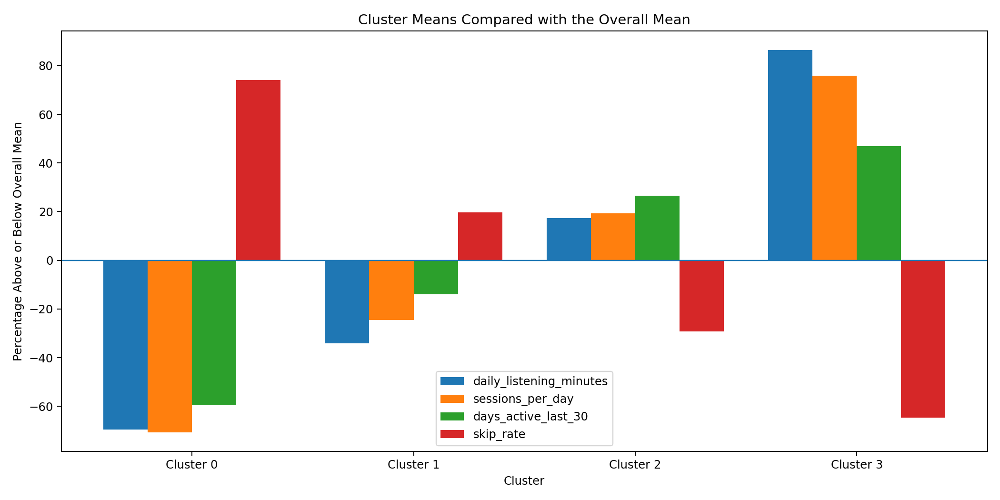

### Image Explanation

- Zero represents the overall population mean.
- Positive values mean the cluster is above the overall mean.
- Negative values mean it is below the overall mean.
- Relative comparison makes cluster differences easier to explain.
- Skip rate should be interpreted carefully because higher friction is usually negative.

---

## Percentage Difference

```python
relative_difference = (
    cluster_means
    .div(overall_means)
    .sub(1)
    .mul(100)
)
```

Example:

```text
Listening minutes:
Cluster 3 = 82% above overall average
```

---

# 14. Standardized Cluster Profiles

A standardized profile expresses cluster means in standard-deviation units.

```text
0
=
Overall average

+1
=
One standard deviation above average

-1
=
One standard deviation below average
```

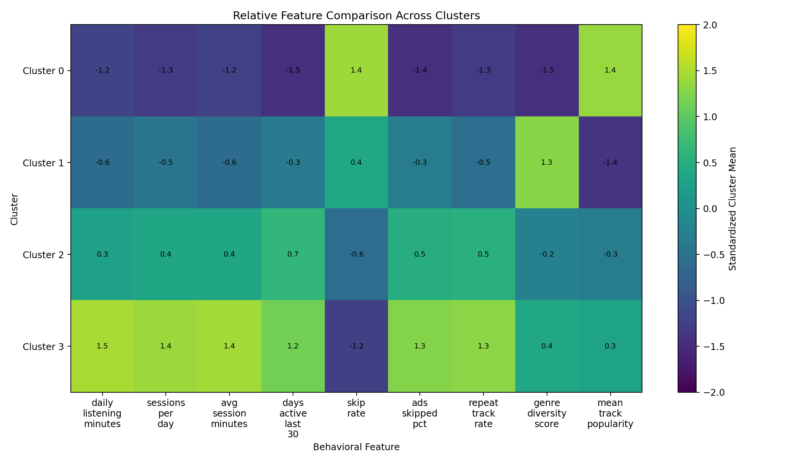

### Image Explanation

- Positive values indicate above-average cluster means.
- Negative values indicate below-average means.
- The heatmap helps compare many features at once.
- Standardized values are useful for relative comparison.
- Original units remain necessary for business explanation.

---

# 15. High and Low Values

A cluster summary should identify the most important high and low features.

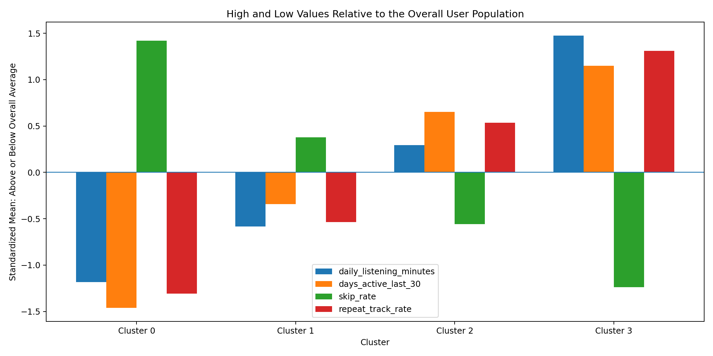

### Image Explanation

- Values above zero are above the overall population mean.
- Values below zero are below the mean.
- Cluster 0 shows low listening, low activity, and high skip behavior.
- Cluster 3 shows high engagement and lower skip behavior.
- The pattern is more important than one isolated feature.

---

## Ranking High and Low Features

```python
profile_row = (
    standardized_profile
    .loc[cluster_id]
)

highest = (
    profile_row
    .sort_values(
        ascending=False
    )
    .head(3)
)

lowest = (
    profile_row
    .sort_values()
    .head(3)
)
```

---

# 16. Behavioral Characteristics

Behavioral characteristics explain what users do.

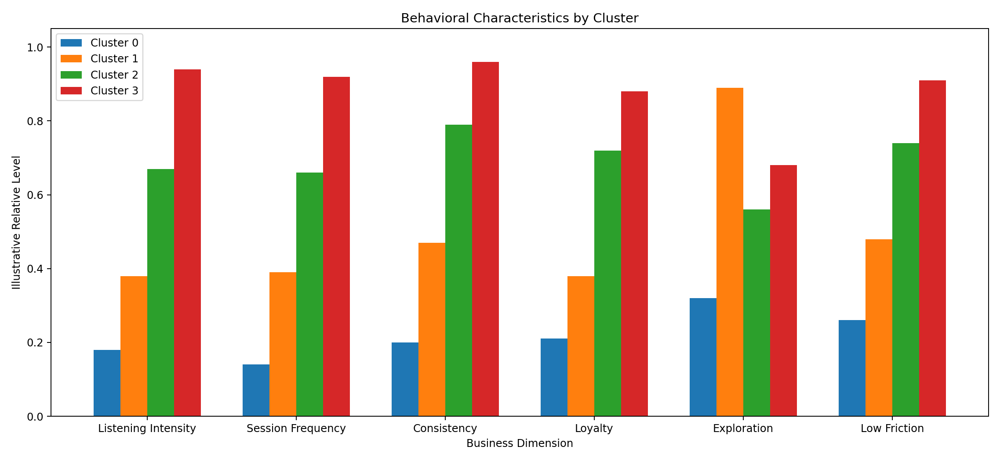

### Image Explanation

The chart compares six business dimensions:

- Listening intensity
- Session frequency
- Consistency
- Loyalty
- Exploration
- Low friction

The example shows that clusters can differ on more than engagement alone.

---

# 17. Engagement Characteristics

Useful engagement features:

```text
daily_listening_minutes
sessions_per_day
avg_session_minutes
days_active_last_30
```

Possible summary:

```text
High listening intensity
Frequent platform visits
Long sessions
Nearly daily activity
```

Avoid repeating raw values without interpretation.

---

# 18. Loyalty Characteristics

Useful loyalty features:

```text
repeat_track_rate
repeat_artist_rate
liked_songs_pct
playlists_followed
artists_followed
```

Possible summaries:

```text
Strong preference for familiar content
High repeat behavior
High explicit following
```

---

# 19. Friction Characteristics

Useful friction features:

```text
skip_rate
ads_skipped_pct
median_gap_minutes_between_plays
```

Interpretation requires care.

High skip rate can mean:

- Recommendation mismatch
- Strong user selectivity
- Active exploration
- Short attention

Do not conclude dissatisfaction from one feature alone.

---

# 20. Exploration Characteristics

Useful exploration features:

```text
genre_diversity_score
std_energy
std_valence
std_tempo
mean_track_popularity
```

Possible summary:

```text
Broad genre exploration
Varied audio preferences
Moderate mainstream preference
```

---

# 21. Demographic Characteristics

Demographics provide context.

They should not replace behavioral meaning.

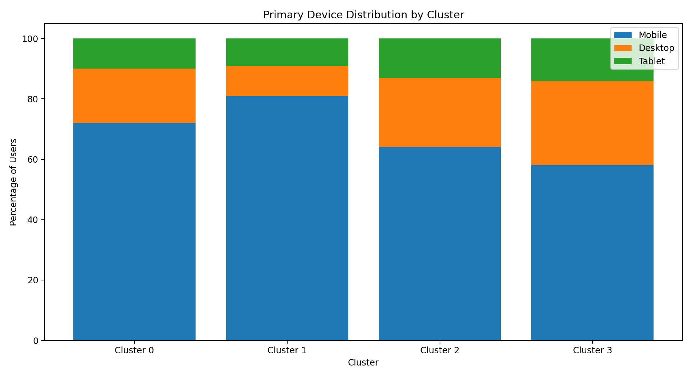

### Image Explanation

- Each bar shows device percentages within a cluster.
- Mobile is the largest device category in the illustrative data.
- Some clusters show stronger desktop usage.
- Device differences can guide channel and experience design.

---

# 22. Age and Tenure

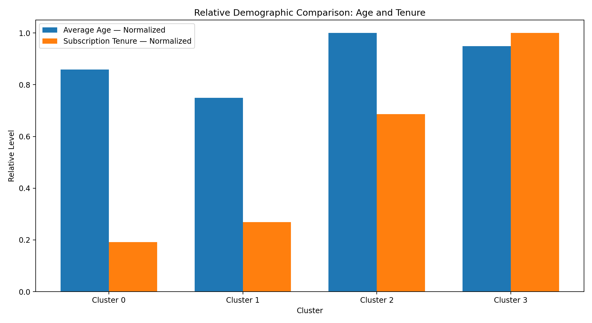

### Image Explanation

- Age and tenure use different units, so the chart normalizes them.
- Cluster 3 has the strongest relative tenure.
- Cluster 1 has a younger average profile in the example.
- Business reporting should show the actual average and median values.

Questions:

- Is the cluster newer or established?
- Is it younger or older relative to others?
- Does tenure support the loyalty interpretation?

---

# 23. Country and City Tier

Useful summaries:

```text
Top country
Top three countries
Country distribution
City-tier percentages
Cluster share within each country
```

Do not use only the mode.

The top country may represent a small percentage in a highly diverse cluster.

---

# 24. Device Characteristics

Useful device metrics:

- Mobile percentage
- Desktop percentage
- Tablet percentage
- Primary device
- Device diversity

Business uses:

- Notification design
- Home-page layout
- Mobile campaign strategy
- Desktop listening experience

---

# 25. Cluster-Size Distribution

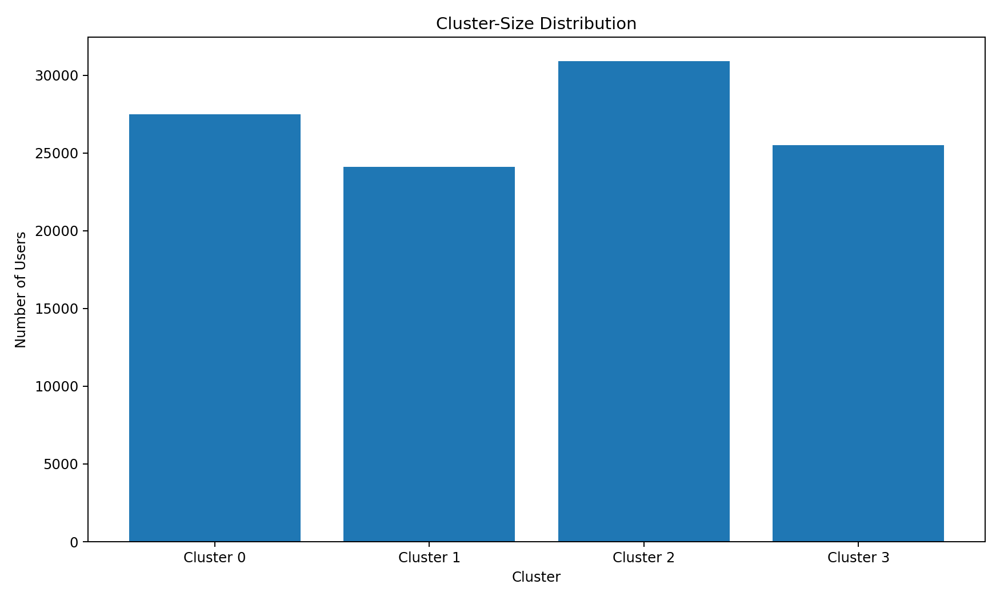

### Image Explanation

- Each bar shows the number of users in one cluster.
- Cluster size provides business scale.
- A small cluster may still be valuable.
- A large cluster may require further sub-segmentation.

Include both:

```text
User count
User percentage
```

---

# 26. Writing Cluster Summaries

A strong cluster summary should include:

1. Cluster size
2. Main behavioral characteristics
3. Important high values
4. Important low values
5. Demographic context
6. Business meaning
7. Recommended action
8. Limitations or uncertainty

Avoid writing a list of every feature.

Focus on the dominant pattern.

---

# 27. Cluster Summary Template

```text
Cluster ID:
Cluster Size:
Suggested Persona Name:

Primary Characteristics:
- 
- 
- 

High Features:
- 
- 

Low Features:
- 
- 

Demographic Context:
- 

Business Interpretation:
- 

Recommended Actions:
- 

Risks and Limitations:
-
```

A reusable template is included in:

```text
cluster_summary_template.md
```

---

# 28. Cluster Naming

Cluster naming converts a profile into a short, memorable business identity.

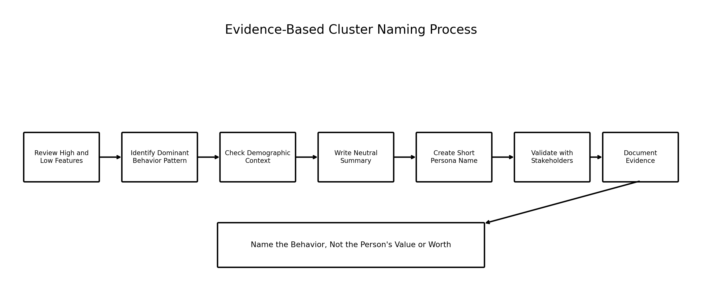

### Image Explanation

A good naming process:

1. Reviews high and low features
2. Identifies the main behavior
3. Checks demographic context
4. Writes a neutral summary
5. Creates a short name
6. Validates with stakeholders
7. Documents the evidence

---

# 29. Good and Poor Cluster Names

## Good Names

```text
Power Streamers
Casual Snackers
Exploratory Samplers
Habitual Loyalists
High-Frequency Short-Session Users
```

These names describe behavior.

## Poor Names

```text
Good Users
Bad Users
Lazy Users
Cheap Users
Difficult Users
```

These names are judgmental and not analytically useful.

---

# 30. Neutral and Ethical Naming

Persona names should:

- Describe behavior
- Avoid insulting language
- Avoid assumptions about personality
- Avoid protected-attribute stereotypes
- Avoid presenting correlation as causation
- Avoid implying business value equals human value

Use:

```text
Low-Engagement New Users
```

instead of:

```text
Unimportant Users
```

---

# 31. Business Interpretation

Business interpretation answers:

```text
Why does this cluster matter?
```

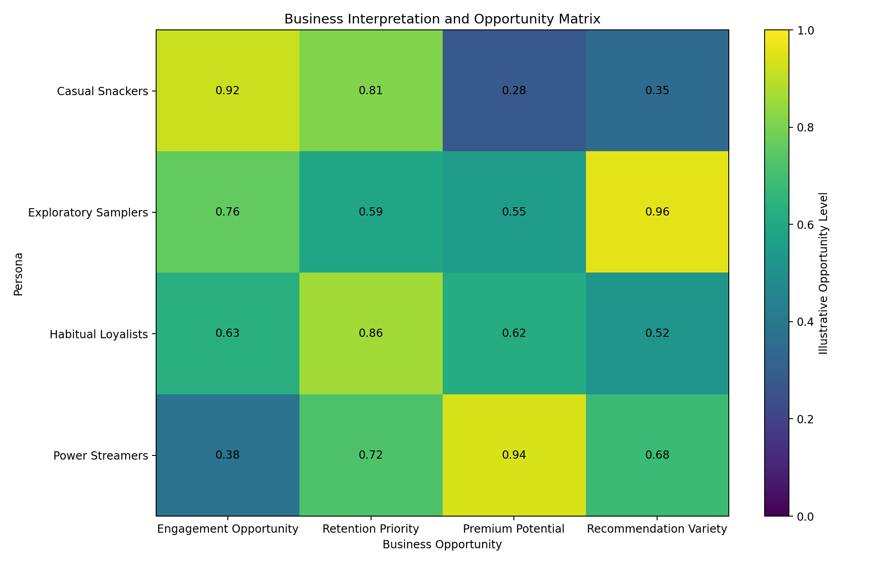

### Image Explanation

- Rows represent personas.
- Columns represent possible business opportunities.
- Higher values indicate stronger illustrative opportunity.
- Different personas require different actions.
- The matrix is a decision-support view, not a model output.

---

# 32. Business Actions

Possible actions:

## Casual Snackers

- Re-engagement playlists
- Simple recommendations
- Reduced notification frequency
- Lightweight onboarding

## Exploratory Samplers

- Discovery playlists
- New-release recommendations
- Cross-genre journeys
- Premium trial messaging

## Habitual Loyalists

- Artist updates
- Loyalty experiences
- Personalized repeat mixes
- Retention rewards

## Power Streamers

- Premium conversion
- High-quality listening features
- Exclusive experiences
- Advanced personalization

Actions must be validated through business experiments.

---

# 33. Creating Spotify Personas

A persona should contain:

- Name
- One-line summary
- Size
- Core behavior
- Demographic context
- Needs
- Friction
- Opportunity
- Recommended action
- Evidence
- Confidence
- Risks

A persona template is included in:

```text
persona_template.md
```

---

# 34. Example Cluster Profiles

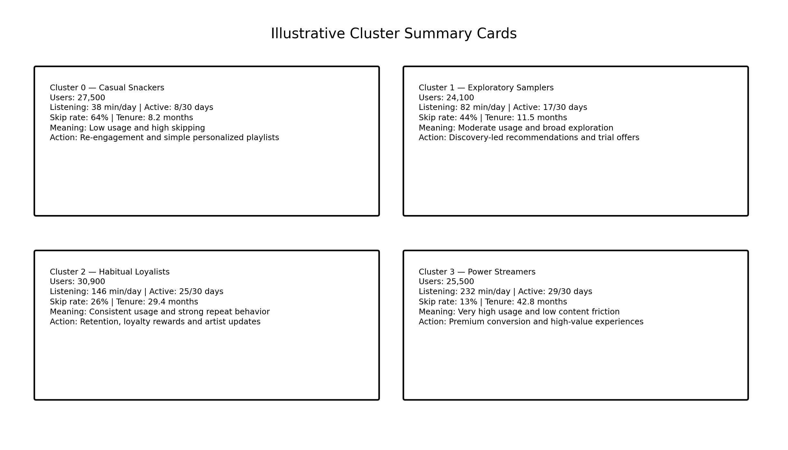

### Image Explanation

Each card includes:

- Cluster ID
- Persona name
- User count
- Listening level
- Active days
- Skip rate
- Subscription tenure
- Primary meaning
- Business action

The values are illustrative and not official Spotify statistics.

---

# 35. K-Means Profiling

K-Means provides:

```text
Hard cluster label
Cluster centroid
```

Recommended profiling:

- User count
- Original-unit centroid
- Mean
- Median
- Percentiles
- Standardized profile
- Demographics

Centroids are useful, but full distributions should also be reviewed.

---

# 36. GMM Profiling

GMM provides:

- Hard component label
- Membership probabilities
- Confidence
- Component means
- Covariances
- Mixture weights

Include:

```text
Mean confidence
Median confidence
P10 confidence
Boundary-user percentage
Top competing component
```

A GMM persona may be less sharply separated than a K-Means persona.

That uncertainty should be documented.

---

# 37. Boundary-User Profiling

Boundary users have mixed probabilities.

Example:

```text
Component 0 = 0.51
Component 1 = 0.46
```

Analyze:

- Their behavior averages
- Most common component pair
- Confidence distribution
- Whether they represent transitions
- Whether blended business actions are appropriate

Do not force absolute certainty in interpretation.

---

# 38. Profile Validation

Validate every profile:

- Row count matches model output
- No missing cluster labels
- All clusters are represented
- Cluster counts match evaluation reports
- Feature units are correct
- Standardized and original values are not confused
- Demographic joins are one-to-one
- Percentage columns sum correctly
- Names match the evidence

---

# 39. Profile Stability

Profiles should remain similar across:

- Random seeds
- Samples
- Time periods
- Retraining
- Small preprocessing changes

Compare:

- Cluster sizes
- Mean profiles
- Median profiles
- Persona meanings
- Business actions

A technically stable label assignment with unstable business meaning is still a problem.

---

# 40. Common Profiling Mistakes

## Mistake 1: Naming from One Feature

```text
High listening
→ Power Streamer
```

without checking activity, sessions, skipping, and loyalty.

## Mistake 2: Using Only Means

Means can hide spread and outliers.

## Mistake 3: Confusing Scaled and Original Units

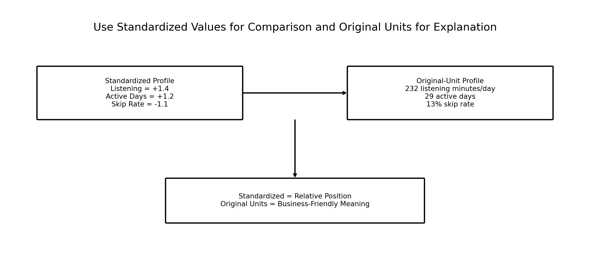

### Image Explanation

- Standardized values support relative comparison.
- Original values support business explanation.
- A standardized value of `+1.4` does not mean 1.4 minutes.
- Both views should be retained.

## Mistake 4: Judgmental Names

Persona names should describe patterns neutrally.

## Mistake 5: Ignoring Cluster Size

A meaningful pattern may represent only a tiny group.

## Mistake 6: Treating Demographics as Causes

A cluster may have a younger average age, but age may not cause the behavior.

## Mistake 7: Hiding GMM Uncertainty

Soft assignments should be reported when relevant.

---

# 41. End-to-End Spotify Profiling Workflow

```text
Load Cluster Labels
        ↓
Validate user_id
        ↓
Join Behavioral Data
        ↓
Join Demographics
        ↓
Calculate Counts and Percentages
        ↓
Calculate Mean, Median and Percentiles
        ↓
Create Standardized Profile
        ↓
Identify High and Low Features
        ↓
Write Behavioral Summary
        ↓
Add Demographic Context
        ↓
Create Persona Name
        ↓
Recommend Business Actions
        ↓
Validate and Document
```

---

# 42. Reusable Python Implementation

Included scripts:

```text
examples/spotify_cluster_profiling.py
examples/cluster_profile_visualizations.py
examples/cluster_naming_framework.py
examples/persona_summary_generator.py
```

They provide:

- Label joins
- Behavioral summaries
- Demographic summaries
- Standardized profiles
- Relative-to-overall comparisons
- High and low feature extraction
- Cluster-size reports
- Automated draft summaries
- Persona evidence tables
- Profile visualizations

---

# 43. Profiling Checklist

## Data

- [ ] `user_id` is unique
- [ ] Cluster labels are complete
- [ ] Behavior join is one-to-one
- [ ] Demographic join is one-to-one
- [ ] Cluster counts match the model report

## Statistics

- [ ] Mean calculated
- [ ] Median calculated
- [ ] P25 calculated
- [ ] P75 calculated
- [ ] Standard deviation calculated
- [ ] Cluster count calculated
- [ ] Cluster percentage calculated

## Comparison

- [ ] Absolute profile created
- [ ] Relative-to-overall profile created
- [ ] Standardized profile created
- [ ] High features identified
- [ ] Low features identified
- [ ] Cluster ranks reviewed

## Interpretation

- [ ] Behavioral characteristics written
- [ ] Demographic context written
- [ ] Cluster size included
- [ ] Persona name is neutral
- [ ] Persona name matches evidence
- [ ] Business action documented
- [ ] Risks and uncertainty documented

## Validation

- [ ] GMM confidence reviewed when applicable
- [ ] Stability reviewed
- [ ] Stakeholder validation completed
- [ ] Persona mapping versioned

---

# 44. Important Terminology

| Term | Meaning |
|---|---|
| Cluster Profiling | Describing and interpreting clusters |
| Cluster-Level Average | Mean feature value within a cluster |
| Median Profile | Middle feature value within a cluster |
| Percentile Profile | Distribution points such as P25 and P75 |
| Absolute Comparison | Comparison using original units |
| Relative Comparison | Comparison with overall or other clusters |
| Standardized Profile | Cluster means expressed in standard deviations |
| High Feature | Above-average cluster characteristic |
| Low Feature | Below-average cluster characteristic |
| Behavioral Characteristic | Description of user activity |
| Demographic Characteristic | Description of user context |
| Cluster Summary | Concise evidence-based description |
| Cluster Name | Short technical or business label |
| Persona | Business-friendly segment representation |
| Business Interpretation | Meaning of the cluster for decisions |
| Actionability | Ability to take a distinct action |
| Boundary User | User with mixed GMM membership |
| Membership Confidence | Highest GMM component probability |
| Profile Stability | Consistency of cluster meaning |
| Persona Mapping | Cluster-to-name documentation |

---

# 45. Interview Questions and Answers

## 1. What is cluster profiling?

Cluster profiling is the process of describing clusters using statistics, behavior, demographics, and business context.

---

## 2. Why is cluster profiling required?

Technical labels do not explain who the users are or what action the business should take.

---

## 3. What is a cluster-level average?

The mean feature value for users in one cluster.

---

## 4. Why is mean alone insufficient?

It can be influenced by outliers and can hide distribution differences.

---

## 5. Which statistics should be used?

Mean, median, percentiles, standard deviation, count and percentage.

---

## 6. What is absolute comparison?

Comparing clusters using original units.

---

## 7. What is relative comparison?

Comparing a cluster with the overall mean or other clusters.

---

## 8. What is a standardized profile?

Cluster means represented in standard-deviation units.

---

## 9. How do you identify high and low features?

Rank standardized or relative cluster means.

---

## 10. What are behavioral characteristics?

Patterns describing what users do.

---

## 11. What are demographic characteristics?

Patterns describing age, country, city tier, device and tenure.

---

## 12. Should demographics define the persona?

Usually behavior should define the persona, while demographics add context.

---

## 13. Why review cluster size?

It shows the scale and practical importance of the segment.

---

## 14. What is a cluster summary?

A concise description of size, behavior, demographics, meaning and action.

---

## 15. How do you name a cluster?

Use the dominant evidence-based behavior pattern.

---

## 16. Are cluster labels ordered?

No.

---

## 17. What makes a good persona name?

It is short, neutral, memorable and supported by evidence.

---

## 18. What makes a poor persona name?

It is judgmental, vague, misleading or unsupported.

---

## 19. What is business interpretation?

Explaining why the cluster matters and how it can be used.

---

## 20. What is actionability?

The ability to take a distinct business action for the cluster.

---

## 21. How do you profile K-Means clusters?

Use labels, centroids, means, medians, percentiles and demographics.

---

## 22. How do you profile GMM components?

Use hard labels, probabilities, confidence, means, covariance and weights.

---

## 23. What is a boundary user?

A user with similar probabilities for multiple GMM components.

---

## 24. Why keep original units?

They are easier for business stakeholders to understand.

---

## 25. Why keep standardized values?

They make different features comparable.

---

## 26. How do you validate a cluster profile?

Check joins, counts, units, summaries, evidence and stability.

---

## 27. What is profile stability?

Consistency of the cluster's statistical and business meaning across reruns or time.

---

## 28. Why should one feature not determine the name?

A persona should represent a pattern across multiple relevant features.

---

## 29. Can demographic association prove causation?

No.

---

## 30. Explain the Spotify cluster-profiling workflow.

Join labels, calculate profiles, compare features, identify characteristics, add demographics, name personas, recommend actions, and validate.

---

# 46. Module Summary

In this module, we learned:

- Cluster profiling converts technical labels into business meaning
- Labels must be joined safely using `user_id`
- Means provide a useful starting point
- Medians and percentiles reveal distribution structure
- Absolute comparison uses original units
- Relative comparison uses overall or cluster benchmarks
- Standardized profiles help compare different feature units
- High and low features reveal the dominant pattern
- Behavioral characteristics should define the persona
- Demographics add context
- Cluster size shows business scale
- Strong summaries focus on the most important pattern
- Cluster names must be evidence-based and neutral
- Business interpretation explains why the cluster matters
- Actions should be specific to the persona
- K-Means and GMM require different profiling details
- GMM uncertainty should be retained
- Profiles must be validated for accuracy and stability

---

# 47. Quick Reference Cheat Sheet

## Join Labels

```python
profile_data = behavior.merge(
    labels,
    on="user_id",
    validate="one_to_one"
)
```

## Means and Medians

```python
means = (
    profile_data
    .groupby("cluster")[features]
    .mean()
)

medians = (
    profile_data
    .groupby("cluster")[features]
    .median()
)
```

## Relative Profile

```python
relative_pct = (
    means
    .div(overall_means)
    .sub(1)
    .mul(100)
)
```

## Standardized Profile

```text
Positive → Above average
Negative → Below average
Zero     → Near average
```

## Summary Structure

```text
Size
Behavior
High features
Low features
Demographics
Name
Meaning
Action
Risk
```

---

# 48. What Comes Next?

## Module 14 — Persona Creation and Business Recommendations

The next module can cover:

- Persona definition
- Persona components
- Persona naming rules
- Persona cards
- Needs and pain points
- Opportunities
- Recommendations
- Premium-conversion strategies
- Retention strategies
- Advertisement strategies
- Persona validation
- Executive presentation
