# Module 14 — Segmentation and Persona Creation

> A detailed beginner-friendly guide to segmentation, customer segmentation, personas, the difference between clusters, segments and personas, translating technical cluster labels into business names, creating behavioral personas, documenting persona characteristics, needs, risks and opportunities, and building four illustrative Spotify personas.

---

## Table of Contents

1. [Module Overview](#1-module-overview)
2. [Learning Objectives](#2-learning-objectives)
3. [What Is Segmentation?](#3-what-is-segmentation)
4. [Why Segmentation Is Required](#4-why-segmentation-is-required)
5. [What Is Customer Segmentation?](#5-what-is-customer-segmentation)
6. [Types of Customer Segmentation](#6-types-of-customer-segmentation)
7. [Behavioral Segmentation](#7-behavioral-segmentation)
8. [Demographic Segmentation](#8-demographic-segmentation)
9. [Geographic Segmentation](#9-geographic-segmentation)
10. [Value-Based Segmentation](#10-value-based-segmentation)
11. [Lifecycle Segmentation](#11-lifecycle-segmentation)
12. [What Is a Persona?](#12-what-is-a-persona)
13. [Segment vs Persona](#13-segment-vs-persona)
14. [Cluster vs Segment](#14-cluster-vs-segment)
15. [Cluster vs Segment vs Persona](#15-cluster-vs-segment-vs-persona)
16. [Translating Cluster Numbers into Business Names](#16-translating-cluster-numbers-into-business-names)
17. [Evidence Required Before Naming](#17-evidence-required-before-naming)
18. [Behavioral Personas](#18-behavioral-personas)
19. [Persona Characteristics](#19-persona-characteristics)
20. [Persona Needs](#20-persona-needs)
21. [Persona Risks](#21-persona-risks)
22. [Persona Opportunities](#22-persona-opportunities)
23. [Persona Business Actions](#23-persona-business-actions)
24. [Persona Anatomy](#24-persona-anatomy)
25. [Persona Naming Rules](#25-persona-naming-rules)
26. [Neutral and Ethical Personas](#26-neutral-and-ethical-personas)
27. [Possible Spotify Personas](#27-possible-spotify-personas)
28. [Persona 1 — Casual Snackers](#28-persona-1--casual-snackers)
29. [Persona 2 — Exploratory Samplers](#29-persona-2--exploratory-samplers)
30. [Persona 3 — Habitual Loyalists](#30-persona-3--habitual-loyalists)
31. [Persona 4 — Power Streamers](#31-persona-4--power-streamers)
32. [Persona Comparison](#32-persona-comparison)
33. [Persona Distribution](#33-persona-distribution)
34. [Persona Opportunity Matrix](#34-persona-opportunity-matrix)
35. [Using Personas for Recommendations](#35-using-personas-for-recommendations)
36. [Using Personas for Retention](#36-using-personas-for-retention)
37. [Using Personas for Premium Conversion](#37-using-personas-for-premium-conversion)
38. [Using Personas for Advertising](#38-using-personas-for-advertising)
39. [Using Personas for Product Experience](#39-using-personas-for-product-experience)
40. [Persona Validation](#40-persona-validation)
41. [Persona Stability and Refresh](#41-persona-stability-and-refresh)
42. [Common Persona Mistakes](#42-common-persona-mistakes)
43. [End-to-End Persona Creation Workflow](#43-end-to-end-persona-creation-workflow)
44. [Reusable Python Implementation](#44-reusable-python-implementation)
45. [Persona Creation Checklist](#45-persona-creation-checklist)
46. [Important Terminology](#46-important-terminology)
47. [Interview Questions and Answers](#47-interview-questions-and-answers)
48. [Module Summary](#48-module-summary)
49. [Quick Reference Cheat Sheet](#49-quick-reference-cheat-sheet)
50. [What Comes Next?](#50-what-comes-next)

---

# 1. Module Overview

Segmentation divides a large and diverse population into smaller groups with meaningful similarities.

For Spotify:

```text
All Users
    ↓
Behavioral Clusters
    ↓
Business Segments
    ↓
Human-Readable Personas
    ↓
Targeted Actions
```

This module focuses on converting technical clustering output into useful business personas.

Possible illustrative Spotify personas:

- Casual Snackers
- Exploratory Samplers
- Habitual Loyalists
- Power Streamers

These names are examples. The final names must be supported by the selected model's actual profiles.

---

# 2. Learning Objectives

By the end of this module, students should be able to:

- Define segmentation
- Define customer segmentation
- Explain why segmentation is required
- Explain behavioral segmentation
- Explain demographic segmentation
- Define a persona
- Differentiate segment and persona
- Differentiate cluster and segment
- Differentiate cluster, segment and persona
- Translate cluster numbers into business names
- Create behavioral personas
- Document persona characteristics
- Identify persona needs
- Identify persona risks
- Identify persona opportunities
- Define business actions for each persona
- Apply neutral and ethical naming rules
- Create persona cards
- Validate personas using cluster evidence
- Refresh personas over time

---

# 3. What Is Segmentation?

Segmentation is the process of dividing a broad population into smaller groups that share meaningful characteristics.

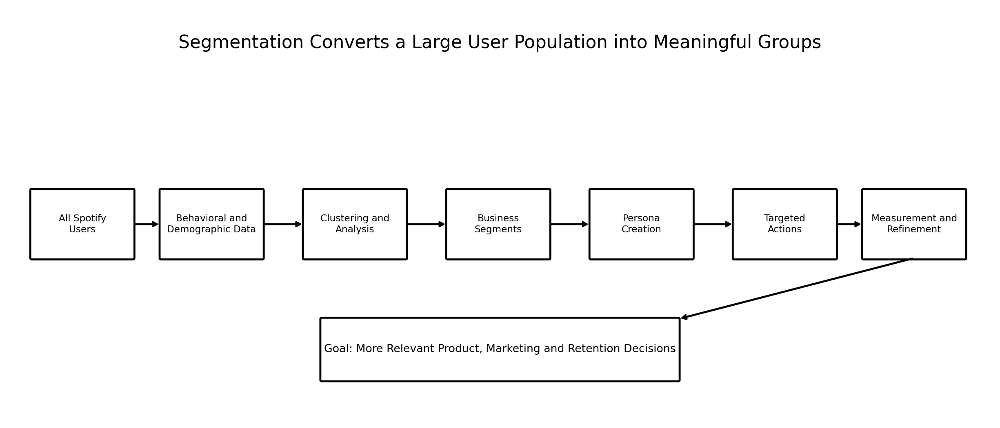

### Image Explanation

- The process starts with the full Spotify user population.
- Behavioral and demographic data describe the users.
- Clustering and analysis identify useful differences.
- Business segments are created from those differences.
- Personas make the segments easier to understand.
- Targeted actions are designed and measured.
- Segmentation is refined over time.

---

# 4. Why Segmentation Is Required

Not all users behave in the same way.

Some may:

- Listen occasionally
- Use very short sessions
- Explore many genres
- Repeat the same artists
- Skip frequently
- Listen almost every day
- Show high advertisement friction
- Demonstrate strong Premium potential

One strategy for every user can lead to:

- Generic recommendations
- Irrelevant Premium messaging
- Poor retention campaigns
- Weak engagement
- Over-notification
- Missed business opportunities

Segmentation helps create different strategies for different groups.

---

# 5. What Is Customer Segmentation?

Customer segmentation is the process of grouping customers or users according to shared characteristics that are useful for business decisions.

A customer segment should be:

- Measurable
- Distinct
- Stable enough to use
- Large enough or valuable enough to matter
- Understandable
- Actionable
- Relevant to the business goal

---

# 6. Types of Customer Segmentation

Common segmentation types:

- Behavioral
- Demographic
- Geographic
- Value-based
- Lifecycle
- Needs-based
- Attitudinal

The Spotify project primarily uses behavioral segmentation, with demographics added as context.

---

# 7. Behavioral Segmentation

Behavioral segmentation groups users based on what they do.

Possible features:

```text
daily_listening_minutes
sessions_per_day
avg_session_minutes
days_active_last_30
skip_rate
ads_skipped_pct
repeat_track_rate
repeat_artist_rate
genre_diversity_score
```

Behavioral segmentation is useful because it describes actual product usage.

---

# 8. Demographic Segmentation

Demographic segmentation uses contextual characteristics such as:

- Age
- Device type
- Subscription tenure
- City tier
- Country

Demographics should usually support the persona rather than completely define it.

Avoid assuming:

```text
Age causes the listening behavior.
```

Demographic association is not proof of causation.

---

# 9. Geographic Segmentation

Geographic segmentation groups users by:

- Country
- Region
- City tier
- Language market
- Urban or non-urban context

Possible uses:

- Local content recommendations
- Market-specific campaigns
- Regional product design
- Language-sensitive messaging

---

# 10. Value-Based Segmentation

Value-based segmentation groups users by expected or observed business value.

Possible indicators:

- Premium conversion probability
- Subscription value
- Engagement intensity
- Advertisement value
- Retention potential
- Cost to serve

Value must not be confused with human worth.

---

# 11. Lifecycle Segmentation

Lifecycle segmentation groups users according to their relationship stage.

Examples:

- New users
- Activated users
- Growing users
- Established users
- At-risk users
- Churned users
- Reactivated users

Lifecycle and behavioral segments can be combined.

Example:

```text
New Casual Snacker
Established Power Streamer
At-Risk Habitual Loyalist
```

---

# 12. What Is a Persona?

A persona is a human-readable representation of a segment.

A persona combines:

- Name
- One-line description
- Size
- Key behaviors
- Needs
- Risks
- Opportunities
- Context
- Recommended actions
- Evidence
- Limitations

A persona is not one real person.

It represents a pattern found across many users.

---

# 13. Segment vs Persona

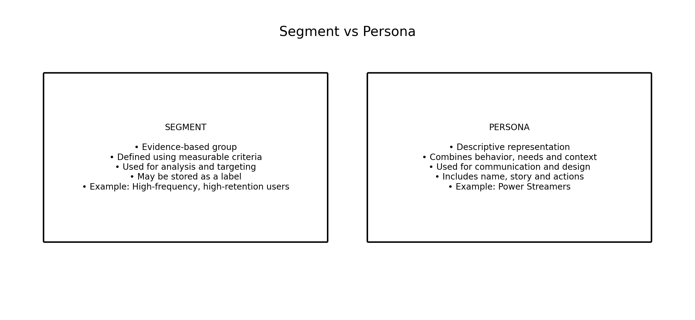

### Image Explanation

A segment is:

- Analytical
- Defined by measurable criteria
- Used for targeting and reporting

A persona is:

- Descriptive
- Designed for communication
- Used for product, marketing and decision-making

Example:

```text
Segment:
High-frequency, high-retention users

Persona:
Power Streamers
```

---

# 14. Cluster vs Segment

A cluster is a model-generated group.

A segment is a business interpretation of a useful group.

Example:

```text
Cluster 2
        ↓
High-repeat, high-consistency users
        ↓
Loyal listener segment
```

A cluster should become a segment only when it is:

- Stable
- Interpretable
- Distinct
- Relevant
- Actionable

---

# 15. Cluster vs Segment vs Persona

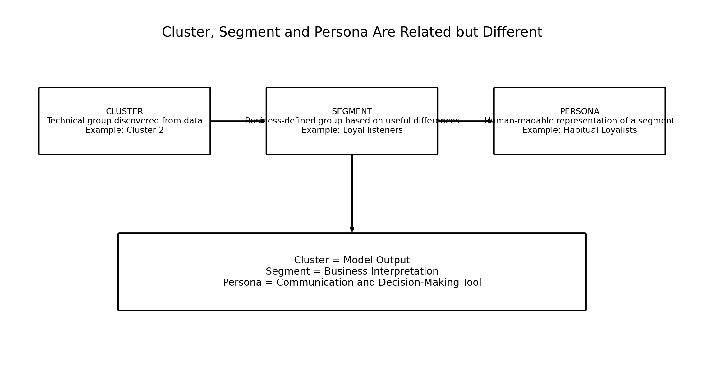

### Image Explanation

- Cluster is the technical output.
- Segment is the business-defined group.
- Persona is the human-readable representation.
- The process moves from data to interpretation and communication.

---

# 16. Translating Cluster Numbers into Business Names

Cluster numbers have no business meaning.

```text
Cluster 0
Cluster 1
Cluster 2
Cluster 3
```

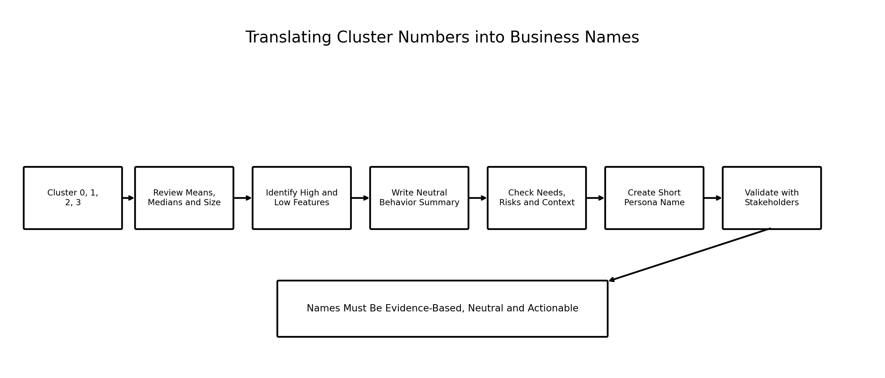

### Image Explanation

The naming process:

1. Reviews profile statistics
2. Identifies high and low values
3. Writes a neutral behavioral summary
4. Reviews needs, risks and context
5. Creates a short persona name
6. Validates the name with stakeholders

---

# 17. Evidence Required Before Naming

Before assigning a persona name, review:

- Cluster size
- Mean values
- Median values
- Percentiles
- Standardized profile
- Relative-to-overall profile
- Demographics
- Stability
- GMM confidence when applicable
- Business opportunities

Avoid naming a cluster from only one feature.

---

# 18. Behavioral Personas

A behavioral persona is mainly defined by product usage patterns.

Possible dimensions:

- Listening intensity
- Session frequency
- Activity consistency
- Content exploration
- Content loyalty
- Content friction
- Advertisement friction
- Premium potential

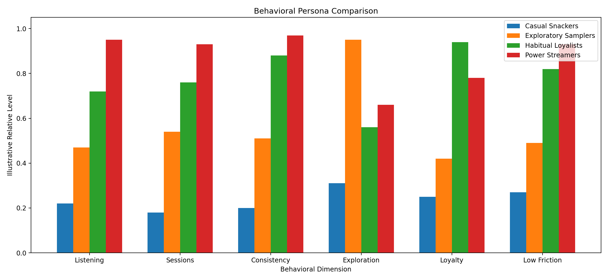

### Image Explanation

- Every persona has a different pattern.
- Casual Snackers are low on engagement dimensions.
- Exploratory Samplers are strongest on exploration.
- Habitual Loyalists are strongest on loyalty and consistency.
- Power Streamers are strongest on listening intensity, frequency and low friction.

The values are illustrative.

---

# 19. Persona Characteristics

Persona characteristics describe the most important evidence.

A persona should include:

- Core behavior
- High features
- Low features
- Typical activity
- Session pattern
- Content behavior
- Friction pattern
- Demographic context
- Lifecycle context
- Segment size

Characteristics should be concise and evidence-based.

---

# 20. Persona Needs

A need describes what may help the persona receive greater value from the product.

Examples:

## Casual Snackers

- Simple entry points
- Relevant short playlists
- Low-effort re-engagement

## Exploratory Samplers

- Variety
- Discovery
- Fresh recommendations

## Habitual Loyalists

- Familiarity
- Reliability
- Recognition

## Power Streamers

- Advanced personalization
- Seamless experience
- High-value product benefits

Needs are analytical hypotheses that should be validated.

---

# 21. Persona Risks

A risk describes what may reduce satisfaction, engagement or business value.

Examples:

- Churn
- Recommendation fatigue
- Content repetition
- High expectations
- Advertisement frustration
- Notification fatigue
- Weak habit formation
- Over-targeting

Do not present a risk as certain without evidence.

---

# 22. Persona Opportunities

An opportunity describes how Spotify could create value for the user and the business.

Examples:

- Re-engagement
- Discovery features
- Retention programs
- Premium conversion
- Advertisement optimization
- Personalized recommendations
- Artist updates
- Exclusive experiences

---

# 23. Persona Business Actions

For every persona, define actions in categories.

## Product

- Home-page modules
- Playback experience
- Notification settings
- Discovery features

## Recommendation

- Familiar vs exploratory content
- Playlist length
- New-release frequency

## Retention

- Re-engagement
- Loyalty messaging
- At-risk monitoring

## Premium

- Trial offers
- Benefit messaging
- Timing and frequency

## Advertising

- Ad frequency
- Relevance
- Friction management

---

# 24. Persona Anatomy

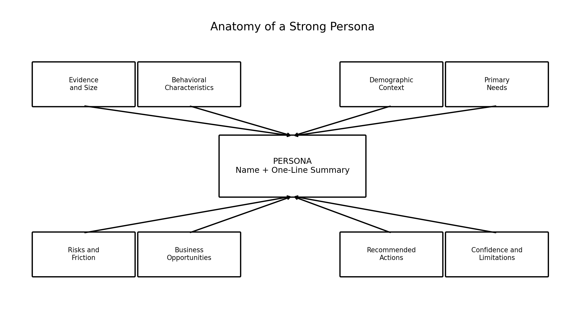

### Image Explanation

A strong persona contains:

- Name and summary
- Evidence
- Behavioral characteristics
- Demographic context
- Needs
- Risks
- Opportunities
- Recommended actions
- Confidence and limitations

A name without evidence is not a complete persona.

---

# 25. Persona Naming Rules

A good persona name should be:

- Short
- Memorable
- Neutral
- Behavior-based
- Distinct from other names
- Supported by evidence
- Easy for stakeholders to use

Examples:

```text
Casual Snackers
Exploratory Samplers
Habitual Loyalists
Power Streamers
```

---

# 26. Neutral and Ethical Personas

Avoid names such as:

```text
Bad Users
Cheap Users
Lazy Listeners
Unimportant Users
Problem Users
```

Use names that describe behavior rather than judging people.

Also avoid:

- Stereotyping demographic groups
- Treating age or location as a personality
- Presenting correlation as causation
- Overstating certainty
- Using a persona to deny fair product access

---

# 27. Possible Spotify Personas

The following personas are illustrative:

1. Casual Snackers
2. Exploratory Samplers
3. Habitual Loyalists
4. Power Streamers

They are examples of how behavioral clusters can be translated into business-friendly identities.

---

# 28. Persona 1 — Casual Snackers

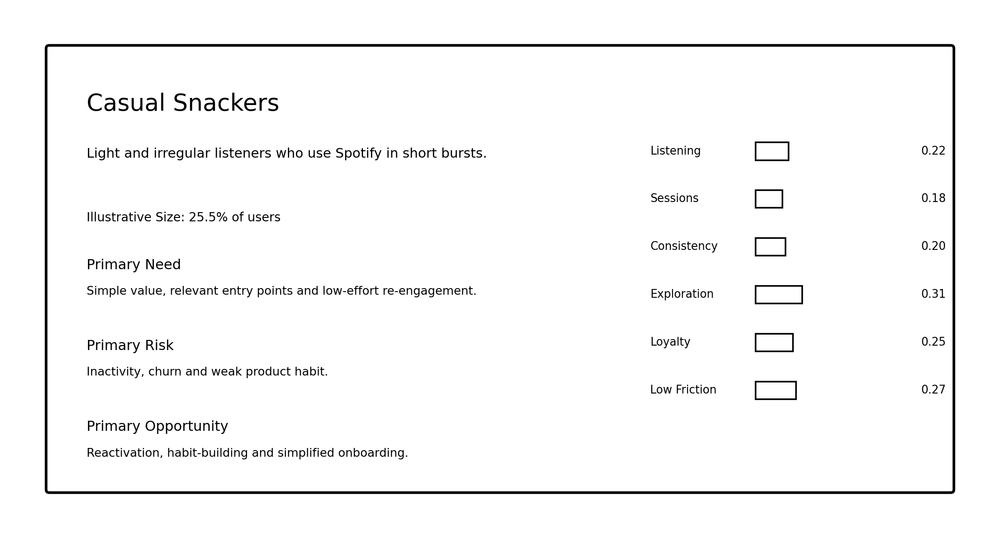

## One-Line Summary

Light and irregular listeners who use Spotify in short bursts.

## Possible Characteristics

- Low listening intensity
- Few sessions
- Low activity consistency
- High skip rate
- Weak repeat behavior
- Short subscription tenure

## Needs

- Simple value
- Low-effort entry points
- Relevant short playlists
- Gentle re-engagement

## Risks

- Inactivity
- Weak product habit
- Churn
- Irrelevant notifications

## Opportunities

- Reactivation campaigns
- Simplified onboarding
- Short-form personalized playlists
- Habit-building experiences

---

# 29. Persona 2 — Exploratory Samplers

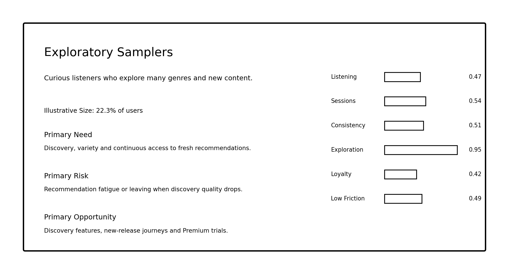

## One-Line Summary

Curious listeners who explore many genres and new content.

## Possible Characteristics

- Moderate listening
- Strong exploration
- High genre diversity
- Moderate repeat behavior
- Frequent track sampling
- Younger or newer profile in some datasets

## Needs

- Variety
- Fresh content
- Discovery
- Smooth transitions across genres

## Risks

- Recommendation fatigue
- Poor discovery quality
- Repetition
- Overly narrow recommendations

## Opportunities

- Discovery playlists
- New-release journeys
- Cross-genre recommendations
- Premium trials

---

# 30. Persona 3 — Habitual Loyalists

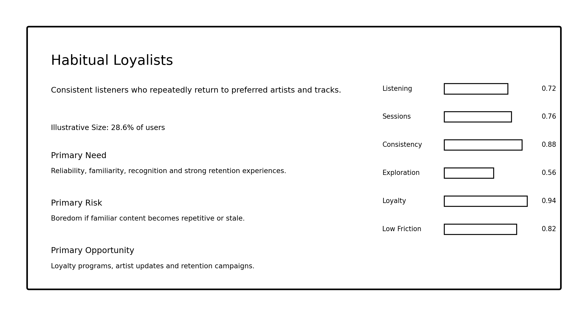

## One-Line Summary

Consistent listeners who repeatedly return to preferred artists and tracks.

## Possible Characteristics

- High active days
- Strong repeat behavior
- Stable session patterns
- Moderate-to-high listening
- Long tenure
- Strong content loyalty

## Needs

- Reliability
- Familiar content
- Recognition
- Artist and playlist continuity

## Risks

- Boredom
- Stale recommendations
- Loss of favorite content
- Ignoring discovery opportunities

## Opportunities

- Loyalty programs
- Artist updates
- Personalized repeat mixes
- Retention campaigns

---

# 31. Persona 4 — Power Streamers

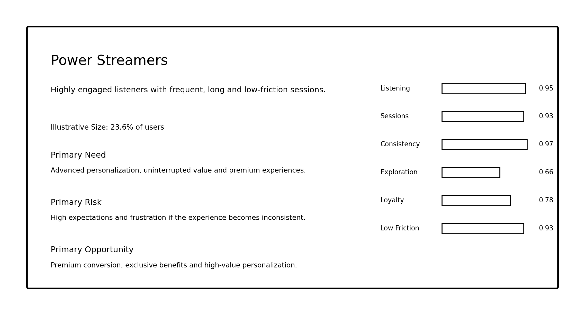

## One-Line Summary

Highly engaged listeners with frequent, long and low-friction sessions.

## Possible Characteristics

- Very high listening
- Many sessions
- Nearly daily activity
- Low skip rate
- Long sessions
- Strong Premium potential

## Needs

- Advanced personalization
- Seamless experience
- Uninterrupted value
- High-quality features

## Risks

- High expectations
- Frustration from service inconsistency
- Advertisement fatigue
- Overuse of repetitive engagement messages

## Opportunities

- Premium conversion
- Exclusive benefits
- High-value personalization
- Advanced product features

---

# 32. Persona Comparison


A comparison table:

| Persona | Engagement | Exploration | Loyalty | Friction |
|---|---|---|---|---|
| Casual Snackers | Low | Low to moderate | Low | High |
| Exploratory Samplers | Moderate | Very high | Moderate | Moderate |
| Habitual Loyalists | High | Moderate | Very high | Low |
| Power Streamers | Very high | Moderate to high | High | Very low |

---

# 33. Persona Distribution

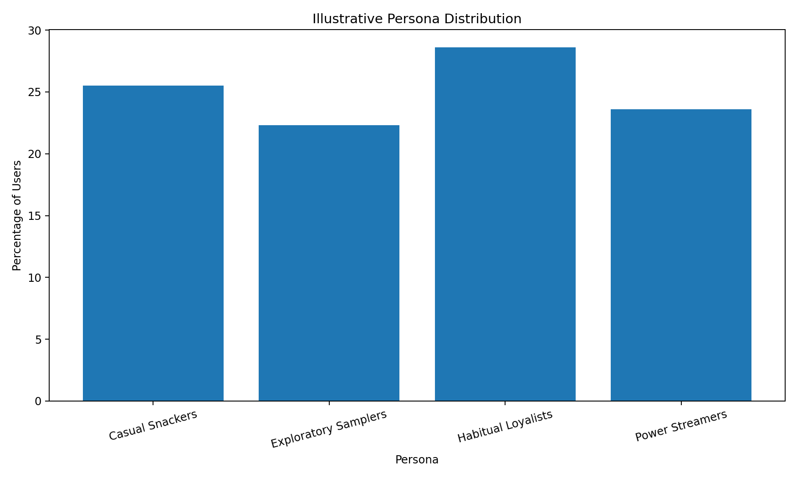

### Image Explanation

- The chart shows illustrative user percentages.
- Cluster size is required for business planning.
- Personas do not need equal sizes.
- Very small or dominant personas require investigation.

---

# 34. Persona Opportunity Matrix

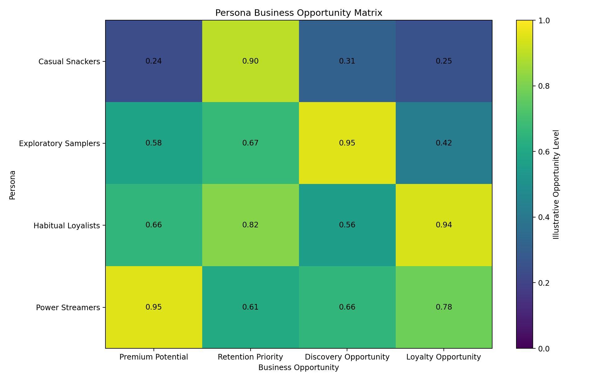

### Image Explanation

- Power Streamers show the strongest Premium opportunity.
- Casual Snackers show the strongest retention or reactivation priority.
- Exploratory Samplers show the strongest discovery opportunity.
- Habitual Loyalists show strong loyalty and retention opportunities.
- The values are hypotheses for planning and require business testing.

---

# 35. Using Personas for Recommendations

## Casual Snackers

- Short and simple playlists
- Familiar entry points
- Low-complexity recommendations

## Exploratory Samplers

- Discovery playlists
- Cross-genre journeys
- New-release recommendations

## Habitual Loyalists

- Repeat mixes
- Artist updates
- Familiar-content personalization

## Power Streamers

- Deep personalization
- Long-session recommendations
- Advanced playlist journeys

---

# 36. Using Personas for Retention

## Casual Snackers

Focus on habit creation and reactivation.

## Exploratory Samplers

Maintain discovery quality and variety.

## Habitual Loyalists

Protect familiar experiences and reward loyalty.

## Power Streamers

Maintain consistently strong product quality and recognize high engagement.

---

# 37. Using Personas for Premium Conversion

Possible targets:

- High engagement
- High advertisement skipping
- Long sessions
- High activity consistency
- Long tenure

Power Streamers may show strong potential, but high engagement alone does not guarantee willingness to pay.

Controlled campaigns are required.

---

# 38. Using Personas for Advertising

Possible approaches:

## Casual Snackers

Avoid excessive ad frequency during short sessions.

## Exploratory Samplers

Use relevant discovery-oriented advertisements.

## Habitual Loyalists

Align advertisements with known preferences carefully.

## Power Streamers

Review advertisement fatigue and Premium-conversion opportunities.

---

# 39. Using Personas for Product Experience

Possible product changes:

- Persona-specific home modules
- Different notification frequency
- Different playlist lengths
- Different discovery intensity
- Different Premium messages
- Different re-engagement timing

Personas should guide experimentation, not create permanent rigid rules.

---

# 40. Persona Validation

A persona must be validated using:

- Cluster statistics
- Relative feature differences
- Stability
- Size
- Stakeholder review
- Business experiment outcomes
- Fairness review
- User feedback when available

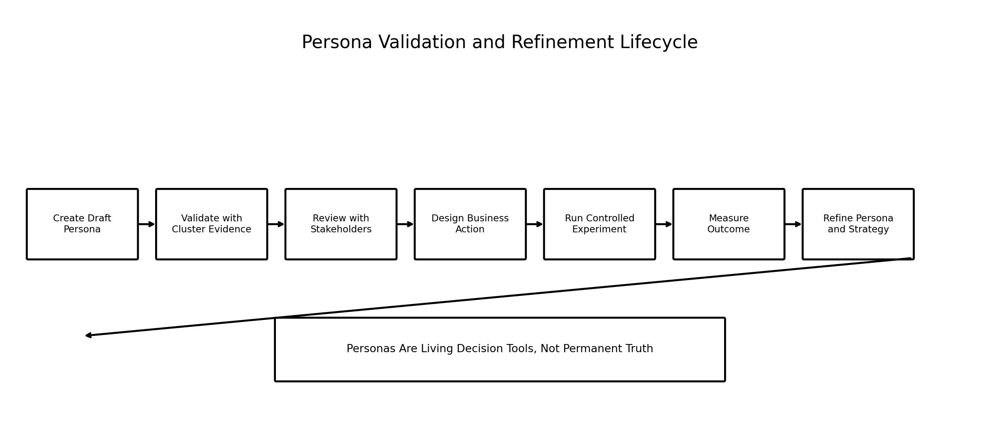

### Image Explanation

- Personas begin as evidence-based drafts.
- Stakeholders review the interpretation.
- Business actions are tested.
- Outcomes are measured.
- Personas and strategies are refined.
- Personas are living decision tools rather than permanent truth.

---

# 41. Persona Stability and Refresh

Personas can change when:

- User behavior changes
- Product features change
- Markets change
- New users join
- Recommendations improve
- Premium strategy changes
- Data collection changes

Review:

- Cluster size drift
- Profile drift
- Persona meaning
- Business action performance
- GMM confidence drift

---

# 42. Common Persona Mistakes

## Mistake 1: Naming Before Profiling

A name should be based on evidence.

## Mistake 2: Creating a Fictional Story Without Data

Personas should not become unsupported storytelling.

## Mistake 3: Using Only Demographics

Behavior should usually drive this project.

## Mistake 4: Treating Personas as Exact Individuals

A persona represents a group pattern.

## Mistake 5: Ignoring Uncertainty

GMM membership can be mixed.

## Mistake 6: Creating Too Many Personas

Too many personas become difficult to use.

## Mistake 7: No Business Action

A persona without a distinct action may not be useful.

---

# 43. End-to-End Persona Creation Workflow

```text
Selected Clustering Model
        ↓
Validated Cluster Profiles
        ↓
High and Low Characteristics
        ↓
Neutral Behavioral Summary
        ↓
Segment Definition
        ↓
Persona Name
        ↓
Needs, Risks and Opportunities
        ↓
Recommended Actions
        ↓
Stakeholder Validation
        ↓
Controlled Business Testing
        ↓
Measure and Refresh
```

---

# 44. Reusable Python Implementation

Included scripts:

```text
examples/spotify_persona_creation.py
examples/persona_card_generator.py
examples/persona_validation_framework.py
examples/segment_persona_mapping.py
```

They provide:

- Cluster-to-segment mapping
- Persona profile validation
- Needs, risks and opportunities tables
- Persona card generation
- Business-action mapping
- Persona evidence reports
- Validation-status tracking

---

# 45. Persona Creation Checklist

## Evidence

- [ ] Selected model documented
- [ ] Cluster size documented
- [ ] Mean and median reviewed
- [ ] High and low features reviewed
- [ ] Demographics reviewed
- [ ] Stability reviewed
- [ ] GMM confidence reviewed when applicable

## Segment

- [ ] Business relevance confirmed
- [ ] Segment definition written
- [ ] Segment is measurable
- [ ] Segment is distinct
- [ ] Segment is actionable

## Persona

- [ ] Name is neutral
- [ ] Name is behavior-based
- [ ] One-line summary written
- [ ] Characteristics documented
- [ ] Needs documented
- [ ] Risks documented
- [ ] Opportunities documented
- [ ] Recommended actions documented
- [ ] Limitations documented

## Validation

- [ ] Stakeholder review completed
- [ ] Fairness review completed
- [ ] Business test designed
- [ ] Success metrics defined
- [ ] Refresh schedule documented
- [ ] Persona version recorded

---

# 46. Important Terminology

| Term | Meaning |
|---|---|
| Segmentation | Dividing a population into useful groups |
| Customer Segmentation | Grouping users for business decisions |
| Behavioral Segmentation | Grouping by product behavior |
| Demographic Segmentation | Grouping by user context |
| Geographic Segmentation | Grouping by location |
| Lifecycle Segmentation | Grouping by relationship stage |
| Cluster | Technical data-driven group |
| Segment | Business-defined group |
| Persona | Human-readable segment representation |
| Persona Characteristic | Important evidence about the persona |
| Persona Need | What may improve user value |
| Persona Risk | Possible source of dissatisfaction or churn |
| Persona Opportunity | Potential business or product action |
| Actionability | Ability to take a distinct action |
| Persona Card | Structured persona summary |
| Persona Mapping | Cluster-to-segment-to-name table |
| Stakeholder Validation | Business review of persona meaning |
| Persona Stability | Consistency over time |
| Persona Refresh | Periodic re-evaluation |
| Behavioral Persona | Persona mainly defined by usage behavior |

---

# 47. Interview Questions and Answers

## 1. What is segmentation?

Segmentation divides a large population into smaller meaningful groups.

---

## 2. What is customer segmentation?

Grouping customers according to shared characteristics useful for business decisions.

---

## 3. What is behavioral segmentation?

Grouping users based on what they do.

---

## 4. What is a persona?

A human-readable representation of a segment.

---

## 5. What is the difference between segment and persona?

A segment is analytically defined; a persona communicates the segment through a name, summary, needs, risks and actions.

---

## 6. What is the difference between cluster and segment?

A cluster is model output; a segment is a business interpretation.

---

## 7. What is the difference between cluster, segment and persona?

Cluster is technical, segment is business-defined, and persona is descriptive.

---

## 8. How do you translate cluster numbers into names?

Profile the cluster, identify dominant patterns, write a neutral summary, create a short name and validate it.

---

## 9. What evidence is required before naming?

Size, means, medians, high and low features, demographics, stability and business relevance.

---

## 10. What is a behavioral persona?

A persona mainly defined by product-usage patterns.

---

## 11. What should persona characteristics include?

Core behavior, high and low features, size, context and evidence.

---

## 12. What is a persona need?

A hypothesis about what may improve value for the persona.

---

## 13. What is a persona risk?

A possible source of churn, dissatisfaction or business loss.

---

## 14. What is a persona opportunity?

A possible product, marketing, retention or monetization action.

---

## 15. Why must persona names be neutral?

To avoid judgment, stereotypes and unsupported assumptions.

---

## 16. What is a Casual Snacker?

An illustrative low-engagement, short-session listener persona.

---

## 17. What is an Exploratory Sampler?

An illustrative discovery-focused persona with broad content exploration.

---

## 18. What is a Habitual Loyalist?

An illustrative consistent listener with strong repeat and loyalty behavior.

---

## 19. What is a Power Streamer?

An illustrative highly engaged, frequent and long-session listener.

---

## 20. How are personas used for recommendations?

Each persona can receive a different balance of familiar, exploratory, short or deep recommendations.

---

## 21. How are personas used for retention?

They identify different retention risks and interventions.

---

## 22. How are personas used for Premium conversion?

They help target users whose behavior suggests potential value from Premium features.

---

## 23. Are personas permanent?

No. They must be monitored and refreshed.

---

## 24. Can demographics define the whole persona?

Usually not in this project. Behavior should drive the persona and demographics should add context.

---

## 25. What makes a persona actionable?

A distinct and measurable business action can be designed for it.

---

## 26. Why should personas be tested?

Needs, risks and opportunities are hypotheses rather than guaranteed truths.

---

## 27. What is persona validation?

Checking evidence, stakeholder usefulness, fairness and business outcomes.

---

## 28. What is persona stability?

Consistency of persona meaning across reruns and time.

---

## 29. What is a persona card?

A structured document containing name, size, behavior, needs, risks, opportunities and actions.

---

## 30. Explain the complete Spotify persona-creation workflow.

Select the model, profile clusters, define segments, create names, document needs and risks, validate, test actions and refresh.

---

# 48. Module Summary

In this module, we learned:

- Segmentation divides a broad user population into useful groups
- Customer segmentation supports targeted business decisions
- Behavioral segmentation uses product activity
- A cluster is technical output
- A segment is a business interpretation
- A persona is a human-readable representation
- Cluster numbers require evidence-based translation
- Behavioral personas should be supported by profile patterns
- A persona includes characteristics, needs, risks and opportunities
- Persona names should be neutral and behavior-based
- Casual Snackers represent light and irregular use
- Exploratory Samplers represent discovery-oriented behavior
- Habitual Loyalists represent consistency and repeat behavior
- Power Streamers represent very high engagement
- Personas can guide recommendations, retention, Premium and advertising
- Persona needs and opportunities are hypotheses that require testing
- Personas must be validated, measured and refreshed

---

# 49. Quick Reference Cheat Sheet

## Relationship

```text
Cluster
→ Technical group

Segment
→ Business-defined group

Persona
→ Human-readable representation
```

## Persona Structure

```text
Name
Summary
Size
Characteristics
Needs
Risks
Opportunities
Actions
Evidence
Limitations
```

## Spotify Personas

```text
Casual Snackers
Exploratory Samplers
Habitual Loyalists
Power Streamers
```

## Naming Rule

```text
Name the dominant behavior.
Do not judge the person.
```

## Validation

```text
Evidence
+ Stability
+ Stakeholder review
+ Business testing
```

---

# 50. What Comes Next?

## Module 15 — Business Recommendations and Action Planning

The next module can cover:

- Turning personas into recommendations
- Product recommendations
- Retention recommendations
- Premium-conversion recommendations
- Advertisement recommendations
- Prioritization frameworks
- Impact vs effort
- Recommendation owners
- Success metrics
- A/B testing
- Implementation roadmap
