# Module 15 — Business Interpretation and Growth Strategy

> A detailed beginner-friendly guide to converting Spotify personas into measurable growth strategies across personalized recommendations, Premium conversion, retention, churn reduction, advertisement optimization, playlist recommendations, discovery, loyalty rewards, user engagement, Customer Lifetime Value, revenue growth, experimentation, and action prioritization.

---

## Table of Contents

1. [Module Overview](#1-module-overview)
2. [Learning Objectives](#2-learning-objectives)
3. [What Is Business Interpretation?](#3-what-is-business-interpretation)
4. [From Persona Insight to Growth Strategy](#4-from-persona-insight-to-growth-strategy)
5. [Observation, Interpretation and Recommendation](#5-observation-interpretation-and-recommendation)
6. [Growth Strategy Principles](#6-growth-strategy-principles)
7. [Personalized Recommendations](#7-personalized-recommendations)
8. [Recommendation Strategy by Persona](#8-recommendation-strategy-by-persona)
9. [Premium Conversion](#9-premium-conversion)
10. [Premium Readiness Signals](#10-premium-readiness-signals)
11. [Premium Strategy by Persona](#11-premium-strategy-by-persona)
12. [Retention Strategy](#12-retention-strategy)
13. [Churn Reduction](#13-churn-reduction)
14. [Retention vs Churn Reduction](#14-retention-vs-churn-reduction)
15. [Churn-Risk Signals](#15-churn-risk-signals)
16. [Advertisement Optimization](#16-advertisement-optimization)
17. [Advertisement Strategy by Persona](#17-advertisement-strategy-by-persona)
18. [Playlist Recommendations](#18-playlist-recommendations)
19. [Playlist Strategy by Persona](#19-playlist-strategy-by-persona)
20. [Discovery Strategy](#20-discovery-strategy)
21. [Novelty vs Familiarity](#21-novelty-vs-familiarity)
22. [Loyalty Rewards](#22-loyalty-rewards)
23. [User Engagement](#23-user-engagement)
24. [Engagement Metric Tree](#24-engagement-metric-tree)
25. [Customer Lifetime Value](#25-customer-lifetime-value)
26. [CLV Components](#26-clv-components)
27. [Illustrative CLV Formula](#27-illustrative-clv-formula)
28. [CLV Limitations](#28-clv-limitations)
29. [Revenue Growth](#29-revenue-growth)
30. [Revenue-Growth Levers](#30-revenue-growth-levers)
31. [Incremental Revenue](#31-incremental-revenue)
32. [Action Prioritization](#32-action-prioritization)
33. [Impact vs Effort](#33-impact-vs-effort)
34. [Priority Scoring](#34-priority-scoring)
35. [Persona Growth Strategy Matrix](#35-persona-growth-strategy-matrix)
36. [A/B Testing and Controlled Experiments](#36-ab-testing-and-controlled-experiments)
37. [Primary and Guardrail Metrics](#37-primary-and-guardrail-metrics)
38. [Growth Guardrails](#38-growth-guardrails)
39. [Measuring Long-Term Impact](#39-measuring-long-term-impact)
40. [Business Recommendation Template](#40-business-recommendation-template)
41. [End-to-End Growth Strategy Workflow](#41-end-to-end-growth-strategy-workflow)
42. [Reusable Python Implementation](#42-reusable-python-implementation)
43. [Business Strategy Checklist](#43-business-strategy-checklist)
44. [Important Terminology](#44-important-terminology)
45. [Interview Questions and Answers](#45-interview-questions-and-answers)
46. [Module Summary](#46-module-summary)
47. [Quick Reference Cheat Sheet](#47-quick-reference-cheat-sheet)
48. [What Comes Next?](#48-what-comes-next)

---

# 1. Module Overview

Clustering and persona creation are valuable only when they improve decisions.

A persona should not end as a presentation slide.

It should support a measurable action such as:

- A more relevant playlist
- A better discovery experience
- A retention intervention
- A Premium offer
- A loyalty reward
- An advertisement-frequency adjustment

The complete path is:

```text
Persona Evidence
        ↓
Business Interpretation
        ↓
Action Hypothesis
        ↓
Prioritization
        ↓
Controlled Experiment
        ↓
User and Business Metrics
        ↓
Scale, Refine or Stop
```

---

# 2. Learning Objectives

By the end of this module, students should be able to:

- Translate persona evidence into business meaning
- Separate observation, interpretation and recommendation
- Create personalized recommendation strategies
- Create Premium-conversion strategies
- Create retention strategies
- Design churn-reduction actions
- Optimize advertisements with user-experience guardrails
- Recommend persona-specific playlists
- Balance novelty and familiarity
- Create loyalty-reward ideas
- Define user-engagement KPIs
- Explain Customer Lifetime Value
- Build simple CLV scenarios
- Identify revenue-growth levers
- Calculate incremental revenue
- Prioritize actions using impact, effort and confidence
- Design controlled experiments
- Define primary and guardrail metrics
- Create a persona growth-strategy matrix
- Document risks, assumptions and owners

---

# 3. What Is Business Interpretation?

Business interpretation explains what analytical findings mean for a decision.

Example:

```text
Observation:
Power Streamers have high listening minutes,
frequent sessions and high ad skipping.

Interpretation:
They receive strong product value but may
experience advertisement friction.

Recommendation:
Test Premium messaging focused on ad-free,
uninterrupted listening.
```

The interpretation connects evidence to a business opportunity.

---

# 4. From Persona Insight to Growth Strategy

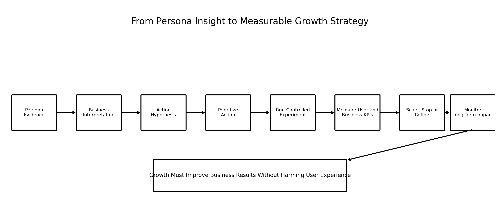

### Image Explanation

The process:

1. Start with persona evidence
2. Interpret the behavior
3. Write an action hypothesis
4. Prioritize the action
5. Run a controlled experiment
6. Measure user and business results
7. Scale, refine or stop
8. Monitor long-term impact

Growth should not damage user experience.

---

# 5. Observation, Interpretation and Recommendation

Keep these three layers separate.

## Observation

Directly supported by data.

```text
This persona listens on 29 of the last 30 days.
```

## Interpretation

Analytical explanation.

```text
The persona has a strong and consistent listening habit.
```

## Recommendation

Proposed action.

```text
Test loyalty recognition and Premium benefits.
```

A recommendation is a hypothesis until tested.

---

# 6. Growth Strategy Principles

A strong strategy should be:

- Persona-relevant
- Evidence-based
- Measurable
- Testable
- Economically reasonable
- Operationally feasible
- Fair
- Privacy-aware
- Reversible
- Monitored over time

Avoid recommending an action only because a persona name sounds suitable.

---

# 7. Personalized Recommendations

Personalized recommendations choose content or experiences using available user evidence.

Possible objectives:

- Increase listening
- Improve recommendation relevance
- Reduce skipping
- Increase saves and follows
- Support discovery
- Strengthen retention
- Improve session quality

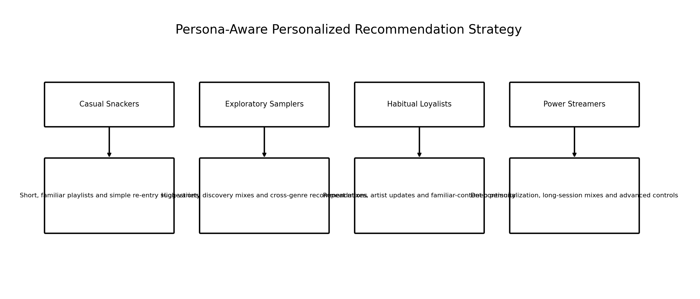

### Image Explanation

Each persona receives a different recommendation hypothesis:

- Casual Snackers: short and simple
- Exploratory Samplers: broad and fresh
- Habitual Loyalists: familiar and continuous
- Power Streamers: deep and advanced

These strategies require testing.

---

# 8. Recommendation Strategy by Persona

## Casual Snackers

- Short playlists
- Familiar tracks
- Low-complexity choices
- Quick re-entry recommendations

## Exploratory Samplers

- Fresh finds
- Cross-genre discovery
- New releases
- Controlled novelty

## Habitual Loyalists

- Repeat mixes
- Artist updates
- Familiar-content continuity
- Adjacent discovery

## Power Streamers

- Long-session mixes
- Advanced personalization
- Mood and activity playlists
- High-frequency refresh

---

# 9. Premium Conversion

Premium conversion is the process of moving an eligible free or ad-supported user into a paid subscription.

A conversion strategy should answer:

- Who is eligible?
- What value is relevant?
- When should the message appear?
- Which offer should be tested?
- Which users should not be contacted?
- How will long-term retention be measured?

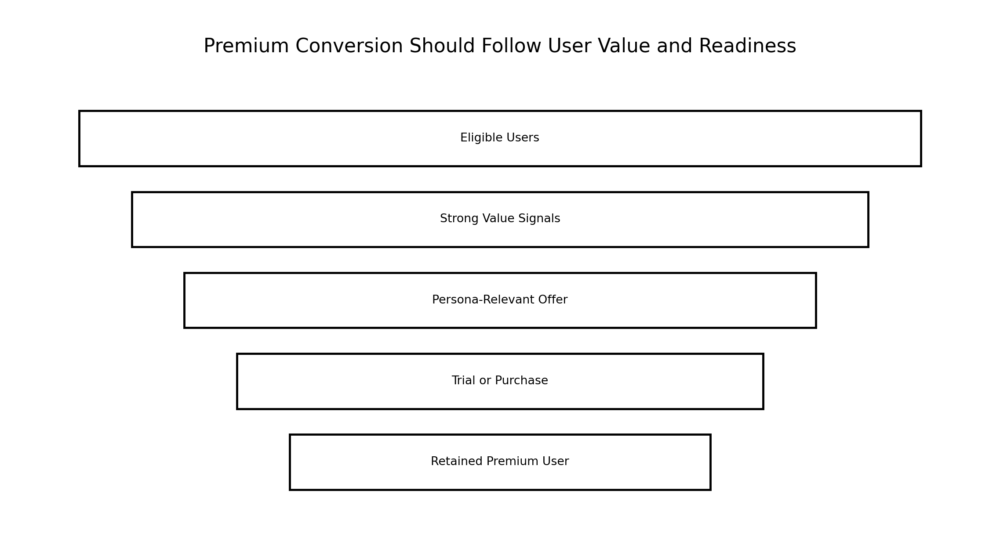

### Image Explanation

The funnel narrows from all eligible users to retained Premium subscribers.

A successful strategy must consider:

- User readiness
- Persona-relevant value
- Trial or purchase
- Post-conversion retention

---

# 10. Premium Readiness Signals

Possible signals:

- High listening minutes
- Frequent sessions
- High active days
- Long sessions
- High advertisement skipping
- Long subscription tenure
- Strong feature usage
- Prior trial engagement

These signals indicate possible readiness, not guaranteed willingness to pay.

---

# 11. Premium Strategy by Persona

## Casual Snackers

Do not prioritize aggressive conversion before proving regular value.

Possible test:

```text
First improve engagement,
then test a simple convenience message.
```

## Exploratory Samplers

Emphasize:

- Discovery value
- Uninterrupted exploration
- Offline listening
- Trial access

## Habitual Loyalists

Emphasize:

- Continuity
- Offline access
- Personalized familiar content
- Loyalty-oriented value

## Power Streamers

Emphasize:

- Ad-free listening
- Uninterrupted sessions
- Audio quality
- Advanced features

---

# 12. Retention Strategy

Retention strategy aims to maintain valuable user activity over time.

Retention may be measured using:

- Day-7 retention
- Day-30 retention
- Monthly active retention
- Rolling active-user retention
- Premium renewal
- Persona-specific retained activity

Retention actions should preserve user value rather than merely increase contact frequency.

---

# 13. Churn Reduction

Churn reduction attempts to prevent users from becoming inactive, cancelling or leaving.

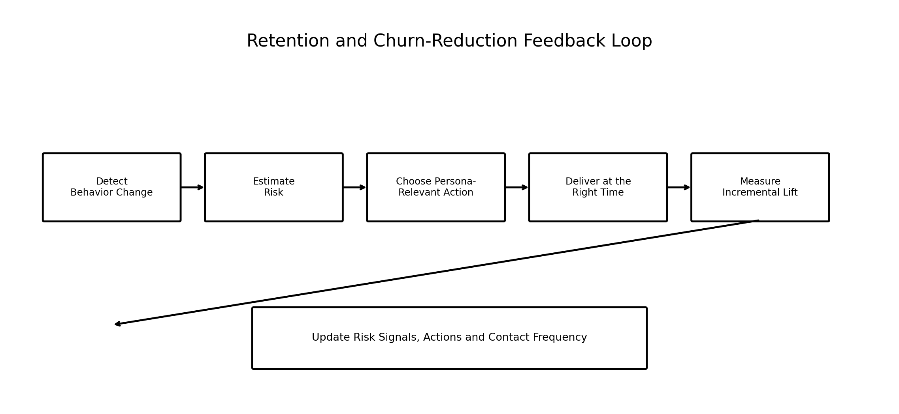

### Image Explanation

The loop:

1. Detect behavior change
2. Estimate risk
3. Choose a persona-relevant action
4. Deliver it at an appropriate time
5. Measure incremental lift
6. Update signals and strategy

---

# 14. Retention vs Churn Reduction

| Retention | Churn Reduction |
|---|---|
| Builds long-term value | Responds to identified risk |
| Can apply broadly | Often targets at-risk users |
| Includes loyalty and product quality | Includes interventions and recovery |
| Preventive | Preventive and reactive |
| Measured over time | Measured by avoided churn or reactivation |

---

# 15. Churn-Risk Signals

Possible behavioral signals:

- Falling active days
- Reduced listening minutes
- Shorter sessions
- Increased gaps between sessions
- Rising skip rate
- Reduced saves or follows
- Reduced repeat behavior
- Failed payments
- Increased support issues

A churn model or rule should be validated against actual future outcomes.

---

# 16. Advertisement Optimization

Advertisement optimization aims to improve advertising value while protecting user experience.

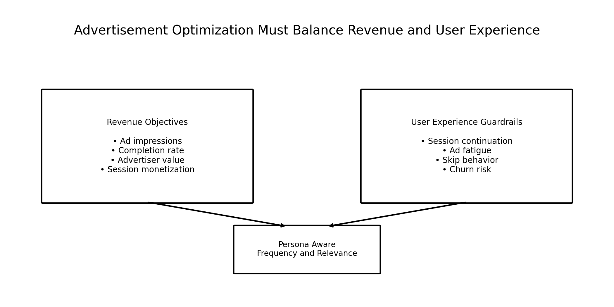

### Image Explanation

The left side shows revenue objectives.

The right side shows user-experience guardrails.

The strategy must balance:

- Advertisement value
- Session continuation
- Friction
- Churn risk
- Premium opportunity

---

# 17. Advertisement Strategy by Persona

## Casual Snackers

- Avoid heavy ad pressure in short sessions
- Use fewer but more relevant impressions
- Protect reactivation

## Exploratory Samplers

- Use discovery-related relevance
- Avoid interrupting exploration frequently
- Measure session continuation

## Habitual Loyalists

- Respect known preferences
- Avoid repetitive advertisements
- Consider loyalty context

## Power Streamers

- Monitor advertisement fatigue
- Consider Premium-conversion tests
- Protect long listening sessions

---

# 18. Playlist Recommendations

Playlist recommendations convert persona behavior into playlist format, length and content strategy.

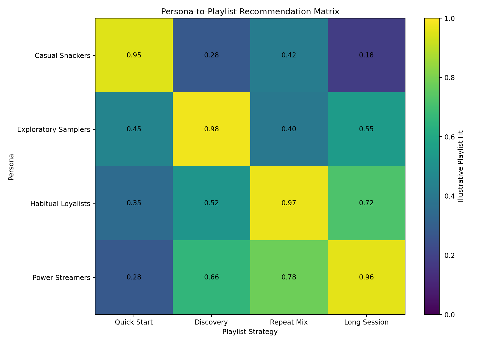

### Image Explanation

The matrix estimates the fit between personas and playlist types.

Examples:

- Quick-start playlists suit Casual Snackers
- Discovery playlists suit Exploratory Samplers
- Repeat mixes suit Habitual Loyalists
- Long-session playlists suit Power Streamers

Values are illustrative.

---

# 19. Playlist Strategy by Persona

| Persona | Playlist Strategy |
|---|---|
| Casual Snackers | Short, familiar, easy start |
| Exploratory Samplers | Cross-genre, new releases, discovery |
| Habitual Loyalists | Artist-based, saved-content, repeat mixes |
| Power Streamers | Long-form, activity, mood and advanced mixes |

Track:

- Playlist start rate
- Completion rate
- Skip rate
- Save rate
- Repeat listening
- Session continuation

---

# 20. Discovery Strategy

Discovery strategy controls how much new or unfamiliar content is introduced.

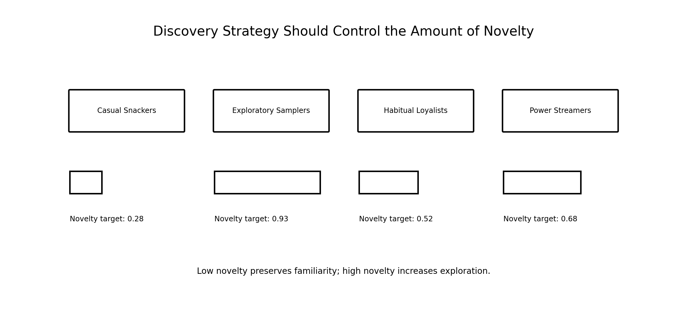

### Image Explanation

- Casual Snackers receive lower novelty.
- Exploratory Samplers receive the highest novelty.
- Habitual Loyalists receive adjacent discovery.
- Power Streamers receive balanced but advanced discovery.

---

# 21. Novelty vs Familiarity

Too much familiarity can create boredom.

Too much novelty can reduce relevance.

A discovery strategy should balance:

```text
Known Preference
+
Adjacent Content
+
New Content
```

The correct balance differs by persona and individual user.

---

# 22. Loyalty Rewards

Loyalty rewards recognize valuable behavior and strengthen the relationship.

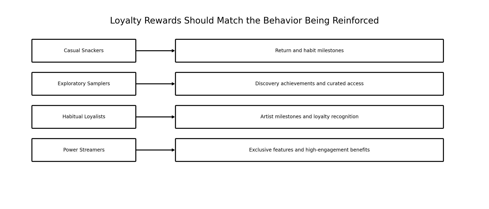

### Image Explanation

Rewards should match the desired behavior:

- Return milestones
- Discovery achievements
- Artist loyalty
- High-engagement benefits

Avoid expensive rewards without measuring incremental retention.

---

# 23. User Engagement

User engagement describes the quality, frequency, depth and consistency of product use.

It is not one metric.

Possible measures:

- Listening minutes
- Sessions
- Active days
- Session duration
- Saves
- Follows
- Playlist completion
- Recommendation engagement
- Retention

---

# 24. Engagement Metric Tree

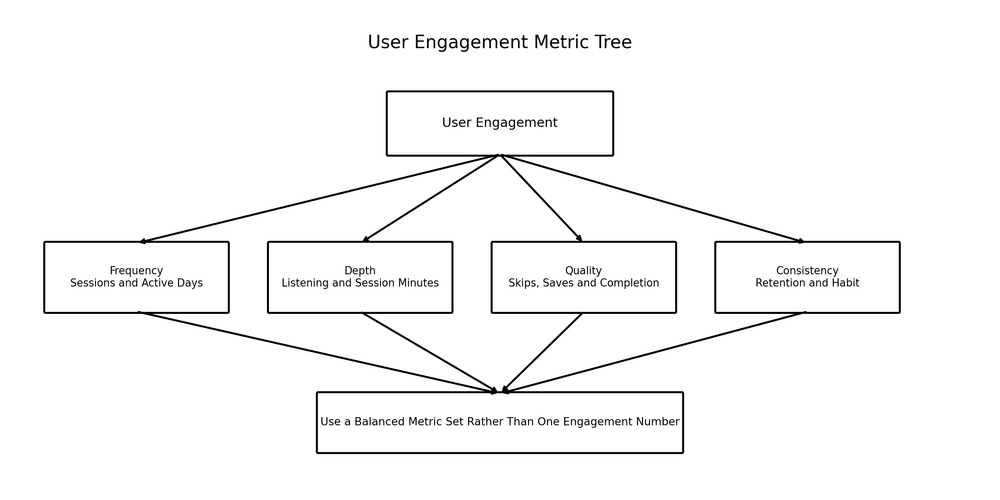

### Image Explanation

Engagement has four branches:

- Frequency
- Depth
- Quality
- Consistency

A balanced metric tree prevents over-optimizing one behavior.

Example:

```text
Listening minutes rise,
but skip rate and complaints also rise.
```

That is not automatically a successful outcome.

---

# 25. Customer Lifetime Value

Customer Lifetime Value, or CLV, estimates the future economic contribution expected from a customer relationship.

CLV can support:

- Acquisition decisions
- Retention investment
- Reward budgets
- Premium strategy
- Segment prioritization

CLV is an estimate based on assumptions.

---

# 26. CLV Components

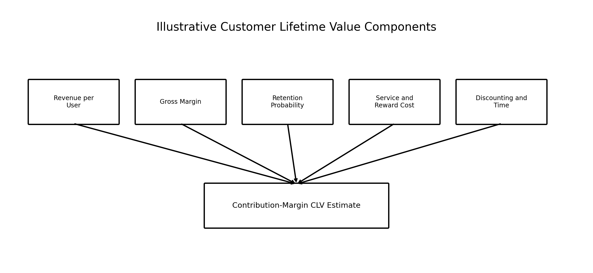

### Image Explanation

A useful CLV estimate may include:

- Revenue per user
- Gross margin
- Retention probability
- Service and reward cost
- Time value or discounting

Use contribution margin rather than revenue alone when possible.

---

# 27. Illustrative CLV Formula

A simplified perpetual-retention formula:

```text
CLV
=
Monthly Revenue × Gross Margin
÷
(1 + Monthly Discount Rate - Monthly Retention Rate)
```

Example code:

```python
clv = (
    monthly_revenue
    * gross_margin_rate
    / (
        1
        + discount_rate
        - retention_rate
    )
)
```

This simplified formula is only an illustration.

Real CLV models may use:

- Cohort survival curves
- Churn probabilities
- Time-varying revenue
- Service cost
- Acquisition cost
- Contract terms
- Discounted cash flow

---

# 28. CLV Limitations

CLV can be misleading when:

- Retention is unstable
- Revenue changes over time
- Costs are excluded
- The discount rate is arbitrary
- Future behavior is assumed constant
- Segment movement is ignored
- Acquisition cost is mixed with post-acquisition value

Always document assumptions.

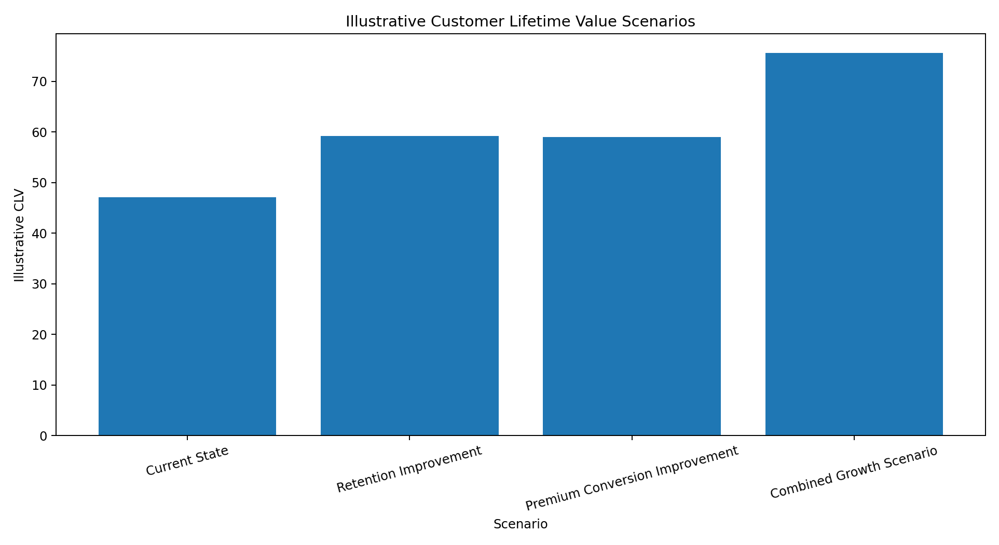

### Image Explanation

The chart compares illustrative scenarios.

Small improvements in retention or revenue can produce large CLV changes in simplified formulas.

This sensitivity must be reviewed carefully.

---

# 29. Revenue Growth

Revenue growth may come from:

- Premium conversion
- Premium retention
- Advertisement yield
- Higher retained engagement
- Partnerships
- New products
- Reduced churn
- Better unit economics

Revenue growth should be measured incrementally.

---

# 30. Revenue-Growth Levers

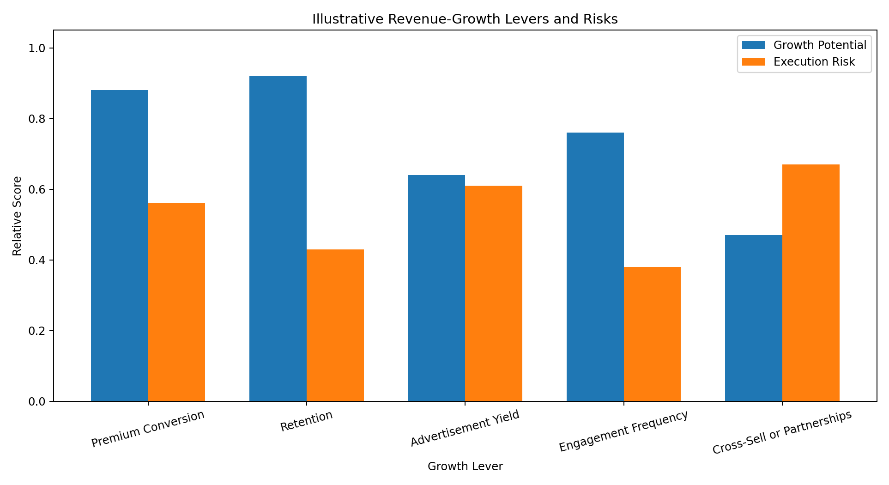

### Image Explanation

The chart compares illustrative potential and execution risk.

A high-potential action can still be a poor first choice when:

- Effort is too high
- Confidence is low
- Risk is high
- User experience may suffer
- Measurement is difficult

---

# 31. Incremental Revenue

Incremental revenue is the revenue caused by the action compared with what would have happened without it.

Conceptually:

```text
Incremental Revenue
=
Revenue in Treatment
-
Expected Revenue Without Treatment
```

A control group helps estimate the counterfactual.

Do not attribute every observed increase to the campaign.

---

# 32. Action Prioritization

Action prioritization decides what should be tested first.

Consider:

- Expected impact
- Effort
- Confidence
- Risk
- Time to value
- Strategic alignment
- Data readiness
- Operational dependency
- User-experience impact

---

# 33. Impact vs Effort

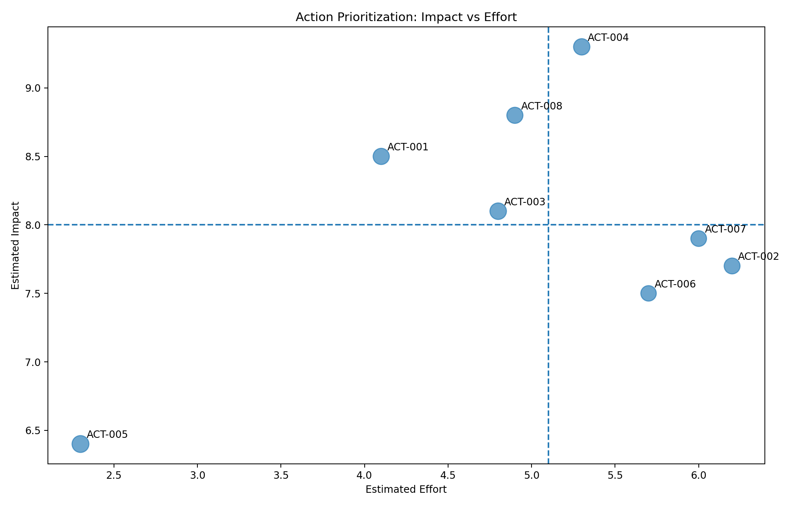

### Image Explanation

- The x-axis shows estimated effort.
- The y-axis shows estimated impact.
- Marker size represents confidence.
- High-impact, low-effort actions are strong early candidates.
- High-impact, high-effort actions may be strategic projects.

The scores are illustrative.

---

# 34. Priority Scoring

A simple score:

```text
Priority Score
=
Impact × Confidence
÷
Effort
```

Example:

```python
priority_score = (
    estimated_impact
    * confidence
    / estimated_effort
)
```

Possible advanced factors:

- Risk penalty
- Strategic alignment
- Time to value
- Dependency complexity
- User-experience guardrail risk

A score supports decisions but does not replace judgment.

---

# 35. Persona Growth Strategy Matrix

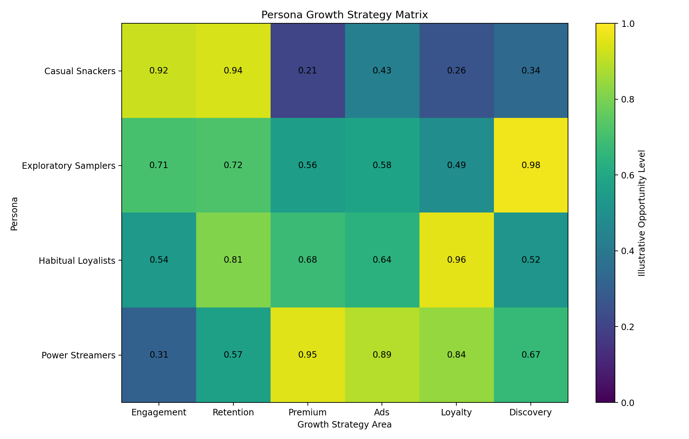

### Image Explanation

The matrix shows illustrative opportunity levels.

Examples:

- Casual Snackers: engagement and retention
- Exploratory Samplers: discovery
- Habitual Loyalists: loyalty and retention
- Power Streamers: Premium and advertisement optimization

The matrix helps avoid using the same action for every persona.

---

# 36. A/B Testing and Controlled Experiments

An A/B test compares:

- Treatment group
- Control group

Example:

```text
Treatment:
Power Streamers receive Premium messaging
focused on uninterrupted listening.

Control:
Existing generic Premium message.
```

Measure:

- Conversion
- Trial activation
- Retained Premium status
- Negative feedback
- Session quality
- Churn

---

# 37. Primary and Guardrail Metrics

## Primary Metric

The main desired outcome.

Examples:

- Premium conversion
- Retention
- Playlist completion
- Recommendation engagement

## Guardrail Metric

A metric that protects against harm.

Examples:

- Churn
- Complaints
- Notification opt-out
- Session abandonment
- Margin
- Advertisement fatigue

The sample KPI framework is included in:

```text
examples/sample_growth_kpi_framework.csv
```

---

# 38. Growth Guardrails

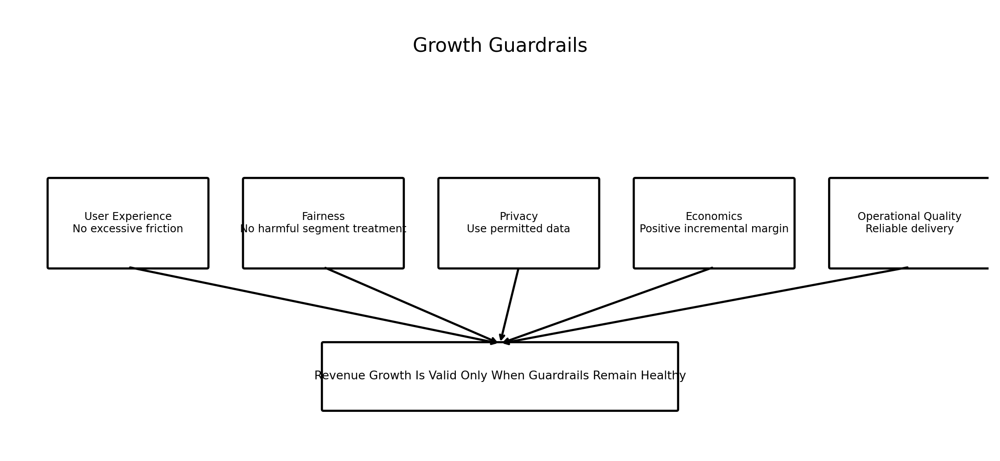

### Image Explanation

Growth actions must respect:

- User experience
- Fairness
- Privacy
- Economics
- Operational quality

Revenue growth is not successful when it creates unacceptable harm or cost.

---

# 39. Measuring Long-Term Impact

Short-term lift may disappear.

Track:

- 7-day outcome
- 30-day outcome
- 60-day outcome
- 90-day retention
- Repeat conversion
- Margin
- Persona migration
- Contact fatigue
- Long-term churn

Avoid scaling based only on one-day clicks.

---

# 40. Business Recommendation Template

```text
Recommendation ID:
Persona:
Business Problem:

Evidence:
- 
- 

Interpretation:
- 

Action Hypothesis:
- 

Target Group:
- 

Control Group:
- 

Primary KPI:
- 

Guardrail KPIs:
- 
- 

Expected Impact:
Effort:
Confidence:
Risk:
Owner:
Timeline:

Decision:
Test / Hold / Reject
```

A complete template is included in:

```text
growth_experiment_template.md
```

---

# 41. End-to-End Growth Strategy Workflow

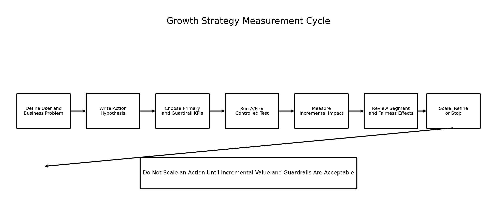

### Image Explanation

The cycle:

1. Define the problem
2. Write the action hypothesis
3. Select primary and guardrail metrics
4. Run a controlled test
5. Measure incremental impact
6. Review persona and fairness effects
7. Scale, refine or stop

---

# 42. Reusable Python Implementation

Included scripts:

```text
examples/spotify_growth_strategy.py
examples/action_prioritization.py
examples/clv_revenue_scenarios.py
examples/persona_experiment_planner.py
```

They provide:

- Persona-to-action mapping
- KPI assignment
- Priority-score calculation
- Impact-effort classification
- CLV scenario calculations
- Incremental revenue scenarios
- Experiment-plan generation
- Strategy registers

---

# 43. Business Strategy Checklist

## Interpretation

- [ ] Observation documented
- [ ] Interpretation separated from observation
- [ ] Recommendation written as a hypothesis
- [ ] Persona evidence attached
- [ ] Assumptions documented

## Action Design

- [ ] Target persona defined
- [ ] Action defined
- [ ] Control or comparison defined
- [ ] Owner assigned
- [ ] Dependencies documented
- [ ] User-experience risk reviewed

## Metrics

- [ ] Primary KPI selected
- [ ] Guardrail KPIs selected
- [ ] Baseline measured
- [ ] Incremental effect defined
- [ ] Measurement period defined
- [ ] Segment-level results planned

## Economics

- [ ] Cost estimated
- [ ] Revenue or margin impact estimated
- [ ] CLV assumptions documented
- [ ] Reward or incentive cost included
- [ ] Operational cost included

## Prioritization

- [ ] Impact scored
- [ ] Effort scored
- [ ] Confidence scored
- [ ] Risk scored
- [ ] Strategic alignment reviewed
- [ ] Priority decision documented

## Validation

- [ ] Controlled experiment designed
- [ ] Fairness reviewed
- [ ] Privacy reviewed
- [ ] Long-term monitoring planned
- [ ] Scale, refine or stop rule defined

---

# 44. Important Terminology

| Term | Meaning |
|---|---|
| Business Interpretation | Meaning of an analytical result for a decision |
| Growth Strategy | Plan to improve measurable user and business outcomes |
| Personalized Recommendation | Content or experience adapted to user evidence |
| Premium Conversion | Movement from free or ad-supported to paid |
| Retention | Continued valuable activity over time |
| Churn | Inactivity, cancellation or relationship loss |
| Churn Reduction | Action intended to prevent churn |
| Advertisement Optimization | Improve ad value with experience guardrails |
| Playlist Strategy | Playlist format and content by user need |
| Discovery Strategy | Balance of new and familiar content |
| Loyalty Reward | Benefit intended to reinforce valuable behavior |
| Engagement | Frequency, depth, quality and consistency of use |
| CLV | Estimated future customer contribution |
| Incremental Revenue | Revenue caused by an action |
| Action Prioritization | Selecting which action to test first |
| Impact | Expected size of benefit |
| Effort | Resources needed |
| Confidence | Strength of evidence |
| Guardrail KPI | Metric protecting against harm |
| A/B Test | Controlled comparison of treatment and control |
| Counterfactual | Expected outcome without the action |
| Persona Migration | User movement between segments |
| Long-Term Lift | Sustained improvement after the initial period |

---

# 45. Interview Questions and Answers

## 1. What is business interpretation?

It explains what an analytical result means for a business decision.

---

## 2. What is the difference between observation and recommendation?

Observation is supported by data; recommendation is a proposed action.

---

## 3. Why must recommendations be tested?

They are hypotheses and may not cause the expected result.

---

## 4. What is personalized recommendation strategy?

Adapting content and experience to user evidence and needs.

---

## 5. How would you recommend content to Casual Snackers?

Use short, familiar and low-complexity playlists.

---

## 6. How would you recommend content to Exploratory Samplers?

Use fresh, varied and cross-genre discovery.

---

## 7. How would you recommend content to Habitual Loyalists?

Use repeat mixes, artist updates and familiar continuity.

---

## 8. How would you recommend content to Power Streamers?

Use deep personalization and long-session playlists.

---

## 9. What is Premium conversion?

Moving an eligible user into a paid subscription.

---

## 10. Which signals may indicate Premium readiness?

High engagement, long sessions, strong activity and advertisement friction.

---

## 11. Does high engagement guarantee conversion?

No.

---

## 12. What is retention strategy?

A plan to maintain valuable user activity over time.

---

## 13. What is churn reduction?

Actions intended to prevent inactivity or cancellation.

---

## 14. Retention vs churn reduction?

Retention builds ongoing value; churn reduction targets identified risk.

---

## 15. What are churn-risk signals?

Falling activity, shorter sessions, longer gaps and rising friction.

---

## 16. What is advertisement optimization?

Improving ad value while protecting user experience.

---

## 17. Why use advertisement guardrails?

Higher ad revenue may increase fatigue, abandonment or churn.

---

## 18. What is a playlist recommendation strategy?

Choosing playlist content, length and novelty for a persona or user.

---

## 19. What is discovery strategy?

Controlling how much unfamiliar content is introduced.

---

## 20. Why balance novelty and familiarity?

Too much familiarity can bore users; too much novelty can reduce relevance.

---

## 21. What are loyalty rewards?

Benefits intended to recognize or strengthen valuable behavior.

---

## 22. What is user engagement?

Frequency, depth, quality and consistency of use.

---

## 23. Why is engagement not one metric?

One metric can increase while experience quality declines.

---

## 24. What is Customer Lifetime Value?

An estimate of future economic contribution from a customer relationship.

---

## 25. Why use contribution margin in CLV?

Revenue alone ignores service and reward costs.

---

## 26. What are CLV limitations?

It depends on retention, revenue, cost and discount assumptions.

---

## 27. What is incremental revenue?

Revenue caused by an action relative to the outcome without it.

---

## 28. Why use a control group?

To estimate the counterfactual.

---

## 29. What is action prioritization?

Selecting which actions to test or implement first.

---

## 30. What is an impact-effort matrix?

A chart comparing expected impact and implementation effort.

---

## 31. What is a simple priority score?

Impact multiplied by confidence and divided by effort.

---

## 32. What is a primary KPI?

The main desired outcome.

---

## 33. What is a guardrail KPI?

A metric protecting against unwanted harm.

---

## 34. What is an A/B test?

A controlled comparison of treatment and control groups.

---

## 35. Why measure long-term impact?

Short-term engagement may not produce retained value.

---

## 36. What growth guardrails should be reviewed?

User experience, fairness, privacy, economics and operational quality.

---

## 37. How do personas support revenue growth?

They help match actions and value propositions to different user patterns.

---

## 38. Should every persona receive a Premium campaign?

No.

---

## 39. How do you prioritize Spotify growth actions?

Compare impact, effort, confidence, risk, strategy and measurement readiness.

---

## 40. Explain the complete growth-strategy workflow.

Interpret evidence, propose an action, prioritize, test, measure incremental impact, review guardrails and scale or stop.

---

# 46. Module Summary

In this module, we learned:

- Business interpretation connects analytical evidence to decisions
- Observation, interpretation and recommendation must be separated
- Personalized recommendations should differ by persona
- Premium conversion should follow user value and readiness
- Retention strategy protects long-term activity
- Churn reduction targets identified risk
- Advertisement optimization must balance revenue and experience
- Playlist strategy should match session depth and content preference
- Discovery strategy balances novelty and familiarity
- Loyalty rewards should reinforce valuable behavior
- Engagement includes frequency, depth, quality and consistency
- CLV estimates future economic contribution
- CLV depends on documented assumptions
- Revenue growth must be incremental
- Impact, effort, confidence and risk support prioritization
- Controlled experiments estimate causal impact
- Primary and guardrail KPIs are both necessary
- Growth strategies must respect user experience, fairness, privacy and economics
- Long-term monitoring decides whether an action should scale

---

# 47. Quick Reference Cheat Sheet

## Business Translation

```text
Observation
→ Interpretation
→ Action Hypothesis
→ Controlled Test
→ Incremental Impact
```

## Persona Strategy

```text
Casual Snackers
→ Engagement and reactivation

Exploratory Samplers
→ Discovery and trial

Habitual Loyalists
→ Retention and loyalty

Power Streamers
→ Premium and experience quality
```

## Priority Score

```text
Impact × Confidence ÷ Effort
```

## CLV

```text
Revenue
× Margin
× Retention
- Cost
- Time discounting
```

## Growth Decision

```text
Primary KPI improves
AND
Guardrails remain acceptable
```

---

# 48. What Comes Next?

## Module 16 — Model Deployment and MLOps

The next module can cover:

- Saving model artifacts
- Feature-order validation
- Batch inference
- API inference
- Streamlit application
- Model registry
- Versioning
- Monitoring
- Data drift
- Cluster drift
- Retraining
- AWS deployment
