# Module 16 — Data Visualization

> A detailed beginner-friendly guide to using histograms, box plots, bar charts, scatter plots, heatmaps, pair plots, cluster charts, radar charts, persona comparisons, business dashboards, chart-selection rules, visual-design practices, and storytelling with data for the Spotify segmentation project.

---

## Table of Contents

1. [Module Overview](#1-module-overview)
2. [Learning Objectives](#2-learning-objectives)
3. [What Is Data Visualization?](#3-what-is-data-visualization)
4. [Why Visualization Is Required](#4-why-visualization-is-required)
5. [Visualization Workflow](#5-visualization-workflow)
6. [Exploratory vs Explanatory Visualization](#6-exploratory-vs-explanatory-visualization)
7. [Histogram](#7-histogram)
8. [Choosing Histogram Bins](#8-choosing-histogram-bins)
9. [Box Plot](#9-box-plot)
10. [Reading a Box Plot](#10-reading-a-box-plot)
11. [Bar Chart](#11-bar-chart)
12. [Bar Chart Best Practices](#12-bar-chart-best-practices)
13. [Scatter Plot](#13-scatter-plot)
14. [Scatter Plot Interpretation](#14-scatter-plot-interpretation)
15. [Heatmap](#15-heatmap)
16. [Correlation Heatmap](#16-correlation-heatmap)
17. [Pair Plot](#17-pair-plot)
18. [Pair Plot Limitations](#18-pair-plot-limitations)
19. [Cluster Chart](#19-cluster-chart)
20. [PCA Cluster Visualization](#20-pca-cluster-visualization)
21. [Radar Chart](#21-radar-chart)
22. [Radar Chart Limitations](#22-radar-chart-limitations)
23. [Persona Comparisons](#23-persona-comparisons)
24. [Business Dashboards](#24-business-dashboards)
25. [Dashboard KPI Design](#25-dashboard-kpi-design)
26. [Dashboard Filters](#26-dashboard-filters)
27. [Choosing the Correct Visualization](#27-choosing-the-correct-visualization)
28. [Chart Selection by Business Question](#28-chart-selection-by-business-question)
29. [Visual Design Best Practices](#29-visual-design-best-practices)
30. [Titles, Labels and Units](#30-titles-labels-and-units)
31. [Axes and Scale](#31-axes-and-scale)
32. [Color and Accessibility](#32-color-and-accessibility)
33. [Reducing Visual Clutter](#33-reducing-visual-clutter)
34. [Storytelling with Data](#34-storytelling-with-data)
35. [Story Structure](#35-story-structure)
36. [Observation, Insight and Action](#36-observation-insight-and-action)
37. [Example Spotify Data Story](#37-example-spotify-data-story)
38. [Common Visualization Mistakes](#38-common-visualization-mistakes)
39. [Static vs Interactive Visualizations](#39-static-vs-interactive-visualizations)
40. [Exporting Visualizations](#40-exporting-visualizations)
41. [End-to-End Spotify Visualization Workflow](#41-end-to-end-spotify-visualization-workflow)
42. [Reusable Python Implementation](#42-reusable-python-implementation)
43. [Visualization Checklist](#43-visualization-checklist)
44. [Important Terminology](#44-important-terminology)
45. [Interview Questions and Answers](#45-interview-questions-and-answers)
46. [Module Summary](#46-module-summary)
47. [Quick Reference Cheat Sheet](#47-quick-reference-cheat-sheet)
48. [What Comes Next?](#48-what-comes-next)

---

# 1. Module Overview

Data visualization converts tables and model outputs into visual evidence.

In the Spotify project, visualization helps answer questions such as:

- How are listening minutes distributed?
- Which persona has the highest skip rate?
- Are listening minutes and sessions related?
- Which features are strongly correlated?
- Are clusters clearly separated?
- How do the four personas differ?
- Which KPI should appear on the dashboard?
- What business action does the evidence support?

A chart should not be created only because the code is available.

It should answer a useful question.

---

# 2. Learning Objectives

By the end of this module, students should be able to:

- Explain why visualization is required
- Differentiate exploratory and explanatory visualization
- Create and interpret histograms
- Create and interpret box plots
- Create and interpret bar charts
- Create and interpret scatter plots
- Create correlation heatmaps
- Understand pair plots
- Create two-dimensional cluster charts
- Explain PCA-based cluster visualization
- Create radar charts
- Compare personas visually
- Design a business dashboard
- Choose the correct chart for a question
- Use clear titles, labels and units
- Avoid misleading axes
- Reduce visual clutter
- Apply accessibility principles
- Tell a business story with data
- Export repeatable visualizations using Python

---

# 3. What Is Data Visualization?

Data visualization is the graphical representation of data, relationships, distributions, comparisons and model results.

Common goals:

- Explore
- Compare
- Detect
- Explain
- Monitor
- Persuade
- Support a decision

A chart is a communication tool.

---

# 4. Why Visualization Is Required

Tables are useful for exact values.

Charts are useful for patterns.

Visualization can reveal:

- Skewed distributions
- Outliers
- Cluster overlap
- Strong relationships
- Weak relationships
- Group differences
- Growth trends
- Data-quality problems
- Business opportunities

---

# 5. Visualization Workflow

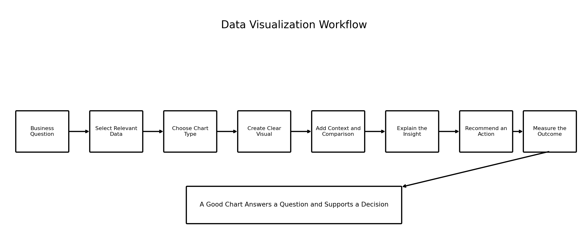

### Image Explanation

The workflow is:

1. Start with a business question
2. Select the relevant data
3. Choose an appropriate chart
4. Create a clear visual
5. Add context and comparison
6. Explain the insight
7. Recommend an action
8. Measure the outcome

A good chart is connected to a decision.

---

# 6. Exploratory vs Explanatory Visualization

## Exploratory Visualization

Used by analysts to investigate data.

Examples:

- Many histograms
- Correlation heatmaps
- Pair plots
- Outlier box plots
- Cluster projections

Exploratory charts may be detailed and technical.

## Explanatory Visualization

Used to communicate one important message.

Examples:

- Persona comparison bar chart
- Premium-conversion opportunity chart
- Retention dashboard
- Action-priority chart

An explanatory chart should be focused and easy to understand.

---

# 7. Histogram

A histogram shows the distribution of one numerical variable.

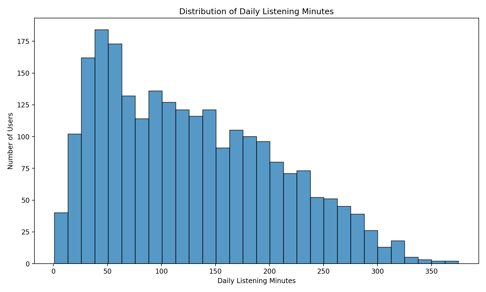

### Image Explanation

- The x-axis shows daily listening-minute ranges.
- The y-axis shows the number of users in each range.
- The chart reveals the overall shape.
- Multiple usage levels create a broad distribution.
- Histograms help identify skewness, spread and unusual values.

## Python

```python
import matplotlib.pyplot as plt

plt.figure(figsize=(10, 6))

plt.hist(
    data["daily_listening_minutes"],
    bins=30,
    edgecolor="black"
)

plt.title(
    "Distribution of Daily Listening Minutes"
)

plt.xlabel(
    "Daily Listening Minutes"
)

plt.ylabel(
    "Number of Users"
)

plt.tight_layout()
plt.show()
```

---

# 8. Choosing Histogram Bins

Too few bins hide detail.

Too many bins create noise.

Possible approaches:

- Start with 20 to 40 bins
- Compare several bin counts
- Use domain-relevant intervals
- Use automatic rules as a starting point
- Keep bin widths consistent

The bin count changes the visual appearance but not the underlying data.

---

# 9. Box Plot

A box plot summarizes the distribution of a numerical feature.

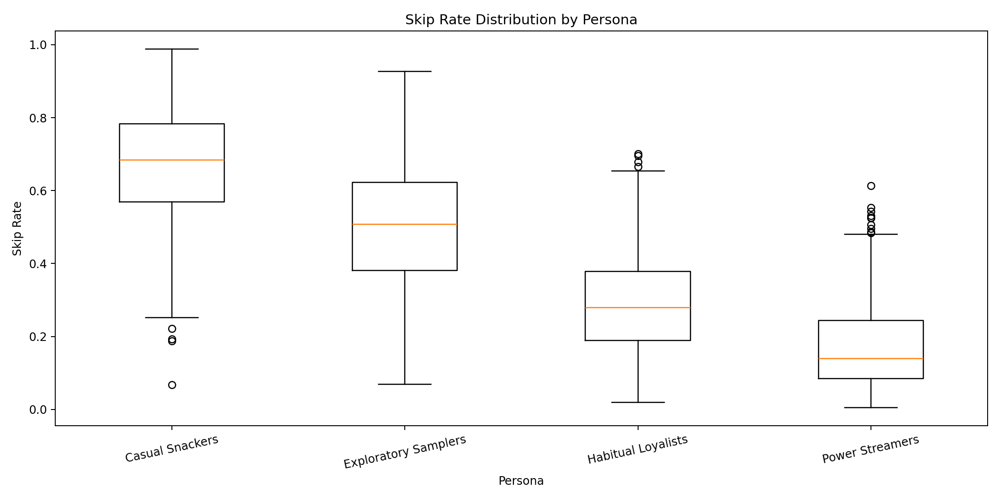

### Image Explanation

- Each box represents one persona.
- The line inside the box is the median.
- The box contains the middle 50% of values.
- Whiskers show the typical range.
- Points beyond the whiskers may be potential outliers.
- The chart makes persona-level distribution differences visible.

## Python

```python
persona_order = [
    "Casual Snackers",
    "Exploratory Samplers",
    "Habitual Loyalists",
    "Power Streamers"
]

box_data = [
    data.loc[
        data["persona"] == persona,
        "skip_rate"
    ]
    for persona in persona_order
]

plt.figure(figsize=(12, 6))

plt.boxplot(
    box_data,
    labels=persona_order
)

plt.title(
    "Skip Rate Distribution by Persona"
)

plt.xlabel("Persona")
plt.ylabel("Skip Rate")

plt.tight_layout()
plt.show()
```

---

# 10. Reading a Box Plot

A box plot shows:

```text
Minimum typical value
First quartile
Median
Third quartile
Maximum typical value
Potential outliers
```

Use it to compare:

- Center
- Spread
- Skewness
- Outliers
- Group overlap

Do not automatically remove every point outside the whiskers.

---

# 11. Bar Chart

A bar chart compares categories.

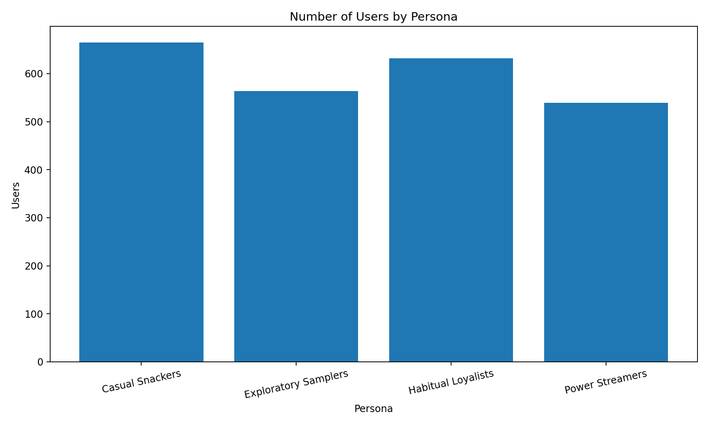

### Image Explanation

- Each bar represents one persona.
- Bar height shows the number of users.
- The chart helps compare segment scale.
- It is easier to compare categories with bars than with a pie chart.

## Python

```python
plt.figure(figsize=(10, 6))

plt.bar(
    persona_summary["persona"],
    persona_summary["users"]
)

plt.title(
    "Number of Users by Persona"
)

plt.xlabel("Persona")
plt.ylabel("Users")

plt.tight_layout()
plt.show()
```

---

# 12. Bar Chart Best Practices

- Start the numerical axis at zero in most cases
- Use clear category labels
- Sort bars when ranking matters
- Use horizontal bars for long category names
- Show exact values when needed
- Avoid unnecessary three-dimensional effects
- Do not use too many categories

---

# 13. Scatter Plot

A scatter plot shows the relationship between two numerical variables.

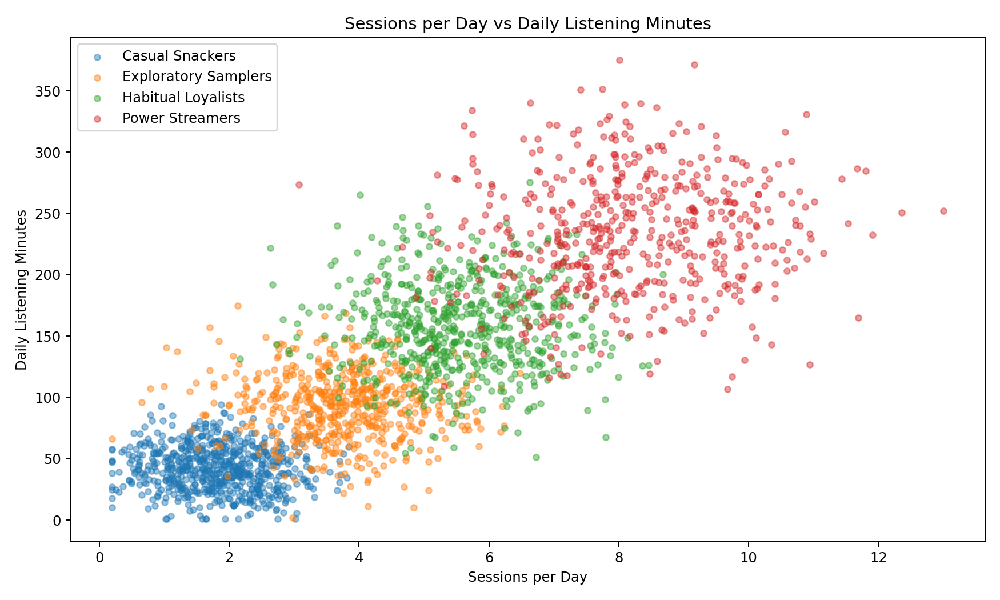

### Image Explanation

- Each point represents a user.
- The x-axis shows sessions per day.
- The y-axis shows listening minutes.
- The upward pattern indicates a positive relationship.
- Persona overlap remains visible.
- Different personas occupy different parts of the behavior space.

## Python

```python
plt.figure(figsize=(10, 6))

for persona in persona_order:
    subset = data[
        data["persona"] == persona
    ]

    plt.scatter(
        subset["sessions_per_day"],
        subset["daily_listening_minutes"],
        s=18,
        alpha=0.45,
        label=persona
    )

plt.title(
    "Sessions per Day vs Listening Minutes"
)

plt.xlabel("Sessions per Day")
plt.ylabel("Daily Listening Minutes")

plt.legend()
plt.tight_layout()
plt.show()
```

---

# 14. Scatter Plot Interpretation

Look for:

- Positive relationship
- Negative relationship
- No clear relationship
- Non-linear pattern
- Clusters
- Outliers
- Different group patterns
- Dense overlapping areas

Correlation does not prove causation.

---

# 15. Heatmap

A heatmap represents numerical values in a matrix.

Common uses:

- Correlation matrices
- Persona-feature comparisons
- Model evaluation grids
- Business opportunity matrices
- Cluster transition matrices

Heatmaps are useful when many values must be compared at once.

---

# 16. Correlation Heatmap

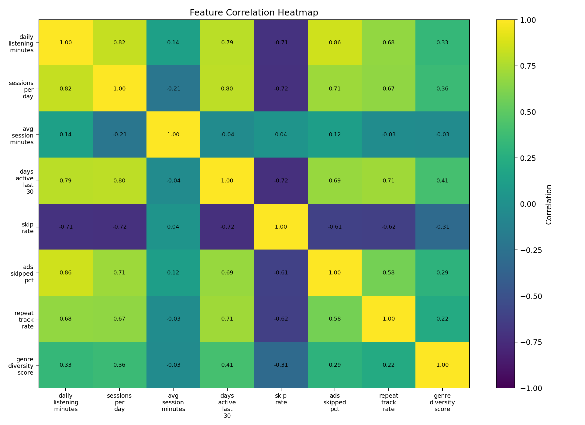

### Image Explanation

- Every cell represents a correlation.
- Values near `+1` indicate strong positive linear relationships.
- Values near `-1` indicate strong negative linear relationships.
- Values near `0` indicate weak linear relationships.
- The diagonal is `1` because each feature is perfectly correlated with itself.

## Python

```python
features = [
    "daily_listening_minutes",
    "sessions_per_day",
    "avg_session_minutes",
    "days_active_last_30",
    "skip_rate",
    "ads_skipped_pct"
]

correlation = data[
    features
].corr()

plt.figure(figsize=(10, 8))

plt.imshow(
    correlation.values,
    aspect="auto",
    vmin=-1,
    vmax=1
)

plt.colorbar(
    label="Correlation"
)

plt.xticks(
    range(len(features)),
    features,
    rotation=45
)

plt.yticks(
    range(len(features)),
    features
)

plt.tight_layout()
plt.show()
```

---

# 17. Pair Plot

A pair plot displays distributions and pairwise relationships for several features.

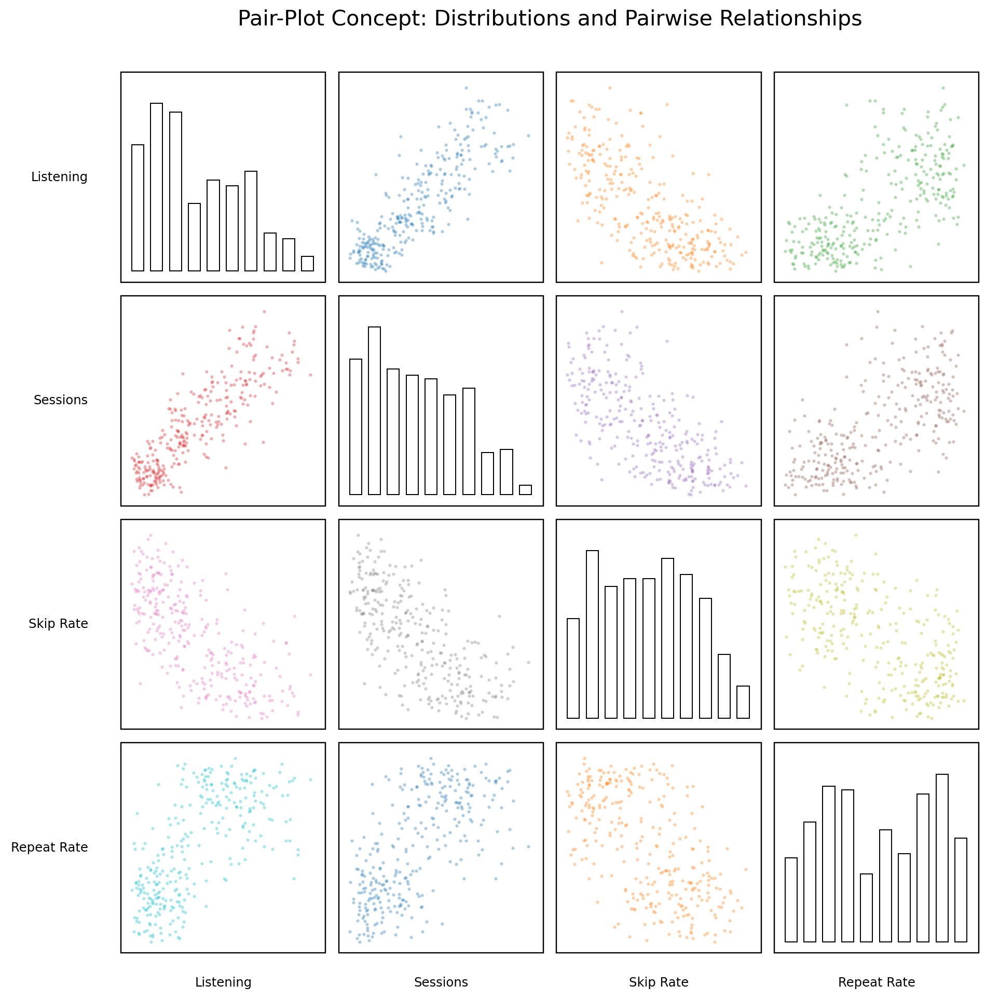

### Image Explanation

- Diagonal cells show feature distributions.
- Off-diagonal cells show pairwise scatter relationships.
- The same features appear across rows and columns.
- Pair plots are useful for early exploratory analysis.
- They help identify relationships, clusters and outliers.

The image uses one plotting canvas to explain the pair-plot structure.

## Python with Pandas

```python
from pandas.plotting import (
    scatter_matrix
)

selected = data[
    [
        "daily_listening_minutes",
        "sessions_per_day",
        "skip_rate",
        "repeat_track_rate"
    ]
].sample(
    1000,
    random_state=42
)

scatter_matrix(
    selected,
    figsize=(12, 12),
    diagonal="hist",
    alpha=0.35
)

plt.show()
```

---

# 18. Pair Plot Limitations

- Becomes crowded with many features
- Can be slow on large datasets
- Overplotting can hide density
- Does not explain causation
- Categorical variables need separate treatment
- A sample may be required

Use pair plots for a small, selected feature set.

---

# 19. Cluster Chart

A cluster chart shows users in a two-dimensional space using cluster labels.

Possible axes:

- Two original features
- PCA components
- UMAP components
- t-SNE components

The visual helps inspect separation and overlap.

---

# 20. PCA Cluster Visualization

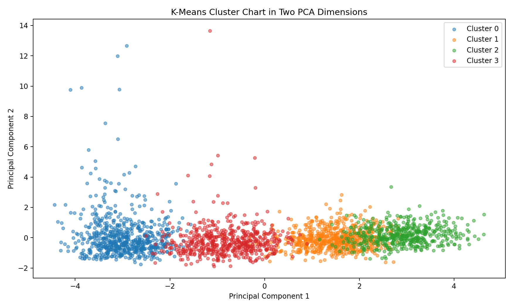

### Image Explanation

- The original feature set is reduced to two principal components.
- Each point represents one user.
- Technical cluster labels are shown.
- The chart helps inspect broad separation and overlap.
- PCA is a projection, so some information is lost.
- A visually separated chart does not replace formal evaluation.

## Python

```python
from sklearn.decomposition import PCA

pca = PCA(
    n_components=2,
    random_state=42
)

X_pca = pca.fit_transform(
    X_scaled
)

plt.figure(figsize=(10, 6))

for cluster in sorted(
    np.unique(labels)
):
    mask = labels == cluster

    plt.scatter(
        X_pca[mask, 0],
        X_pca[mask, 1],
        s=18,
        alpha=0.5,
        label=f"Cluster {cluster}"
    )

plt.xlabel("Principal Component 1")
plt.ylabel("Principal Component 2")
plt.legend()

plt.tight_layout()
plt.show()
```

---

# 21. Radar Chart

A radar chart compares several normalized dimensions.

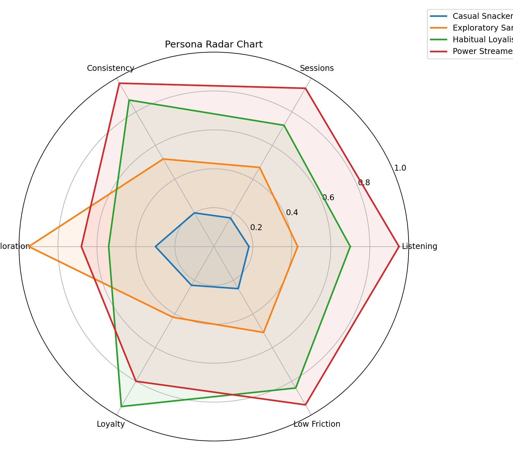

### Image Explanation

- Every axis represents a behavioral dimension.
- Every line represents a persona.
- The shape summarizes the persona's relative profile.
- Exploratory Samplers are strong on exploration.
- Habitual Loyalists are strong on loyalty.
- Power Streamers are strong on engagement and low friction.

---

# 22. Radar Chart Limitations

- Hard to compare many personas
- Area can appear more important than it is
- Different axis order changes the shape
- Requires normalized values
- Exact values are difficult to read
- Can become cluttered quickly

Use radar charts for a small number of personas and dimensions.

Always provide a supporting table.

---

# 23. Persona Comparisons

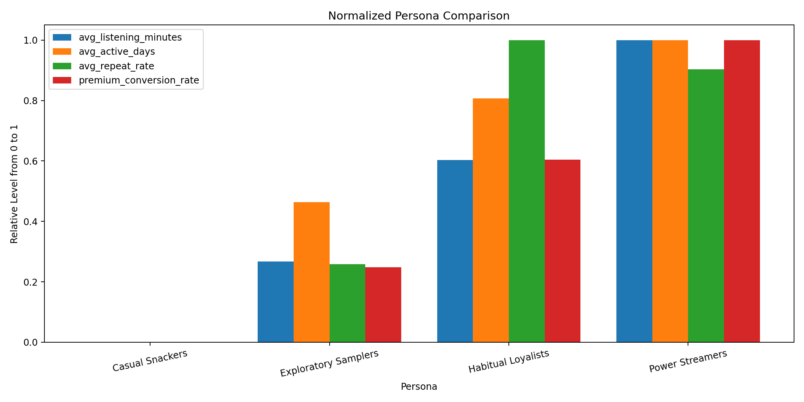

### Image Explanation

- Metrics are normalized to a common 0-to-1 scale.
- This makes features with different units comparable.
- Original values should still be available in tables.
- Persona comparisons help identify distinct business strategies.

Useful persona-comparison views:

- Grouped bar chart
- Standardized heatmap
- Radar chart
- Profile table
- Opportunity matrix

---

# 24. Business Dashboards

A dashboard combines KPIs and charts for ongoing monitoring.

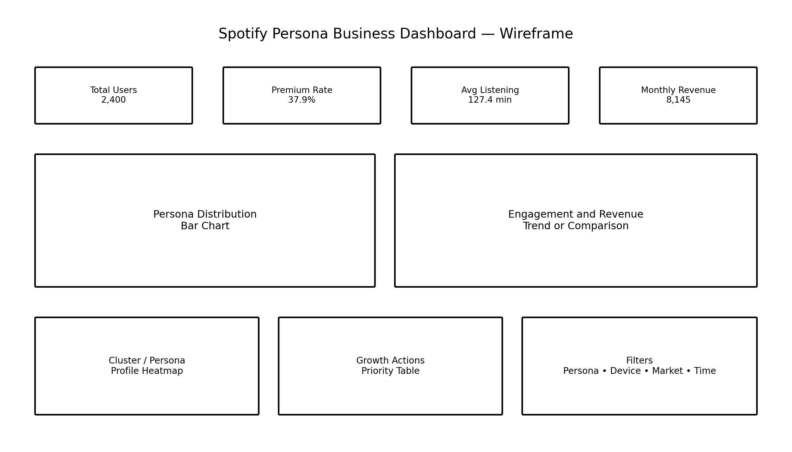

### Image Explanation

A persona dashboard may contain:

- Total users
- Premium rate
- Listening activity
- Revenue
- Persona distribution
- Engagement comparisons
- Profile heatmap
- Priority actions
- Filters

A dashboard should support regular decisions.

---

# 25. Dashboard KPI Design

Each KPI should have:

- Business definition
- Calculation
- Owner
- Refresh frequency
- Target
- Baseline
- Guardrail
- Action when the KPI changes

Examples:

```text
Persona User Count
Premium Conversion Rate
Average Listening Minutes
30-Day Retention
Monthly Revenue
Churn Rate
Recommendation Engagement
```

---

# 26. Dashboard Filters

Useful filters:

- Persona
- Cluster
- Country
- City tier
- Device
- Subscription status
- Date
- Experiment group
- New vs established user

Avoid adding filters without a real decision use case.

---

# 27. Choosing the Correct Visualization

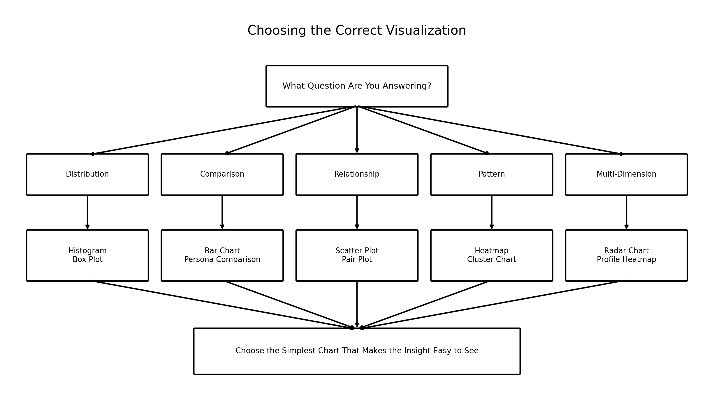

### Image Explanation

Choose a chart based on the question:

- Distribution → Histogram or box plot
- Category comparison → Bar chart
- Relationship → Scatter plot
- Matrix pattern → Heatmap
- Pairwise exploration → Pair plot
- Cluster separation → Cluster chart
- Multi-dimensional persona → Radar chart or heatmap

Use the simplest chart that communicates the insight.

---

# 28. Chart Selection by Business Question

| Business Question | Recommended Chart |
|---|---|
| How is one numerical feature distributed? | Histogram |
| Are there outliers across personas? | Box plot |
| Which persona is largest? | Bar chart |
| Are two numerical features related? | Scatter plot |
| Which features are correlated? | Heatmap |
| How do several features relate? | Pair plot |
| Are clusters separated? | PCA cluster chart |
| How do personas compare across dimensions? | Radar chart or heatmap |
| What should leadership monitor? | Business dashboard |
| Which action should be prioritized? | Impact-effort scatter plot |

---

# 29. Visual Design Best Practices

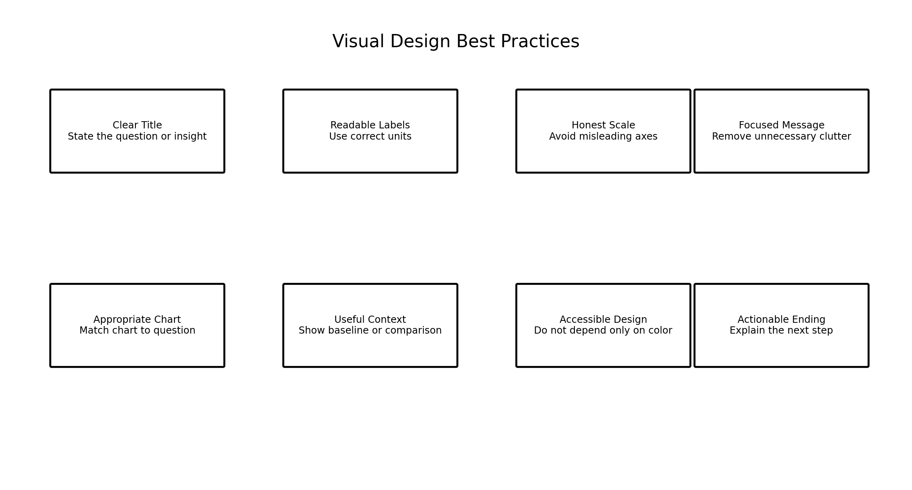

### Image Explanation

A strong chart uses:

- Clear title
- Readable labels
- Honest scale
- Focused message
- Appropriate chart
- Useful context
- Accessible design
- Actionable ending

---

# 30. Titles, Labels and Units

Weak title:

```text
Listening Chart
```

Better title:

```text
Power Streamers Average 3.2× More Daily Listening Than Casual Snackers
```

Labels should include units:

```text
Daily Listening Minutes
Monthly Revenue
Skip Rate
Users
```

---

# 31. Axes and Scale

Avoid misleading axes.

Examples:

- Bar charts should usually start at zero
- Log scales must be clearly identified
- Time axes should use consistent intervals
- Truncated axes require explanation
- Percentage axes should show percentage units

A visual should not exaggerate small differences.

---

# 32. Color and Accessibility

Do not depend only on color.

Also use:

- Labels
- Shapes
- Patterns
- Direct annotation
- Clear legends
- Sufficient contrast

Consider users with color-vision differences.

Keep persona colors consistent across a project when a design standard is approved.

---

# 33. Reducing Visual Clutter

Remove elements that do not improve understanding.

Common clutter:

- Excessive gridlines
- Decorative three-dimensional effects
- Too many categories
- Repeated legends
- Unnecessary decimal places
- Large blocks of text
- Too many colors
- Unrelated KPIs

---

# 34. Storytelling with Data

A data story connects evidence to a decision.

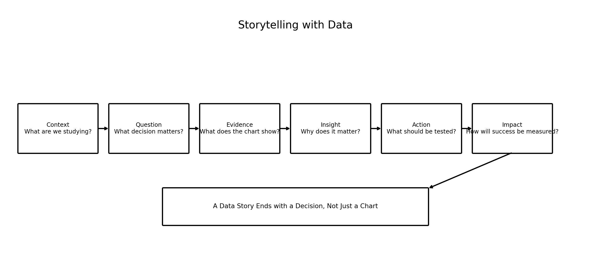

### Image Explanation

A useful story includes:

1. Context
2. Question
3. Evidence
4. Insight
5. Action
6. Impact measurement

A story should not end with:

```text
Here is the chart.
```

It should explain what the audience should understand or test next.

---

# 35. Story Structure

## Context

What are we studying?

## Question

What decision matters?

## Evidence

What does the chart show?

## Insight

Why does the pattern matter?

## Action

What should be tested?

## Impact

How will success be measured?

---

# 36. Observation, Insight and Action

Example:

```text
Observation:
Power Streamers have the highest listening
and session frequency.

Insight:
They receive high value from the product and
may be sensitive to interruptions.

Action:
Test Premium messaging focused on uninterrupted,
ad-free listening.
```

Keep the observation factual.

Keep the action testable.

---

# 37. Example Spotify Data Story

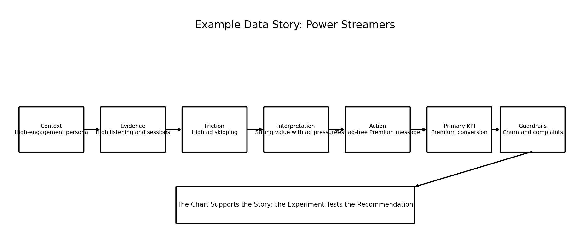

### Image Explanation

The story moves from:

- Persona context
- Engagement evidence
- Advertisement friction
- Business interpretation
- Premium-conversion hypothesis
- Primary KPI
- Guardrail KPIs

The chart supports the story.

The experiment tests the recommendation.

---

# 38. Common Visualization Mistakes

## Mistake 1: Wrong Chart Type

Using a pie chart for many categories.

## Mistake 2: Missing Units

Showing `120` without explaining minutes, users or currency.

## Mistake 3: Misleading Scale

Starting a bar chart at a high value to exaggerate differences.

## Mistake 4: Too Much Data

Showing every user when a sample or summary is clearer.

## Mistake 5: Too Many Colors

Creating visual noise.

## Mistake 6: No Business Question

Creating a chart without knowing why it is needed.

## Mistake 7: No Action

Reporting a pattern without explaining what it means.

## Mistake 8: Treating Projection as Proof

A PCA chart is not a complete evaluation.

---

# 39. Static vs Interactive Visualizations

## Static

Examples:

- PNG
- PDF
- Presentation chart
- README image

Advantages:

- Easy to share
- Reproducible
- Good for reports
- Stable appearance

## Interactive

Examples:

- Power BI
- Tableau
- Streamlit
- Plotly dashboard

Advantages:

- Filters
- Hover information
- Drill-down
- Dynamic exploration

The business dashboard can use interactive filters, while GitHub documentation can use static images.

---

# 40. Exporting Visualizations

```python
plt.savefig(
    "images/persona_sizes.png",
    dpi=175,
    bbox_inches="tight"
)
```

Recommended practices:

- Use descriptive file names
- Set sufficient resolution
- Keep titles and labels readable
- Store code with the exported image
- Record data version
- Recreate visuals from code rather than manual editing

---

# 41. End-to-End Spotify Visualization Workflow

```text
Define Business Question
        ↓
Choose Dataset and Time Window
        ↓
Validate Data
        ↓
Choose Chart Type
        ↓
Create Exploratory Visual
        ↓
Identify the Main Insight
        ↓
Simplify into Explanatory Visual
        ↓
Add Title, Labels and Context
        ↓
Write Observation and Interpretation
        ↓
Recommend a Testable Action
        ↓
Export and Version
```

---

# 42. Reusable Python Implementation

Included scripts:

```text
examples/spotify_visualization_pipeline.py
examples/pair_plot_generator.py
examples/cluster_visualization.py
examples/persona_radar_chart.py
examples/business_dashboard_generator.py
examples/data_story_generator.py
```

They provide:

- Histograms
- Box plots
- Bar charts
- Scatter plots
- Correlation heatmaps
- Pair-plot generation
- PCA cluster charts
- Radar charts
- Persona comparisons
- Static dashboard generation
- Markdown data-story generation

---

# 43. Visualization Checklist

## Question and Audience

- [ ] Business question defined
- [ ] Audience defined
- [ ] Decision or action defined
- [ ] Required level of detail defined

## Data

- [ ] Data source documented
- [ ] Date range documented
- [ ] Missing values reviewed
- [ ] Outliers reviewed
- [ ] Units confirmed
- [ ] Category order confirmed

## Chart Selection

- [ ] Chart matches the question
- [ ] Simpler chart considered
- [ ] Correct aggregation used
- [ ] Large data sampled when needed
- [ ] Cluster projection limitations documented

## Design

- [ ] Clear title
- [ ] Axes labeled
- [ ] Units included
- [ ] Honest scale
- [ ] Legend readable
- [ ] Text readable
- [ ] Visual clutter removed
- [ ] Accessibility reviewed

## Story

- [ ] Observation written
- [ ] Insight written
- [ ] Business meaning written
- [ ] Action hypothesis written
- [ ] Primary KPI written
- [ ] Guardrails written
- [ ] Limitations written

## Reproducibility

- [ ] Visualization code saved
- [ ] Data version recorded
- [ ] Image file named clearly
- [ ] Export resolution sufficient
- [ ] README image path tested

---

# 44. Important Terminology

| Term | Meaning |
|---|---|
| Data Visualization | Graphical representation of data |
| Exploratory Visualization | Used to investigate patterns |
| Explanatory Visualization | Used to communicate one message |
| Histogram | Numerical distribution chart |
| Bin | Numerical interval in a histogram |
| Box Plot | Distribution summary using quartiles |
| Bar Chart | Category comparison chart |
| Scatter Plot | Relationship between two numerical variables |
| Heatmap | Matrix values represented visually |
| Correlation | Linear relationship measure |
| Pair Plot | Multiple distributions and pairwise relationships |
| Cluster Chart | Two-dimensional view of cluster labels |
| PCA | Linear dimensionality reduction |
| Radar Chart | Multi-dimensional profile chart |
| Persona Comparison | Visual comparison of personas |
| Dashboard | Combined KPI monitoring view |
| KPI | Key Performance Indicator |
| Filter | Interactive data-selection control |
| Visual Clutter | Elements that reduce clarity |
| Data Story | Evidence connected to insight and action |
| Guardrail Metric | Metric protecting against harm |
| Overplotting | Too many points hiding patterns |
| Projection | Lower-dimensional representation |
| Annotation | Text highlighting a key point |

---

# 45. Interview Questions and Answers

## 1. What is data visualization?

It is the graphical representation of data, relationships, patterns and results.

---

## 2. Why is visualization required?

It makes distributions, comparisons, relationships, outliers and patterns easier to identify and explain.

---

## 3. Exploratory vs explanatory visualization?

Exploratory charts investigate data; explanatory charts communicate a focused message.

---

## 4. What does a histogram show?

The distribution of one numerical variable.

---

## 5. What are histogram bins?

Intervals used to group numerical values.

---

## 6. What does a box plot show?

Median, quartiles, spread and potential outliers.

---

## 7. When should a bar chart be used?

To compare categories.

---

## 8. Why should bar charts usually start at zero?

To avoid exaggerating differences.

---

## 9. What does a scatter plot show?

The relationship between two numerical variables.

---

## 10. What is overplotting?

Too many points overlap and hide the pattern.

---

## 11. What is a heatmap?

A visual matrix of numerical values.

---

## 12. What is a correlation heatmap?

A matrix showing pairwise feature correlations.

---

## 13. Does correlation prove causation?

No.

---

## 14. What is a pair plot?

A matrix of feature distributions and pairwise relationships.

---

## 15. What are pair-plot limitations?

It becomes crowded, slow and difficult to read with many features.

---

## 16. What is a cluster chart?

A two-dimensional chart showing observations using cluster labels.

---

## 17. Why use PCA for cluster visualization?

To reduce many features into two dimensions for visual inspection.

---

## 18. Does a PCA chart prove good clustering?

No.

---

## 19. What is a radar chart?

A chart comparing several normalized dimensions around a circle.

---

## 20. What are radar-chart limitations?

Exact comparisons are difficult and shapes can be misleading.

---

## 21. How can personas be compared visually?

Using bar charts, heatmaps, radar charts and profile tables.

---

## 22. What is a business dashboard?

A combined view of KPIs and charts used for monitoring and decisions.

---

## 23. What should a dashboard KPI contain?

Definition, owner, target, baseline, refresh frequency and action.

---

## 24. How do you choose the correct visualization?

Start from the business question and choose the simplest chart that answers it.

---

## 25. Which chart shows a distribution?

Histogram or box plot.

---

## 26. Which chart shows category comparison?

Bar chart.

---

## 27. Which chart shows numerical relationships?

Scatter plot.

---

## 28. Which chart shows matrix patterns?

Heatmap.

---

## 29. Which chart shows multi-dimensional personas?

Radar chart or standardized heatmap.

---

## 30. What makes a chart misleading?

Wrong scale, missing units, inappropriate chart type or selective context.

---

## 31. Why should titles communicate insight?

They help the audience understand the message quickly.

---

## 32. Why is accessibility important?

A chart should remain understandable for users with different visual abilities.

---

## 33. What is storytelling with data?

Connecting context, evidence, insight, action and impact.

---

## 34. What is the difference between observation and insight?

Observation states what the data shows; insight explains why it matters.

---

## 35. Why should a data story end with an action?

The purpose is to support a decision or test.

---

## 36. Static vs interactive visualization?

Static visuals are fixed files; interactive visuals support filtering and drill-down.

---

## 37. How do you export a Matplotlib chart?

Use `plt.savefig()` with a clear path and sufficient resolution.

---

## 38. Why save visualization code?

For reproducibility and future updates.

---

## 39. How would you visualize Spotify personas?

Use size bars, profile heatmaps, radar charts, comparison bars and dashboard KPIs.

---

## 40. Explain the complete visualization workflow.

Define the question, select data, choose a chart, create and simplify it, explain the insight, recommend an action and measure the result.

---

# 46. Module Summary

In this module, we learned:

- Visualization converts data into visual evidence
- Exploratory charts investigate patterns
- Explanatory charts communicate decisions
- Histograms show numerical distributions
- Box plots compare medians, spread and outliers
- Bar charts compare categories
- Scatter plots show relationships
- Heatmaps show matrix patterns
- Pair plots show distributions and pairwise relationships
- Cluster charts visualize projected group separation
- Radar charts compare normalized persona dimensions
- Persona comparisons support business interpretation
- Dashboards combine KPIs and ongoing monitoring
- Chart selection should start with the business question
- Titles, labels and units improve clarity
- Honest scales prevent misleading communication
- Accessibility and low clutter improve usability
- Data storytelling connects context, evidence, insight, action and impact
- Visualization code and data versions should be saved for reproducibility

---

# 47. Quick Reference Cheat Sheet

## Chart Selection

```text
Distribution
→ Histogram / Box Plot

Category Comparison
→ Bar Chart

Relationship
→ Scatter Plot

Matrix Pattern
→ Heatmap

Pairwise Exploration
→ Pair Plot

Cluster Separation
→ PCA Cluster Chart

Multi-Dimensional Persona
→ Radar Chart / Heatmap

Monitoring
→ Business Dashboard
```

## Data Story

```text
Context
→ Question
→ Evidence
→ Insight
→ Action
→ Impact
```

## Quality Rule

```text
Choose the simplest chart
that clearly answers the question.
```

---

# 48. What Comes Next?

## Module 17 — Model Deployment and MLOps

The next module can cover:

- Saving model artifacts
- Model versioning
- Batch inference
- API inference
- Streamlit deployment
- AWS deployment
- Monitoring
- Data drift
- Cluster drift
- Retraining
- CI/CD
