# Module 17 — End-to-End Project Summary

> A complete, beginner-friendly final summary of the Spotify customer-segmentation project, covering the full workflow, technical architecture, business architecture, challenges, model-selection decisions, final clusters, final personas, business recommendations, limitations, future enhancements, and a ready-to-use final project explanation for interviews and presentations.

---

## Table of Contents

1. [Module Overview](#1-module-overview)
2. [Important Note About the Final Values](#2-important-note-about-the-final-values)
3. [Project Objective](#3-project-objective)
4. [Business Problem](#4-business-problem)
5. [Project Scope](#5-project-scope)
6. [Complete Project Workflow](#6-complete-project-workflow)
7. [Phase 1 — Business Understanding](#7-phase-1--business-understanding)
8. [Phase 2 — Data Understanding](#8-phase-2--data-understanding)
9. [Phase 3 — Data Cleaning](#9-phase-3--data-cleaning)
10. [Phase 4 — Exploratory Data Analysis](#10-phase-4--exploratory-data-analysis)
11. [Phase 5 — Feature Selection and Engineering](#11-phase-5--feature-selection-and-engineering)
12. [Phase 6 — Scaling and Transformation](#12-phase-6--scaling-and-transformation)
13. [Phase 7 — Clustering Models](#13-phase-7--clustering-models)
14. [Phase 8 — Experiment Automation](#14-phase-8--experiment-automation)
15. [Phase 9 — Cluster Evaluation](#15-phase-9--cluster-evaluation)
16. [Phase 10 — Cluster Profiling](#16-phase-10--cluster-profiling)
17. [Phase 11 — Persona Creation](#17-phase-11--persona-creation)
18. [Phase 12 — Growth Strategy](#18-phase-12--growth-strategy)
19. [Phase 13 — Visualization](#19-phase-13--visualization)
20. [Technical Architecture](#20-technical-architecture)
21. [Business Architecture](#21-business-architecture)
22. [Project Challenges](#22-project-challenges)
23. [Model-Selection Decisions](#23-model-selection-decisions)
24. [Why K-Means Was Selected](#24-why-k-means-was-selected)
25. [Role of GMM](#25-role-of-gmm)
26. [Final Clusters](#26-final-clusters)
27. [Final Personas](#27-final-personas)
28. [Persona 1 — Casual Snackers](#28-persona-1--casual-snackers)
29. [Persona 2 — Exploratory Samplers](#29-persona-2--exploratory-samplers)
30. [Persona 3 — Habitual Loyalists](#30-persona-3--habitual-loyalists)
31. [Persona 4 — Power Streamers](#31-persona-4--power-streamers)
32. [Business Recommendations](#32-business-recommendations)
33. [Recommendation Measurement](#33-recommendation-measurement)
34. [Project Deliverables](#34-project-deliverables)
35. [Project Limitations](#35-project-limitations)
36. [Future Enhancements](#36-future-enhancements)
37. [Productionization Roadmap](#37-productionization-roadmap)
38. [Final Project Explanation — Two Minutes](#38-final-project-explanation--two-minutes)
39. [Final Project Explanation — Detailed](#39-final-project-explanation--detailed)
40. [Interview Explanation Framework](#40-interview-explanation-framework)
41. [Presentation Structure](#41-presentation-structure)
42. [Project Decision Principles](#42-project-decision-principles)
43. [End-to-End Validation Checklist](#43-end-to-end-validation-checklist)
44. [Important Terminology](#44-important-terminology)
45. [Interview Questions and Answers](#45-interview-questions-and-answers)
46. [Module Summary](#46-module-summary)
47. [Quick Reference Cheat Sheet](#47-quick-reference-cheat-sheet)
48. [Project Completion Statement](#48-project-completion-statement)

---

# 1. Module Overview

This module brings together all earlier modules into one complete project story.

The project begins with a broad business problem:

```text
Spotify users do not all behave in the same way.
```

It ends with:

- A reproducible clustering workflow
- A selected final model
- Four interpretable user groups
- Four business-friendly personas
- Persona-specific growth recommendations
- A measurement and future-deployment plan

---

# 2. Important Note About the Final Values

The final model metrics, persona percentages and feature values included in this module are **illustrative teaching values**.

They are included to demonstrate how a finished project should be documented.

Before using this module as a client, production or official project report:

```text
Replace the illustrative values
with the actual outputs from your final experiment.
```

The project structure, decision framework and templates can be reused directly.

---

# 3. Project Objective

The objective is to segment Spotify users using behavioral data and create actionable personas.

The final solution should help answer:

- Which users are lightly engaged?
- Which users prefer discovery?
- Which users show strong loyalty?
- Which users are highly engaged?
- Which groups may need retention action?
- Which groups may have Premium potential?
- How should recommendations differ?
- Which actions should be tested first?

---

# 4. Business Problem

A generic user strategy can create:

- Irrelevant recommendations
- Poor engagement
- Weak retention
- Over-targeting
- Missed Premium opportunities
- Advertisement fatigue
- Unclear growth priorities

The project creates evidence-based segments so the business can design more relevant actions.

---

# 5. Project Scope

## Included

- Behavioral-data understanding
- Demographic context
- Data cleaning
- EDA
- Feature engineering
- Scaling and transformations
- K-Means
- Gaussian Mixture Models
- Experiment automation
- Cluster evaluation
- Persona creation
- Growth recommendations
- Visualization
- Reproducible documentation

## Not Yet Included

- Production API
- Real-time inference
- Automated retraining
- Production drift alerts
- Actual controlled growth tests
- Official financial valuation

These items are future enhancements.

---

# 6. Complete Project Workflow

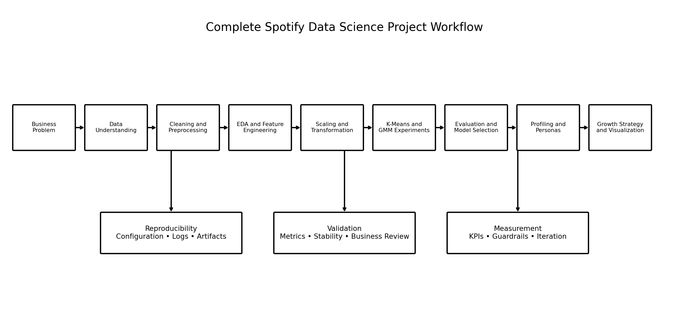

### Image Explanation

The complete workflow moves through:

1. Business problem
2. Data understanding
3. Cleaning and preprocessing
4. EDA and feature engineering
5. Scaling and transformation
6. K-Means and GMM experiments
7. Evaluation and model selection
8. Profiling and personas
9. Growth strategy and visualization

Reproducibility, validation and measurement support the entire process.

---

# 7. Phase 1 — Business Understanding

The project goal was defined before modeling.

Core question:

```text
Can Spotify users be grouped into
distinct behavioral personas that support
better recommendations, retention and growth actions?
```

Success requires more than a strong technical score.

The result must also be:

- Stable
- Interpretable
- Actionable
- Measurable
- Responsible

---

# 8. Phase 2 — Data Understanding

The project uses two main data categories.

## Behavioral Data

Examples:

- Daily listening minutes
- Sessions per day
- Average session duration
- Active days
- Skip rate
- Advertisement skipping
- Repeat behavior
- Genre diversity
- Content popularity

## Demographic Data

Examples:

- Age
- Country
- City tier
- Device type
- Subscription tenure

Behavior drives the clustering.

Demographics provide context for interpretation.

---

# 9. Phase 3 — Data Cleaning

The cleaning workflow includes:

- Data-type validation
- Missing-value checks
- Duplicate checks
- Range validation
- Invalid-format correction
- Infinite-value detection
- Outlier review
- Identifier separation
- Join validation

The `user_id` is retained for joins and final output but removed from the model feature matrix.

---

# 10. Phase 4 — Exploratory Data Analysis

EDA is used to understand:

- Feature distributions
- Skewness
- Outliers
- Relationships
- Correlation
- Group patterns
- Data-quality risks

Visuals include:

- Histograms
- Box plots
- Scatter plots
- Correlation heatmaps
- Pair plots

---

# 11. Phase 5 — Feature Selection and Engineering

Features were selected according to:

- Business relevance
- Numeric validity
- Variance
- Redundancy
- Interpretability
- Leakage risk

Possible derived features:

```text
active_day_ratio
friction_score
loyalty_score
follow_depth
mainstream_affinity
return_frequency_score
```

Not every available column should be used.

---

# 12. Phase 6 — Scaling and Transformation

Distance-based methods are sensitive to feature scale.

The project compares:

- StandardScaler
- MinMaxScaler
- RobustScaler
- PowerTransformer
- QuantileTransformer
- Selected log transformations

The final preprocessing method should be saved with the model.

---

# 13. Phase 7 — Clustering Models

## K-Means

Provides:

- Hard cluster labels
- Centroids
- Inertia
- Simple deployment
- Strong interpretability

## Gaussian Mixture Model

Provides:

- Hard component labels
- Soft probabilities
- Membership confidence
- Flexible covariance
- AIC and BIC

Both models are valuable for comparison.

---

# 14. Phase 8 — Experiment Automation

The project automates combinations of:

```text
Feature Sets
× Preprocessing Methods
× Algorithms
× K or Component Values
× Covariance Types
```

Each experiment logs:

- Configuration
- Runtime
- Status
- Metrics
- Cluster sizes
- Errors
- Model parameters

This improves consistency and reproducibility.

---

# 15. Phase 9 — Cluster Evaluation

The evaluation framework includes:

- Silhouette Score
- Davies-Bouldin Index
- Calinski-Harabasz Score
- Inertia
- Log-likelihood
- AIC
- BIC
- Cluster-size distribution
- Stability
- Business interpretability
- Deployment simplicity

No single metric selects the final model.

---

# 16. Phase 10 — Cluster Profiling

Profiling converts technical labels into understandable patterns.

It includes:

- Counts and percentages
- Means
- Medians
- Percentiles
- Standardized profiles
- Relative-to-overall profiles
- High and low features
- Demographic context
- Business interpretation

---

# 17. Phase 11 — Persona Creation

The relationship is:

```text
Cluster
→ Technical group

Segment
→ Business-defined group

Persona
→ Human-readable representation
```

Persona names are created only after the profiles are reviewed.

---

# 18. Phase 12 — Growth Strategy

Persona insights are converted into testable action hypotheses.

Areas include:

- Recommendations
- Premium conversion
- Retention
- Churn reduction
- Advertisement optimization
- Playlist strategy
- Discovery
- Loyalty
- Engagement
- CLV
- Revenue growth

Every action should have:

- Primary KPI
- Guardrail KPI
- Owner
- Experiment plan
- Scale, refine or stop rule

---

# 19. Phase 13 — Visualization

Visualizations support:

- Exploration
- Evaluation
- Persona comparison
- Model communication
- Business dashboards
- Final storytelling

A chart must answer a question.

---

# 20. Technical Architecture

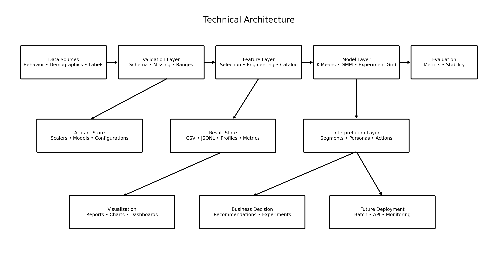

### Image Explanation

The architecture includes:

- Data sources
- Validation
- Feature processing
- Clustering models
- Evaluation
- Artifact storage
- Result storage
- Interpretation
- Visualization
- Future deployment

The fitted preprocessor and model must remain linked.

---

# 21. Business Architecture

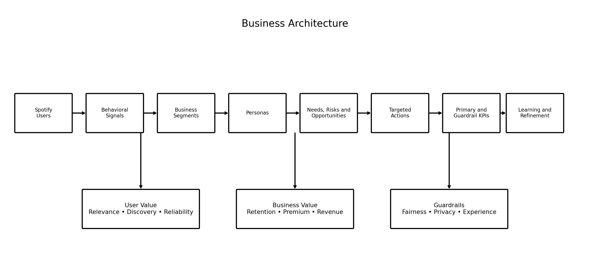

### Image Explanation

The business flow is:

1. Users create behavioral signals
2. Signals become segments
3. Segments become personas
4. Personas reveal needs, risks and opportunities
5. Actions are designed
6. KPIs and guardrails measure impact
7. Results refine the strategy

---

# 22. Project Challenges

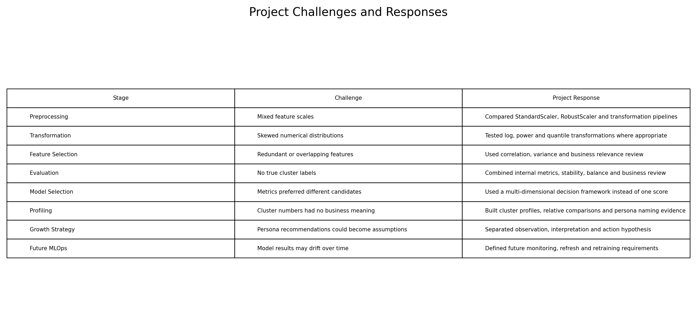

### Major Challenges

## Mixed Feature Scales

Resolved by testing scaling methods.

## Skewed Distributions

Resolved by comparing transformations.

## Redundant Features

Resolved through correlation and business review.

## No True Labels

Resolved using internal metrics, stability and interpretation.

## Conflicting Metrics

Resolved using a multi-dimensional decision framework.

## Technical Labels Without Meaning

Resolved through cluster profiling.

## Recommendations Could Become Assumptions

Resolved by separating evidence, interpretation and action hypotheses.

## Future Drift

Addressed through a monitoring and retraining roadmap.

---

# 23. Model-Selection Decisions

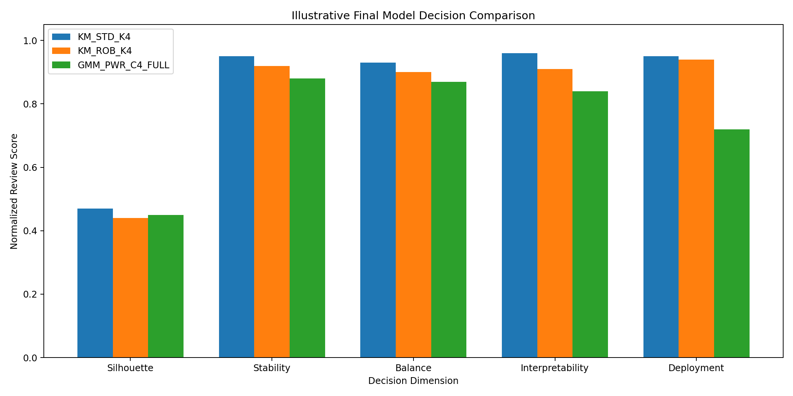

### Image Explanation

The final model is compared across:

- Separation
- Stability
- Cluster balance
- Business interpretability
- Deployment simplicity

The illustrative selected model is:

```text
StandardScaler
+
K-Means
+
K = 4
```

The exact project selection should use actual experiment results.

---

# 24. Why K-Means Was Selected

The illustrative final K-Means model was selected because it provided:

- Strong separation
- High stability
- Balanced groups
- Clear centroids
- Simple labels
- Strong persona interpretation
- Straightforward deployment
- Easier stakeholder explanation

The selected model was not chosen only because it had the highest one metric.

---

# 25. Role of GMM

GMM remains valuable because it provides:

- Membership probabilities
- Confidence
- Boundary-user analysis
- Flexible component shapes
- AIC and BIC comparison

In this project summary, GMM is retained as:

```text
A comparison and uncertainty-analysis model
```

rather than the primary deployment model.

---

# 26. Final Clusters

The final illustrative solution contains four clusters.

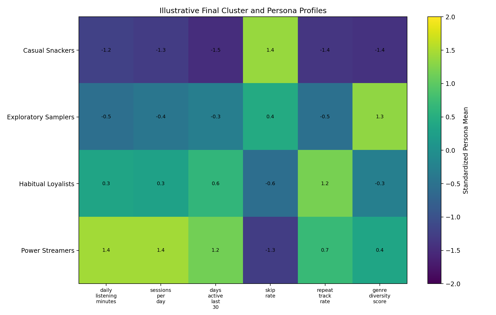

### Image Explanation

The heatmap shows standardized cluster means.

- Casual Snackers are below average on engagement
- Exploratory Samplers are highest on exploration
- Habitual Loyalists are highest on repeat behavior
- Power Streamers are highest on listening, sessions and consistency

Original values must also be reported.

---

# 27. Final Personas

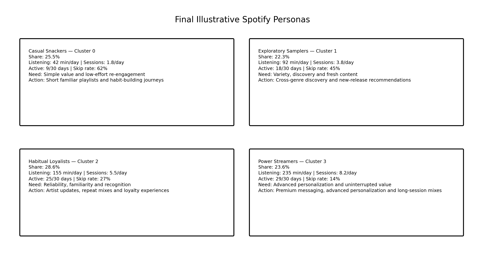

The final illustrative personas are:

1. Casual Snackers
2. Exploratory Samplers
3. Habitual Loyalists
4. Power Streamers

---

# 28. Persona 1 — Casual Snackers

## Summary

Light and irregular listeners who use Spotify in short bursts.

## Characteristics

- Low listening
- Few sessions
- Low active days
- High skipping
- Weak repeat behavior

## Need

Simple value and low-effort re-engagement.

## Business Opportunity

Habit building and reactivation.

## Recommended Action

Test short familiar playlists and carefully timed reminders.

---

# 29. Persona 2 — Exploratory Samplers

## Summary

Curious listeners who explore many genres and new content.

## Characteristics

- Moderate engagement
- High genre diversity
- Strong discovery behavior
- Moderate repeat behavior

## Need

Variety and fresh recommendations.

## Business Opportunity

Discovery-led engagement and Premium trials.

## Recommended Action

Test cross-genre discovery journeys and new-release recommendations.

---

# 30. Persona 3 — Habitual Loyalists

## Summary

Consistent listeners who repeatedly return to preferred artists and tracks.

## Characteristics

- High active days
- Strong repeat behavior
- Stable usage
- Long tenure
- High loyalty

## Need

Reliability, familiarity and recognition.

## Business Opportunity

Retention and loyalty.

## Recommended Action

Test artist updates, repeat mixes and loyalty recognition.

---

# 31. Persona 4 — Power Streamers

## Summary

Highly engaged listeners with frequent, long and low-friction sessions.

## Characteristics

- Very high listening
- Many sessions
- Nearly daily activity
- Low skip rate
- High Premium potential

## Need

Advanced personalization and uninterrupted value.

## Business Opportunity

Premium conversion and experience quality.

## Recommended Action

Test ad-free Premium messaging and advanced long-session personalization.

---

# 32. Business Recommendations

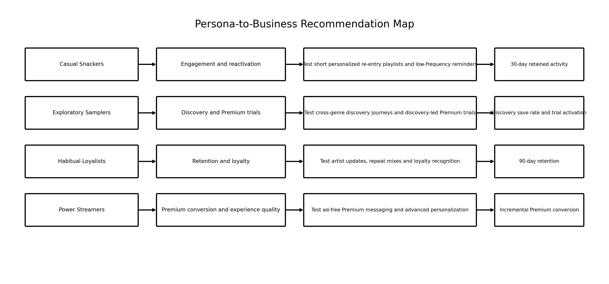

### Recommendation Summary

| Persona | Primary Strategy |
|---|---|
| Casual Snackers | Engagement and reactivation |
| Exploratory Samplers | Discovery and Premium trials |
| Habitual Loyalists | Retention and loyalty |
| Power Streamers | Premium conversion and experience quality |

Recommendations are hypotheses until tested.

---

# 33. Recommendation Measurement

Every recommendation should define:

## Primary KPI

Example:

```text
Incremental Premium conversion
```

## Guardrail KPI

Examples:

```text
Churn
Complaints
Notification opt-out
Session abandonment
```

## Measurement Design

- Treatment
- Control
- Eligibility
- Exclusions
- Time window
- Incremental effect
- Long-term outcome

---

# 34. Project Deliverables

The complete project provides:

- Data-quality reports
- EDA reports
- Feature catalog
- Preprocessing comparisons
- K-Means experiments
- GMM experiments
- Automated result logs
- Cluster evaluation reports
- Cluster profiles
- Persona cards
- Business recommendations
- Visualizations
- Checklists
- Interview questions
- Reusable Python code
- Final project summary

---

# 35. Project Limitations

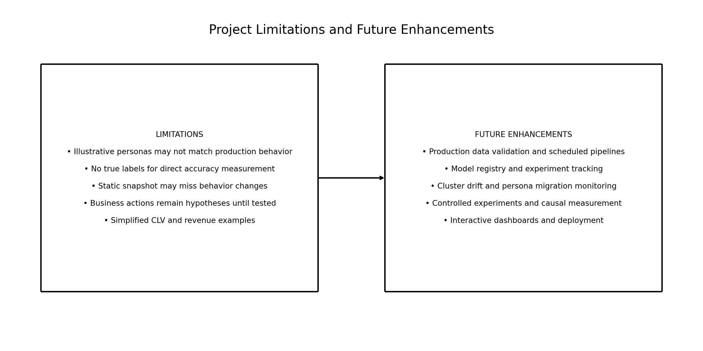

## Illustrative Values

The included values are teaching examples.

## No True Labels

There is no direct accuracy score.

## Static Snapshot

User behavior may change.

## Business Causality Not Proven

Recommendations require experiments.

## Simplified Economics

CLV and revenue examples are simplified.

## Persona Generalization

Users within one persona are not identical.

## Demographic Causation

Demographic associations do not prove causes.

## GMM Uncertainty

Soft membership may reveal mixed behavior.

---

# 36. Future Enhancements

Possible enhancements:

- Automated scheduled pipeline
- Model registry
- Experiment tracking
- Data-drift monitoring
- Cluster-drift monitoring
- Persona migration
- Time-aware features
- Real-time or batch scoring
- Interactive dashboard
- Controlled experimentation
- Automated fairness and privacy checks
- Retraining workflow

---

# 37. Productionization Roadmap

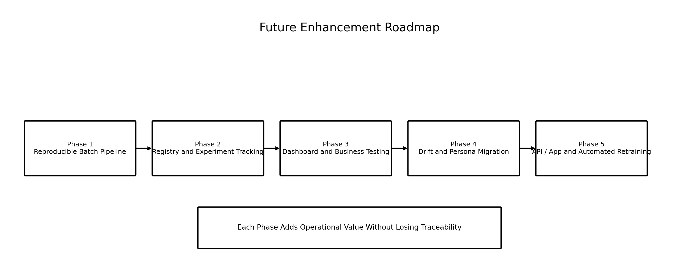

### Phase 1

Build a repeatable batch pipeline.

### Phase 2

Add model registry and experiment tracking.

### Phase 3

Add dashboard and business experiments.

### Phase 4

Add drift and persona-migration monitoring.

### Phase 5

Add application/API scoring and automated retraining.

---

# 38. Final Project Explanation — Two Minutes

```text
The project objective was to segment Spotify users based on
behavior and convert the technical groups into actionable personas.

I started by understanding the behavioral and demographic datasets,
then validated data types, missing values, duplicates and ranges.
I performed EDA to understand distributions, outliers and correlations.

Next, I selected behaviorally meaningful features and removed identifiers.
Because clustering is distance-sensitive, I compared StandardScaler,
RobustScaler, PowerTransformer and other preprocessing approaches.

I automated K-Means and Gaussian Mixture Model experiments across
multiple cluster counts and covariance configurations. I evaluated the
models using Silhouette Score, Davies-Bouldin Index, Calinski-Harabasz,
inertia, AIC, BIC, cluster-size balance and stability.

The illustrative final selection was StandardScaler with K-Means K=4
because it provided the best overall balance of technical quality,
stability, interpretability and deployment simplicity.

I profiled the four clusters and translated them into Casual Snackers,
Exploratory Samplers, Habitual Loyalists and Power Streamers.

Finally, I created persona-specific recommendations for engagement,
discovery, retention and Premium conversion, with primary and guardrail
KPIs. The next step would be to deploy the pipeline, monitor drift and
validate the business recommendations through controlled experiments.
```

---

# 39. Final Project Explanation — Detailed

## Problem

Spotify users show different engagement, loyalty, discovery and friction patterns.

## Data

Behavioral and demographic datasets were joined using `user_id`.

## Cleaning

Missing values, duplicates, ranges, formats and identifiers were reviewed.

## Features

Relevant behavioral features were selected and documented.

## Preprocessing

Multiple scaling and transformation methods were compared.

## Models

K-Means and GMM were tested.

## Automation

Loops, functions, configuration and logging automated the experiment grid.

## Evaluation

Multiple technical and business dimensions were used.

## Final Decision

The illustrative final model was StandardScaler plus K-Means with four clusters.

## Personas

Four business-friendly personas were created.

## Recommendations

Each persona received a distinct growth hypothesis.

## Measurement

Primary and guardrail KPIs were defined.

## Future

Deployment, drift monitoring, persona migration and retraining are planned.

---

# 40. Interview Explanation Framework

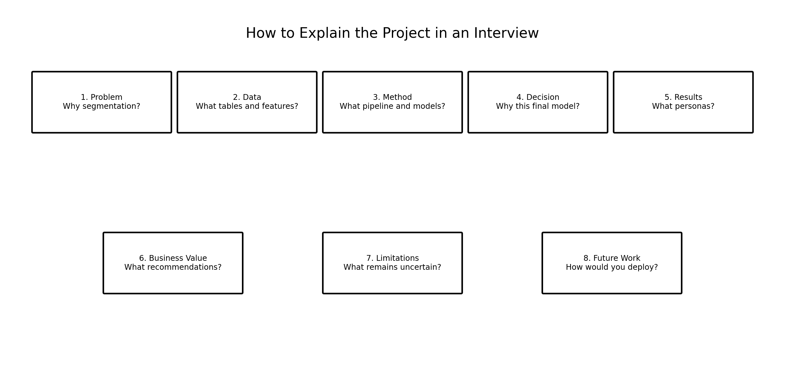

### Image Explanation

Explain the project in this order:

1. Problem
2. Data
3. Method
4. Model decision
5. Results
6. Business value
7. Limitations
8. Future work

This structure keeps the explanation clear.

---

# 41. Presentation Structure

Recommended final presentation:

```text
Slide 1  — Project objective
Slide 2  — Business problem
Slide 3  — Data sources and features
Slide 4  — Data cleaning and EDA
Slide 5  — Feature engineering and scaling
Slide 6  — K-Means and GMM experiments
Slide 7  — Evaluation and final model
Slide 8  — Final cluster profiles
Slide 9  — Final personas
Slide 10 — Business recommendations
Slide 11 — Limitations
Slide 12 — Future roadmap
```

---

# 42. Project Decision Principles

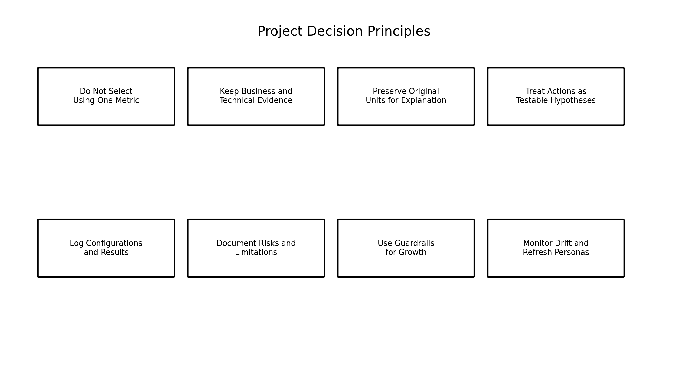

The project follows these principles:

- Do not select using one metric
- Keep technical and business evidence
- Use original units for explanation
- Treat recommendations as hypotheses
- Log configurations and results
- Document risks
- Use growth guardrails
- Monitor drift and refresh personas

---

# 43. End-to-End Validation Checklist

## Data

- [ ] User IDs validated
- [ ] Missing values reviewed
- [ ] Duplicates reviewed
- [ ] Ranges validated
- [ ] Joins validated
- [ ] Data version recorded

## Features

- [ ] Identifier removed from feature matrix
- [ ] Business relevance documented
- [ ] Redundancy reviewed
- [ ] Transformations documented
- [ ] Feature order saved

## Modeling

- [ ] K-Means tested
- [ ] GMM tested
- [ ] Multiple K values tested
- [ ] Multiple covariance types tested
- [ ] Random state recorded
- [ ] Experiment results logged

## Evaluation

- [ ] Silhouette reviewed
- [ ] Davies-Bouldin reviewed
- [ ] Calinski-Harabasz reviewed
- [ ] Inertia reviewed
- [ ] AIC and BIC reviewed
- [ ] Cluster sizes reviewed
- [ ] Stability reviewed
- [ ] Business interpretation reviewed

## Personas

- [ ] Cluster profiles created
- [ ] Original units shown
- [ ] High and low features identified
- [ ] Persona names justified
- [ ] Needs documented
- [ ] Risks documented
- [ ] Opportunities documented
- [ ] Limitations documented

## Business

- [ ] Recommendations written as hypotheses
- [ ] Primary KPIs defined
- [ ] Guardrail KPIs defined
- [ ] Owners assigned
- [ ] Controlled tests proposed
- [ ] Long-term measurement planned

## Reproducibility

- [ ] Configuration saved
- [ ] Preprocessor saved
- [ ] Model saved
- [ ] Feature order saved
- [ ] Metrics saved
- [ ] Persona mapping versioned
- [ ] Code syntax validated

---

# 44. Important Terminology

| Term | Meaning |
|---|---|
| End-to-End Project | Complete workflow from problem to action |
| Technical Architecture | Data, code, models and artifacts |
| Business Architecture | Users, segments, actions and KPIs |
| Model Selection | Choosing the best-supported candidate |
| Final Cluster | Selected technical group |
| Final Persona | Business-friendly representation |
| Growth Recommendation | Testable business action |
| Guardrail KPI | Metric protecting against harm |
| Project Limitation | Known constraint or uncertainty |
| Future Enhancement | Planned improvement |
| Drift | Change in data or model behavior |
| Persona Migration | User movement between personas |
| Model Registry | Versioned storage of models and metadata |
| Experiment Tracking | Recording runs and comparisons |
| Productionization | Making the solution operational |
| Reproducibility | Ability to rerun the workflow |
| Controlled Experiment | Treatment vs control comparison |
| Business Interpretability | Ease of explaining and using results |
| Deployment Simplicity | Ease of operational use |
| Decision Principle | Rule guiding project choices |

---

# 45. Interview Questions and Answers

## 1. What was the project objective?

To segment Spotify users using behavior and create actionable personas.

---

## 2. What data was used?

Behavioral features and demographic context.

---

## 3. Why was `user_id` removed from modeling?

It is an identifier and does not represent behavior.

---

## 4. Why was scaling required?

Distance-based algorithms are sensitive to feature magnitude.

---

## 5. Which models were tested?

K-Means and Gaussian Mixture Models.

---

## 6. Why test both K-Means and GMM?

K-Means provides simple hard clusters, while GMM provides soft probabilities and flexible covariance.

---

## 7. How were experiments automated?

Using loops, functions, configuration dictionaries and standardized logging.

---

## 8. Which metrics were used?

Silhouette, Davies-Bouldin, Calinski-Harabasz, inertia, AIC, BIC, size and stability.

---

## 9. Why not select the highest Silhouette model automatically?

The model also needs balance, stability, interpretability and business value.

---

## 10. What was the illustrative final model?

StandardScaler plus K-Means with four clusters.

---

## 11. Why was K-Means selected?

It provided strong overall technical quality, stability, interpretation and deployment simplicity.

---

## 12. What role did GMM play?

It supported comparison, soft membership and boundary-user analysis.

---

## 13. What were the final personas?

Casual Snackers, Exploratory Samplers, Habitual Loyalists and Power Streamers.

---

## 14. How were persona names created?

Using cluster profiles, high and low features, demographics and business review.

---

## 15. What was the recommendation for Casual Snackers?

Re-engagement and short familiar playlists.

---

## 16. What was the recommendation for Exploratory Samplers?

Discovery journeys and discovery-led Premium trials.

---

## 17. What was the recommendation for Habitual Loyalists?

Retention, artist updates and loyalty experiences.

---

## 18. What was the recommendation for Power Streamers?

Premium conversion and advanced personalization.

---

## 19. How should recommendations be validated?

Using controlled experiments with primary and guardrail KPIs.

---

## 20. What were the biggest challenges?

No true labels, mixed scales, skewness, redundant features, conflicting metrics and business interpretation.

---

## 21. What are the main limitations?

Illustrative values, static data, no causal validation and simplified economics.

---

## 22. What future enhancements are planned?

Deployment, tracking, drift monitoring, dashboards, real-time scoring and retraining.

---

## 23. How would you productionize the project?

Create a batch or API pipeline, save versioned artifacts, monitor drift and schedule retraining.

---

## 24. What is cluster drift?

A change in cluster sizes, centers or profiles over time.

---

## 25. What is persona migration?

Movement of users between behavioral personas.

---

## 26. Why save the feature order?

The model expects the same features in the same order.

---

## 27. Why save the scaler?

Inference must use the same transformation used during training.

---

## 28. What is the business value of the project?

It supports more relevant recommendations, retention, Premium and growth decisions.

---

## 29. What is the most important project lesson?

A clustering project is successful only when technical results become measurable business actions.

---

## 30. Explain the project in one sentence.

I built an automated Spotify user-segmentation pipeline that compared K-Means and GMM, selected a stable four-cluster solution, created actionable personas and translated them into measurable growth experiments.

---

# 46. Module Summary

In this module, we combined the complete project:

- Business understanding
- Data understanding
- Cleaning
- EDA
- Feature selection
- Feature engineering
- Scaling
- Transformations
- K-Means
- GMM
- Experiment automation
- Evaluation
- Profiling
- Segmentation
- Persona creation
- Business strategy
- Visualization
- Limitations
- Future roadmap

The final project message is:

```text
The model is not the final product.

The final product is a reproducible decision workflow
that connects user behavior to measurable business action.
```

---

# 47. Quick Reference Cheat Sheet

## Complete Flow

```text
Problem
→ Data
→ Clean
→ Explore
→ Engineer
→ Scale
→ Cluster
→ Evaluate
→ Profile
→ Persona
→ Recommend
→ Test
→ Monitor
```

## Illustrative Final Model

```text
StandardScaler
+
K-Means
+
K = 4
```

## Final Personas

```text
Casual Snackers
Exploratory Samplers
Habitual Loyalists
Power Streamers
```

## Selection Rule

```text
Technical Quality
+ Stability
+ Balance
+ Interpretability
+ Deployment Simplicity
```

## Business Rule

```text
Recommendation
→ Controlled Test
→ Primary KPI
→ Guardrail KPI
→ Scale / Refine / Stop
```

---

# 48. Project Completion Statement

```text
This project created a complete Spotify customer-segmentation
and persona-development workflow.

It began with behavioral and demographic data, compared multiple
preprocessing and clustering approaches, selected a stable and
interpretable four-cluster solution, translated the clusters into
business-friendly personas, and created measurable recommendation,
retention and Premium-conversion strategies.

The next phase is productionization, drift monitoring and controlled
business experimentation.
```
